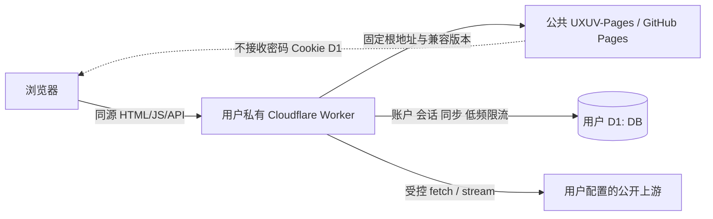

# UXUVideo Worker / UXUV-Pages 分仓迁移与 KVideo 4.9.19 完整复刻规范

状态：**第 1—20 节为已完成历史基线；第 21 节已于 2026-08-17 获用户批准，可进入规划，仍未授权实现、提交或部署**
日期：2026-08-17（保留 2026-08-11 已完成基线，新增第 21 节界面、来源与 IPTV 退役修订）
目标版本：历史基线为 Worker API Contract v1；第 21 节拟升级为 Worker API Contract v2，Worker/Pages 语义版本在批准后的计划中同步确定

> 2026-08-08 验收纠偏：已发布的 UXUV-Pages `0.1.2` 只覆盖了简化页面和部分功能，未满足本规范原有“迁移不是视觉重设计”和“功能类别完整”的要求。本次重开把 KVideo 4.9.19 的完整 UI 与用户可见行为升级为硬性发布门；此前 `work-products/plan.md`、`work-products/todo.md` 中关于 UI 已全面接管的结论失效，须在本规范获批后重新规划。

> 2026-08-11 定向修订：用户明确要求调整顶部导航、用户设置入口、品牌图标、版本更新入口与语言布局，并降低卡片套卡片等模板化“AI 感”。第 20 节已获批准，只在这些表面覆盖原“视觉完全复刻”条款；其余 KVideo 功能、Worker/D1/会话安全、Pages 兼容发布和审批边界继续有效。

> 2026-08-17 修订规则：若第 21 节获批，它只在明确冲突处覆盖第 1—20 节，包括 `/UXUV-Pages` 兼容路径、IPTV、系统预设视频源/弹幕 API、全局片头片尾设置、主页继续观看和旧视觉边界；未被点名的认证、D1、同步、代理、安全、Free 预算、不可变 Pages 发布、更新复制与证据分层合同继续有效。

## 1. 决策摘要

| 事项 | 已批准决策 |
| --- | --- |
| 仓库职责 | `UXUVideo` 最终只交付单文件模块 Worker `_worker.js`；新增公共 `UXUV-Pages` 保存并发布静态前端 |
| 前端交付 | Next.js 使用 `output: 'export'` 与 `images.unoptimized: true`；公共 Pages 不运行 API、认证或用户数据逻辑 |
| 复刻基准 | KVideo 4.9.19 的权威源码基准固定为 `UXUVideo` Git commit `28334f41407082ae1028fa4a4180bcc46d31c52a`；`https://kvideo.uxudjs.dpdns.org/` 只作辅助人工对照，不替代固定提交 |
| UI 与功能 | 除第 20 节已批准的定向 UI 修订外，完整保留固定基准中的视觉设计、页面结构、组件、文案、交互、设置项和用户功能；禁止以简化页面、原生控件或无关新设计替代 |
| 唯一允许差异 | 已批准差异为 Worker API、D1 数据/同步和登录/会话安全架构所必需的差异，以及第 20 节明确列出的导航、图标、版本入口、语言布局和结构减层；不得外推为全站重设计 |
| Worker 路由 | Worker 原生实现迁移的 Web API 合同，并包含 `app-update` 与 Cloudflare 用量路由；当前 `worker-route-contract.test.mjs` 权威清单共 23 个路径合同；禁止复制 `NextRequest`、`NextResponse`、Node 文件系统或 Next 缓存语义 |
| 静态资源 | Worker 固定代理 UXUV-Pages 的公开根地址；同一兼容版本内允许 Pages 独立更新，禁止拼接 `main`、`latest` 或其他分支 URL |
| 认证与同步存储 | **已确认：** D1 是 v1 唯一权威存储；KV 与 Upstash 不进入 v1 运行时 |
| 认证边界 | 登录、会话、Premium 授权、账户管理、同步与所有高成本代理 API 均发生在用户自己的 Worker 域名 |
| Free 套餐 | **已确认：** 支持完整功能类别，但采用保守上限；媒体代理、IPTV 和长流为尽力而为，不承诺无限时长或生产 SLA |
| 安全基线 | 默认必须配置认证；同源 API、严格 Cookie/CSRF、SSRF 防护、无通配 CORS、CSP、安全日志和应用级限流 |
| 兼容发布 | Worker 只校验 Pages 版本、API Contract、Worker 兼容范围和清单结构；不固定 Git commit 或资源 SHA，不兼容时失败关闭 |
| 用量与提醒 | 主设置页向 `super_admin` 显示 Workers 账户/本脚本及 D1 账户/本数据库用量；项目警戒线、官方额度和 UTC 重置时间分开标识，接近官方上限时显示全局提醒 |

本规范选择“兼容版本的公共静态发布 + 用户私有 API Worker”，而不是把完整前后端一起复制到每个 Cloudflare 账户。它保留单文件部署体验，允许 Pages 小步更新而无需用户重发 Worker，也避免公共 Pages 接触密码、Cookie、D1 或用户同步数据。

## 2. 假设与确认项

以下假设与决策均已确认：

1. **已确认：** 用户所称 `../CfCdnAX` 与 `../CFAX-Pages` 指本机实际存在的 `../CfGfwAX` 与 `../CGAX-Pages`。本规范采用其“Worker 固定公开 Pages 根地址、前端可独立更新”的职责与维护模型，并增加 manifest 版本、API Contract、Worker 兼容范围和安全路由结构校验；不增加 commit 或 SHA 固定。
2. 目标用户是个人、家庭或小规模可信用户群；不是公开匿名视频代理服务或大规模 SaaS。
3. “单一 `_worker.js`”指部署产物只有一个可复制粘贴的模块 Worker 文件；仓库仍可保留 README、许可证、验证脚本和 `work-products/tests/`。
4. **已确认：** “全部功能支持 Free 套餐”指所有功能类别均有可验证的小规模路径，不等于无限并发、无限流量、第三方源可用性保证或生产 SLA。
5. **已确认：** 新公共仓库为 `uxudjs/UXUV-Pages`；本机 `../UXUV-Pages` 已是 Git 工作区，`origin` 指向 `https://github.com/uxudjs/UXUV-Pages.git`。Worker 使用固定公开根地址；同一兼容版本内的 Pages 发布不要求修改 Worker。
6. **已确认：** D1 完整模式要求用户创建一个 D1 数据库并配置两个 Worker Secret。仅复制代码但不配置这些项时，Worker 必须显示安全的设置错误，而不是退化为匿名开放代理。
7. **已确认：** 数据模型、查询、限流和同步必须按 Free 配额留出显著余量；不得把“额度够用”建立在未索引扫描、每媒体分片写 D1 或忽略索引写放大的假设上。
8. **已确认：** 精确显示 Cloudflare 账户实际用量需要额外配置一个仅含 `Account Analytics: Read` 的 API Token Secret，以及 Account ID、Worker script name、D1 database ID 三个普通变量。未配置时全部业务功能仍可用，但设置页只能显示配置说明与运行时发现的配额错误，不能伪造精确计数。
9. **已确认：** 完整复刻对象是 KVideo 4.9.19，固定源码提交为 `28334f41407082ae1028fa4a4180bcc46d31c52a`。该提交中的用户可观察行为高于当前 UXUV-Pages `0.1.2`，后者不是验收基准。
10. **已确认：** “完整 UI/功能复刻”不是仅保留同名路由或功能类别，而是保留用户能够看到、点击、配置和操作的具体界面与行为；只有后端 API 存在不能视为前端功能已迁移。第 20 节获批后，其明确点名的 UI 元素按新规范验收。
11. **已确认：** Worker、D1 和登录安全架构可以改变数据来源、认证方式、错误状态和保守上限，但不得借此删除 KVideo 控件、设置、页面区块或正常小规模成功路径；第 20 节的显式删除和迁移不属于“借架构删减”。

## 3. 目标、用户与成功定义

### 3.1 目标

让用户完成以下最小部署流程：

1. 在 Cloudflare 创建 Worker，将 UXUVideo 发布的 `_worker.js` 全量复制粘贴。
2. 创建并绑定一个 D1 数据库 `DB`。
3. 配置 `ADMIN_PASSWORD` 与 `AUTH_SECRET` 两个 Secret。
4. 打开 Worker 域名，登录后使用搜索、详情、播放、媒体代理、IPTV、Premium、账户管理和跨设备同步。

若需要设置页显示 Cloudflare 实际用量，再按 9.2、9.3 配置只读 Analytics Token 和三个公开标识；这组配置不属于业务功能的必需项。

用户不需要 Fork、克隆、导入或授权 Cloudflare 读取 `UXUV-Pages` 仓库；Pages 由项目维护者统一发布。

### 3.2 How Might We

如何让个人用户只维护一个私有 Worker 和最少绑定，就能使用 UXUVideo 全部功能，同时让公共前端可独立更新、可验证、不会接触任何用户认证或同步数据？

### 3.3 可测成功条件

- `UXUVideo/_worker.js` 是可直接粘贴的 ES Module Worker，运行时无 npm 包、无构建产物依赖、无本地文件依赖。
- `UXUV-Pages` 能由 GitHub Actions 完成静态导出，发布物不含 `app/api/`、服务端模块、Secret 或用户数据。
- 固定基准提交中的每一项用户可见功能都有迁移实现、自动化行为证据和可追溯的对照项；对照矩阵不存在 `missing`、`partial` 或未审批差异。
- 八个页面入口及其关键加载、空、错误、内容、弹窗、菜单和播放器状态在 320、768、1024、1440 px 与固定基准保持结构和视觉一致。
- KVideo 的 Liquid Glass 设计系统、导航、卡片、设置区块、播放器控件、图标、动效、主题和响应式行为被直接迁移，不被当前 UXUV-Pages 的通用深色卡片设计替代。
- 现有 21 个 API 路由的用户可见功能均有 Worker 原生路由和合同测试，并新增 1 个只读用量路由。
- 浏览器地址栏始终是用户 Worker 域名；密码、会话 Cookie 和写操作不会发送到 `github.io`。
- Worker 只能从固定的 Pages 公开根地址加载前端，且能拒绝版本、API Contract、Worker 兼容范围或路由结构不兼容的发布；不对 Git commit 或资源 SHA 做运行时固定。
- D1 支持账户、可撤销会话、Premium 授权、配置、历史和收藏跨设备同步，并发写入不会静默覆盖较新版本。
- D1 Free 最坏情形预算模型、逐查询 `meta.rows_read`/`meta.rows_written` 和远端验收均低于 8.6 的项目警戒线。
- 主设置页能区分本项目用量、Cloudflare 账户额度、Analytics 延迟和数据不可用；达到分级阈值或收到 D1 配额错误时显示可执行提醒。
- Free profile 的远端 Cloudflare 验收不出现 `exceededCpu`、超过 50 个外部子请求或超过 6 个等待响应头的并发连接。
- 本地通过、Cloudflare 远端通过、真实第三方媒体源通过分别报告，不互相替代。

## 4. 范围与非目标

### 4.1 范围内

- 继续使用现有 `UXUV-Pages` 公共静态前端仓库，并以新的不可变版本发布完整复刻候选。
- 将现有浏览器 UI、样式、PWA 资源和浏览器安全逻辑迁移到 `UXUV-Pages`；第 20 节获批后，其点名表面按定向修订验收。
- 除第 20 节获批的定向修订外，从固定 KVideo 4.9.19 提交直接迁移浏览器组件、样式、状态管理和交互；仅在与静态导出或 Worker/D1/登录安全边界冲突的位置做适配。
- 建立逐功能、逐页面、逐状态的 KVideo 对照矩阵，以及固定浏览器环境下的视觉基准与交互回归。
- 把根布局中的运行时文件/环境读取改为浏览器启动后从同源 Worker 获取公共配置。
- 在 `_worker.js` 中以 Fetch API、Web Streams、Web Crypto 和 D1 binding 重写现有 21 个 API 路由，并原生实现 1 个只读用量路由。
- 建立 D1 schema、自举、兼容迁移、配额预算、限流、会话和同步冲突合同。
- 建立 Pages/Worker 版本兼容、发布结构、安全响应头、日志和端到端回归合同。
- 保留 MIT 许可证和原作者版权声明；公开 Pages 分发必须包含相同许可证要求。

### 4.2 非目标

- 不恢复 Docker、Android TV、Apple TV 或 Node.js 自托管部署。
- 不让用户 Worker 克隆、导入或在运行时读取 GitHub 仓库源码。
- 不把公共 GitHub Pages 变成认证站点；其直接访问入口只显示公开说明或静态预览，不接受密码。
- 不保证任意第三方视频源、弹幕源、订阅源或 IPTV 源持续可用、合法或允许代理。
- 不提供匿名开放媒体代理。
- 不承诺 Free 套餐的无限流量、持续高并发或长流 SLA。
- 不在本规范阶段实现业务代码、创建远端仓库、部署或迁移生产数据。
- 除第 20 节已批准的定向修订外，不重新设计 KVideo UI，不以“现代化”“简洁化”“更适合静态站点”为由改变视觉、导航或交互。
- 不以原生 `<video controls>` 替代 KVideo 自定义播放器，不以单一名称/URL 表单替代完整设置与来源管理。
- 不把 UXUV-Pages `0.1.2` 的现状当作应继续兼容的产品基准；它只保留为不可变、可回滚的历史发布。
- v1 不自动迁移现有 Upstash 数据；迁移工具需单独审批和规范。
- v1 不发送邮件、系统推送或后台定时告警；提醒只在用户打开应用时显示。需要离线告警时另立通知渠道、调度和隐私规范。

## 5. 当前基线与迁移约束

### 5.1 固定 KVideo 基线与当前迁移证据

- 固定 KVideo 4.9.19 提交有 21 个 `app/api/**/route.ts` 文件，共约 2,200 行路由代码；这些服务端实现是功能语义参考，不会原样恢复为 Pages 运行时。
- 固定基准的认证与同步使用 Upstash Redis；账户被保存为单一数组 key，更新是读-改-写，存在并发覆盖窗口。该存储实现由已批准的 D1/CAS 架构替代。
- 固定基准根布局读取文件系统、环境变量、Redis 能力和服务端图标，阻止共享静态前端；只允许适配这些服务端边界，不允许借机改写浏览器 UI。
- 固定基准 `/api/proxy` 会把浏览器 `cookie` 转发给任意上游，这是必须消除的安全缺陷，不能视为兼容行为。
- 固定基准的并行搜索、分辨率探测和 Premium 聚合没有统一的 Cloudflare 子请求预算；Worker 可以施加已批准上限，但 UI 和小规模成功路径必须保留。
- 2026-08-08 当前 UXUVideo 提交为 `e7e397e520f90433f98eb1f929fc5d135bacfec0`，已收敛为 Worker 1.0.0；当前 UXUV-Pages 提交为 `4bc847affa76755a5c99ce249d793aa43e0b83bb`，发布版本为 `0.1.2`。
- 原 KVideo UI 已从当前树移除，但固定提交仍在 Git 历史中可读取。实施必须用增量补丁迁移，禁止 reset/checkout 覆盖当前工作树或破坏用户改动。
- 2026-08-08 审计显示：固定 KVideo 基准的 `app`、`components`、`lib`、`public` 相关源码共 296 个文件，UXUV-Pages `0.1.2` 对应目录仅 48 个；文件数量本身不是验收指标，但与播放器、设置、首页、IPTV、推荐、弹幕、主题和 TV 行为缺失相互印证。
- 当前 UXUV-Pages `MediaPlayer` 使用原生 `<video controls>`，当前来源设置主要提供名称、URL、启停和删除；它们不满足固定基准中的自定义播放器和完整设置合同。
- 当前生产页面与 KVideo 生产页面的同浏览器对照确认视觉系统、信息密度和交互入口显著不同。线上页面可用于人工发现问题，但自动验收必须依赖固定提交和无敏感数据的确定性 fixture。

### 5.2 参考项目中可复用与不可复用的模式

可复用：

- Worker 与静态 Pages 的仓库职责分离。
- 页面经 Worker 域名提供，认证 Cookie 只属于 Worker 域名。
- Worker、Pages 与跨仓测试共同组成发布门。

不可直接复用：

- 运行时拼接 GitHub `main`、`latest` 或任意分支 URL。
- 缺少发布清单、Pages 版本、API Contract 或 Worker 兼容范围。
- 仅靠本地 Node 测试宣称 Cloudflare/真实长流可用。
- 参考项目的用量接口从浏览器 query string 接收 Account ID/API Token，并兼容 Global API Key；UXUVideo 必须改为 Worker Secret + 固定 GraphQL endpoint，凭据永不进入 URL 或前端。

## 6. 目标架构



### 6.1 `UXUVideo` 最终职责

建议最终结构：

```text
UXUVideo/
  _worker.js                 # 唯一部署产物；允许超过通用 150 行上限
  CHANGELOG.md
  README.md
  LICENSE
  scripts/                   # 只用于本地验证/发布，不是运行时依赖
  work-products/
    SPEC.md
    tests/
```

`_worker.js` 是用户明确要求的单文件例外。内部仍必须以短函数、路由表和明确区域组织，禁止生成式重复或复制 23 份响应样板。

### 6.2 `UXUV-Pages` 最终职责

```text
UXUV-Pages/
  app/                       # 仅静态页面
  components/
  lib/                       # 仅浏览器逻辑、共享类型和纯函数
  public/
  scripts/build-release.mjs
  next.config.ts
  package.json
  work-products/tests/
```

要求：

- `next.config.ts` 使用 `output: 'export'`、`images.unoptimized: true`，所有页面在构建期可导出。
- 删除 `app/api/`、`lib/server/`、`server-only`、`fs`、运行时 `process.env` 个性化和 Vercel Analytics。
- `NEXT_PUBLIC_*` 只允许用于真正的公共构建常量；实例配置一律来自用户 Worker 的 `/api/config`。
- 根布局必须是确定性的静态布局。站点名、图标、功能能力、广告关键词、VideoTogether 配置等由客户端 RuntimeConfigProvider 在同源 Worker 上加载。
- GitHub Pages 直接入口不得显示登录表单或发送敏感数据；它可以显示“请从你的 Worker 域名访问”的静态说明。
- Pages 发布不得包含默认密码、D1 标识、Worker Secret、用户源、Cookie 或真实账户数据。

### 6.3 请求路由顺序

Worker 必须按以下顺序处理：

1. 规范化 URL、方法和请求 ID。
2. `/api/*` 进入 API 路由表；未知 API 返回结构化 404，绝不回退 HTML。
3. 非 API 只接受 `GET`/`HEAD`；其他方法返回 405。
4. 根据当前 Pages release manifest 的兼容版本与安全映射精确路由；禁止任意上游路径拼接。
5. HTML 添加安全头和必要 nonce；带内容哈希文件名的静态资产使用长期缓存，其他资产按发布策略重验证。
6. 未知页面返回当前兼容版本的 `404.html`；不把任意路径当首页。

## 7. Pages 独立发布、兼容与资源映射合同

### 7.1 发布标识

每个 Pages 发布必须在公开根目录生成当前兼容清单，例如：

```json
{
  "schemaVersion": 1,
  "pagesVersion": "1.0.0",
  "apiContract": 1,
  "workerRange": ">=1.0.0 <2.0.0",
  "routes": {
    "/": "index.html",
    "/player": "player/index.html"
  },
  "assets": {
    "/_next/static/example.js": {
      "path": "_next/static/example.js",
      "contentType": "text/javascript; charset=utf-8"
    }
  }
}
```

Worker 源码固定以下常量：

- `WORKER_VERSION`
- `API_CONTRACT_VERSION`
- `PAGES_BASE_URL`

Worker 源码不得固定 `PAGES_GIT_COMMIT`、`PAGES_MANIFEST_SHA256` 或任何 Pages 资产 SHA。

### 7.2 独立更新与校验规则

- `PAGES_BASE_URL` 固定为 UXUV-Pages 发布根目录，不含版本目录、`main`、`master`、`latest` 或可变查询参数。
- Worker 校验 `schemaVersion`、`pagesVersion` 为合法语义版本、`apiContract === API_CONTRACT_VERSION`、`workerRange` 接受当前 `WORKER_VERSION`、安全路由映射、允许的内容类型和大小上限；不得用固定 `PAGES_VERSION` 要求精确相等。
- Worker 不读取或比较 Pages Git commit、manifest SHA、资产 SHA 或 SRI；公开仓库和版本号不是 Secret，Pages 也不得接收任何对接密钥。
- 只要 API Contract 与 `workerRange` 仍兼容，Pages 可独立变更 `pagesVersion` 并覆盖公开根目录；Worker 下一次请求直接使用当前清单和资产，不要求用户更新 `_worker.js`。
- `X-UXUV-Pages-Version`、运行时配置和诊断信息必须使用当前清单的 `pagesVersion`，不得回报 Worker 内硬编码的旧值。
- 资产在状态、路径、内容类型和大小边界通过后以流方式返回，不为哈希校验缓冲完整文件。
- 清单结构、版本或兼容范围校验失败时返回安全的内置 503 页面并记录稳定的 Pages 失败阶段；不得把不兼容发布当成当前版本。
- GitHub Pages 429/5xx 时直接返回 503，不回退旧版本。
- HTML：`Cache-Control: no-cache, must-revalidate`。内容哈希资产：`public, max-age=31536000, immutable`。认证/API 响应：`no-store`。

### 7.3 发布顺序与回滚

1. 在 UXUV-Pages 运行静态构建与清单合同测试，再把当前版本发布到唯一公开根目录。
2. 若 `apiContract` 和 `workerRange` 仍兼容，无论 `pagesVersion` 是否变化，都只验证公开页面与 Worker 代理，不修改或重发 `_worker.js`。
3. 只有 API Contract 变化或 `workerRange` 不再接受当前 Worker 时，才更新 `_worker.js` 的兼容常量、Worker 版本和 CHANGELOG。
4. 运行两个仓库的本地合同测试；生产 Pages 与 Worker 验收必须与本地证据分开记录。
5. 用户自行复制需要更新的 Worker、绑定 `DB` 并配置两个必需 Secret；Pages 小步更新不触发这一步。

兼容范围内的前端回滚只需把上一版 Pages artifact 重新发布到根目录并验证清单版本与路由；Worker 保持不变。只有后端或兼容合同同时变化时才回滚 Worker。D1 迁移在同一 API major 内必须只增不删并保持上一版可读；若做不到，发布门必须 NO-GO，另写迁移/回滚规范。

## 8. 存储与认证决策

### 8.1 决策：D1 完整模式

D1 完整模式以 D1 作为 v1 唯一权威存储，binding 名固定为 `DB`。

理由：

- 账户用户名唯一、最后一个超级管理员保护、会话撤销和同步 CAS 都需要原子约束或事务。
- D1 `batch()` 是事务；适合账户和多文档状态。
- Free 套餐当前包含每日 500 万行读取、10 万行写入、账户总计 5 GB 存储；单个数据库上限为 500 MB。该容量足以覆盖本项目的个人/家庭文本状态，但必须通过索引限制扫描，且禁止把媒体内容写入 D1。
- 在 Workers Free 计划内创建并使用 D1 不会自动收费；达到每日读写上限后查询会失败，至 UTC 00:00 重置，而不是自动产生超额账单。达到存储上限后必须清理数据或升级。D1 不收数据传输/egress 费用。
- 与 Upstash 相比，用户少一个第三方服务账户和两项外部数据库凭据。

未采用方案：

- KV：最终一致，跨区域可能 60 秒或更久，且同键并发写入为最后写入覆盖；必须削减多账户、即时会话撤销和强一致同步，已由用户选择 D1 后排除出 v1。
- Upstash：现状迁移成本最低，但把核心认证继续交给外部服务；Free 当前为 256 MB、每月 50 万命令，且现有单数组读改写仍需重构原子并发合同。它可作为未来可选适配器，但不进入 v1。

### 8.2 最小 D1 schema

```text
accounts
  id PK, username UNIQUE, display_name, role, permissions_json,
  password_hash, password_salt, password_iterations,
  session_version, created_at, updated_at

sessions
  token_hash PK, account_id FK, premium_until,
  expires_at, created_at, last_seen_at

user_documents
  account_id, kind, version, payload_json, updated_at,
  PRIMARY KEY(account_id, kind)

rate_limits
  bucket_key PK, window_start, count, expires_at
```

`kind` v1 只允许 `config` 与 `library`。必须对用户名、会话过期、文档主键和限流过期建立必要索引；测试必须核对每个常用查询的行扫描范围。

### 8.3 Schema 初始化

- Worker 内嵌带版本号的幂等 schema，首次 API 请求执行 `ensureSchema()`。
- 创建语句使用 `IF NOT EXISTS`，多语句通过 `DB.batch()`；失败返回 `503 STORAGE_UNAVAILABLE`。
- 同一 isolate 共享初始化 Promise，但不能依赖 isolate 全局状态保证跨请求正确性。
- 自动迁移只允许向后兼容的新增表、列或索引。删列、重写数据或不可逆迁移必须另行审批。

### 8.4 认证与会话

- 全功能模式必须配置 `ADMIN_PASSWORD` 与 `AUTH_SECRET` Secret；默认管理员用户名为 `admin`，可用普通变量 `ADMIN_USERNAME` 覆盖。
- 第一次成功管理员登录时，将密码以 PBKDF2-SHA-256 和随机 salt 写入 D1；明文永不写入 D1 或日志。
- 不保留 v1 的 `ACCOUNTS`、`ACCESS_PASSWORD`、`UPSTASH_REDIS_REST_*` 运行时兼容。旧数据迁移另立规范。
- 会话 Cookie 使用 `__Host-uxuv_session`，属性为 `HttpOnly; Secure; SameSite=Strict; Path=/`，不设置 `Domain`。
- Cookie 保存 256-bit 随机 token；D1 只保存其 SHA-256。登出、删账户、改密码或提升 `session_version` 后可撤销会话。
- 会话默认 30 天；非持久会话为浏览器会话。过期时间必须在服务端验证，不能只依赖 Cookie。
- Premium 密码验证成功后，把 `premium_until` 写入当前会话；Premium API 必须服务端验证，不能只依赖前端 Gate。
- 密码哈希工作因子不得为了 Free CPU 门而静默降低。PBKDF2 远端验证若持续触发 10 ms CPU 上限，则 Free 全功能门为 NO-GO，需用户决定付费或重新审批认证方案。

### 8.5 同步与冲突

- `/api/user/config` 与 `/api/user/sync` 返回 `version`、`updatedAt` 和 ETag。
- 写入必须带 `baseVersion` 或 `If-Match`；D1 使用 `UPDATE ... WHERE version = ?` 实现 CAS。
- 版本不匹配返回 409 `SYNC_CONFLICT` 和当前服务端版本，禁止最后写入者静默覆盖。
- `config` 对标量保存逐字段更新时间；按 ID 管理的 sources/subscriptions 保存删除 tombstone，保留 30 天。
- `library` 按稳定记录 ID 合并历史/收藏，选择更新时间较新的记录；删除也用 30 天 tombstone，防止另一设备复活。
- 每个文档 JSON 最大 512 KiB；超过返回 413。客户端本地存储仍是离线源，服务端不可用时显示明确同步状态，不伪装成功。

### 8.6 D1 Free 预算合同

Cloudflare 当前 Free 上限是每日 500 万行读、10 万行写、单数据库 500 MB。本项目的发布警戒线必须更低，并以 D1 返回的实际 `meta.rows_read` / `meta.rows_written` 计算，不能只数 SQL 语句：

| 指标 | 项目警戒线 | Free 上限占比 |
| --- | --- | --- |
| D1 行读取 | 每日最坏情形模型不超过 1,000,000 | 20% |
| D1 行写入 | 每日最坏情形模型不超过 50,000，包含索引写放大 | 50% |
| D1 存储 | 不超过 50 MiB | 低于单库上限约 10% |
| 账户 | 最多 8 个 | 个人/家庭边界 |
| 活跃会话 | 每账户最多 5 个；新登录淘汰最旧会话 | 最多 40 个 |
| 用户文档 | 每账户固定 `config`、`library` 两行；每行最多 512 KiB | 用户 JSON 理论上限约 8 MiB |

批准上限下的基础写模型为：同步最多 23,040 行/日，登录、Premium 与账户日桶合计最多 2,100 次，会话活跃时间最多 160 次/日，清理最多 200 行/日；合计不超过 25,500 次逻辑变更。发布测试仍必须使用实际 row metrics 计入事务和索引写放大，并保持在 50,000 行警戒线内。

查询合同：

- 会话按 `token_hash` 主键查询并通过账户主键关联；普通已认证请求目标不超过 5 行读取，任何非管理 API 不超过 20 行读取。
- 账户列表最多返回 8 行；所有查询显式列名，禁止 `SELECT *`、无界 `UPDATE/DELETE` 和未索引认证/同步查询。
- 每条常用查询必须用 `EXPLAIN QUERY PLAN` 验证主键、唯一索引或显式索引；出现无界 `SCAN` 即发布 NO-GO。
- 每个 D1 调用记录脱敏的 `queryId`、`rowsRead`、`rowsWritten` 和耗时；禁止记录 SQL 参数、payload 或用户标识。

写入合同：

- 客户端本地变更立即保存，但每个账户、每种文档最多每 60 秒同步写一次；期间变化合并为一次 CAS 更新。
- `sessions.last_seen_at` 每个会话最多 6 小时更新一次；不得每请求写入。
- D1 持久限流只用于登录、Premium 验证、账户变更和同步写入。搜索、探测、媒体首请求采用 isolate 内短期令牌桶加路由硬上限，不为每次高频读取写 D1。
- D1 全局日写保护上限为：登录尝试 1,000、Premium 验证 1,000、账户变更 100；达到上限后的条件 UPSERT/UPDATE 必须停止修改计数行，只返回 429。
- 静态资源、缓存命中、媒体字节、HLS 签名子资源、日志和指标不得写 D1。
- 过期 session/rate-limit 清理只附带在成功登录或管理事务中，每次最多删除 20 行、全局每日最多删除 200 行；禁止一次无界清理。

验收与失败行为：

- `work-products/tests/d1-free-budget.test.mjs` 必须从账户、会话、同步和限流上限重算最坏情形日预算，并拒绝超过上述警戒线的改动。
- 预算模型至少包含 8 个账户各 2 种文档每分钟一次写入、40 个活跃会话、索引写放大、全部 D1 日限流桶和每日最多 200 行的有界清理。
- 测试 D1 必须采集每条关键 API 的实际 row metrics；估算低于警戒线但远端实际超线时，以远端结果为准并 NO-GO。
- D1 返回配额错误时统一返回 503 `STORAGE_QUOTA_EXCEEDED`，认证和写操作失败关闭；前端保留本地未同步数据并显示等待 UTC 重置/清理/升级说明。
- 不自动升级 Paid、不自动删除用户文档、不退化为匿名或无存储认证。
- 以上预算只约束 UXUVideo；同一 Cloudflare 账户中的其他 D1 工作负载或恶意流量仍可能消耗账户额度，必须在 Dashboard 查看实际 Row Metrics。

## 9. 用户必须配置的变量与绑定

### 9.1 全功能必需

| 名称 | 类型 | 说明 | 缺失行为 |
| --- | --- | --- | --- |
| `DB` | D1 binding | 账户、会话、同步、限流 | API 503，显示设置说明；不开放匿名代理 |
| `ADMIN_PASSWORD` | Secret | 首个超级管理员自举凭据 | 登录 503 `SETUP_REQUIRED` |
| `AUTH_SECRET` | Secret | HMAC 限流键、短期媒体 token 与敏感标识 | 相关 API 503；不得使用内置默认值 |

### 9.2 可选 Secret

| 名称 | 默认值 | 用途 |
| --- | --- | --- |
| `PREMIUM_PASSWORD` | 空 | 可选的 Premium 独立授权凭据；必须在 Dashboard 中按 Secret 配置 |
| `CF_ANALYTICS_API_TOKEN` | 空 | Cloudflare GraphQL 只读用量查询；必须只授予目标账户的 `Account Analytics: Read`，不得使用 Global API Key；缺失时业务功能不受影响，用量卡显示未配置 |

### 9.3 可选普通变量

| 名称 | 默认值 | 用途 |
| --- | --- | --- |
| `ADMIN_USERNAME` | `admin` | 自举管理员用户名 |
| `PERSIST_SESSION` | `true` | 持久会话开关 |
| `SITE_NAME` / `SITE_TITLE` / `SITE_DESCRIPTION` | UXUVideo 默认值 | Worker 运行时站点文案 |
| `SITE_ICON_URL` | `/icon.png` | HTTPS 图标 URL；不支持本地文件路径 |
| `SUBSCRIPTION_SOURCES` | 空 | 默认订阅源 JSON/URL 列表 |
| `IPTV_SOURCES` | 空 | 默认 IPTV 源；只返回给已认证且有权限的用户 |
| `MERGE_SOURCES` | `false` | 默认源合并策略 |
| `DANMAKU_API_URL` | 空 | 默认弹幕 API |
| `AD_KEYWORDS` | 空 | 广告关键词；不支持 `AD_KEYWORDS_FILE` |
| `VIDEOTOGETHER_ENABLED` | `true` | 内置一起看能力；设为 `false` 或 `0` 时由部署管理员关闭 |
| `VIDEOTOGETHER_SCRIPT_URL` / `VIDEOTOGETHER_SETTING_URL` | 固定官方入口 | 可选 HTTPS 自定义覆盖；非法显式脚本 URL 失败关闭，不回退官方地址 |
| `UPDATE_REPOSITORY` / `UPDATE_BRANCH` | 项目默认 | 更新检查来源 |
| `DEPLOYMENT_PROFILE` | `free` | `free` 或 `paid`，选择保守上限 |
| `DEBUG` | `false` | 结构化调试日志；仍必须脱敏 |
| `CF_ACCOUNT_ID` | 空 | 用量查询的 Cloudflare Account ID；只用于服务端 GraphQL 变量 |
| `CF_WORKER_SCRIPT_NAME` | 空 | 当前 UXUVideo Worker 的 script name，用于区分本脚本与账户总用量 |
| `CF_D1_DATABASE_ID` | 空 | `DB` 对应的 D1 database ID，用于区分本数据库与账户总用量 |

`PAGES_BASE_URL` 和 API Contract 兼容版本不是用户变量，必须固化在发布的 `_worker.js` 中；当前 Pages 版本从已校验清单读取，不在 Worker 中精确锁定，也不要求任何 Pages 对接密钥。

四项 `CF_*` 用量配置是一个可选整体：Token 必须保存为 Worker Secret，其他三项是非敏感标识。任何一项缺失时 `/api/admin/usage` 返回 `configured: false` 和缺失的变量名，不返回 5xx，也不影响登录、同步、媒体或其他 API。不得把 Token 写入普通变量、URL、请求查询参数、D1、Pages、浏览器存储、响应或日志。

## 10. 23 个 Worker API 路由合同

所有 JSON 错误统一为：

```json
{
  "error": {
    "code": "MACHINE_READABLE_CODE",
    "message": "Safe user-facing message",
    "requestId": "uuid",
    "details": null
  }
}
```

所有响应带 `X-Request-Id`、`X-UXUV-Worker-Version` 和 `X-UXUV-API-Contract`。只有已读取并验证当前 Pages 清单的静态 Pages 响应与 `/api/config` 才带 `X-UXUV-Pages-Version`；其他 API 不回报未验证、过期或硬编码的 Pages 版本。SSE 错误使用 `event: error` 加同一 JSON 结构。开始二进制流后发生错误时终止流并记录日志，不伪造第二个 HTTP 响应。

| # | 路由 | 方法 | 授权 | Worker v1 行为与上限 |
| --- | --- | --- | --- | --- |
| 1 | `/api/app-update` | GET | 已登录 | 获取固定仓库清单；10 秒超时；Cache API 5 分钟；失败仍返回安全的 `check-failed` 状态 |
| 2 | `/api/auth/accounts/:accountId` | PATCH, DELETE | super_admin | D1 事务更新/删除；保护最后一个超级管理员；改密码撤销旧会话 |
| 3 | `/api/auth/accounts` | GET, POST | super_admin | 最多 8 个账户；用户名唯一；不返回密码字段 |
| 4 | `/api/auth` | GET, POST | GET 公开；POST 登录或已登录 Premium 授权 | GET 返回登录模式与公开能力；POST 受严格限流；Premium 授权写当前 session |
| 5 | `/api/auth/session` | GET, DELETE | 公开读取当前状态；DELETE 当前会话 | 只读安全公开会话摘要；DELETE 撤销 D1 session 并清 Cookie |
| 6 | `/api/config` | GET | 公开最小配置；敏感/源配置需登录 | 返回版本、能力、站点文案；未登录不得泄漏 IPTV/订阅源 |
| 7 | `/api/danmaku` | GET, OPTIONS | 已登录 | 只允许 `search/comments`；目标 HTTPS/HTTP 公开地址；JSON 最大 2 MiB；1 小时安全缓存 |
| 8 | `/api/detail` | GET, POST | 已登录 | 验证 source schema 后请求单一上游；响应最大 5 MiB；15 秒超时 |
| 9 | `/api/douban/image` | GET | 已登录 | 只允许受支持的豆瓣图片 host 候选；流式返回；长期缓存；不接受任意图片代理 |
| 10 | `/api/douban/recommend` | GET | 已登录 | 固定豆瓣 host、分页参数范围校验；1 小时缓存；图片 URL 改写为同源路由 |
| 11 | `/api/douban/tags` | GET | 已登录 | 固定豆瓣 host；只允许 movie/tv；24 小时缓存 |
| 12 | `/api/iptv` | GET | 已登录且 `iptv_access` | 获取并解析 M3U；清单最大 1 MiB；5 分钟缓存；自定义 UA/Referer 长度与字符校验 |
| 13 | `/api/iptv/stream` | GET, OPTIONS | 首次请求已登录且 `iptv_access`；子资源使用 10 分钟签名 token | HLS 清单重写；Range 透传；二进制不缓冲；20 秒响应头超时；无通配 CORS |
| 14 | `/api/ping` | POST | 已登录 | URL/SSRF 校验；HEAD 后可选 GET fallback；单目标；8 秒总超时 |
| 15 | `/api/premium/category` | GET, POST | 已登录且 Premium 有效 | Free 最多 12 源/5 并发/500 条；Paid 最多 32 源/6 并发/2000 条；实际应用 `limit` |
| 16 | `/api/premium/types` | GET, POST | 已登录且 Premium 有效 | 同上源/并发预算；1 小时缓存；使用 Web API base64，不使用 Node `Buffer` |
| 17 | `/api/probe-resolution` | POST | 已登录 | SSE；Free 最多 6 视频/3 并发/每项最多 2 个变体；Paid 最多 50 视频/6 并发 |
| 18 | `/api/proxy` | GET, OPTIONS | 首次请求已登录；重写子资源使用 10 分钟签名 token | HLS 清单最大 1 MiB；媒体流/Range 直通；不转发浏览器 Cookie/Authorization；无匿名开放代理 |
| 19 | `/api/search-parallel` | POST | 已登录 | SSE；Free 最多 12 源、5 并发、每源 3 页、500 条；Paid 最多 32 源、6 并发、每源 3 页、2000 条 |
| 20 | `/api/source-import` | POST | 已登录 | 校验订阅 URL/SSRF；受控拉取 JSON/文本，响应最大 512 KiB；不接受浏览器凭据或任意转发头 |
| 21 | `/api/user/config` | GET, POST | 已登录 | D1 `config` 文档；ETag/CAS；512 KiB；冲突 409；每账户最多每 60 秒写一次 |
| 22 | `/api/user/sync` | GET, POST | 已登录 | D1 `library` 文档；CAS 与 history/favorite/tombstone 合并；512 KiB；每账户最多每 60 秒写一次 |
| 23 | `/api/admin/usage` | GET | super_admin | 只读查询 Cloudflare GraphQL；返回 Workers 与 D1 的账户总量及本项目量、阈值、UTC 重置时间和数据新鲜度；成功快照服务端缓存 5 分钟；不写 D1 |

兼容原则：路由和主要成功数据字段在 API Contract v1 内保持；错误体、认证强制和安全上限是有意的新合同。不得为了保留旧行为继续泄漏 Cookie、允许匿名代理或绕过服务端 Premium 校验。

### 10.1 Cloudflare 用量 API 合同

`GET /api/admin/usage` 只能在验证 `super_admin` session 和同源请求后访问。它向固定地址 `https://api.cloudflare.com/client/v4/graphql` 发起最多一个 GraphQL 子请求，使用 `Authorization: Bearer <secret>` 请求头；Account ID、script name 与 database ID 使用 GraphQL variables。禁止从浏览器的 query/body/header 接受 Cloudflare 凭据，也不支持 Email + Global API Key。公共 `UXUV-Pages` 运行在 GitHub Pages，不计入用户 Cloudflare Pages 用量，界面不得仿照参考项目虚构 Pages 请求数。

时间范围固定为当前 UTC 日，`resetsAt` 为下一次 UTC 00:00。GraphQL 必须同时查询：

- `workersInvocationsAdaptive` 的账户请求/错误总量，以及按 `CF_WORKER_SCRIPT_NAME` 过滤的本脚本请求/错误量。
- D1 账户全部数据库的 `rowsRead`、`rowsWritten` 与存储总量，以及按 `CF_D1_DATABASE_ID` 过滤的本数据库读、写与大小。
- 本项目与账户总量必须分字段返回。Workers 100,000 请求/日及 D1 读写日额度是账户级边界，不能用本脚本或本数据库的较小数字冒充账户剩余额度；D1 单库 500 MB 与账户总存储 5 GB 也分别显示。

成功响应至少为：

```json
{
  "data": {
    "configured": true,
    "plan": "free",
    "period": { "start": "UTC ISO", "end": "UTC ISO", "resetsAt": "UTC ISO" },
    "workers": {
      "accountRequests": 0,
      "scriptRequests": 0,
      "accountErrors": 0,
      "scriptErrors": 0,
      "accountLimit": 100000
    },
    "d1": {
      "accountRowsRead": 0,
      "databaseRowsRead": 0,
      "accountRowsWritten": 0,
      "databaseRowsWritten": 0,
      "accountStorageBytes": 0,
      "databaseStorageBytes": 0,
      "accountReadLimit": 5000000,
      "accountWriteLimit": 100000,
      "accountStorageLimitBytes": 5000000000,
      "databaseStorageLimitBytes": 500000000,
      "projectReadGuardrail": 1000000,
      "projectWriteGuardrail": 50000,
      "projectStorageGuardrailBytes": 52428800
    },
    "level": "normal",
    "warnings": [],
    "observedAt": "UTC ISO",
    "stale": false,
    "source": "cloudflare-graphql"
  }
}
```

百分比由 Worker 使用受控整数计算，前端只负责显示；负数、非有限数或统计回退不得进入响应。`level` 为所有指标的最高等级，`warnings` 使用稳定机器码。Analytics adaptive 数据可能延迟，界面必须显示 `observedAt` 和“统计可能延迟”，不能标为实时余额。

缓存与失败行为：

- 鉴权成功后才可读取服务端 Cache API 快照；成功快照 5 分钟内直接复用，浏览器响应使用 `Cache-Control: private, no-store`。
- Cache API 可保留上一份成功快照最多 1 小时；上游暂时失败时返回该快照并设 `stale: true`，同时给出安全警告码。缓存不得写 D1，也不得包含 Token 或未经脱敏的 Cloudflare 错误。
- 未配置四项 `CF_*` 时返回 HTTP 200、`configured: false`、稳定的 `missing` 名称列表和设置说明；不尝试 GraphQL。
- Cloudflare 401、403、429、GraphQL 错误及网络失败分别映射为 `USAGE_AUTH_FAILED`、`USAGE_FORBIDDEN`、`USAGE_RATE_LIMITED`、`USAGE_UPSTREAM_ERROR`；无可用旧快照时返回 502/503，绝不透传原始响应体。
- GraphQL 查询不写 D1；用量卡打开时请求一次，页面可见期间最多每 5 分钟自动刷新。手动刷新 30 秒内禁用重复点击，但仍服从 5 分钟服务端快照，避免“查看额度”本身制造高频 Worker/Analytics 流量。

### 10.2 分级提醒与额度耗尽行为

设置页卡片对每个指标显示“账户官方额度”和“本项目用量”；D1 另显示 8.6 的项目警戒线。等级规则固定为：

- Workers 账户请求：`<70%` normal，`70%-<85%` notice，`85%-<95%` warning，`95%-<100%` critical，`>=100%` exhausted。
- D1 账户日读/写额度及账户/单库存储：官方额度 `<85%` normal，`85%-<95%` warning，`95%-<100%` critical，`>=100%` exhausted。
- D1 本数据库项目警戒线：达到警戒线的 80% 为 notice，达到 100% 为 warning；它只在用量卡提示预算风险，不等同于 Cloudflare 官方额度耗尽。
- 任一指标进入 warning 时，已登录 `super_admin` 在所有应用页面看到不可静默永久关闭的全局横幅；critical/exhausted 使用更强提示并显示 UTC 重置时间或存储清理/升级说明。其他用户不看到精确数字。

D1 查询实际返回配额错误时，即使 Analytics 尚未更新，也必须返回 503 `STORAGE_QUOTA_EXCEEDED`，带安全的 `quotaKind`（可判定时）和 `retryAt`；前端保留本地未同步数据并显示全局错误。若任何 API 发现该稳定错误码，普通用户可以看到不含数值和账户标识的通用存储不可用提醒。

Workers Free 请求额度真正耗尽后，新请求可能在执行 `_worker.js` 前就被 Cloudflare 拒绝，因此应用无法保证在“已经耗尽”后再由同一 Worker 显示提醒。v1 的可靠合同是 70%/85%/95% 提前预警、显示最后观测时间，并在已打开页面的 Worker 请求整体失败时提示“实例暂时不可达，请到 Cloudflare Dashboard 核对”；不能把网络故障确定表述为额度耗尽，也不承诺后台、邮件或系统推送。

## 11. Free 与 Paid 能力边界

### 11.1 决策

Free 套餐目标是“个人使用的功能完整性”，不是“无限容量的行为等价”。媒体代理、IPTV、并行搜索和长流都保留，但必须服从 profile 上限和远端验收门。

当前官方硬边界（2026-08-07 核验）：

- Workers Free：100,000 请求/日、每请求 10 ms CPU、128 MB 内存、50 个外部子请求、6 个等待响应头的并发连接、压缩后 Worker 3 MB。
- HTTP Worker 只要客户端保持连接就没有硬 wall-time 上限，响应体也没有强制大小上限；但 runtime 更新只给在途请求约 30 秒宽限，客户端或上游断开仍会终止。
- D1 Free：每日 500 万行读、10 万行写、账户总计 5 GB、单数据库 500 MB；读写超限后查询失败直到 UTC 00:00 重置。
- 本项目 D1 警戒线：每日最坏情形不超过 100 万行读、5 万行写，数据库不超过 50 MiB；详见 8.6。

### 11.2 “长流尽力而为、无 SLA”的含义

这不是“播放 30 分钟后强制断开”，也不是删除媒体代理或 IPTV。合同含义是：

- Worker 必须用 Web Streams 直通媒体，保留 Range、HLS 清单和签名分片代理，不把完整媒体读入内存。
- 发布门会验证连续 30 分钟的受控长流，但该测试只证明候选版本在测试条件下工作。
- 项目不承诺任意第三方源都可用，也不承诺连接永不断开、固定码率、固定启动时间或 7x24 可用率。
- 上游服务器、客户端网络、Cloudflare runtime 更新、Free 请求/CPU/子请求配额均可能中止某次播放；Worker 应记录可诊断的结束原因并允许客户端重试。
- 若验收要求是“IPTV 长期中继必须稳定、任何流都不能断”，这已经是生产媒体 SLA，Free 套餐不在支持范围内。

### 11.3 支持矩阵

| 能力 | Free | Paid |
| --- | --- | --- |
| 静态 UI、登录、账户、同步 | 支持；必须通过 10 ms CPU 远端门 | 支持，CPU 余量更高 |
| 媒体代理、IPTV | 支持已认证个人使用；流式直通、清单限 1 MiB；无 SLA | 支持更高持续负载，仍取决于上游与条款 |
| 并行搜索 | 支持 12 源、5 并发、3 页/源、500 条 | 支持 32 源、6 并发、2000 条 |
| 分辨率探测 | 支持小批次 6 条 | 支持 50 条 |
| 长流 | 技术上支持，30 分钟测试为发布门；不承诺无限连接 | 技术上支持，仍不等于媒体 SLA |
| 高流量 | 受 100,000 请求/日硬限制 | 按 Paid 计费与配置 |

如果用户把“全部功能”定义为没有上述 Free 上限或要求长期稳定 IPTV 中继，则结论是 **Free 不满足，必须使用 Workers Paid 或专用媒体服务**。

## 12. 安全合同

### 12.1 SSRF 与上游请求

- 只允许 `http:`/`https:`，拒绝凭据 URL、localhost、`.local`、私有/回环/链路本地/组播/保留 IP 字面量和 Cloud metadata host。
- Cloudflare 出站代理仍是第二道保护，不能替代应用校验。
- 自动重定向最多 3 次，每次重新验证目标。
- 从浏览器请求中只允许转发明确白名单头；`Cookie`、`Authorization`、`CF-*`、`X-Forwarded-*` 永不转发到媒体上游。
- 自定义 UA/Referer 禁止 CR/LF，限制长度；Referer 必须是有效 HTTP(S) URL。
- JSON、HTML、M3U、同步文档均有显式字节上限；二进制媒体使用 Streams API，不调用 `arrayBuffer()`/`text()` 全量缓冲。

### 12.2 CORS、CSRF 与 Cookie

- 浏览器 API 设计为同源；不返回 `Access-Control-Allow-Origin: *`。
- 公共 `github.io` 页面不得跨源调用用户 Worker API。
- 所有状态修改方法验证 `Origin === request origin`；不匹配或缺失的浏览器写请求返回 403。
- 使用 `SameSite=Strict` 的 `__Host-` Cookie；禁止把 session 放入 URL、localStorage 或可读 JavaScript。
- OPTIONS 路由保留合同，但默认只允许同源所需方法/头，不开放跨站凭据请求。

### 12.3 CSP 与响应头

HTML 至少设置：

```text
Content-Security-Policy:
  default-src 'self';
  script-src 'self' 'nonce-<per-response>' [显式允许的第三方脚本源];
  style-src 'self' 'unsafe-inline';
  img-src 'self' data: blob: https: http:;
  media-src 'self' blob: https: http:;
  connect-src 'self' https: http: wss:;
  worker-src 'self' blob:;
  object-src 'none'; base-uri 'self'; form-action 'self'; frame-ancestors 'none'
```

并设置 `X-Content-Type-Options: nosniff`、`Referrer-Policy: no-referrer`、合理的 `Permissions-Policy` 和 HTTPS 下的 HSTS。VideoTogether 的固定官方入口由 Worker 默认允许，但账户内功能开关默认关闭，部署管理员也可显式禁用；Google Cast 与 VideoTogether 均不属于首方 Pages 完整性保证，UI 必须说明这一边界。

### 12.4 限流

为保持 Dashboard 复制部署，不要求 Wrangler 专用 Rate Limiting binding；该 binding 当前不能在 Dashboard 中配置或查看。限流分为两层，避免高频媒体/搜索请求逐次写 D1：

- D1 持久固定窗口仅覆盖密码验证和低频状态变更；使用单语句 UPSERT，失败时敏感操作失败关闭。
- 搜索、探测和媒体首请求使用 isolate 内短期令牌桶，并同时受路由硬并发/扇出上限约束。该层是尽力限制，不宣称跨 location 全局精确。

至少覆盖：

- 登录：每匿名 actor + username 每 60 秒 5 次，D1 全局每日最多记录 1,000 次尝试。
- Premium 验证：每 session 每 60 秒 10 次，D1 全局每日最多记录 1,000 次尝试。
- 搜索/探测：每 session 每 60 秒各 6 次。
- 账户写入：每 super_admin 每 60 秒 10 次，D1 全局每日最多 100 次。
- 同步写入：每账户、每文档种类每 60 秒 1 次；由文档 CAS/更新时间同时约束，不另写一行限流计数。
- 媒体首请求：每 session 每 60 秒 60 次；签名 HLS 子资源不逐段写持久存储。

超限返回 429 和 `Retry-After`。日上限到达后必须通过条件写停止增加 D1 `rows_written`。限流键使用 `AUTH_SECRET` HMAC，不在 D1 或日志中保存原始 IP、用户名或 session token。

### 12.5 日志

每个请求最多记录一个完成事件和必要错误事件，JSON 字段为：

```text
event, requestId, routeId, method, status, durationMs,
workerVersion, pagesVersion, apiContract, cacheStatus,
upstreamClass, errorCode
```

禁止记录：密码、Cookie、Authorization、完整媒体/订阅 URL、查询 token、存储 payload、历史、收藏、源清单或原始 IP。`DEBUG=true` 也不能解除脱敏。Cloudflare 单请求日志上限为 256 KB，但本项目目标远低于该值。

## 13. 前端启动与功能迁移合同

1. 静态 HTML 只包含非实例化默认 UI。
2. 客户端首次加载并行请求 `/api/config` 与 `/api/auth/session`；在完成前显示确定性启动状态，不能先错误展示受限功能。
3. RuntimeConfigProvider 注入站点文案、图标、能力、默认源、广告关键词和第三方脚本开关。
4. PasswordGate 以服务端 session 为准；不能根据构建时环境变量猜测是否启用认证。
5. `next/image` 全部在静态导出模式下工作；外部图片仍经过现有错误/占位路径，不依赖 Next 图片优化 API。
6. 路由 `/`, `/favorites`, `/iptv`, `/player`, `/premium`, `/premium/favorites`, `/premium/settings`, `/settings` 均生成静态入口并列入 release manifest。
7. `sw.js` 和 `manifest.json` 经 Worker 同源提供。Service Worker 不缓存认证/API/媒体响应；更新时按 Pages 版本清理旧首方静态 cache。
8. 页面在 320、768、1024、1440 px 保持现有响应式与 WCAG 2.1 AA 基线；迁移不是视觉重设计。
9. 主 `/settings` 页面在“账户管理”之后、“播放设置”之前新增“Cloudflare 用量”卡；不在 `/premium/settings` 重复。卡片复用 `SettingsSection` 视觉结构，只向 `super_admin` 展示精确用量、刷新按钮、UTC 重置倒计时、数据观测时间、延迟/陈旧状态和配置说明。
10. 用量卡包含 Workers 账户请求（附本脚本请求）、D1 账户读、D1 账户写、D1 本数据库存储四个主要进度项；D1 项同时标出本数据库值和项目警戒线。颜色不能作为唯一状态信息，必须同时显示文字、数值和可访问标签。
11. 根级 `UsageAlertProvider` 只在确认当前 session 为 `super_admin` 后读取用量；普通用户仅在业务 API 返回 `STORAGE_QUOTA_EXCEEDED` 时看到不含账户数值的通用错误。Pages 直接入口不请求用量 API。

### 13.1 权威基准与判定优先级

验收证据按以下优先级判定：

1. 固定 Git 提交 `28334f41407082ae1028fa4a4180bcc46d31c52a` 中的 KVideo 4.9.19 源码、静态资源、文案和既有测试，是功能与设计的权威基准。
2. 从该提交以固定依赖、固定 Chromium、固定字体、`zh-CN` locale、`Asia/Taipei` 时区和无敏感 fixture 生成的截图、DOM 与交互清单，是自动化验收基准。
3. `https://kvideo.uxudjs.dpdns.org/` 是辅助人工对照，只用于发现基准清单可能遗漏的用户行为；该 URL 可变，不能单独批准发布。
4. 当前 UXUV-Pages `0.1.2` 不是兼容基准。与 KVideo 不同且不属于 13.3 明确允许差异的行为，一律视为缺陷。

如果 README、测试和源码描述不一致，以固定提交中真实可达的用户行为为准；若行为是否应保留仍有争议，停止实施并修订本规范，不能由实现者自行删减。

### 13.2 完整功能对照矩阵

下表中的每个分号分隔项都是独立验收能力。规划阶段必须在 `work-products/kvideo-parity-matrix.md` 中拆成稳定 ID，并为每项填写固定基准入口、目标实现、自动测试和状态。状态只允许 `unverified`、`pass`、`approved-difference`；发布时不得存在 `unverified`，`approved-difference` 只能引用 13.3。

| 领域 | 必须复刻的用户能力 |
| --- | --- |
| 全局设计与导航 | Liquid Glass 设计系统；原导航结构与模式切换；站点图标和文案；深色/浅色/跟随系统；主题过渡；滚动位置恢复；返回顶部；加载动画；原有图标、焦点、悬停、模态框和确认框行为 |
| 首页与豆瓣 | 电影/电视剧切换；豆瓣标签和分类浏览；推荐内容；标签添加、删除、恢复默认、拖拽排序；无限滚动；海报失败占位；演员/导演可点击搜索；普通与 Premium 首页行为隔离 |
| 搜索 | 多源 SSE 增量结果；取消；搜索历史查看、复用、单项删除和清空；繁简转换；普通/合并同名展示；来源与类型筛选；分组标签展开状态持久化；来源/类型/语言/清晰度徽章；内容类目屏蔽；实时延迟；相关性、延迟、发布时间、评分、名称等原有排序 |
| 来源与订阅 | 系统源、个人源和 Premium 源；添加、编辑、启停、删除、上移、下移；折叠/显示全部；JSON 粘贴导入；文件导入；链接导入；订阅导入、更新和管理；源校验；账户隔离；原有默认字段和错误提示 |
| 收藏 | 搜索页和播放页一键收藏；收藏网格/列表；收藏侧边栏；单项删除；普通/Premium 隔离；每模式容量提示；账户隔离；空状态和继续播放入口 |
| 观看历史 | 自动记录剧集、进度和时长；断点续播；同标题去重；单项删除；清空全部；最多 50 条的可见行为；历史侧边栏；普通/Premium 隔离；账户隔离 |
| 播放器外观 | KVideo 自定义播放器、顶部导航、元数据、源选择器、选集与错误/空状态；播放器和选集顶部对齐；剧集列表/网格切换；每 50 集分页；来源前五条折叠、展开和按类型分组；短链接/sessionStorage 行为 |
| 播放器控制 | 播放/暂停；进度拖动；音量和静音；倍速；快进/快退；系统全屏和网页全屏；PiP；Chromecast；控制栏自动隐藏；桌面与移动控件；双击手势；屏幕方向；光标隐藏；键盘快捷键；实际分辨率徽章 |
| 播放策略 | HLS.js 生命周期；直连/智能重试/总是代理；Range；自动跳过片头/片尾；自动连播；切集保持正确状态；断点续播；卡顿检测；当前源失败自动切换；来源延迟排序；全源实际分辨率探测 |
| 弹幕 | 聚合 API；多个用户弹幕 API 管理和优先级；Canvas 渲染；滚动/顶部/底部轨道；开关；透明度、字号和显示区域；暂停/跳转/全屏联动；无数据和错误状态 |
| 广告过滤 | 关闭、关键词、智能启发式和激进四种模式；播放器内切换；自定义关键词；HLS 清单过滤行为与安全失败 |
| IPTV | M3U/M3U8 与 JSON 频道源；自定义源管理；逐源缓存；最多三源并发；分组、搜索和分页；源→分类→频道三级导航；多线路前三条折叠；频道自动切源和延迟选择；UA/Referer；HLS 代理与 URL 重写；重定向、超时和重试；HEVC/H.264 兼容选择；播放器快捷键；权限状态 |
| Premium | 独立 `/premium` 入口；服务端授权状态；独立来源、设置、收藏、历史和推荐；分类模糊合并；多源交错排列；搜索；失效后重新验证；与普通模式物理隔离 |
| 设置 | 除第 20 节获批后的版本入口迁出和语言区减层外，保留原设置页分区、层级和顺序；账户；来源；订阅；搜索排序；显示；主题；播放器；片头片尾；代理模式；弹幕；屏蔽分类；数据导入导出；版本检查；语言；Premium 独立设置；新增 Cloudflare 用量卡和 D1 同步状态按 KVideo 视觉结构插入，不得替换其他原区块 |
| PWA 与同步 | manifest、图标、安装模式和 Service Worker；静态资源离线缓存；浏览器/PWA/多设备间配置、来源、订阅、收藏和历史同步；本地优先；冲突合并；离线/等待/配额/错误状态；恢复后重试 |
| 响应式与设备 | 320、768、1024、1440 px；桌面、平板、手机；触摸交互；TV 浏览器检测；10 英尺 UI；遥控器空间导航；焦点高亮；播放器区域方向键隔离；旧 WebView 83 的既有可解析边界，除非另行批准提高浏览器基线 |
| 无障碍与国际化 | 语义化 HTML；ARIA；焦点管理与焦点陷阱；键盘完整操作；不只靠颜色；简体中文、繁体中文和英语界面及持久化语言选择；原有可访问名称和提示 |
| 数据管理与更新 | 全设置 JSON 导出/导入；来源批量导入；账户数据隔离；容量和配额提示；应用版本检查；更新成功、无需更新和检查失败状态 |
| 第三方可选功能 | VideoTogether 创建/加入房间及配置状态；Google Cast；均默认服从 Worker 配置和 CSP，禁用时保留符合 KVideo 视觉的可解释状态，不静默删除入口 |

矩阵必须继续覆盖固定提交中可达但 README 未列出的行为。实现者不得把“领域存在一个成功路径”当作该领域全部通过。

### 13.3 唯一允许差异

| 差异类别 | 允许改变 | 必须保持 |
| --- | --- | --- |
| Worker 运行时 | Next API 改为同源 Worker Web API；受控子请求、流、限流和结构化错误 | 原功能入口、正常小规模成功路径、取消/重试和用户可理解错误；不得因 API 已迁移而删除 UI |
| D1 与同步 | D1 替代 Upstash；CAS、tombstone、离线队列、配额错误和账户隔离 | KVideo 的本地即时响应、跨设备同步、导入导出、历史/收藏/设置能力及界面；同步状态只允许增量呈现 |
| 登录与会话 | 用户名/密码、HttpOnly Cookie、角色/权限、Premium 服务端授权、账户管理 | 登录页使用 KVideo 视觉语言；登录后页面与功能不缩水；会话失效、无权限和重新登录状态明确 |
| 安全边界 | SSRF、CSRF、无 Cookie/Authorization 上游泄漏、无匿名代理、CSP、保守 Free 上限 | 所有安全允许的功能仍可使用；达到限制时显示原因、上限和重试方式，不能把限制伪装成功能不存在 |
| 静态发布 | GitHub Pages 静态导出、Worker 同源代理、不可变版本、完整性校验；直接访问 `github.io` 只显示说明 | 从 Worker 域名访问时的 KVideo UI/功能；PWA 与路由入口；发布失败安全关闭 |
| 架构新增 UI | 账户管理、Cloudflare 用量、D1 同步/冲突/配额状态 | 必须复用 KVideo 的 `SettingsSection`、卡片、按钮、排版和响应式规则，以增量区块加入，不得重排或删除原设置 |
| 2026-08-11 UI 定向修订 | 第 20 节获批后，可移除内容页顶栏的 GitHub、收藏、独立设置和语言入口；把用户首字符入口改为设置入口；重做默认 U/V 图标；把版本更新改为全局紧凑入口；把设置页语言改为三列；对这些区域做视觉减层 | 只改第 20 节列出的表面；收藏功能与路由、设置能力、三语能力、主题切换、退出、IPTV、播放器以及全部安全/发布合同保持；不得据此发起全站重写 |

除第 20 节获批后明确点名的表面外，以下仍不属于允许差异：通用深色仪表板重设计、删减设置、删减推荐/筛选/历史/弹幕/TV/主题、使用原生播放器替代自定义播放器、改变信息架构、用一个简化表单代替原管理流程、只实现后端而省略前端入口。

### 13.4 UI 与视觉验收合同

- 视觉基准必须从固定提交生成并存入 UXUV-Pages 的 `work-products/tests/fixtures/kvideo-4.9.19/`；不得保存真实账户、真实源 URL、Cookie 或观看数据。
- Playwright 截图使用锁定版本 Chromium、固定字体、禁用非确定性动画、确定性时钟和 fixture。基准覆盖八个路由、四个断点及关键内容/空/错误/弹窗/菜单/播放器状态。
- 全页截图 `maxDiffPixelRatio` 不高于 `0.01`；导航、播放器控制层、设置区块、来源行、搜索过滤器和模态框等关键区域不高于 `0.005`。第 20 节获批后，旧基准继续约束未受影响区域；被点名区域须先建立“旧实现 / 新候选 / 规格依据”的审阅证据，再由用户批准新的局部视觉基准。任何其他超过阈值的更新都必须由用户审阅新旧截图并修改本规范或批准基准更新。
- 自动测试同时核对主要元素边界、层级、可见文案、角色、可访问名称、交互数量和设计 token。主布局边界误差不超过 2 CSS px；字号、行高、圆角、颜色和间距来自 KVideo token，不用像素阈值掩盖组件替换。
- 动效通过最终状态、持续时间区间、`prefers-reduced-motion` 和焦点行为测试；不得因为截图禁用动画而省略生产动效。
- “视觉测试通过”不能替代功能测试；“功能测试通过”也不能替代视觉测试。

### 13.5 完成定义与停止条件

- 每个对照项必须至少有一个能够先在当前 UXUV-Pages `0.1.2` 上失败的 RED 证据，再以迁移实现转为 GREEN；测试不能只断言源码含某个字符串。
- 对需要真实媒体或浏览器能力的功能，先用确定性 fixture 证明首方实现和平台 API 合同；能在内置浏览器安全验证的第三方流程再单独记录真实证据。Cast、PiP、PWA 安装、TV 和 Cloudflare 实例由用户部署后按可复验步骤验收，不阻塞“可复制 `_worker.js`”本地交付，也不得被表述为已在真实设备或生产环境验证。
- 任一页面仍使用非 KVideo 且非第 20 节批准项的替代信息架构、任一矩阵项为 `unverified`/缺失/部分完成、任一关键视觉区域超阈值或任一安全门失败，发布结论均为 NO-GO。
- UXUV-Pages `0.1.2` 历史产物不得作为当前生产根目录。完整复刻先发布新的兼容语义版本；同一版本的小步修订可独立发布，只有兼容合同变化才更新 Worker。
- 固定 KVideo 源码仍可通过 Git 提交恢复。实施不得使用 reset/checkout 覆盖当前工作树，也不得在复刻门完成前删除唯一可复验的基准 fixture、矩阵或截图。

## 14. 测试策略与发布证据

所有本次工作新增的测试文件放在各仓库 `work-products/tests/`。测试引用仓库文件时必须从测试最终位置使用相对路径：例如 UXUVideo 测试用 `new URL('../../_worker.js', import.meta.url)`；跨仓引用 UXUV-Pages 用 `../../../UXUV-Pages/...`，不得写 `C:\\Code`。

### 14.1 UXUVideo 合同测试

计划测试：

- `work-products/tests/worker-route-contract.test.mjs`：23 路由、方法、404/405、统一错误体。
- `work-products/tests/auth-d1.test.mjs`：自举、PBKDF2、Cookie、撤销、最后一个 super_admin、Premium 服务端授权。
- `work-products/tests/sync-cas.test.mjs`：ETag、CAS、409、合并和 tombstone。
- `work-products/tests/d1-free-budget.test.mjs`：查询计划、逐路由 row metrics、账户/会话/同步上限和最坏情形日预算。
- `work-products/tests/security-boundary.test.mjs`：SSRF、重定向、Cookie/Authorization 不外泄、CSRF、CORS、CSP。
- `work-products/tests/pages-integrity.test.mjs`：根目录版本、API Contract、Worker 兼容范围、安全路由映射、流式资产、无 commit/SHA 固定和失败关闭。
- `work-products/tests/free-budget.test.mjs`：每条路径的外部子请求与并发连接上限。
- `work-products/tests/media-stream.test.mjs`：Range、HLS 重写、签名 token、字节一致、取消与无界缓冲防护。
- `work-products/tests/structured-logging.test.mjs`：字段、D1 row metrics、脱敏和错误分类。
- `work-products/tests/cloudflare-usage-contract.test.mjs`：GraphQL 固定地址、Bearer header/variables、账户与项目分量、阈值、UTC 日界、缓存/陈旧快照、错误映射、无 D1 写和 Token 零泄漏。

### 14.2 UXUV-Pages 合同测试

- 静态导出成功且不存在 API route/server-only/fs/Secret。
- release manifest 覆盖每个 HTML/JS/CSS/公共资源并提供安全路径、内容类型和当前兼容版本；运行时合同不要求 SHA/SRI。
- 公开根目录只包含当前兼容版本，不使用版本目录；同一版本内允许发布修订内容。
- 所有 API 调用都是同源相对 `/api/*`，不存在固定 Worker 域名或 GitHub Pages 认证提交。
- `work-products/tests/kvideo-feature-parity.test.mjs` 校验固定基准身份、对照矩阵完整性、每项测试映射和零未审批差异；从测试位置引用 UXUVideo 时只能使用 `../../../UXUVideo/...`。
- `work-products/tests/kvideo-visual-parity.e2e.spec.ts` 使用已审阅 fixture 和截图覆盖八路由、四断点、关键状态及 13.4 阈值。
- `work-products/tests/kvideo-home-search-parity.e2e.spec.ts` 覆盖首页、豆瓣、标签、推荐、搜索历史、筛选、徽章、排序、收藏和错误/取消。
- `work-products/tests/kvideo-player-parity.e2e.spec.ts` 覆盖自定义控件、来源、选集、断点、跳过、连播、全屏、PiP、快捷键、弹幕、分辨率、代理模式和失败切源。
- `work-products/tests/kvideo-settings-parity.e2e.spec.ts` 覆盖普通/Premium 全部设置区块、来源 CRUD/排序/导入/订阅、主题、播放器、弹幕、数据、版本、账户、用量和同步状态。
- `work-products/tests/kvideo-iptv-device-parity.e2e.spec.ts` 覆盖 IPTV 层级/线路/筛选/播放、移动触摸、TV 空间导航、PWA 和 WebView 83 静态语法边界。
- Playwright 还必须覆盖登录、详情、账户、Premium、错误/空/加载状态和响应式断点；相同流程可以与上述文件合并，但不得删减对照 ID。
- axe-core 无新增严重/关键问题；控制台无错误；网络中密码只发往测试 Worker origin。
- 用量卡位置、`super_admin` 可见性、四项进度、项目警戒线、全局横幅、UTC 倒计时、未配置/延迟/陈旧/失败状态和移动端布局均有 Playwright 回归；DOM、URL、网络记录和浏览器存储中没有 Analytics Token。

### 14.3 跨仓与远端门

本地证据：

- 两仓单元/合同测试、Lint、静态构建、Worker 语法和 `git diff --check`。
- Pages 公开根 URL 的版本、API Contract、路由、MIME 与关键页面浏览器验证；不把字节 SHA 作为 Worker 更新门。

Cloudflare 远端证据：

- 测试 Worker + 测试 D1 首次自举、登录、撤销和双浏览器同步。
- 对关键 API 采集实际 `rows_read`/`rows_written`，重放最坏情形预算并验证数据库大小低于 8.6 警戒线。
- Free profile 运行所有 23 路由的小规模成功/失败用例，确认无 1102/1027、无超子请求。
- 测试账户以临时只读 Analytics Token 查询真实 Workers/D1 指标；只验证字段、范围、UTC 日界、数据来源和合理变化，不要求与 Dashboard 瞬时数字逐字相等。Token 只由 CI/测试 Worker Secret 注入，不进入 fixture、日志或产物。
- 并行搜索达到 Free 上限时仍按 SSE 完成，取消后停止上游工作。
- 受控 HLS fixture 连续播放 30 分钟、Range 正确、客户端取消后上游结束。
- 真实第三方媒体/IPTV 只作为单独人工证据；失败不得归因于本地测试通过。

### 14.4 目标命令

UXUVideo：

```powershell
node --check _worker.js
npm test
npm run check:size
git diff --check
```

UXUV-Pages：

```powershell
npm ci
npm test
npm run lint
npx tsc --noEmit
npm run build
npm run test:e2e
git diff --check
```

两个仓库还必须执行不包含真实值的秘密扫描；视觉回归必须使用 UXUV-Pages 锁文件所确定的 Playwright/Chromium 环境。命令绿色只证明对应环境；不自动授权 commit、push、创建远端仓库、部署或生产切换。

## 15. 可测验收标准

### A. 仓库和静态导出

- [ ] `UXUVideo` 的部署说明只要求复制 `_worker.js`，无 bundler/runtime npm 依赖。
- [ ] `UXUV-Pages` 静态输出覆盖 8 个页面入口和全部资源。
- [ ] 公共 Pages 直接访问不显示登录表单，不接收密码或用户数据。
- [ ] 首方静态发布小于 GitHub Pages 1 GB 上限，并监控其 100 GB/月软带宽限制。

### B. API 与认证

- [ ] 当前 `worker-route-contract.test.mjs` 列出的 23 条路径/方法合同全部被 Worker 路由表覆盖；后续增补复用既有路径，不新增第 24 条。
- [ ] 未认证用户不能使用代理、IPTV、搜索、Premium、同步或账户 API。
- [ ] Premium API 在服务端拒绝只有前端状态、没有有效 session 授权的请求。
- [ ] Cookie、Authorization 和完整上游 URL 不出现在上游请求或日志。

### C. 存储与同步

- [ ] 缺少 `DB` 或 Secret 时失败关闭并给出设置说明。
- [ ] 并发创建同用户名只能成功一次；最后一个 super_admin 不能删除/降级。
- [ ] 登出、改密码、删账户可撤销服务端会话。
- [ ] 两设备冲突返回 409 并通过定义的合并规则收敛，无静默覆盖。
- [ ] 普通认证查询无无界扫描；关键 API 的实际 D1 row metrics 满足 8.6 单请求和日预算。
- [ ] 最多 8 个账户、每账户 5 个会话、每种文档 60 秒一次写入和 50 MiB 存储警戒线均被合同测试锁定。

### D. Pages/Worker 合同

- [ ] Worker 不含可变 Pages 分支 URL。
- [ ] Worker 不含 `PAGES_GIT_COMMIT`、`PAGES_MANIFEST_SHA256` 或 Pages 资产 SHA 校验。
- [ ] 清单结构、丢资源、非法路径和版本/API 不兼容都被自动测试拒绝。
- [ ] `pagesVersion` 变化但 API Contract 与 `workerRange` 仍兼容时，无需修改 Worker 即可加载；版本头与清单一致。
- [ ] 上一版兼容 Pages artifact 可单独重新发布到根目录；后端合同未变时 Worker 与 D1 均不回滚。

### E. Free 能力

- [ ] 压缩后 `_worker.js` 小于 3 MB，启动小于 1 秒。
- [ ] Free 搜索、Premium 和探测不超过 50 个外部子请求或 6 个等待响应头连接。
- [ ] 远端认证/路由验收不持续超过 10 ms CPU；否则 Free 全功能 NO-GO。
- [ ] 受控媒体和 IPTV 流不缓冲完整 body，30 分钟 fixture 通过。

### F. 安全与可观察性

- [ ] CSP、CSRF、同源 CORS、SSRF、限流和安全头均有回归测试。
- [ ] 日志可关联 requestId、路由、版本和错误，但秘密/用户内容扫描为零命中。
- [ ] 429、502、503、Pages 兼容/上游失败和流中断均有稳定错误码与 UI 状态。
- [ ] 用量接口只允许 `super_admin` 同源访问，Token 只通过 Bearer header 发往固定 GraphQL 地址；URL、响应、Pages、D1、Cache 内容、浏览器和日志均零泄漏。
- [ ] 用量卡能区分账户总量、本项目量、项目警戒线、官方额度与 Analytics 延迟；70/85/95/100 及 D1 项目警戒线边界都有自动测试。
- [ ] D1 配额错误触发 `STORAGE_QUOTA_EXCEEDED` 和保留本地数据的 UI；Worker 请求耗尽限制被明确呈现为提前预警而非保证事后通知。

### G. KVideo 4.9.19 UI 与功能完整复刻

- [ ] `work-products/kvideo-parity-matrix.md` 覆盖固定提交的全部可达用户行为，所有条目均为 `pass` 或引用 13.3 的 `approved-difference`，不存在缺失、部分完成或未验证项。
- [ ] 八个路由、四个断点和关键状态通过 13.4 的视觉、DOM、交互数量和设计 token 门；第 20 节点名区域通过其定向验收，其余区域仍对照固定 KVideo 基准；任何基准更新均有用户明确审批。
- [ ] 首页、豆瓣、标签、推荐、搜索历史、筛选、排序、徽章、收藏与历史达到固定基准行为。
- [ ] KVideo 自定义播放器及其来源、选集、断点、跳过、连播、桌面/移动控件、全屏、PiP、Cast、快捷键、分辨率、弹幕、广告过滤和失败切源全部达到固定基准行为。
- [ ] 普通/Premium 来源管理、订阅、JSON/文件/链接导入、编辑、启停、排序、删除，以及显示、主题、播放器、弹幕、数据、版本和语言设置全部存在并可操作；版本入口和语言布局按第 20 节获批后的新位置验收。
- [ ] IPTV 的导入、分组、搜索、分页、三级导航、多线路、自动切源、UA/Referer、HEVC 兼容、缓存、超时和播放状态达到固定基准行为。
- [ ] PWA、离线缓存、D1 同步、冲突、账户隔离、移动触摸、TV 空间导航、WCAG 与三种语言满足固定基准或 13.3 的明确架构差异。
- [ ] 当前 UXUV-Pages 通用深色卡片替代设计和原生播放器不再作为生产主界面；架构新增 UI 使用 KVideo 视觉组件增量呈现。
- [ ] 新候选跟随公开根目录的当前兼容 Pages 版本；历史 `0.1.2` 不作为生产根目录，且没有把本地绿色证据表述为已提交、已推送或已部署。

## 16. 工作边界

### Always

- 先固定合同测试，再迁移一个垂直功能切片。
- 先从固定 KVideo 提交建立对照 ID、RED 行为证据和视觉基准，再修改对应 UXUV-Pages 切片。
- 除第 20 节获批的定向修订外，直接复用 KVideo 组件、样式和纯浏览器逻辑；只有静态导出或 Worker/D1/登录安全冲突才做局部适配。
- 先发布并验证 Pages；只有版本或 API 兼容合同变化时才更新 Worker。
- 对外部响应、用户 URL、持久化 JSON 和环境变量做边界校验。
- 保留未提交工作与 MIT 归属。
- 区分本地、GitHub Pages、Cloudflare 远端和真实第三方源证据。

### Ask first

- 修改固定 KVideo 基准提交、视觉差异阈值、对照矩阵范围或把任何非 13.3 / 非第 20 节差异标记为已批准。
- 更新已审阅的视觉基准截图，即使新截图来自当前实现。
- 创建或发布 `UXUV-Pages` 远端仓库。
- commit、push、部署 Worker/Pages、创建或修改真实 D1。
- 更改 Free profile 上限、密码哈希强度、公开访问策略或日志留存。
- 自动迁移/删除 Upstash 数据或做破坏性 D1 schema 迁移。
- 启用新的第三方脚本、分析、遥测或付费 Cloudflare 能力。
- 扩大 Analytics Token 权限、把用量数据发送到 Cloudflare 之外，或增加邮件/推送/后台定时告警。

### Never

- 以路由存在、页面能打开、后端 API 存在或少量 E2E 通过替代完整 UI/功能复刻证明。
- 为减少工作量或在第 20 节范围外重设计、合并、隐藏或删除 KVideo 控件、设置、页面区块、设备行为或状态。
- 把 Secret、密码、Cookie、真实账户或完整订阅/媒体 URL 提交到仓库。
- 从浏览器接收 Cloudflare API 凭据，支持 Global API Key，或把 Analytics Token 放入 query/body/普通变量。
- 让公共 Pages 接收认证或同步请求。
- 拼接或加载 GitHub `main/latest` 等分支 URL，而不是固定 UXUV-Pages 公开根地址。
- 缺少 D1 binding/Secret 时退化为匿名开放代理。
- 为通过 Free CPU 门降低认证安全性或删除失败测试。
- 把本地测试称为生产、真实媒体或 Free 套餐稳定性证明。

## 17. 主要风险与缓解

| 风险 | 后果 | 缓解 |
| --- | --- | --- |
| Free 10 ms CPU 对 PBKDF2/大 JSON 不足 | 登录或聚合 1102 | 远端 CPU 门；不降低哈希；减少缓冲/聚合；失败则 Paid 或重新审批 |
| GitHub Pages 可用性/429 | UI 无法加载 | 固定公开根地址；当前兼容清单不可用时 503，不回退旧版本 |
| 同一版本的 Pages 内容发生非预期变化 | Worker 不再通过 commit/SHA 识别内容漂移 | 保护公开仓库与 Pages 发布权限；保留 Actions artifact 和 Git 历史；发布前测试，异常时只回滚 Pages 根目录 |
| GitHub Pages 不适合敏感交易 | 密码暴露风险 | 浏览器 origin 必须是 Worker；Pages 直接入口无登录；同源 API |
| 公共媒体代理被滥用 | 配额/条款/上游封禁 | 强制认证、签名短期 token、SSRF、限流、无通配 CORS、清晰使用政策 |
| HLS 产生大量 Worker 请求 | Free 100,000/日很快耗尽 | 短期 token、合理客户端缓存、UI 展示 profile 限制；高负载要求 Paid/专用媒体服务 |
| 用量统计延迟或配置错误 | 数字陈旧、错误安全感 | 显示 observedAt/stale；区分账户与项目；稳定错误码；以 Cloudflare Dashboard 和实际配额错误为最终依据 |
| Worker 请求额度已经耗尽 | Worker 无法执行，无法保证事后横幅 | 70/85/95 提前预警；已打开页面显示实例不可达；文档明确同一 Worker 无法保证事后通知 |
| D1 自动 schema 失败 | API 不可用 | 幂等事务、稳定错误、备份/回滚门、不可逆迁移另审 |
| D1 行配额被产品路径或攻击耗尽 | 登录/同步不可用至额度重置 | 8.6 警戒线、无高频 D1 写、row metrics、限流预筛、503 失败关闭；不自动付费 |
| 同账户其他 D1 项目消耗共享额度 | UXUVideo 预算仍可能不足 | Dashboard 监控实际 Row Metrics；明确项目预算不能约束外部工作负载 |
| 双仓版本漂移 | UI/API 不兼容 | 清单 `apiContract`/range、固定版本、跨仓测试、发布顺序 |
| 迁移中删除 Next 过早 | 功能丢失 | 在静态 Pages、Worker、E2E 全绿前禁止删除原实现 |
| 只按路由/功能类别做烟雾测试 | 大量 UI 与交互缺失却全绿 | 固定提交对照矩阵、逐项 RED/GREEN、行为 E2E 和视觉回归四重门 |
| 用通用组件重写而不是迁移 KVideo | 视觉和信息架构失真 | 直接复用固定基准组件/样式；非 13.3 且非第 20 节获批项的差异一律 NO-GO |
| 线上 KVideo 页面漂移 | 自动基准不可复验 | 以固定 Git 提交和确定性 fixture 为权威；线上只作人工辅助 |
| 视觉截图含真实账户或来源 | 敏感数据进入仓库 | 只使用无敏感确定性 fixture；秘密与真实 URL 扫描为零命中 |

## 18. 审批记录

下表第 1 至 7 项需求已由用户确认；用户于 2026-08-08 在收到本修订后直接调用 `@uxu-code:plan`，视为批准原规范进入规划。用户于 2026-08-11 再次直接调用 `@uxu-code:plan`，批准第 8 项及第 20 节 20.3 五项解释进入规划。任何批准都不自动授权 `@uxu-code:build`、commit、push、部署或真实 Cloudflare/D1 变更：

| # | 状态 | 审批项 |
| --- | --- | --- |
| 1 | **已确认** | 参考项目是 `CfGfwAX / CGAX-Pages`。 |
| 2 | **已确认** | 选择 D1 完整模式；KV 与 Upstash 不进入 v1。D1 必须满足 8.6 Free 预算合同。 |
| 3 | **已确认** | Free 的定义是“功能类别完整 + 保守上限 + 长流尽力而为”，不是无限连接或生产媒体 SLA；11.2 给出具体解释。 |
| 4 | **已确认** | 默认强制登录、取消匿名代理；Premium 权限由服务端 session 授权。 |
| 5 | **已确认** | 仓库为 `uxudjs/UXUV-Pages`；本机 `../UXUV-Pages` 的 `origin` 已指向该 GitHub 地址。未授权前仍不 commit、push 或部署。 |
| 6 | **已确认** | 精确用量采用 Worker Secret `CF_ANALYTICS_API_TOKEN`（仅目标账户 `Account Analytics: Read`）和三个普通 `CF_*` 标识；不复制参考项目把凭据放进 URL 的方式。未配置时业务功能完整，但不显示精确计数。 |
| 7 | **已确认** | KVideo 4.9.19 的 UI 和用户功能必须完整复刻；唯一允许差异是 Worker、D1 与登录/会话安全架构所必需的改变。固定源码基准为 `28334f41407082ae1028fa4a4180bcc46d31c52a`。 |
| 8 | **已批准进入规划（2026-08-11）** | 第 20 节列出的顶部导航减项、用户名设置入口、U/V 品牌图标、全局版本更新入口、三列语言布局和定向视觉减层，覆盖第 7 项中相应表面的“完整复刻”，但不扩大到其余功能和页面。 |

## 19. 官方约束来源（2026-08-07 核验）

- Cloudflare Workers limits: https://developers.cloudflare.com/workers/platform/limits/
- Cloudflare Streams API: https://developers.cloudflare.com/workers/runtime-apis/streams/
- Cloudflare D1 pricing: https://developers.cloudflare.com/d1/platform/pricing/
- Cloudflare Workers GraphQL metrics: https://developers.cloudflare.com/analytics/graphql-api/tutorials/querying-workers-metrics/
- Cloudflare D1 metrics and analytics: https://developers.cloudflare.com/d1/observability/metrics-analytics/
- Cloudflare GraphQL API token authentication: https://developers.cloudflare.com/analytics/graphql-api/getting-started/authentication/api-token-auth/
- Cloudflare GraphQL errors: https://developers.cloudflare.com/analytics/graphql-api/errors/
- Cloudflare D1 `batch()` transactions: https://developers.cloudflare.com/d1/worker-api/d1-database/
- Cloudflare KV consistency: https://developers.cloudflare.com/kv/concepts/how-kv-works/
- Cloudflare KV limits: https://developers.cloudflare.com/kv/platform/limits/
- Cloudflare Workers Rate Limiting API characteristics: https://developers.cloudflare.com/workers/runtime-apis/bindings/rate-limit/
- Upstash Redis pricing: https://upstash.com/pricing/redis
- GitHub Pages limits: https://docs.github.com/en/pages/getting-started-with-github-pages/github-pages-limits
- GitHub Pages custom workflow publishing: https://docs.github.com/en/pages/getting-started-with-github-pages/configuring-a-publishing-source-for-your-github-pages-site

## 20. 顶部导航、品牌图标与全局版本入口增补（2026-08-11，已批准进入规划）

本节响应 2026-08-11 的六项 UI 要求。用户已通过直接调用 `@uxu-code:plan` 批准本节，因此它覆盖第 1—19 节中相冲突的视觉复刻条款；该批准仍不授权业务代码修改、图标生成、测试实现、commit、push、Pages/Worker 发布或真实 Cloudflare/D1 变更。

### 20.1 目标、用户与成功定义

#### 目标

在不削弱收藏、设置、三语、版本检查、认证和固定发布能力的前提下：

1. 让内容页顶栏只保留高频且不重复的动作，用户首字符本身成为设置入口。
2. 用克制的蓝灰 `U/V` 组合标识替换现有紫色发光 `K/播放` 默认图标。
3. 把版本状态从普通/Premium 设置页首块迁为八个已认证应用路由共享的右上角紧凑入口。
4. 复用 `CGAX-Pages` 的“检查状态 → 更新提示 → 弹窗 → 一键复制最新 `_worker.js`”行为，不复制其渐变、脉冲、emoji 或大卡片视觉。
5. 让设置页三种语言并排且无重复小字，用层级、留白和语义边框替代卡片套卡片与装饰性效果。

#### 目标用户

- 已在自己的 Worker 域名登录的普通用户、Premium 用户和管理员。
- 使用简体中文、繁体中文或英语，以及桌面、平板、手机、PWA 和受支持 TV 浏览器的用户。
- 需要复制最新 Worker 源码进行人工更新的部署者；“复制”不等于自动提交、推送或部署。

#### 可度量成功定义

- 内容页顶栏不再出现 GitHub、收藏、独立设置或语言选择控件；收藏路由、语言设置与设置页仍可达。
- 用户入口视觉上只显示一个首字符，DOM 中不再嵌套首字符和全名两层；点击进入正确的普通或 Premium 设置页。
- 八个已认证应用路由恰有一个全局版本入口，普通/Premium 设置页不再渲染大型版本区块。
- 更新可用时入口以“文字或图标 + 状态色”提示，点击弹出可键盘操作的更新界面；仅在元数据与源码版本一致时允许复制。
- 语言区始终为一行三等列，只显示三种语言名称；不显示 section hint 或选项 `<small>` 说明。
- 新默认图标在 16、32、48、192、512、1024 px 以及 PWA mask 裁切下仍能辨认 `U` 与 `V`，且没有紫/粉霓虹、强渐变、玻璃高光、3D 或重阴影。
- 本节涉及区域满足 WCAG 2.1 AA、四断点不遮挡、三语文案齐全，并通过 RED/GREEN 合同测试与浏览器视觉/交互测试。

### 20.2 已观察基线与参考边界

#### 当前 UXUV-Pages

- `components/ContentNavigation.tsx` 同时显示 GitHub、收藏、独立设置、语言、主题、用户全名与退出；用户区域为“首字符 + 全名”的嵌套结构。
- `components/settings/AppVersionSettings.tsx` 作为普通和 Premium 设置页顶部的大型 `SettingsSection`，已有 `loading`、`update-available`、`up-to-date`、`ahead-of-remote`、`check-failed` 状态。
- `components/settings/DisplaySettings.tsx` 的语言区含区块提示、每项小字说明和可换行的通用选择网格。
- `public/icon.png` 是当前 metadata、manifest 与运行时默认站点图标，现状为深色紫光背景和白色 `K/播放` 形态；仓库没有独立 `.ico` 产品资产。
- `PasswordGate.tsx` 的认证后 `application-shell` 是八个应用路由的最低共享挂载点，可只挂载一个全局版本入口，避免每页复制组件和请求。

#### 当前 UXUVideo Worker

- `GET /api/app-update` 已受会话鉴权，返回本地/远端版本、状态、release/source 信息；其默认行为不得破坏。
- 自动版本检查不应把完整 `_worker.js` 放进 JSON，也不应让每个路由重复请求大文件。
- 当前权威合同为 23 个 API 路径；本次复制能力必须复用 `app-update` 路由，不新增第 24 个业务路由。

#### CGAX-Pages 参考

- 只复用以下交互逻辑：紧凑版本入口、更新可用状态、点击打开版本弹窗、显示当前/最新版本、按需获取并复制最新 `_worker.js`、复制成功/失败反馈。
- 不复用以下实现或外观：浏览器无约束地请求任意源、预先缓存整份源码、渐变大卡片、emoji、无限脉冲或与 UXUV-Pages token 不一致的视觉。

### 20.3 已批准解释

用户批准本节即表示同时确认以下解释；如任一解释不符，应先修订本节再进入规划：

1. “KVideo 的 ico 图标”指当前站点/PWA 默认资产 `UXUV-Pages/public/icon.png`；本次不新增 Windows `.ico` 文件。
2. “显示在所有页面”指登录后的八个应用路由：`/`、`/favorites`、`/iptv`、`/player`、`/premium`、`/premium/favorites`、`/premium/settings`、`/settings`。GitHub Pages 说明页、登录、初始化、加载和致命错误界面不显示版本入口，也不得为此提前发起认证 API 请求。
3. “主页顶部”指 `ContentNavigation` 覆盖的首页、收藏、IPTV 和 Premium 内容页；播放器专用 `PlayerNavbar` 的设置、语言与播放控制不在本次删除范围，除全局版本入口外保持现状。
4. “与 CGAX-Pages 一样”指行为和状态流一致，不要求像素复制 CGAX-Pages 的旧视觉。
5. 用户显式配置的运行时 `site.iconUrl` 继续优先；本次只替换项目默认图标，不覆盖私人自定义品牌。

### 20.4 功能与界面合同

#### A. 内容页顶栏与用户设置入口

1. 从 `ContentNavigation` 删除 GitHub 仓库、收藏、独立设置和语言选择四个顶栏控件及其只为这些控件存在的 import、事件和样式。
2. 保留品牌入口、IPTV 条件入口、主题切换和退出；不得删除 `/favorites`、`/settings`、`/premium/settings` 路由或侧栏/内容内的收藏入口。
3. 已登录用户入口改为一个语义化设置链接：
   - 普通上下文进入 `/settings`；Premium 上下文进入 `/premium/settings`。
   - 可见内容只含去除首尾空白后的第一个 Unicode 可见字符；中文取首字，拉丁文字取首字母。实现不得用会拆开代理对的单字节切片。
   - 显示名为空时，复用现有 session 中已存在的用户名字段；仍为空时显示 `?`。不得为该回退扩展认证 API。
   - 可访问名称只需使用本地化“打开设置”；完整用户名不得在该入口的可见文本、tooltip 或无障碍名称中重复暴露。
4. DOM 减层硬门：用户入口本身是唯一交互根节点，其可见首字符为直接文本节点；不得再包一层 `span > b/span`、头像卡片或装饰容器。退出按钮保持独立，避免误触。
5. 删除的顶栏语言入口由用户设置入口承接；第一次使用、未登录语言和登录页语言仍沿用现有合同，不因本次删除而失效。

#### B. 蓝灰 `U/V` 默认图标

1. 交付仍为 `public/icon.png`，1024 × 1024、PNG、正方形、无外部字体或网络依赖；metadata、apple icon、manifest 和 Worker 默认 `site.iconUrl` 继续指向该资产。
2. 视觉构成：
   - 不透明深蓝灰底 `#0F172A`。
   - `U` 使用清晰蓝色 `#60A5FA`，`V` 使用蓝灰 `#94A3B8`；允许以 `#E2E8F0` 做一处小面积高对比修正，不得增加其他强调色。
   - `U` 形成稳定外轮廓，`V` 居中嵌入并共享底部视觉中心；两个字母都必须可辨，不得继续呈现为 `K` 或单一播放三角。
   - 使用平面几何、统一笔画和克制圆角；禁止渐变、发光、玻璃反射、拟物、3D、颗粒和重阴影。
3. PWA maskable 合同：所有关键 `U/V` 笔画位于图标中心、半径为图标宽度 40% 的安全圆内；安全圆外只允许可裁切背景。
4. 小尺寸合同：16/32/48 px 不糊成一块，不依赖细于 2 输出像素的关键间隙；192/512/1024 px 无锯齿、脏边或透明杂点。浅色和深色浏览器标签背景下均保持可辨。
5. 本节只规定设计与验收，不在规格阶段生成资产。实现阶段须提交六档缩放图与圆形、圆角矩形 mask 预览供用户审阅后，才可更新视觉基准。

#### C. 全局版本与更新入口

1. 在认证后 `application-shell` 只挂载一个 `AppUpdateControl`（名称可按现有风格调整）；不得在八个页面分别实例化，也不得新增只转发 props 的包装组件。
2. 普通和 Premium 设置页移除顶部 `AppVersionSettings` 大区块。账户、用量、同步、播放器、显示、来源等后续区块顺序保持；版本能力通过全局入口完整保留。
3. 入口位于应用视觉右上角，使用现有 spacing/z-index/颜色 token 和 `env(safe-area-inset-top/right)`：
   - 最小命中区 44 × 44 CSS px；视觉主体为小型版本/更新状态，不做大卡片。
   - 正常状态显示紧凑当前版本，例如 `v1.0.0`；更新可用时显示非纯颜色提示，例如警示点/下载图标加“可更新”或最新版本。
   - 不使用持续跳动吸引注意；如确需一次性状态过渡，`prefers-reduced-motion: reduce` 下必须完全停用。
   - 在 320、768、1024、1440 px 及安全区下不得覆盖顶栏用户入口、播放器控制、用量提醒、弹窗关闭按钮或页面标题。需要时为应用 chrome 预留空间，不以随机像素偏移逐页修补。
4. 自动检查每个已认证页面会话最多一次；路由切换不重复拉取。允许显式“重试/重新检查”，且失败不阻塞其他页面功能。
5. 点击入口打开一个可访问更新对话框，最少包含：当前版本、最新版本、状态说明、检查/发布时间（若后端已有可信值）、变更记录或仓库链接、主按钮“复制最新 `_worker.js`”、重试/关闭动作。
6. 状态行为：
   - `loading`：显示静态加载状态，复制禁用。
   - `update-available`：入口明显但克制地变化；弹窗允许复制远端最新源码。
   - `up-to-date`：入口保持中性；弹窗仍允许复制当前远端最新源码，便于重新部署。
   - `ahead-of-remote`：明确提示本地版本较新，复制禁用，避免意外降级。
   - `check-failed`：显示可重试状态，复制禁用；不得使用旧缓存伪装成最新。
7. 复制必须由用户点击触发，成功后通过 `aria-live="polite"` 或等价状态显示“已复制”，失败显示可重试错误。不得自动写剪贴板、自动修改 Worker、自动打开部署页面或宣称已更新。
8. 对话框使用一个 overlay surface；内部不再使用“外层弹窗卡 + 内层版本卡 + 内层操作卡”。阴影只用于 overlay，内容分组用标题、留白和分隔线。

#### D. 设置页语言

1. 普通与 Premium 的显示设置都保留 `zh-CN`、`zh-TW`、`en` 三个现有语言值、持久化和立即生效行为。
2. 三个选项在 320/768/1024/1440 px 均为一行三等列，不折行、不横向滚动；仅显示“简体中文 / 繁體中文 / English”对应的本地化名称。
3. 删除语言区块的小字说明以及语言按钮内部的 `<small>` 说明；通用选择组件在搜索显示等其他设置中的说明不受影响。
4. 每个选项使用原生按钮并暴露选中状态（`aria-pressed` 或等价语义），支持 Tab、Enter/Space、清晰焦点和至少 44 px 高度；选中状态不能只靠颜色。
5. 语言区最多保留一个语义标题和一个三列容器；不得为每个选项增加卡片、图标、说明容器或一次性 React 包装组件。

#### E. 视觉减层与“降低 AI 感”

本节将“AI 感”转化为可验证规则，而不是主观口号：

- 颜色：复用现有语义 token，以中性蓝灰和单一状态强调色为主；不新增紫粉渐变、彩色光晕或无语义的强调色。
- 层级：默认用页面背景、留白、分隔线和字重建立层级；只允许 overlay/modal 使用明显 elevation。禁止在版本弹窗、用户入口和语言选择中出现卡片套卡片。
- 圆角：沿用一个受控圆角尺度；pill 只用于首字符、紧凑状态或标签，不把所有容器做成药丸。
- 排版：单个区域最多使用 2—3 个清晰字号/字重层级；标题、状态和动作各司其职，不重复“图标 + 标题 + 小字”表达同一件事。
- 间距：复用项目 spacing token 或一致的 4/8 px 倍数；不得通过逐页新增一次性 margin/transform 修补冲突。
- 组件：保留必要的 provider、语义 landmark、button group 和 dialog；只删除纯视觉多余 wrapper。不得以“减嵌套”为由合并认证、同步、错误边界或可访问语义。
- 范围：只重整本节涉及的顶栏、用户入口、版本入口/弹窗、语言区和默认图标；不做全站 CSS 清理、组件库替换或设计系统重写。

设计依据：Atlassian 建议普通分组优先使用边框与留白，并把明显 elevation 留给 overlay；其语义 token 与 spacing 指南用于保持层级和节奏。Primer 的语义颜色原则用于避免硬编码装饰色。W3C Web App Manifest 的 maskable safe zone 定义用于图标裁切验收：

- https://atlassian.design/foundations/elevation/
- https://atlassian.design/foundations/tokens/design-tokens/
- https://atlassian.design/foundations/grid-beta/applying-grid/
- https://primer.style/product/getting-started/foundations/color-usage/
- https://www.w3.org/TR/appmanifest/#icon-masks

### 20.5 Worker 与前端接口合同

#### 元数据检查（向后兼容）

`GET /api/app-update` 的现有鉴权、默认 JSON 字段、状态语义和错误不得删除或改名。成功响应可增加以下字段；旧前端忽略它们时行为不变：

```json
{
  "copy": {
    "available": true,
    "href": "/api/app-update?artifact=worker",
    "version": "1.1.0"
  }
}
```

- `href` 必须是同源相对路径，不返回用户可控 URL。
- `available` 仅表示后端支持按需获取，不表示已下载、已复制或已部署。
- 自动元数据检查不得携带完整 Worker 源码。

#### 按需复制源码

`GET /api/app-update?artifact=worker` 复用同一路由与既有会话鉴权：

1. 只从 Worker 内配置并通过现有仓库/分支白名单校验的 `raw.githubusercontent.com/<owner>/<repo>/<branch>/_worker.js` 获取；浏览器不得直接拼接或选择上游 URL。
2. 仅在用户点击复制后调用，不预取。响应必须在命名常量限定的字节上限内，初始上限为 3 MiB；超限失败关闭。
3. 后端解析源码中的 `WORKER_VERSION`，并要求它与本次远端 release 元数据的 `latestVersion` 完全一致；不一致时不得返回可复制源码。
4. 成功返回源码原字节，`Content-Type: text/javascript; charset=utf-8`、`Cache-Control: private, no-store`、`X-Content-Type-Options: nosniff`，并附 `X-UXUVideo-Worker-Version` 与按原字节计算的 SHA-256 响应头。
5. 稳定失败合同：未登录沿用现有 401；上游/解析失败为 502 `APP_UPDATE_FETCH_FAILED`；版本不一致为 409 `APP_UPDATE_VERSION_MISMATCH`；超限为 413 `APP_UPDATE_ARTIFACT_TOO_LARGE`。错误体为现有结构化 JSON，不回显上游正文、Cookie、Token 或用户数据。
6. 前端只复制 200 响应且响应版本等于弹窗显示的最新版本的正文；任一校验失败都清空本次候选，不复用陈旧源码。
7. 首选 `navigator.clipboard.writeText`；在安全上下文能力缺失或拒绝时允许使用现有受控 textarea fallback，但必须删除临时节点、保持焦点，并报告结果。

### 20.6 无障碍、响应式与国际化合同

- 全部新增/改动文案同时提供简体中文、繁体中文和英语；不得以英语 key、emoji 或仅 title 属性替代可见状态。
- 用户设置入口、版本入口、复制、重试、关闭和三个语言按钮均有稳定可访问名称、44 × 44 px 最小触摸目标和 `:focus-visible`。
- 更新对话框具备 `role="dialog"`/`aria-modal="true"` 或原生等价语义；打开后焦点进入，Tab 不逃逸，Escape/关闭可退出，关闭后焦点返回版本入口；背景不可交互。
- 更新可用、复制成功和错误不只靠颜色；动态状态使用礼貌播报，网络重试不造成焦点跳动。
- 320 px 无水平溢出，三列语言仍并排；768/1024/1440 px 的版本入口不覆盖现有内容。200% 文本缩放和系统 reduced-motion 下仍可完成全部操作。
- 默认图标是装饰时使用空替代文本；品牌首页链接保留可访问名称，不把 `U/V` 字母重复朗读为导航说明。

### 20.7 计划中的文件边界

实现若获授权，预计只触及与本节直接相关的最小集合；最终计划必须先以实际 diff 和现有未提交工作复核：

- `UXUV-Pages/components/ContentNavigation.tsx`
- `UXUV-Pages/components/PasswordGate.tsx`
- `UXUV-Pages/components/settings/DisplaySettings.tsx`
- `UXUV-Pages/components/settings/AppVersionSettings.tsx`（迁移/改名或删除其页面区块，不复制一份并存）
- `UXUV-Pages/app/settings/page.tsx`
- `UXUV-Pages/components/premium/PremiumSettingsExperience.tsx`
- `UXUV-Pages/app/globals.css`
- `UXUV-Pages/public/icon.png`
- `UXUVideo/_worker.js`
- 两仓 `work-products/tests/` 中本节列出的测试

不得修改与本节无关的播放器业务逻辑、认证模型、D1 schema、来源/收藏数据、Pages 固定版本或发布工作流。实施前须读取 `UXUV-Pages/node_modules/next/dist/docs/` 中与当前 Next 16.3.0、静态导出、metadata 和客户端组件相关的本地指南；不得凭旧版 Next.js 记忆改动。

### 20.8 RED/GREEN 测试策略

规格阶段不创建测试或业务代码。批准后按最小 RED → GREEN 顺序执行，测试文件全部位于各仓 `work-products/tests/`，从其最终位置用相对路径引用产品文件。

#### UXUV-Pages 合同测试

- 更新 `global-shell-contract.test.mjs` / `home-ui-contract.test.mjs`：当前实现在“顶栏仍含四个待删入口、可见全名、额外 wrapper、设置页仍挂版本大区块”上先 RED；实现后断言用户入口为单一直接文本交互根、普通/Premium href 正确、删除项只从 `ContentNavigation` 消失。
- 更新 `data-settings-contract.test.mjs`、`premium-settings-contract.test.mjs`、`settings-preferences-contract.test.mjs`：三语言一行三列、无语言 hint/`small`、三种 locale 与持久化不变；其他设置的说明文本不被误删。
- 更新 `pwa-contract.test.mjs`：图标仍为 1024 PNG、metadata/manifest/default runtime 引用一致、运行时自定义 `site.iconUrl` 仍优先。
- 新增 `app-update-control-contract.test.mjs`：认证 shell 只挂一次，全局八路由共享，普通/Premium 设置不再实例化大型版本区块，所有状态和三语文案存在。

#### UXUVideo Worker 合同测试

- 在既有 low-fanout/app-update 测试中先 RED：默认 metadata GET 向后兼容；`artifact=worker` 未登录拒绝；只允许固定仓库；仅点击路径按需拉取；正确版本返回原字节与安全头。
- 覆盖 401、409、413、502，源码版本缺失/不一致、超限、重定向/非 HTTPS、上游错误、SHA-256、秘密零回显；确认路由总数仍为 23。

#### 浏览器与视觉测试

- 新增或更新 Playwright：八个认证路由各只有一个版本入口；登录/初始化/Pages 说明页无入口且不请求 `/api/app-update`；路由切换只检查一次，手动重试例外。
- 覆盖五种版本状态、复制成功/失败、陈旧候选清除、ahead 禁用、对话框焦点陷阱/Escape/焦点归还、键盘和 axe。
- 在 320/768/1024/1440 px、三语、200% 文本缩放、safe-area 和 reduced-motion 下检查遮挡、溢出与 44 px 命中区。
- 为图标生成 16/32/48/192/512/1024 缩放和圆形/圆角矩形 mask fixture；人工批准新图后固化局部视觉基准。视觉快照不得自动接受。
- 未受本节影响的 KVideo 区域继续使用 13.4 阈值；本节区域使用用户批准后的新局部基准，不能用扩大全页阈值掩盖差异。

#### 最低本地验证命令

`UXUV-Pages`：

```powershell
npm test
npm run lint
npm run build
npm run test:e2e
git diff --check
```

`UXUVideo`：

```powershell
node --check _worker.js
npm test
npm run check:size
git diff --check
```

另需运行两仓既有秘密扫描/发布合同；本地绿色只能证明候选工作树，不等于已 commit、push、发布或真实 Worker 更新。

### 20.9 风险、缓解与停止条件

| 风险 | 后果 | 缓解 / 停止条件 |
| --- | --- | --- |
| 浏览器直接取可变 raw 源码 | 被 CORS/网络污染，或复制版本与提示不一致 | 同源鉴权 Worker 按需获取；固定仓库/分支；版本、大小、SHA-256 三重校验；不一致停止复制 |
| 自动检查携带整份源码或每页重复请求 | Free 子请求、流量和内存浪费 | metadata 与 artifact 分离；认证 shell 单实例；每会话一次；源码只在点击后获取 |
| `ahead-of-remote` 仍允许复制 | 用户误降级 | 显式禁用并解释；若未来允许降级必须另行审批 |
| 全局入口覆盖原顶栏/播放器/提醒 | 小屏关键控件不可用 | safe-area + chrome 预留；四断点/200%/真实控制层遮挡测试；任一覆盖即 NO-GO |
| 删除顶栏收藏/语言后功能不可达 | 用户能力缩水 | 仅删重复入口；路由、侧栏收藏、设置语言和登录语言合同测试必须 GREEN |
| 首字符截断 emoji/复合字符或空名 | 乱码或空按钮 | Unicode 安全取首字符；复用现有 session 回退；最终 `?`；不得扩展认证 API |
| 图标在 mask 或 favicon 尺寸下失真 | 品牌不可辨 | 40% 安全圆、六档缩放、两种 mask、人工审阅；未批准图标不得更新基准 |
| “降低 AI 感”演变为全站重写 | diff 失控、回归扩大 | 只改 20.7 文件/表面；新增文件或范围必须先说明；无关 CSS/组件保持 |
| 现有两仓有未提交改动 | 覆盖用户工作 | 实施前后逐仓 `git status`/定向 diff；不 reset/checkout；重叠处无法安全合并则停止询问 |

任一以下情况必须停止而非自行扩展：20.3 已批准解释被变更或否定；需要新增 `.ico`/新依赖/新业务路由；必须修改认证或 D1 schema；最新源码无法与 release 元数据一致；图标或新局部视觉基准未获用户审阅；与现有未提交改动发生不可判定冲突。

### 20.10 验收清单

- [x] 用户已通过 2026-08-11 直接调用 `@uxu-code:plan` 明确批准第 20 节及 20.3 五项解释。
- [x] 顶栏四个指定入口已删除，但收藏、设置、三语、主题、退出、IPTV 和播放器能力未缩水。
- [x] 用户设置入口只显示 Unicode 安全首字符，直接文本无多余视觉 wrapper，普通/Premium 目标正确。
- [x] 新 `U/V` 图标符合指定蓝灰色、平面几何、40% mask 安全圆和六档尺寸门；运行时自定义图标仍优先。
- [x] 八个认证路由共享一个右上角版本入口；非认证界面无入口/无提前 API 请求；无控件遮挡。
- [x] 普通/Premium 设置页不再把版本区块放在顶部，版本状态、更新提示、弹窗和一键复制能力完整。
- [x] metadata GET 向后兼容；artifact 查询同源鉴权、按需、限长、版本一致、SHA-256、安全头和稳定错误均通过测试。
- [x] 三个语言选项一行三等列、无小字说明，三语持久化与可访问性不变。
- [x] 新 UI 无卡片套卡片、无无语义渐变/光晕/持续脉冲，overlay 之外不新增明显 elevation。
- [x] 单元/合同/E2E/视觉/axe、两仓构建、Worker size、秘密扫描和 `git diff --check` 全绿。
- [x] 证据明确区分工作树、本地构建、公开 Pages、Worker 部署和真实浏览器；未授权前不 commit、push 或部署。

### 20.11 审批门

- **已批准进入规划：** 用户于 2026-08-11 直接调用 `@uxu-code:plan`；这只授权把本节转成依赖有序计划。
- **已授权并完成：** 用户调用 `@uxu-code:build auto` 授权第 20 节本地实现；随后回复“批准四项候选”，批准 T64 视觉基线并授权 T65 本地总门。
- **已授权并执行：** 用户明确授权同步 Worker 1.1.0 权威源码、Cloudflare Worker 与 GitHub Pages 发布；生产当前显示 Worker `1.1.0`、Pages `0.2.0`，Pages 发布链路成功。
- **生产复验已闭合：** 2026-08-13 使用用户指定的 Edge 登录态打开生产版本弹窗，当前/最新版本均为 `1.1.0`；点击复制后 UI 显示成功，剪贴板源码换行标准化后为 165,661 bytes，SHA-256 为 `d0640a7fc6655c70c7c3dab962ec0c7bbef1d1eb73b13307ece43e292074b09b`，源码内 `WORKER_VERSION` 为 `1.1.0`。用户名入口只显示 `A` 且可进入设置；设置页无版本区块，三种语言同排且无说明小字。
- **仍未授权：** 真实 D1 schema/数据迁移、Secret 或 Analytics Token 修改。
- **后续修订：** 若用户改变 20.3 的解释、图标方向、版本入口范围或任一验收项，须先修订本节和计划，再继续实施。

## 21. 根路由、来源所有权、播放器布局与 Liquid Glass 全站修订（已批准）

### 21.1 状态、目标用户与问题定义

本节状态为 **APPROVED FOR PLANNING / IMPLEMENTATION NOT AUTHORIZED**。用户于 2026-08-17 明确批准第 21 节；目标用户仍是使用自己 Worker、D1 与合法自备来源的个人或小规模可信用户群。

**How Might We：** 如何在不削弱认证、同步、普通视频代理和更新安全合同的前提下，让 UXUVideo 以 Worker 域名根路径作为唯一入口，去除系统内容暗示与 IPTV，修复搜索/播放器缺陷，并形成紧凑、可访问、响应式的 Liquid Glass 界面？

成功不是“换一套 CSS”。用户必须能更快找到内容、管理自己的来源、在播放器内保存逐视频跳过规则，并且不会因窗口切换、慢来源、重叠按钮或错误路由而中断任务。

### 21.2 当前证据与待替换基线

2026-08-17 对两个干净工作树、CodeGraph、当前源码和生产登录态进行只读审查，确认：

| 观察 | 当前证据 | 本节目标 |
| --- | --- | --- |
| 浏览器路径 | `next.config.ts` 设置 `basePath = "/UXUV-Pages"`；Worker `pagesLookupPath()` 继续剥离该前缀；生产品牌链接仍指向 `/UXUV-Pages/` | Worker 域名 `/` 是唯一主页；旧前缀真实 404 |
| 角落状态 | 版本入口位于右侧中上部；同步状态位于页面流内 | 版本固定右上，同步固定左上并自动隐藏成功态 |
| 搜索合并 | `VideoGrid` 只用小写标题作为 Map key | 使用标题、类别族和年份的保守内容指纹 |
| 结果控制 | 排序、延迟、来源、类别、语言、屏蔽表单全部展开 | 默认收起，只常驻排序和类别屏蔽 |
| 来源默认值 | Worker 仍读取 `SUBSCRIPTION_SOURCES`、`DANMAKU_API_URL`、`IPTV_SOURCES`；Pages 仍有 `RuntimeSourceSync` 和“系统默认”文案 | 所有视频源与弹幕 API 均由账户用户添加；IPTV 完全退役 |
| 设置页 | 播放、代理、自动化、广告、弹幕集中在长区块；“个人视频源”与“视频源管理”并存 | 重组信息架构，合并来源入口，统一控件尺寸 |
| 播放器 | 顶栏有齿轮设置与语言下拉；收藏在页面底部；影院仍是右侧栏布局；顶栏和正文有效宽度不同 | 顶栏显示首字、收藏移入顶栏、无语言切换、影院选集置底、宽度一致 |
| 焦点切换 | `SyncProvider` 与 `RuntimeSourceSync` 都监听 `window.focus` 并触发网络重试 | 焦点切换不刷新、不重新拉取、不重置 UI |
| 搜索超时 | 单页单源 deadline 为 20 秒 | 8 秒后放弃该源，不重试，不阻塞其他结果 |
| 视觉 | 当前设置和搜索大量大圆角实心卡片/胶囊按钮 | 采用有边界的 Liquid Glass 功能层，不在内容层滥用玻璃 |

生产登录态审查只证明上述 1.1.4/0.2.1 现状，不是本节候选的实现或发布证据。

### 21.3 必须批准的解释

批准本节即同时确认以下解释；任一项不同意时先修订本节，不得直接规划：

1. **“iOS 27 玻璃特效”** 指采用 Apple 当前 Liquid Glass 的层级、材质、圆角、光感和交互原则，不逐像素复制 Apple 私有组件，也不把每张内容卡都变成高成本模糊层。Apple HIG 明确把 Liquid Glass 主要用于导航与控制功能层，并要求节制使用；本节以此作为可访问性和性能边界：<https://developer.apple.com/design/human-interface-guidelines/materials>、<https://developer.apple.com/videos/play/wwdc2025/219/>。
2. **“主页为域名/”** 指用户 Worker 浏览器地址空间；GitHub Project Pages 作为内部不可变资源上游仍可物理存在 `/UXUV-Pages/` 前缀，但该前缀不得出现在 Worker 页面 DOM、客户端路由、导航 href 或地址栏。
3. **逐视频跳过规则** 以 `mode + source + videoId` 标识一个视频，同一来源视频的所有剧集共用规则；不同来源即使同名也可有不同规则，避免标题碰撞。
4. **“移除主页继续观看”** 只移除主页内嵌的继续观看横栏；观看历史记录、浮动历史侧栏、恢复播放和个性化推荐输入继续保留。
5. **“24 小时删除”** 是项目使用规则，不是版权授权或免责。README 必须明确：项目不提供或存储视频、不授予版权；用户应只使用有权访问的来源，并在使用后 24 小时内删除自己下载或可控制的临时副本；该动作不能使未经授权的使用自动合法。

### 21.4 功能与界面合同

#### 21.4.1 唯一根路由（需求 1）

- 认证后的主页、品牌链接、客户端导航和刷新入口统一使用 `/`；设置、收藏、播放与 Premium 等路由统一为 `/settings`、`/favorites`、`/player`、`/premium` 等根相对路径。
- Worker 域名的 `/UXUV-Pages`、`/UXUV-Pages/` 与任意 `/UXUV-Pages/*` 必须返回真实 404；不得 301/302/307/308 到根路径，也不得渲染主页。
- Pages 构建不得再向客户端发出 `basePath="/UXUV-Pages"` 语义。公共 Project Pages 的物理仓库前缀只允许存在于发布清单或 Worker 上游取件地址中。
- release manifest 使用逻辑根路由映射文件；HTML、客户端 chunk、预取与 `Link` 经 Worker 提供时都不得泄露上游前缀。
- 直接访问公共 GitHub Pages 仍只显示部署说明，不成为认证入口。

#### 21.4.2 版本与同步角落控件（需求 2）

- 建立唯一 `--shell-edge-inset` 间距 token；其桌面基准为当前顶部菜单到视窗上沿的间距，包含 `safe-area-inset-*`。
- 版本入口固定在右上角，`top` 与 `right` 都使用该 token；同步提示固定在左上角，`top` 与 `left` 使用同一 token。
- 顶部导航必须为两个角落控件预留空间；在 320、768、1024、1440 px 和 200% 文本缩放下均不得遮挡、重叠或造成水平滚动。
- `synced` 成功提示在状态稳定后 3 秒自动隐藏；小于 500 ms 的快速同步不闪烁。`offline`、`quota`、`conflict` 与 `error` 属于需处理状态，保持可见直到状态改变或用户明确关闭。
- 窗口重新获得焦点不得让已隐藏的同步成功提示重新出现。

#### 21.4.3 保守搜索合并（需求 3）

合并模式使用以下内容指纹，不再仅按标题：

```text
groupKey = normalizedTitle + "\0" + normalizedTypeFamily + "\0" + normalizedYear
```

- 标题进行 trim、NFC、空白折叠和大小写归一；不得删除能区分作品的标点或数字。
- 类别归一为稳定族，至少区分 `movie`、`tv`、`anime`、`variety`、`documentary`、`other`、`unknown`；“动漫/动画/番剧”不得与“电视剧/连续剧”同组。
- 年份只接受四位合理年份；缺失年份进入 `unknown` 年份桶，不得与明确年份静默合并。
- `unknown` 类别不得并入任何已知类别。保守的少合并优先于错误合并。
- 同标题、同类别族、同年份的多个来源仍合成一个卡片，并沿用当前按实时/已知延迟选择代表来源和切换来源的能力。
- 测试至少覆盖：同名动漫与电视剧分开、同名同类同年合并、同名同类不同年分开、缺失类别/年份不误并入已知组、简繁/空白规范化不破坏合法合并。

#### 21.4.4 搜索卡片动作与结果工具栏（需求 4、5、6）

- 清晰度探测与收藏星标必须进入同一显式动作区或两个互不覆盖的定位槽，视觉间距至少 8 px，移动端命中区均至少 44 × 44 px。
- 在四个断点、标题两行、状态文案变化、探测中/成功/失败和 200% 文本缩放下，两个动作都可见、可点击、焦点环完整。
- 搜索结果工具栏默认 `collapsed`。折叠状态只常驻“排序”和“类别屏蔽”两个数据控制，以及一个有 `aria-expanded` 的展开/收起图标按钮。
- 排序与类别屏蔽位于同一行、同一垂直基线；320 px 可压缩为两个 `minmax(0, 1fr)` 区域，但不得变成一上一下或产生横向滚动。已屏蔽标签在该行下方紧凑换行。
- 展开后才显示实时延迟、来源、类型、语言与清除筛选；展开状态是页面本地状态，新搜索和新页面默认回到折叠。
- Paid/Free 能力提示改为紧凑辅助文字：无独立卡片、无最小高度，外边距不超过 8 px；768 px 以上单行，320 px 最多两行，不截断数值。

#### 21.4.5 品牌归零与主页精简（需求 7、20）

- 在任意页面点击 UXUVideo 品牌进入 `/`。
- 已在主页时点击品牌不得整页 reload；它必须终止在途搜索并清空搜索框、已提交 query、搜索结果、搜索错误、进度和临时来源/类型/语言筛选，然后进入真实 `idle` 主界面。
- 持久排序、类别屏蔽、收藏、历史、来源、语言和主题不得被品牌归零动作清除。
- 移除主页内嵌“继续观看”标题与横栏；历史浮动按钮、历史侧栏、播放进度恢复和推荐逻辑继续工作。

#### 21.4.6 无系统默认来源与统一来源管理（需求 8、10）

- Worker API Contract v2 不再把 `SUBSCRIPTION_SOURCES` 或 `DANMAKU_API_URL` 作为运行时/公开配置；README 环境变量表删除二者。
- 删除 `RuntimeSourceSync` 的系统订阅注入路径、`runtime-subscription-*` 自动创建和 `kind: "system"` 新写入。新账户初始视频源、订阅和弹幕 API 均为空。
- 现有 D1 中已经属于账户的来源/订阅记录不得被自动删除；升级后把它们视为用户管理的数据并继续显示，用户可在统一管理页决定保留、编辑或删除。不得继续由环境变量覆盖或周期刷新。
- “个人视频源”和“视频源管理”合并为一个“视频源管理”区：同一区块支持 JSON 订阅导入、单源新增、编辑、启停、排序、搜索、重新同步与删除。
- 统一来源区不再显示“系统/个人”二分；可用“订阅导入/单独添加”说明来源方式。普通与 Premium 模式仍保持数据隔离和原权限边界。
- 弹幕 API 管理不再提供“使用系统默认”选项。没有用户 API 时显示空状态；用户添加并选择 API 后才启用弹幕。
- `capabilities.danmaku` 在 v2 只表示 Worker 支持受控弹幕代理，不表示存在默认 API；活动 API 始终来自账户同步配置。

#### 21.4.7 设置页视觉与信息架构（需求 9）

设置页重组为六个清晰域，普通/Premium 使用同一布局语言：

1. 账户与权限；
2. 视频源与弹幕 API；
3. 播放与网络；
4. 显示、搜索与语言；
5. 同步与 Cloudflare 用量；
6. 数据导入、导出与清除。

布局规则：

- 1024 px 以上使用紧凑锚点导航 + 单内容列；低于 1024 px 使用单列分区，不引入第二套业务组件。
- 设置项优先采用“标题/说明在左，控件在右”的行；只有 2—3 个短互斥值使用分段控制，长文案使用 select/radio row，避免大卡片按钮被拉成长胶囊。
- 每个字段有可见 label；按钮文字不因容器变窄而挤压变形；危险操作不与普通主按钮并排争夺强调色。
- 播放器设置拆成“播放行为”“网络路径”“广告过滤”“弹幕外观”子区；逐视频跳过从此页移除。
- 来源新增/导入不再重复出现；弹幕 API 不再同时出现在播放器区和独立系统默认区，播放器区只保留外观与开关状态。
- 账户表单在 320 px 单列，在 768 px 以上按字段成对布局；角色 select、删除、创建按钮保持最小 44 px 命中区且不溢出。
- 视觉验收必须使用真实简中、繁中和英文长文案，不以占位词掩盖换行问题。

#### 21.4.8 IPTV 完全退役（需求 11）

- Worker 删除 `/api/iptv` 与 `/api/iptv/stream`，权威路由数从 23 降为 21；未知旧路由按普通未知 API 返回结构化 404，不重定向到代理。
- 删除 `IPTV_SOURCES`、`capabilities.iptv`、`sources.iptvSources`、IPTV cache/token scope、IPTV 专属媒体分支、权限 `iptv_access`/`iptv_source_management`/`iptv_builtin_sources` 及对应文案。
- Pages 删除 `/iptv` 页面、导航入口、`IptvExperience`、`components/iptv/`、`lib/iptv/`、IPTV 专属样式、测试与 fixture。
- VideoTogether 若启用，只在普通/Premium 视频播放器工作；文案不得再提 IPTV。
- 旧账户 `permissions_json` 中的 IPTV 权限在读取时忽略，在下一次账户权限保存时省略；不需要 D1 schema 迁移，也不得因未知旧权限导致登录失败。
- 必须证明普通视频的 HLS/DASH、`/api/proxy`、媒体 token、广告过滤、来源切换、Cast/画中画和播放错误回退未被误删。共享媒体函数只有在引用与行为证据证明 IPTV 专属时才可删除。
- 既有 KVideo parity 矩阵不得抹除历史；IPTV 条目标记为“approved-retired-by-SPEC-21”，并从发布必备能力计数中排除。

#### 21.4.9 逐视频片头片尾规则（需求 12）

- 全局设置移除 `autoSkipIntro`、`skipIntroSeconds`、`autoSkipOutro`、`skipOutroSeconds` 的可编辑 UI；旧全局字段不再驱动播放，也不自动复制到每个视频。
- 播放界面提供一个“跳过设置”按钮，打开锚定 popover/dialog；其中分别配置片头启用/秒数、片尾启用/剩余秒数，范围保持 0—600 秒。
- 规则键为 `mode:source:videoId`，同一视频所有剧集共用；更换视频/来源时即时加载对应规则，不泄漏上一视频状态。
- 规则作为账户 config 的一个有时间戳字段跨设备同步；最多保存 200 个视频，超过时按 `updatedAt` 删除最旧规则。删除规则恢复“均关闭”。
- popover 支持 Escape、焦点归还、可见 label、错误提示和 44 px 控件；保存不打断播放，不把 currentTime 重置为 0。
- 现有 `introSkipTarget`、`outroAction` 与自动下一集语义保留，只把设置来源改为当前视频规则。

#### 21.4.10 播放器布局与顶栏（需求 13、14、16、17、18、19）

- 影院模式改为单主列：视频自动占满共享内容宽度；来源/选集移动到视频正下方的横向条，不再占右侧栏。
- 横向选集支持触摸横滚、Shift+滚轮、键盘方向键和可见焦点；当前集自动滚入可见区域。不得因集数多而压缩成不可读按钮。
- 顶栏、播放窗口、视窗模式控制、选集条、元数据使用同一 `max-width`、box-sizing 和水平 gutter；顶栏可见外沿与下方组件左右边界误差不超过 1 CSS px。
- 网页全视窗通过现有 `body.player-web-fullscreen-open` 表示；该状态下全局“返回顶部”按钮必须隐藏且不可获得焦点。浏览器原生全屏行为不受影响。
- 所有页面顶栏不再提供语言切换；仅普通/Premium 设置页可更改语言，持久化和即时生效继续有效。
- 播放页收藏按钮移到顶栏设置入口左侧，使用心形状态按钮和 `aria-pressed`；页面底部的 `PlayerFavoriteButton` 行删除，不保留重复入口。
- 播放页设置入口与主页相同，显示 Unicode 安全的用户名/显示名首字，不再显示齿轮；普通进入 `/settings`，Premium 进入 `/premium/settings`。
- 顶栏操作顺序为：收藏、用户首字设置、主题（以及现有必要动作）；不得重新加入语言下拉。

#### 21.4.11 不因窗口切换刷新（需求 15）

- 删除所有仅由 `window.focus`、`blur` 或 `document.visibilityState === "visible"` 触发的 pull、来源导入、router refresh 或整页 reload。
- 窗口切出再切回时，搜索输入、结果、滚动位置、播放器时间、展开状态和未提交表单保持不变。
- 首次页面加载、用户手动“重试/同步”、`online` 事件和已有待写入计时器仍可同步；它们不得伪装成窗口切换刷新。
- `visibilitychange` 在隐藏时仅允许保存当前播放进度，不得重新拉取内容。

#### 21.4.12 慢来源直接放弃（需求 21）

- 建立单一 `SEARCH_SOURCE_TIMEOUT_MS = 8_000` 合同，覆盖每个来源的每页搜索响应；超时后终止该来源剩余页，不重试，不返回占位视频。
- 其他来源的视频通过 SSE 到达即显示，不等待超时来源成功；超时来源达到 deadline 后立即计为 completed/failed 并释放并发槽。
- 只要至少一个来源返回合法响应，局部超时不显示全局错误；只有所有来源均失败/超时时才返回 `SEARCH_SOURCES_UNAVAILABLE`。
- 取消搜索与客户端断开继续优先于 timeout；Abort 原因必须区分，日志不得包含源 URL 的凭据或响应正文。
- 测试以假时钟证明：快速来源先显示、慢来源在 8 秒被放弃、没有第二次 fetch、完成事件仍发送、全失败语义保持。

#### 21.4.13 Liquid Glass 全站设计系统（需求 22）

本节替代第 20 节“只改指定表面”的视觉范围，但不授权重写业务逻辑。

**层级：**

- 功能层使用 Liquid Glass：顶部导航、版本/同步角落控件、搜索工具栏、播放器控制、浮动收藏/历史、dialog/popover。
- 内容层使用 standard material：影片海报、搜索结果、设置内容区、表格和长文本。禁止 glass-on-glass、卡片套卡片与整页多重 `backdrop-filter`。
- 视频/海报等丰富背景上的短控件可用 `clear` 变体；含长文案、设置与弹窗使用高可读性的 `regular` 变体。

**统一 token：**

```css
:root {
  --shell-edge-inset: max(
    1rem,
    env(safe-area-inset-top),
    env(safe-area-inset-right),
    env(safe-area-inset-bottom),
    env(safe-area-inset-left)
  );
  --glass-regular-bg: color-mix(in srgb, var(--surface) 72%, transparent);
  --glass-border: color-mix(in srgb, currentColor 16%, transparent);
  --control-radius: 1.25rem;
  --content-radius: 1rem;
  --control-hit-size: 2.75rem;
}
```

- 实际 token 必须同时覆盖浅色、深色、系统主题和 increased-contrast fallback；不得散落一次性 hex、transform 或任意像素修补。
- 动效只用于 hover/press、展开与层级转换，时长 120—240 ms；`prefers-reduced-motion` 下关闭位移、缩放和弹性效果。
- 不支持 `backdrop-filter`、启用 `prefers-reduced-transparency`/forced-colors 或性能不足时，退化为不透明语义 surface；文字对比度仍满足 WCAG 2.1 AA。
- 普通文本对比度至少 4.5:1，大文本与 UI 边界至少 3:1；焦点不能只靠颜色，所有交互保持 44 × 44 px 命中区。
- 玻璃效果不能造成滚动掉帧、视频解码抖动或大量重绘。大面积模糊只允许固定功能层，滚动内容不得每卡一层 blur。
- 图标继续使用现有 Lucide/品牌资源；不新增运行时 UI、动画或玻璃依赖。

### 21.5 Worker/Pages 接口与迁移合同

#### 21.5.1 API Contract v2

本节包含有意的破坏性删除，不能继续冒充 v1：

- 路由表从 23 变为 21，删除两个 IPTV 路由。
- `/api/config` 不再输出 `sources.subscriptionSources`、`sources.iptvSources`、`sources.danmakuApiUrl` 与 `capabilities.iptv`。
- `capabilities.danmaku` 改为“受控代理能力”，用户是否已配置 API 由账户同步文档决定。
- Pages release manifest 声明 `apiContract: 2` 和匹配的 Worker range；v1 Worker/v2 Pages 或 v2 Worker/v1 Pages 必须在发布门失败关闭，不得混合部署。
- 其余 21 条 API 的请求/响应、认证、CSRF、错误结构、额度和同源边界保持兼容，除非本节明确修改。

#### 21.5.2 账户数据

- 不新增 D1 表，不迁移真实生产 D1 schema。
- 现有来源、订阅、收藏、历史、语言和设置继续保留；系统环境变量停止回灌后，账户已有来源成为用户管理数据。
- 新增的逐视频跳过映射存于已有 config document 的 timestamped field，必须先证明最坏 200 项低于现有文档字节上限。
- 旧 IPTV 权限只做容错读取与后续规范化写回；不得为清理权限单独扫描或改写全部账户。
- 设置导入/导出更新到 v2：导出逐视频跳过规则，不导出 IPTV 或系统默认字段；导入旧包时忽略 IPTV 字段并报告已跳过，不静默恢复退休功能。

### 21.6 项目结构、代码风格与预期边界

仓库职责不变：

```text
UXUVideo/
  _worker.js
  README.md
  work-products/SPEC.md
  work-products/tests/*.test.mjs

UXUV-Pages/
  app/
  components/
  lib/
  public/
  work-products/tests/*.test.mjs
  work-products/tests/*.e2e.spec.ts
```

- 不在 Worker 仓恢复前端源码，不在 Pages 仓新增 API route 或 Secret。
- 保持 Next 16.3.0、React 19、原生 ESM/Web API 与现有依赖；实施前读取本地 `node_modules/next/dist/docs/` 的 basePath、assetPrefix、静态导出与 Link 指南。
- 纯算法放入可单测模块：搜索指纹、逐视频规则规范化和来源 v2 迁移不得埋在大型 React render 中。
- 组件以语义组合为主；不为单个按钮建立通用框架，不为全站玻璃引入新组件库。
- 测试从最终 `work-products/tests/` 位置使用 `../../...` 等仓库相对路径引用产品文件，禁止写机器绝对路径。

### 21.7 测试策略与验证命令

规格阶段不创建测试或业务代码。批准并完成计划后，按最小 RED → GREEN 执行。

#### UXUV-Pages 自动化边界

- 路由：新增根路由/旧前缀拒绝合同，更新 release manifest、静态导出、导航和 E2E URL。
- 搜索：为内容指纹建立纯函数测试；更新结果工具栏、探测/收藏定位、能力提示与品牌归零合同。
- 设置：更新来源、弹幕、显示、播放器、普通/Premium 设置合同；新增设置响应式视觉与无系统默认断言。
- IPTV：以一个负向退休合同替代所有 IPTV 正向测试，并更新 parity 矩阵；确认磁盘和发布产物均无 IPTV 运行时代码。
- 播放：新增逐视频规则、影院横向选集、共享宽度、顶栏收藏/首字、语言移除和网页全视窗隐藏返回顶部测试。
- 生命周期：新增 focus/visibility 回归，证明切窗不触发 fetch/reload 且隐藏时仍保存播放进度。
- 视觉：主页、搜索结果、设置、播放器在 320/768/1024/1440 px，简中/繁中/英文，浅色/深色、200% 缩放、reduced-motion、forced-colors 下人工与 Playwright 双重审查；视觉快照不得自动接受。
- 无障碍：axe 无 critical/serious；键盘可完成搜索、折叠工具栏、来源管理、逐视频跳过、播放器来源/选集和设置语言。

#### UXUVideo 自动化边界

- `worker-route-contract.test.mjs` 先 RED 于 23 条和 IPTV，再 GREEN 于精确 21 条。
- runtime config 合同先证明三个默认来源字段仍存在，再移除；覆盖 API Contract v2 与 v1/v2 不兼容失败关闭。
- high-fanout 使用假时钟覆盖 8 秒单源终止、无重试、局部成功和全失败。
- README 合同覆盖“无内容/无存储/用户自备来源/24 小时项目规则不构成免责”，并拒绝 `IPTV_SOURCES`、`SUBSCRIPTION_SOURCES`、`DANMAKU_API_URL`。
- 普通媒体、D1、认证、app-update、Pages 完整性、size 与 secret regression 必须保持绿色。

最低本地命令：

`UXUV-Pages`：

```powershell
npm test
npm run lint
npm run build
npm run test:e2e
npm run release:build
git diff --check
```

`UXUVideo`：

```powershell
node --check _worker.js
npm test
npm run check:size
git diff --check
```

另需运行两仓既有秘密扫描、机器路径扫描、发布清单/公开字节合同。任何本地绿色都不等于 commit、push、Pages 发布、Cloudflare 部署或真实 D1 数据迁移。

### 21.8 可测验收清单

- [ ] Worker 域名 `/` 是唯一主页；`/UXUV-Pages` 全家族真实 404，DOM/href 无旧前缀。
- [ ] 版本右上、同步左上使用同一边距 token；成功同步 3 秒隐藏，错误状态不被吞掉。
- [ ] 同名动漫/电视剧不合并；同名同类同年跨来源仍正确合并。
- [ ] 探测与星标在四断点和 200% 缩放下不重叠。
- [ ] 结果工具栏默认收起；排序和类别屏蔽同排，其他筛选只在展开时出现。
- [ ] Paid/Free 提示无独立卡片，桌面单行、320 px 最多两行。
- [ ] 点击品牌清空搜索态并回到真实主页，不清除持久数据、不整页刷新。
- [ ] 新账户无视频源/弹幕 API；无“系统默认”入口；既有账户来源不被自动删除。
- [ ] 设置页六域清晰，来源入口唯一，按钮/字段在真实三语文案下不变形不溢出。
- [ ] Worker 精确 21 路由，Pages/发布物/README/权限均无 IPTV；普通视频媒体回归保持绿色。
- [ ] 跳过设置只在播放器出现，按 `mode:source:videoId` 隔离并跨设备同步，最多 200 项。
- [ ] 影院模式视频自适应全宽，来源/选集位于下方横排且键盘/触摸可用。
- [ ] 网页全视窗隐藏并禁用返回顶部；系统全屏不回归。
- [ ] 所有顶栏无语言切换；设置页三语言选择和同步仍有效。
- [ ] 播放顶栏与下方组件左右边界误差不超过 1 CSS px。
- [ ] 收藏位于播放顶栏设置入口左侧且状态正确；底部无重复收藏行。
- [ ] 播放设置入口显示与主页相同的 Unicode 安全用户名首字。
- [ ] 主页无继续观看横栏；历史侧栏、恢复进度和推荐输入仍工作。
- [ ] 切换窗口不触发拉取、刷新或 UI 重置；隐藏时播放进度仍保存。
- [ ] 单源 8 秒超时即放弃且不重试；其他来源结果即时保留并完成。
- [ ] Liquid Glass 遵守功能层/内容层边界、三主题、降级、性能与 WCAG 2.1 AA 合同。
- [ ] README 准确声明自备合法来源、无视频存储、24 小时项目规则不构成版权许可或免责。
- [ ] 两仓测试、lint/build/E2E/release、Worker syntax/size、secret/path/diff 检查全绿，证据层级明确。

### 21.9 非目标

- 不恢复 IPTV 的兼容页、重定向、API stub 或隐藏开关。
- 不提供、推荐或打包任何视频源、弹幕 API、节目单、真实账户或受版权保护内容。
- 不把 24 小时删除写成任何司法辖区的合法性保证。
- 不新增 D1 表、外部数据库、UI 框架、动画库或运行时玻璃依赖。
- 不改动 ADMIN_PASSWORD、AUTH_SECRET、Analytics Token、真实 D1 数据或 Cloudflare 配置。
- 不以全站重写替代 22 项可追溯需求，不清理无关代码。
- 不保证第三方来源的速度、可用性、合法性或播放质量。

### 21.10 风险、回滚与停止条件

| 风险 | 后果 | 缓解 / 停止条件 |
| --- | --- | --- |
| 根路由与 Project Pages 物理前缀混淆 | chunk 404 或地址栏再次出现旧前缀 | 逻辑路由与上游取件路径分离；发布清单与真实 Worker 两域验收 |
| API v2 与旧 Pages/Worker 混用 | 配置字段或路由不匹配 | release manifest 明确 Contract 2；混用失败关闭；同步发布顺序与回滚矩阵在计划中定义 |
| IPTV 删除误伤普通 HLS/代理 | 普通视频无法播放 | 先建负向 IPTV 与正向普通媒体回归；共享函数无证据不得删 |
| 保守合并造成少合并 | 同一作品显示多个卡片 | 接受少合并；错误合并优先级更高，未来用证据扩展归一表 |
| 逐视频规则使 config 文档膨胀 | D1 写入或同步失败 | 200 项上限、字节预算、最旧淘汰；超预算停止而非提高文档上限 |
| Liquid Glass 过度模糊 | 对比不足、滚动/视频掉帧 | 功能层限定、无 blur fallback、reduced motion/transparency、性能审查 |
| 成功提示自动隐藏掩盖错误 | 用户错过离线/配额状态 | 只隐藏稳定成功；错误保持可见 |
| README 免责文案误导 | 用户误以为 24 小时规则使侵权合法 | 明确项目规则不构成授权、合理使用判断或免责 |

出现以下任一情况必须停止：需要新增运行时依赖；需要删除或批量改写真实 D1 数据；普通媒体回归因 IPTV 删除变红且无法证明隔离；根路由必须依赖旧前缀兼容；API v2 回滚矩阵无法成立；Liquid Glass 在 320 px、200% 缩放或高对比模式不可用；与用户未提交工作发生不可判定冲突。

回滚必须恢复一对兼容的 Worker v1 + Pages v1 发布，而不是只回滚其中一仓；已有 v2 逐视频字段必须被 v1 安全忽略。回滚不恢复已退休 IPTV 或系统默认来源作为 v2 的兼容层。

### 21.11 行为边界与审批门

- **Always：** 保留认证/D1/同源/CSRF/SSRF/Free 预算；先 RED 后 GREEN；三语、四断点、键盘、axe、普通媒体与发布合同一起验收；保留未提交工作。
- **Ask first：** 新依赖、新 D1 schema、删除账户已有来源、改变 8 秒 deadline、改变逐视频 key/200 项上限、修改本节 README 法律措辞、commit、push、发布或部署。
- **Never：** 提交 Secret/来源/真实账户；静默兼容 `/UXUV-Pages`；重新引入 IPTV 或系统默认源；把本地测试说成生产证明；玻璃层覆盖每个内容卡；未经授权修改 Cloudflare/D1。

**当前审批门：** 用户批准本节后只授权进入 `@uxu-code:plan`，不授权业务代码、测试代码、版本更新、commit、push、GitHub Pages 发布、Cloudflare Worker 部署、真实 D1/Secret/变量修改。若用户不接受 21.3 任一解释，应先给出修订意见。
