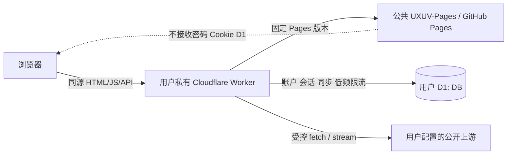

# UXUVideo Worker / UXUV-Pages 分仓迁移与 KVideo 4.9.19 完整复刻规范

状态：**Approved for planning；用户于 2026-08-08 在收到本修订后直接调用 `@uxu-code:plan`。仍不授权实现、提交、推送或部署**
日期：2026-08-08（基于 2026-08-07 已批准架构重开）
目标版本：Worker API Contract v1

> 2026-08-08 验收纠偏：已发布的 UXUV-Pages `0.1.2` 只覆盖了简化页面和部分功能，未满足本规范原有“迁移不是视觉重设计”和“功能类别完整”的要求。本次重开把 KVideo 4.9.19 的完整 UI 与用户可见行为升级为硬性发布门；此前 `work-products/plan.md`、`work-products/todo.md` 中关于 UI 已全面接管的结论失效，须在本规范获批后重新规划。

## 1. 决策摘要

| 事项 | 已批准决策 |
| --- | --- |
| 仓库职责 | `UXUVideo` 最终只交付单文件模块 Worker `_worker.js`；新增公共 `UXUV-Pages` 保存并发布静态前端 |
| 前端交付 | Next.js 使用 `output: 'export'` 与 `images.unoptimized: true`；公共 Pages 不运行 API、认证或用户数据逻辑 |
| 复刻基准 | KVideo 4.9.19 的权威源码基准固定为 `UXUVideo` Git commit `28334f41407082ae1028fa4a4180bcc46d31c52a`；`https://kvideo.uxudjs.dpdns.org/` 只作辅助人工对照，不替代固定提交 |
| UI 与功能 | 完整保留固定基准中的视觉设计、页面结构、组件、文案、交互、设置项和用户功能；禁止以简化页面、原生控件或新设计替代 |
| 唯一允许差异 | 仅允许 Worker API、D1 数据/同步和登录/会话安全架构所必需的差异；这些差异必须保持原功能入口和用户能力，并使用 KVideo 视觉语言呈现 |
| Worker 路由 | Worker 原生实现现有 21 个 `app/api/**/route.ts` 的 Web API 合同，并新增 1 个 Cloudflare 用量路由，共 22 个；禁止复制 `NextRequest`、`NextResponse`、Node 文件系统或 Next 缓存语义 |
| 静态资源 | Worker 固定代理一个明确的 Pages 发布版本；禁止在运行时跟随 `main`、`latest` 或可变分支 |
| 认证与同步存储 | **已确认：** D1 是 v1 唯一权威存储；KV 与 Upstash 不进入 v1 运行时 |
| 认证边界 | 登录、会话、Premium 授权、账户管理、同步与所有高成本代理 API 均发生在用户自己的 Worker 域名 |
| Free 套餐 | **已确认：** 支持完整功能类别，但采用保守上限；媒体代理、IPTV 和长流为尽力而为，不承诺无限时长或生产 SLA |
| 安全基线 | 默认必须配置认证；同源 API、严格 Cookie/CSRF、SSRF 防护、无通配 CORS、CSP、安全日志和应用级限流 |
| 兼容发布 | Pages 版本、Pages 提交、资源清单 SHA-256、Worker 版本和 API Contract 必须一起验证；不兼容时失败关闭 |
| 用量与提醒 | 主设置页向 `super_admin` 显示 Workers 账户/本脚本及 D1 账户/本数据库用量；项目警戒线、官方额度和 UTC 重置时间分开标识，接近官方上限时显示全局提醒 |

本规范选择“固定静态发布 + 用户私有 API Worker”，而不是把完整前后端一起复制到每个 Cloudflare 账户。它保留单文件部署体验，也避免公共 Pages 接触密码、Cookie、D1 或用户同步数据。

## 2. 假设与确认项

以下假设与决策均已确认：

1. **已确认：** 用户所称 `../CfCdnAX` 与 `../CFAX-Pages` 指本机实际存在的 `../CfGfwAX` 与 `../CGAX-Pages`。前者的 Worker 固定代理 Pages 基址、后者只保存静态 UI，是本规范的职责参考，但本规范不会复制其“跟随 Pages 最新内容”的弱版本契约。
2. 目标用户是个人、家庭或小规模可信用户群；不是公开匿名视频代理服务或大规模 SaaS。
3. “单一 `_worker.js`”指部署产物只有一个可复制粘贴的模块 Worker 文件；仓库仍可保留 README、许可证、验证脚本和 `work-products/tests/`。
4. **已确认：** “全部功能支持 Free 套餐”指所有功能类别均有可验证的小规模路径，不等于无限并发、无限流量、第三方源可用性保证或生产 SLA。
5. **已确认：** 新公共仓库为 `uxudjs/UXUV-Pages`；本机 `../UXUV-Pages` 已是 Git 工作区，`origin` 指向 `https://github.com/uxudjs/UXUV-Pages.git`。Pages 最终公开 URL 与可选自定义域名在发布时由仓库配置确定，不改变固定发布合同。
6. **已确认：** D1 完整模式要求用户创建一个 D1 数据库并配置两个 Worker Secret。仅复制代码但不配置这些项时，Worker 必须显示安全的设置错误，而不是退化为匿名开放代理。
7. **已确认：** 数据模型、查询、限流和同步必须按 Free 配额留出显著余量；不得把“额度够用”建立在未索引扫描、每媒体分片写 D1 或忽略索引写放大的假设上。
8. **已确认：** 精确显示 Cloudflare 账户实际用量需要额外配置一个仅含 `Account Analytics: Read` 的 API Token Secret，以及 Account ID、Worker script name、D1 database ID 三个普通变量。未配置时全部业务功能仍可用，但设置页只能显示配置说明与运行时发现的配额错误，不能伪造精确计数。
9. **已确认：** 完整复刻对象是 KVideo 4.9.19，固定源码提交为 `28334f41407082ae1028fa4a4180bcc46d31c52a`。该提交中的用户可观察行为高于当前 UXUV-Pages `0.1.2`，后者不是验收基准。
10. **已确认：** “完整 UI/功能复刻”不是仅保留同名路由或功能类别，而是保留用户能够看到、点击、配置和操作的具体界面与行为；只有后端 API 存在不能视为前端功能已迁移。
11. **已确认：** Worker、D1 和登录安全架构可以改变数据来源、认证方式、错误状态和保守上限，但不得借此删除 KVideo 控件、设置、页面区块或正常小规模成功路径。

## 3. 目标、用户与成功定义

### 3.1 目标

让用户完成以下最小部署流程：

1. 在 Cloudflare 创建 Worker，将 UXUVideo 发布的 `_worker.js` 全量复制粘贴。
2. 创建并绑定一个 D1 数据库 `DB`。
3. 配置 `ADMIN_PASSWORD` 与 `AUTH_SECRET` 两个 Secret。
4. 打开 Worker 域名，登录后使用搜索、详情、播放、媒体代理、IPTV、Premium、账户管理和跨设备同步。

若需要设置页显示 Cloudflare 实际用量，再按 9.2、9.3 配置只读 Analytics Token 和三个公开标识；这组配置不属于业务功能的必需项。

用户不需要 Fork、克隆、导入或授权 Cloudflare 读取 `UXUV-Pages` 仓库；Pages 由项目维护者统一发布。

### 3.2 How Might We

如何让个人用户只维护一个私有 Worker 和最少绑定，就能使用 UXUVideo 全部功能，同时让公共前端可独立更新、可验证、不会接触任何用户认证或同步数据？

### 3.3 可测成功条件

- `UXUVideo/_worker.js` 是可直接粘贴的 ES Module Worker，运行时无 npm 包、无构建产物依赖、无本地文件依赖。
- `UXUV-Pages` 能由 GitHub Actions 完成静态导出，发布物不含 `app/api/`、服务端模块、Secret 或用户数据。
- 固定基准提交中的每一项用户可见功能都有迁移实现、自动化行为证据和可追溯的对照项；对照矩阵不存在 `missing`、`partial` 或未审批差异。
- 八个页面入口及其关键加载、空、错误、内容、弹窗、菜单和播放器状态在 320、768、1024、1440 px 与固定基准保持结构和视觉一致。
- KVideo 的 Liquid Glass 设计系统、导航、卡片、设置区块、播放器控件、图标、动效、主题和响应式行为被直接迁移，不被当前 UXUV-Pages 的通用深色卡片设计替代。
- 现有 21 个 API 路由的用户可见功能均有 Worker 原生路由和合同测试，并新增 1 个只读用量路由。
- 浏览器地址栏始终是用户 Worker 域名；密码、会话 Cookie 和写操作不会发送到 `github.io`。
- Worker 只能加载规范中固定的 Pages 发布，且能拒绝清单哈希错误、资源不完整或 API Contract 不兼容的发布。
- D1 支持账户、可撤销会话、Premium 授权、配置、历史和收藏跨设备同步，并发写入不会静默覆盖较新版本。
- D1 Free 最坏情形预算模型、逐查询 `meta.rows_read`/`meta.rows_written` 和远端验收均低于 8.6 的项目警戒线。
- 主设置页能区分本项目用量、Cloudflare 账户额度、Analytics 延迟和数据不可用；达到分级阈值或收到 D1 配额错误时显示可执行提醒。
- Free profile 的远端 Cloudflare 验收不出现 `exceededCpu`、超过 50 个外部子请求或超过 6 个等待响应头的并发连接。
- 本地通过、Cloudflare 远端通过、真实第三方媒体源通过分别报告，不互相替代。

## 4. 范围与非目标

### 4.1 范围内

- 继续使用现有 `UXUV-Pages` 公共静态前端仓库，并以新的不可变版本发布完整复刻候选。
- 将现有浏览器 UI、样式、PWA 资源和浏览器安全逻辑迁移到 `UXUV-Pages`。
- 从固定 KVideo 4.9.19 提交直接迁移浏览器组件、样式、状态管理和交互；仅在与静态导出或 Worker/D1/登录安全边界冲突的位置做适配。
- 建立逐功能、逐页面、逐状态的 KVideo 对照矩阵，以及固定浏览器环境下的视觉基准与交互回归。
- 把根布局中的运行时文件/环境读取改为浏览器启动后从同源 Worker 获取公共配置。
- 在 `_worker.js` 中以 Fetch API、Web Streams、Web Crypto 和 D1 binding 重写现有 21 个 API 路由，并原生实现 1 个只读用量路由。
- 建立 D1 schema、自举、兼容迁移、配额预算、限流、会话和同步冲突合同。
- 建立 Pages/Worker 版本、资源完整性、安全响应头、日志和端到端回归合同。
- 保留 MIT 许可证和原作者版权声明；公开 Pages 分发必须包含相同许可证要求。

### 4.2 非目标

- 不恢复 Docker、Android TV、Apple TV 或 Node.js 自托管部署。
- 不让用户 Worker 克隆、导入或在运行时读取 GitHub 仓库源码。
- 不把公共 GitHub Pages 变成认证站点；其直接访问入口只显示公开说明或静态预览，不接受密码。
- 不保证任意第三方视频源、弹幕源、订阅源或 IPTV 源持续可用、合法或允许代理。
- 不提供匿名开放媒体代理。
- 不承诺 Free 套餐的无限流量、持续高并发或长流 SLA。
- 不在本规范阶段实现业务代码、创建远端仓库、部署或迁移生产数据。
- 不重新设计 KVideo UI，不以“现代化”“简洁化”“更适合静态站点”为由改变视觉、导航或交互。
- 不以原生 `<video controls>` 替代 KVideo 自定义播放器，不以单一名称/URL 表单替代完整设置与来源管理。
- 不把 UXUV-Pages `0.1.2` 的现状当作应继续兼容的产品基准；它只保留为不可变、可回滚的历史发布。
- v1 不自动迁移现有 Upstash 数据；迁移工具需单独审批和规范。
- v1 不发送邮件、系统推送或后台定时告警；提醒只在用户打开应用时显示。需要离线告警时另立通知渠道、调度和隐私规范。

## 5. 当前基线与迁移约束

### 5.1 固定 KVideo 基线与当前迁移证据

- 固定 KVideo 4.9.19 提交有 21 个 `app/api/**/route.ts` 文件，共约 2,200 行路由代码；这些服务端实现是功能语义参考，不会原样恢复为 Pages 运行时。
- 固定基准的认证与同步使用 Upstash Redis；账户被保存为单一数组 key，更新是读-改-写，存在并发覆盖窗口。该存储实现由已批准的 D1/CAS 架构替代。
- 固定基准根布局读取文件系统、环境变量、Redis 能力和服务端图标，阻止共享静态前端；只允许适配这些服务端边界，不允许借机改写浏览器 UI。
- 固定基准 `/api/proxy` 会把浏览器 `cookie` 转发给任意上游，这是必须消除的安全缺陷，不能视为兼容行为。
- 固定基准的并行搜索、分辨率探测和 Premium 聚合没有统一的 Cloudflare 子请求预算；Worker 可以施加已批准上限，但 UI 和小规模成功路径必须保留。
- 2026-08-08 当前 UXUVideo 提交为 `e7e397e520f90433f98eb1f929fc5d135bacfec0`，已收敛为 Worker 1.0.0；当前 UXUV-Pages 提交为 `4bc847affa76755a5c99ce249d793aa43e0b83bb`，发布版本为 `0.1.2`。
- 原 KVideo UI 已从当前树移除，但固定提交仍在 Git 历史中可读取。实施必须用增量补丁迁移，禁止 reset/checkout 覆盖当前工作树或破坏用户改动。
- 2026-08-08 审计显示：固定 KVideo 基准的 `app`、`components`、`lib`、`public` 相关源码共 296 个文件，UXUV-Pages `0.1.2` 对应目录仅 48 个；文件数量本身不是验收指标，但与播放器、设置、首页、IPTV、推荐、弹幕、主题和 TV 行为缺失相互印证。
- 当前 UXUV-Pages `MediaPlayer` 使用原生 `<video controls>`，当前来源设置主要提供名称、URL、启停和删除；它们不满足固定基准中的自定义播放器和完整设置合同。
- 当前生产页面与 KVideo 生产页面的同浏览器对照确认视觉系统、信息密度和交互入口显著不同。线上页面可用于人工发现问题，但自动验收必须依赖固定提交和无敏感数据的确定性 fixture。

### 5.2 参考项目中可复用与不可复用的模式

可复用：

- Worker 与静态 Pages 的仓库职责分离。
- 页面经 Worker 域名提供，认证 Cookie 只属于 Worker 域名。
- Worker、Pages 与跨仓测试共同组成发布门。

不可直接复用：

- 直接固定到 GitHub Pages 可变 `main` 内容。
- 缺少发布清单、资源 SHA-256 和兼容范围。
- 仅靠本地 Node 测试宣称 Cloudflare/真实长流可用。
- 参考项目的用量接口从浏览器 query string 接收 Account ID/API Token，并兼容 Global API Key；UXUVideo 必须改为 Worker Secret + 固定 GraphQL endpoint，凭据永不进入 URL 或前端。

## 6. 目标架构



### 6.1 `UXUVideo` 最终职责

建议最终结构：

```text
UXUVideo/
  _worker.js                 # 唯一部署产物；允许超过通用 150 行上限
  CHANGELOG.md
  README.md
  LICENSE
  scripts/                   # 只用于本地验证/发布，不是运行时依赖
  work-products/
    SPEC.md
    tests/
```

`_worker.js` 是用户明确要求的单文件例外。内部仍必须以短函数、路由表和明确区域组织，禁止生成式重复或复制 22 份响应样板。

### 6.2 `UXUV-Pages` 最终职责

```text
UXUV-Pages/
  app/                       # 仅静态页面
  components/
  lib/                       # 仅浏览器逻辑、共享类型和纯函数
  public/
  scripts/build-release.mjs
  next.config.ts
  package.json
  work-products/tests/
```

要求：

- `next.config.ts` 使用 `output: 'export'`、`images.unoptimized: true`，所有页面在构建期可导出。
- 删除 `app/api/`、`lib/server/`、`server-only`、`fs`、运行时 `process.env` 个性化和 Vercel Analytics。
- `NEXT_PUBLIC_*` 只允许用于真正的公共构建常量；实例配置一律来自用户 Worker 的 `/api/config`。
- 根布局必须是确定性的静态布局。站点名、图标、功能能力、广告关键词、VideoTogether 配置等由客户端 RuntimeConfigProvider 在同源 Worker 上加载。
- GitHub Pages 直接入口不得显示登录表单或发送敏感数据；它可以显示“请从你的 Worker 域名访问”的静态说明。
- Pages 发布不得包含默认密码、D1 标识、Worker Secret、用户源、Cookie 或真实账户数据。

### 6.3 请求路由顺序

Worker 必须按以下顺序处理：

1. 规范化 URL、方法和请求 ID。
2. `/api/*` 进入 API 路由表；未知 API 返回结构化 404，绝不回退 HTML。
3. 非 API 只接受 `GET`/`HEAD`；其他方法返回 405。
4. 根据固定的 Pages release manifest 精确映射静态路由；禁止任意上游路径拼接。
5. HTML 添加安全头和必要 nonce；哈希静态资产使用长期缓存。
6. 未知页面返回固定版本的 `404.html`；不把任意路径当首页。

## 7. Pages 发布、兼容与资源完整性合同

### 7.1 发布标识

每个 Pages 发布必须生成不可变清单，例如：

```json
{
  "schemaVersion": 1,
  "pagesVersion": "1.0.0",
  "gitCommit": "40-character-full-commit-sha",
  "apiContract": 1,
  "workerRange": ">=1.0.0 <2.0.0",
  "routes": {
    "/": "index.html",
    "/player": "player/index.html"
  },
  "assets": {
    "/_next/static/example.js": {
      "path": "_next/static/example.js",
      "sha256": "base64-sha256",
      "contentType": "text/javascript; charset=utf-8"
    }
  }
}
```

Worker 源码固定以下常量：

- `WORKER_VERSION`
- `API_CONTRACT_VERSION`
- `PAGES_VERSION`
- `PAGES_BASE_URL`
- `PAGES_MANIFEST_SHA256`
- 可选的同 API Contract 上一版回退清单

### 7.2 不可变与校验规则

- `PAGES_BASE_URL` 必须包含明确版本目录，不能含 `main`、`master`、`latest` 或可变查询参数。
- 发布流水线拒绝覆盖已存在且字节不同的版本目录。
- Worker 获取清单后先校验清单 SHA-256，再校验 `apiContract` 与 `workerRange`。
- HTML 必须在 Worker 中校验 SHA-256 后再返回；首方 JS/CSS 使用内容哈希文件名和 SRI，且 SRI 值来自已验证清单。
- 小型首方公共资源可在 Worker cache miss 时校验 SHA-256；大资源不得为了哈希而无界缓冲。
- 清单、HTML 或兼容校验失败时返回安全的内置 503 页面，并记录 `frontend_integrity_error`；禁止静默加载最新 Pages。
- GitHub Pages 429/5xx 时，只能使用同一 API Contract、已固定并已验证的回退版本；没有安全回退则 503。
- HTML：`Cache-Control: no-cache, must-revalidate`。内容哈希资产：`public, max-age=31536000, immutable`。认证/API 响应：`no-store`。

### 7.3 发布顺序与回滚

1. 先发布新的、不可变的 Pages 版本并完成公开字节/SHA 验证。
2. 再更新 `_worker.js` 的 Pages 固定常量、Worker 版本和 CHANGELOG。
3. 运行两个仓库的本地合同测试。
4. 本地身份、字节、回滚和安全门通过后，把精确 `_worker.js` 标为可复制候选。
5. 用户自行复制到 Cloudflare、绑定 `DB` 并配置两个必需 Secret；Cloudflare、真实媒体与真实设备结果作为用户验收证据，不反向伪装成本地已验证结论。

回滚只需恢复上一版 `_worker.js`。D1 迁移在同一 API major 内必须只增不删并保持上一版可读；若做不到，发布门必须 NO-GO，另写迁移/回滚规范。

## 8. 存储与认证决策

### 8.1 决策：D1 完整模式

D1 完整模式以 D1 作为 v1 唯一权威存储，binding 名固定为 `DB`。

理由：

- 账户用户名唯一、最后一个超级管理员保护、会话撤销和同步 CAS 都需要原子约束或事务。
- D1 `batch()` 是事务；适合账户和多文档状态。
- Free 套餐当前包含每日 500 万行读取、10 万行写入、账户总计 5 GB 存储；单个数据库上限为 500 MB。该容量足以覆盖本项目的个人/家庭文本状态，但必须通过索引限制扫描，且禁止把媒体内容写入 D1。
- 在 Workers Free 计划内创建并使用 D1 不会自动收费；达到每日读写上限后查询会失败，至 UTC 00:00 重置，而不是自动产生超额账单。达到存储上限后必须清理数据或升级。D1 不收数据传输/egress 费用。
- 与 Upstash 相比，用户少一个第三方服务账户和两项外部数据库凭据。

未采用方案：

- KV：最终一致，跨区域可能 60 秒或更久，且同键并发写入为最后写入覆盖；必须削减多账户、即时会话撤销和强一致同步，已由用户选择 D1 后排除出 v1。
- Upstash：现状迁移成本最低，但把核心认证继续交给外部服务；Free 当前为 256 MB、每月 50 万命令，且现有单数组读改写仍需重构原子并发合同。它可作为未来可选适配器，但不进入 v1。

### 8.2 最小 D1 schema

```text
accounts
  id PK, username UNIQUE, display_name, role, permissions_json,
  password_hash, password_salt, password_iterations,
  session_version, created_at, updated_at

sessions
  token_hash PK, account_id FK, premium_until,
  expires_at, created_at, last_seen_at

user_documents
  account_id, kind, version, payload_json, updated_at,
  PRIMARY KEY(account_id, kind)

rate_limits
  bucket_key PK, window_start, count, expires_at
```

`kind` v1 只允许 `config` 与 `library`。必须对用户名、会话过期、文档主键和限流过期建立必要索引；测试必须核对每个常用查询的行扫描范围。

### 8.3 Schema 初始化

- Worker 内嵌带版本号的幂等 schema，首次 API 请求执行 `ensureSchema()`。
- 创建语句使用 `IF NOT EXISTS`，多语句通过 `DB.batch()`；失败返回 `503 STORAGE_UNAVAILABLE`。
- 同一 isolate 共享初始化 Promise，但不能依赖 isolate 全局状态保证跨请求正确性。
- 自动迁移只允许向后兼容的新增表、列或索引。删列、重写数据或不可逆迁移必须另行审批。

### 8.4 认证与会话

- 全功能模式必须配置 `ADMIN_PASSWORD` 与 `AUTH_SECRET` Secret；默认管理员用户名为 `admin`，可用普通变量 `ADMIN_USERNAME` 覆盖。
- 第一次成功管理员登录时，将密码以 PBKDF2-SHA-256 和随机 salt 写入 D1；明文永不写入 D1 或日志。
- 不保留 v1 的 `ACCOUNTS`、`ACCESS_PASSWORD`、`UPSTASH_REDIS_REST_*` 运行时兼容。旧数据迁移另立规范。
- 会话 Cookie 使用 `__Host-uxuv_session`，属性为 `HttpOnly; Secure; SameSite=Strict; Path=/`，不设置 `Domain`。
- Cookie 保存 256-bit 随机 token；D1 只保存其 SHA-256。登出、删账户、改密码或提升 `session_version` 后可撤销会话。
- 会话默认 30 天；非持久会话为浏览器会话。过期时间必须在服务端验证，不能只依赖 Cookie。
- Premium 密码验证成功后，把 `premium_until` 写入当前会话；Premium API 必须服务端验证，不能只依赖前端 Gate。
- 密码哈希工作因子不得为了 Free CPU 门而静默降低。PBKDF2 远端验证若持续触发 10 ms CPU 上限，则 Free 全功能门为 NO-GO，需用户决定付费或重新审批认证方案。

### 8.5 同步与冲突

- `/api/user/config` 与 `/api/user/sync` 返回 `version`、`updatedAt` 和 ETag。
- 写入必须带 `baseVersion` 或 `If-Match`；D1 使用 `UPDATE ... WHERE version = ?` 实现 CAS。
- 版本不匹配返回 409 `SYNC_CONFLICT` 和当前服务端版本，禁止最后写入者静默覆盖。
- `config` 对标量保存逐字段更新时间；按 ID 管理的 sources/subscriptions 保存删除 tombstone，保留 30 天。
- `library` 按稳定记录 ID 合并历史/收藏，选择更新时间较新的记录；删除也用 30 天 tombstone，防止另一设备复活。
- 每个文档 JSON 最大 512 KiB；超过返回 413。客户端本地存储仍是离线源，服务端不可用时显示明确同步状态，不伪装成功。

### 8.6 D1 Free 预算合同

Cloudflare 当前 Free 上限是每日 500 万行读、10 万行写、单数据库 500 MB。本项目的发布警戒线必须更低，并以 D1 返回的实际 `meta.rows_read` / `meta.rows_written` 计算，不能只数 SQL 语句：

| 指标 | 项目警戒线 | Free 上限占比 |
| --- | --- | --- |
| D1 行读取 | 每日最坏情形模型不超过 1,000,000 | 20% |
| D1 行写入 | 每日最坏情形模型不超过 50,000，包含索引写放大 | 50% |
| D1 存储 | 不超过 50 MiB | 低于单库上限约 10% |
| 账户 | 最多 8 个 | 个人/家庭边界 |
| 活跃会话 | 每账户最多 5 个；新登录淘汰最旧会话 | 最多 40 个 |
| 用户文档 | 每账户固定 `config`、`library` 两行；每行最多 512 KiB | 用户 JSON 理论上限约 8 MiB |

批准上限下的基础写模型为：同步最多 23,040 行/日，登录、Premium 与账户日桶合计最多 2,100 次，会话活跃时间最多 160 次/日，清理最多 200 行/日；合计不超过 25,500 次逻辑变更。发布测试仍必须使用实际 row metrics 计入事务和索引写放大，并保持在 50,000 行警戒线内。

查询合同：

- 会话按 `token_hash` 主键查询并通过账户主键关联；普通已认证请求目标不超过 5 行读取，任何非管理 API 不超过 20 行读取。
- 账户列表最多返回 8 行；所有查询显式列名，禁止 `SELECT *`、无界 `UPDATE/DELETE` 和未索引认证/同步查询。
- 每条常用查询必须用 `EXPLAIN QUERY PLAN` 验证主键、唯一索引或显式索引；出现无界 `SCAN` 即发布 NO-GO。
- 每个 D1 调用记录脱敏的 `queryId`、`rowsRead`、`rowsWritten` 和耗时；禁止记录 SQL 参数、payload 或用户标识。

写入合同：

- 客户端本地变更立即保存，但每个账户、每种文档最多每 60 秒同步写一次；期间变化合并为一次 CAS 更新。
- `sessions.last_seen_at` 每个会话最多 6 小时更新一次；不得每请求写入。
- D1 持久限流只用于登录、Premium 验证、账户变更和同步写入。搜索、探测、媒体首请求采用 isolate 内短期令牌桶加路由硬上限，不为每次高频读取写 D1。
- D1 全局日写保护上限为：登录尝试 1,000、Premium 验证 1,000、账户变更 100；达到上限后的条件 UPSERT/UPDATE 必须停止修改计数行，只返回 429。
- 静态资源、缓存命中、媒体字节、HLS 签名子资源、日志和指标不得写 D1。
- 过期 session/rate-limit 清理只附带在成功登录或管理事务中，每次最多删除 20 行、全局每日最多删除 200 行；禁止一次无界清理。

验收与失败行为：

- `work-products/tests/d1-free-budget.test.mjs` 必须从账户、会话、同步和限流上限重算最坏情形日预算，并拒绝超过上述警戒线的改动。
- 预算模型至少包含 8 个账户各 2 种文档每分钟一次写入、40 个活跃会话、索引写放大、全部 D1 日限流桶和每日最多 200 行的有界清理。
- 测试 D1 必须采集每条关键 API 的实际 row metrics；估算低于警戒线但远端实际超线时，以远端结果为准并 NO-GO。
- D1 返回配额错误时统一返回 503 `STORAGE_QUOTA_EXCEEDED`，认证和写操作失败关闭；前端保留本地未同步数据并显示等待 UTC 重置/清理/升级说明。
- 不自动升级 Paid、不自动删除用户文档、不退化为匿名或无存储认证。
- 以上预算只约束 UXUVideo；同一 Cloudflare 账户中的其他 D1 工作负载或恶意流量仍可能消耗账户额度，必须在 Dashboard 查看实际 Row Metrics。

## 9. 用户必须配置的变量与绑定

### 9.1 全功能必需

| 名称 | 类型 | 说明 | 缺失行为 |
| --- | --- | --- | --- |
| `DB` | D1 binding | 账户、会话、同步、限流 | API 503，显示设置说明；不开放匿名代理 |
| `ADMIN_PASSWORD` | Secret | 首个超级管理员自举凭据 | 登录 503 `SETUP_REQUIRED` |
| `AUTH_SECRET` | Secret | HMAC 限流键、短期媒体 token 与敏感标识 | 相关 API 503；不得使用内置默认值 |

### 9.2 可选 Secret

| 名称 | 默认值 | 用途 |
| --- | --- | --- |
| `PREMIUM_PASSWORD` | 空 | 可选的 Premium 独立授权凭据；必须在 Dashboard 中按 Secret 配置 |
| `CF_ANALYTICS_API_TOKEN` | 空 | Cloudflare GraphQL 只读用量查询；必须只授予目标账户的 `Account Analytics: Read`，不得使用 Global API Key；缺失时业务功能不受影响，用量卡显示未配置 |

### 9.3 可选普通变量

| 名称 | 默认值 | 用途 |
| --- | --- | --- |
| `ADMIN_USERNAME` | `admin` | 自举管理员用户名 |
| `PERSIST_SESSION` | `true` | 持久会话开关 |
| `SITE_NAME` / `SITE_TITLE` / `SITE_DESCRIPTION` | UXUVideo 默认值 | Worker 运行时站点文案 |
| `SITE_ICON_URL` | `/icon.png` | HTTPS 图标 URL；不支持本地文件路径 |
| `SUBSCRIPTION_SOURCES` | 空 | 默认订阅源 JSON/URL 列表 |
| `IPTV_SOURCES` | 空 | 默认 IPTV 源；只返回给已认证且有权限的用户 |
| `MERGE_SOURCES` | `false` | 默认源合并策略 |
| `DANMAKU_API_URL` | 空 | 默认弹幕 API |
| `AD_KEYWORDS` | 空 | 广告关键词；不支持 `AD_KEYWORDS_FILE` |
| `VIDEOTOGETHER_ENABLED` | `true` | 内置一起看能力；设为 `false` 或 `0` 时由部署管理员关闭 |
| `VIDEOTOGETHER_SCRIPT_URL` / `VIDEOTOGETHER_SETTING_URL` | 固定官方入口 | 可选 HTTPS 自定义覆盖；非法显式脚本 URL 失败关闭，不回退官方地址 |
| `UPDATE_REPOSITORY` / `UPDATE_BRANCH` | 项目默认 | 更新检查来源 |
| `DEPLOYMENT_PROFILE` | `free` | `free` 或 `paid`，选择保守上限 |
| `DEBUG` | `false` | 结构化调试日志；仍必须脱敏 |
| `CF_ACCOUNT_ID` | 空 | 用量查询的 Cloudflare Account ID；只用于服务端 GraphQL 变量 |
| `CF_WORKER_SCRIPT_NAME` | 空 | 当前 UXUVideo Worker 的 script name，用于区分本脚本与账户总用量 |
| `CF_D1_DATABASE_ID` | 空 | `DB` 对应的 D1 database ID，用于区分本数据库与账户总用量 |

`PAGES_BASE_URL`、Pages 版本和清单哈希不是用户变量，必须固化在发布的 `_worker.js` 中，避免把不受验证的前端注入用户实例。

四项 `CF_*` 用量配置是一个可选整体：Token 必须保存为 Worker Secret，其他三项是非敏感标识。任何一项缺失时 `/api/admin/usage` 返回 `configured: false` 和缺失的变量名，不返回 5xx，也不影响登录、同步、媒体或其他 API。不得把 Token 写入普通变量、URL、请求查询参数、D1、Pages、浏览器存储、响应或日志。

## 10. 22 个 Worker API 路由合同

所有 JSON 错误统一为：

```json
{
  "error": {
    "code": "MACHINE_READABLE_CODE",
    "message": "Safe user-facing message",
    "requestId": "uuid",
    "details": null
  }
}
```

所有响应带 `X-Request-Id`、`X-UXUV-Worker-Version`、`X-UXUV-Pages-Version` 和 `X-UXUV-API-Contract`。SSE 错误使用 `event: error` 加同一 JSON 结构。开始二进制流后发生错误时终止流并记录日志，不伪造第二个 HTTP 响应。

| # | 路由 | 方法 | 授权 | Worker v1 行为与上限 |
| --- | --- | --- | --- | --- |
| 1 | `/api/app-update` | GET | 已登录 | 获取固定仓库清单；10 秒超时；Cache API 5 分钟；失败仍返回安全的 `check-failed` 状态 |
| 2 | `/api/auth/accounts/:accountId` | PATCH, DELETE | super_admin | D1 事务更新/删除；保护最后一个超级管理员；改密码撤销旧会话 |
| 3 | `/api/auth/accounts` | GET, POST | super_admin | 最多 8 个账户；用户名唯一；不返回密码字段 |
| 4 | `/api/auth` | GET, POST | GET 公开；POST 登录或已登录 Premium 授权 | GET 返回登录模式与公开能力；POST 受严格限流；Premium 授权写当前 session |
| 5 | `/api/auth/session` | GET, DELETE | 公开读取当前状态；DELETE 当前会话 | 只读安全公开会话摘要；DELETE 撤销 D1 session 并清 Cookie |
| 6 | `/api/config` | GET | 公开最小配置；敏感/源配置需登录 | 返回版本、能力、站点文案；未登录不得泄漏 IPTV/订阅源 |
| 7 | `/api/danmaku` | GET, OPTIONS | 已登录 | 只允许 `search/comments`；目标 HTTPS/HTTP 公开地址；JSON 最大 2 MiB；1 小时安全缓存 |
| 8 | `/api/detail` | GET, POST | 已登录 | 验证 source schema 后请求单一上游；响应最大 5 MiB；15 秒超时 |
| 9 | `/api/douban/image` | GET | 已登录 | 只允许受支持的豆瓣图片 host 候选；流式返回；长期缓存；不接受任意图片代理 |
| 10 | `/api/douban/recommend` | GET | 已登录 | 固定豆瓣 host、分页参数范围校验；1 小时缓存；图片 URL 改写为同源路由 |
| 11 | `/api/douban/tags` | GET | 已登录 | 固定豆瓣 host；只允许 movie/tv；24 小时缓存 |
| 12 | `/api/iptv` | GET | 已登录且 `iptv_access` | 获取并解析 M3U；清单最大 1 MiB；5 分钟缓存；自定义 UA/Referer 长度与字符校验 |
| 13 | `/api/iptv/stream` | GET, OPTIONS | 首次请求已登录且 `iptv_access`；子资源使用 10 分钟签名 token | HLS 清单重写；Range 透传；二进制不缓冲；20 秒响应头超时；无通配 CORS |
| 14 | `/api/ping` | POST | 已登录 | URL/SSRF 校验；HEAD 后可选 GET fallback；单目标；8 秒总超时 |
| 15 | `/api/premium/category` | GET, POST | 已登录且 Premium 有效 | Free 最多 12 源/5 并发/500 条；Paid 最多 32 源/6 并发/2000 条；实际应用 `limit` |
| 16 | `/api/premium/types` | GET, POST | 已登录且 Premium 有效 | 同上源/并发预算；1 小时缓存；使用 Web API base64，不使用 Node `Buffer` |
| 17 | `/api/probe-resolution` | POST | 已登录 | SSE；Free 最多 6 视频/3 并发/每项最多 2 个变体；Paid 最多 50 视频/6 并发 |
| 18 | `/api/proxy` | GET, OPTIONS | 首次请求已登录；重写子资源使用 10 分钟签名 token | HLS 清单最大 1 MiB；媒体流/Range 直通；不转发浏览器 Cookie/Authorization；无匿名开放代理 |
| 19 | `/api/search-parallel` | POST | 已登录 | SSE；Free 最多 12 源、5 并发、每源 3 页、500 条；Paid 最多 32 源、6 并发、每源 3 页、2000 条 |
| 20 | `/api/user/config` | GET, POST | 已登录 | D1 `config` 文档；ETag/CAS；512 KiB；冲突 409；每账户最多每 60 秒写一次 |
| 21 | `/api/user/sync` | GET, POST | 已登录 | D1 `library` 文档；CAS 与 history/favorite/tombstone 合并；512 KiB；每账户最多每 60 秒写一次 |
| 22 | `/api/admin/usage` | GET | super_admin | 只读查询 Cloudflare GraphQL；返回 Workers 与 D1 的账户总量及本项目量、阈值、UTC 重置时间和数据新鲜度；成功快照服务端缓存 5 分钟；不写 D1 |

兼容原则：路由和主要成功数据字段在 API Contract v1 内保持；错误体、认证强制和安全上限是有意的新合同。不得为了保留旧行为继续泄漏 Cookie、允许匿名代理或绕过服务端 Premium 校验。

### 10.1 Cloudflare 用量 API 合同

`GET /api/admin/usage` 只能在验证 `super_admin` session 和同源请求后访问。它向固定地址 `https://api.cloudflare.com/client/v4/graphql` 发起最多一个 GraphQL 子请求，使用 `Authorization: Bearer <secret>` 请求头；Account ID、script name 与 database ID 使用 GraphQL variables。禁止从浏览器的 query/body/header 接受 Cloudflare 凭据，也不支持 Email + Global API Key。公共 `UXUV-Pages` 运行在 GitHub Pages，不计入用户 Cloudflare Pages 用量，界面不得仿照参考项目虚构 Pages 请求数。

时间范围固定为当前 UTC 日，`resetsAt` 为下一次 UTC 00:00。GraphQL 必须同时查询：

- `workersInvocationsAdaptive` 的账户请求/错误总量，以及按 `CF_WORKER_SCRIPT_NAME` 过滤的本脚本请求/错误量。
- D1 账户全部数据库的 `rowsRead`、`rowsWritten` 与存储总量，以及按 `CF_D1_DATABASE_ID` 过滤的本数据库读、写与大小。
- 本项目与账户总量必须分字段返回。Workers 100,000 请求/日及 D1 读写日额度是账户级边界，不能用本脚本或本数据库的较小数字冒充账户剩余额度；D1 单库 500 MB 与账户总存储 5 GB 也分别显示。

成功响应至少为：

```json
{
  "data": {
    "configured": true,
    "plan": "free",
    "period": { "start": "UTC ISO", "end": "UTC ISO", "resetsAt": "UTC ISO" },
    "workers": {
      "accountRequests": 0,
      "scriptRequests": 0,
      "accountErrors": 0,
      "scriptErrors": 0,
      "accountLimit": 100000
    },
    "d1": {
      "accountRowsRead": 0,
      "databaseRowsRead": 0,
      "accountRowsWritten": 0,
      "databaseRowsWritten": 0,
      "accountStorageBytes": 0,
      "databaseStorageBytes": 0,
      "accountReadLimit": 5000000,
      "accountWriteLimit": 100000,
      "accountStorageLimitBytes": 5000000000,
      "databaseStorageLimitBytes": 500000000,
      "projectReadGuardrail": 1000000,
      "projectWriteGuardrail": 50000,
      "projectStorageGuardrailBytes": 52428800
    },
    "level": "normal",
    "warnings": [],
    "observedAt": "UTC ISO",
    "stale": false,
    "source": "cloudflare-graphql"
  }
}
```

百分比由 Worker 使用受控整数计算，前端只负责显示；负数、非有限数或统计回退不得进入响应。`level` 为所有指标的最高等级，`warnings` 使用稳定机器码。Analytics adaptive 数据可能延迟，界面必须显示 `observedAt` 和“统计可能延迟”，不能标为实时余额。

缓存与失败行为：

- 鉴权成功后才可读取服务端 Cache API 快照；成功快照 5 分钟内直接复用，浏览器响应使用 `Cache-Control: private, no-store`。
- Cache API 可保留上一份成功快照最多 1 小时；上游暂时失败时返回该快照并设 `stale: true`，同时给出安全警告码。缓存不得写 D1，也不得包含 Token 或未经脱敏的 Cloudflare 错误。
- 未配置四项 `CF_*` 时返回 HTTP 200、`configured: false`、稳定的 `missing` 名称列表和设置说明；不尝试 GraphQL。
- Cloudflare 401、403、429、GraphQL 错误及网络失败分别映射为 `USAGE_AUTH_FAILED`、`USAGE_FORBIDDEN`、`USAGE_RATE_LIMITED`、`USAGE_UPSTREAM_ERROR`；无可用旧快照时返回 502/503，绝不透传原始响应体。
- GraphQL 查询不写 D1；用量卡打开时请求一次，页面可见期间最多每 5 分钟自动刷新。手动刷新 30 秒内禁用重复点击，但仍服从 5 分钟服务端快照，避免“查看额度”本身制造高频 Worker/Analytics 流量。

### 10.2 分级提醒与额度耗尽行为

设置页卡片对每个指标显示“账户官方额度”和“本项目用量”；D1 另显示 8.6 的项目警戒线。等级规则固定为：

- Workers 账户请求：`<70%` normal，`70%-<85%` notice，`85%-<95%` warning，`95%-<100%` critical，`>=100%` exhausted。
- D1 账户日读/写额度及账户/单库存储：官方额度 `<85%` normal，`85%-<95%` warning，`95%-<100%` critical，`>=100%` exhausted。
- D1 本数据库项目警戒线：达到警戒线的 80% 为 notice，达到 100% 为 warning；它只在用量卡提示预算风险，不等同于 Cloudflare 官方额度耗尽。
- 任一指标进入 warning 时，已登录 `super_admin` 在所有应用页面看到不可静默永久关闭的全局横幅；critical/exhausted 使用更强提示并显示 UTC 重置时间或存储清理/升级说明。其他用户不看到精确数字。

D1 查询实际返回配额错误时，即使 Analytics 尚未更新，也必须返回 503 `STORAGE_QUOTA_EXCEEDED`，带安全的 `quotaKind`（可判定时）和 `retryAt`；前端保留本地未同步数据并显示全局错误。若任何 API 发现该稳定错误码，普通用户可以看到不含数值和账户标识的通用存储不可用提醒。

Workers Free 请求额度真正耗尽后，新请求可能在执行 `_worker.js` 前就被 Cloudflare 拒绝，因此应用无法保证在“已经耗尽”后再由同一 Worker 显示提醒。v1 的可靠合同是 70%/85%/95% 提前预警、显示最后观测时间，并在已打开页面的 Worker 请求整体失败时提示“实例暂时不可达，请到 Cloudflare Dashboard 核对”；不能把网络故障确定表述为额度耗尽，也不承诺后台、邮件或系统推送。

## 11. Free 与 Paid 能力边界

### 11.1 决策

Free 套餐目标是“个人使用的功能完整性”，不是“无限容量的行为等价”。媒体代理、IPTV、并行搜索和长流都保留，但必须服从 profile 上限和远端验收门。

当前官方硬边界（2026-08-07 核验）：

- Workers Free：100,000 请求/日、每请求 10 ms CPU、128 MB 内存、50 个外部子请求、6 个等待响应头的并发连接、压缩后 Worker 3 MB。
- HTTP Worker 只要客户端保持连接就没有硬 wall-time 上限，响应体也没有强制大小上限；但 runtime 更新只给在途请求约 30 秒宽限，客户端或上游断开仍会终止。
- D1 Free：每日 500 万行读、10 万行写、账户总计 5 GB、单数据库 500 MB；读写超限后查询失败直到 UTC 00:00 重置。
- 本项目 D1 警戒线：每日最坏情形不超过 100 万行读、5 万行写，数据库不超过 50 MiB；详见 8.6。

### 11.2 “长流尽力而为、无 SLA”的含义

这不是“播放 30 分钟后强制断开”，也不是删除媒体代理或 IPTV。合同含义是：

- Worker 必须用 Web Streams 直通媒体，保留 Range、HLS 清单和签名分片代理，不把完整媒体读入内存。
- 发布门会验证连续 30 分钟的受控长流，但该测试只证明候选版本在测试条件下工作。
- 项目不承诺任意第三方源都可用，也不承诺连接永不断开、固定码率、固定启动时间或 7x24 可用率。
- 上游服务器、客户端网络、Cloudflare runtime 更新、Free 请求/CPU/子请求配额均可能中止某次播放；Worker 应记录可诊断的结束原因并允许客户端重试。
- 若验收要求是“IPTV 长期中继必须稳定、任何流都不能断”，这已经是生产媒体 SLA，Free 套餐不在支持范围内。

### 11.3 支持矩阵

| 能力 | Free | Paid |
| --- | --- | --- |
| 静态 UI、登录、账户、同步 | 支持；必须通过 10 ms CPU 远端门 | 支持，CPU 余量更高 |
| 媒体代理、IPTV | 支持已认证个人使用；流式直通、清单限 1 MiB；无 SLA | 支持更高持续负载，仍取决于上游与条款 |
| 并行搜索 | 支持 12 源、5 并发、3 页/源、500 条 | 支持 32 源、6 并发、2000 条 |
| 分辨率探测 | 支持小批次 6 条 | 支持 50 条 |
| 长流 | 技术上支持，30 分钟测试为发布门；不承诺无限连接 | 技术上支持，仍不等于媒体 SLA |
| 高流量 | 受 100,000 请求/日硬限制 | 按 Paid 计费与配置 |

如果用户把“全部功能”定义为没有上述 Free 上限或要求长期稳定 IPTV 中继，则结论是 **Free 不满足，必须使用 Workers Paid 或专用媒体服务**。

## 12. 安全合同

### 12.1 SSRF 与上游请求

- 只允许 `http:`/`https:`，拒绝凭据 URL、localhost、`.local`、私有/回环/链路本地/组播/保留 IP 字面量和 Cloud metadata host。
- Cloudflare 出站代理仍是第二道保护，不能替代应用校验。
- 自动重定向最多 3 次，每次重新验证目标。
- 从浏览器请求中只允许转发明确白名单头；`Cookie`、`Authorization`、`CF-*`、`X-Forwarded-*` 永不转发到媒体上游。
- 自定义 UA/Referer 禁止 CR/LF，限制长度；Referer 必须是有效 HTTP(S) URL。
- JSON、HTML、M3U、同步文档均有显式字节上限；二进制媒体使用 Streams API，不调用 `arrayBuffer()`/`text()` 全量缓冲。

### 12.2 CORS、CSRF 与 Cookie

- 浏览器 API 设计为同源；不返回 `Access-Control-Allow-Origin: *`。
- 公共 `github.io` 页面不得跨源调用用户 Worker API。
- 所有状态修改方法验证 `Origin === request origin`；不匹配或缺失的浏览器写请求返回 403。
- 使用 `SameSite=Strict` 的 `__Host-` Cookie；禁止把 session 放入 URL、localStorage 或可读 JavaScript。
- OPTIONS 路由保留合同，但默认只允许同源所需方法/头，不开放跨站凭据请求。

### 12.3 CSP 与响应头

HTML 至少设置：

```text
Content-Security-Policy:
  default-src 'self';
  script-src 'self' 'nonce-<per-response>' [显式允许的第三方脚本源];
  style-src 'self' 'unsafe-inline';
  img-src 'self' data: blob: https: http:;
  media-src 'self' blob: https: http:;
  connect-src 'self' https: http: wss:;
  worker-src 'self' blob:;
  object-src 'none'; base-uri 'self'; form-action 'self'; frame-ancestors 'none'
```

并设置 `X-Content-Type-Options: nosniff`、`Referrer-Policy: no-referrer`、合理的 `Permissions-Policy` 和 HTTPS 下的 HSTS。VideoTogether 的固定官方入口由 Worker 默认允许，但账户内功能开关默认关闭，部署管理员也可显式禁用；Google Cast 与 VideoTogether 均不属于首方 Pages 完整性保证，UI 必须说明这一边界。

### 12.4 限流

为保持 Dashboard 复制部署，不要求 Wrangler 专用 Rate Limiting binding；该 binding 当前不能在 Dashboard 中配置或查看。限流分为两层，避免高频媒体/搜索请求逐次写 D1：

- D1 持久固定窗口仅覆盖密码验证和低频状态变更；使用单语句 UPSERT，失败时敏感操作失败关闭。
- 搜索、探测和媒体首请求使用 isolate 内短期令牌桶，并同时受路由硬并发/扇出上限约束。该层是尽力限制，不宣称跨 location 全局精确。

至少覆盖：

- 登录：每匿名 actor + username 每 60 秒 5 次，D1 全局每日最多记录 1,000 次尝试。
- Premium 验证：每 session 每 60 秒 10 次，D1 全局每日最多记录 1,000 次尝试。
- 搜索/探测：每 session 每 60 秒各 6 次。
- 账户写入：每 super_admin 每 60 秒 10 次，D1 全局每日最多 100 次。
- 同步写入：每账户、每文档种类每 60 秒 1 次；由文档 CAS/更新时间同时约束，不另写一行限流计数。
- 媒体首请求：每 session 每 60 秒 60 次；签名 HLS 子资源不逐段写持久存储。

超限返回 429 和 `Retry-After`。日上限到达后必须通过条件写停止增加 D1 `rows_written`。限流键使用 `AUTH_SECRET` HMAC，不在 D1 或日志中保存原始 IP、用户名或 session token。

### 12.5 日志

每个请求最多记录一个完成事件和必要错误事件，JSON 字段为：

```text
event, requestId, routeId, method, status, durationMs,
workerVersion, pagesVersion, apiContract, cacheStatus,
upstreamClass, errorCode
```

禁止记录：密码、Cookie、Authorization、完整媒体/订阅 URL、查询 token、存储 payload、历史、收藏、源清单或原始 IP。`DEBUG=true` 也不能解除脱敏。Cloudflare 单请求日志上限为 256 KB，但本项目目标远低于该值。

## 13. 前端启动与功能迁移合同

1. 静态 HTML 只包含非实例化默认 UI。
2. 客户端首次加载并行请求 `/api/config` 与 `/api/auth/session`；在完成前显示确定性启动状态，不能先错误展示受限功能。
3. RuntimeConfigProvider 注入站点文案、图标、能力、默认源、广告关键词和第三方脚本开关。
4. PasswordGate 以服务端 session 为准；不能根据构建时环境变量猜测是否启用认证。
5. `next/image` 全部在静态导出模式下工作；外部图片仍经过现有错误/占位路径，不依赖 Next 图片优化 API。
6. 路由 `/`, `/favorites`, `/iptv`, `/player`, `/premium`, `/premium/favorites`, `/premium/settings`, `/settings` 均生成静态入口并列入 release manifest。
7. `sw.js` 和 `manifest.json` 经 Worker 同源提供。Service Worker 不缓存认证/API/媒体响应；更新时按 Pages 版本清理旧首方静态 cache。
8. 页面在 320、768、1024、1440 px 保持现有响应式与 WCAG 2.1 AA 基线；迁移不是视觉重设计。
9. 主 `/settings` 页面在“账户管理”之后、“播放设置”之前新增“Cloudflare 用量”卡；不在 `/premium/settings` 重复。卡片复用 `SettingsSection` 视觉结构，只向 `super_admin` 展示精确用量、刷新按钮、UTC 重置倒计时、数据观测时间、延迟/陈旧状态和配置说明。
10. 用量卡包含 Workers 账户请求（附本脚本请求）、D1 账户读、D1 账户写、D1 本数据库存储四个主要进度项；D1 项同时标出本数据库值和项目警戒线。颜色不能作为唯一状态信息，必须同时显示文字、数值和可访问标签。
11. 根级 `UsageAlertProvider` 只在确认当前 session 为 `super_admin` 后读取用量；普通用户仅在业务 API 返回 `STORAGE_QUOTA_EXCEEDED` 时看到不含账户数值的通用错误。Pages 直接入口不请求用量 API。

### 13.1 权威基准与判定优先级

验收证据按以下优先级判定：

1. 固定 Git 提交 `28334f41407082ae1028fa4a4180bcc46d31c52a` 中的 KVideo 4.9.19 源码、静态资源、文案和既有测试，是功能与设计的权威基准。
2. 从该提交以固定依赖、固定 Chromium、固定字体、`zh-CN` locale、`Asia/Taipei` 时区和无敏感 fixture 生成的截图、DOM 与交互清单，是自动化验收基准。
3. `https://kvideo.uxudjs.dpdns.org/` 是辅助人工对照，只用于发现基准清单可能遗漏的用户行为；该 URL 可变，不能单独批准发布。
4. 当前 UXUV-Pages `0.1.2` 不是兼容基准。与 KVideo 不同且不属于 13.3 明确允许差异的行为，一律视为缺陷。

如果 README、测试和源码描述不一致，以固定提交中真实可达的用户行为为准；若行为是否应保留仍有争议，停止实施并修订本规范，不能由实现者自行删减。

### 13.2 完整功能对照矩阵

下表中的每个分号分隔项都是独立验收能力。规划阶段必须在 `work-products/kvideo-parity-matrix.md` 中拆成稳定 ID，并为每项填写固定基准入口、目标实现、自动测试和状态。状态只允许 `unverified`、`pass`、`approved-difference`；发布时不得存在 `unverified`，`approved-difference` 只能引用 13.3。

| 领域 | 必须复刻的用户能力 |
| --- | --- |
| 全局设计与导航 | Liquid Glass 设计系统；原导航结构与模式切换；站点图标和文案；深色/浅色/跟随系统；主题过渡；滚动位置恢复；返回顶部；加载动画；原有图标、焦点、悬停、模态框和确认框行为 |
| 首页与豆瓣 | 电影/电视剧切换；豆瓣标签和分类浏览；推荐内容；标签添加、删除、恢复默认、拖拽排序；无限滚动；海报失败占位；演员/导演可点击搜索；普通与 Premium 首页行为隔离 |
| 搜索 | 多源 SSE 增量结果；取消；搜索历史查看、复用、单项删除和清空；繁简转换；普通/合并同名展示；来源与类型筛选；分组标签展开状态持久化；来源/类型/语言/清晰度徽章；内容类目屏蔽；实时延迟；相关性、延迟、发布时间、评分、名称等原有排序 |
| 来源与订阅 | 系统源、个人源和 Premium 源；添加、编辑、启停、删除、上移、下移；折叠/显示全部；JSON 粘贴导入；文件导入；链接导入；订阅导入、更新和管理；源校验；账户隔离；原有默认字段和错误提示 |
| 收藏 | 搜索页和播放页一键收藏；收藏网格/列表；收藏侧边栏；单项删除；普通/Premium 隔离；每模式容量提示；账户隔离；空状态和继续播放入口 |
| 观看历史 | 自动记录剧集、进度和时长；断点续播；同标题去重；单项删除；清空全部；最多 50 条的可见行为；历史侧边栏；普通/Premium 隔离；账户隔离 |
| 播放器外观 | KVideo 自定义播放器、顶部导航、元数据、源选择器、选集与错误/空状态；播放器和选集顶部对齐；剧集列表/网格切换；每 50 集分页；来源前五条折叠、展开和按类型分组；短链接/sessionStorage 行为 |
| 播放器控制 | 播放/暂停；进度拖动；音量和静音；倍速；快进/快退；系统全屏和网页全屏；PiP；Chromecast；控制栏自动隐藏；桌面与移动控件；双击手势；屏幕方向；光标隐藏；键盘快捷键；实际分辨率徽章 |
| 播放策略 | HLS.js 生命周期；直连/智能重试/总是代理；Range；自动跳过片头/片尾；自动连播；切集保持正确状态；断点续播；卡顿检测；当前源失败自动切换；来源延迟排序；全源实际分辨率探测 |
| 弹幕 | 聚合 API；多个用户弹幕 API 管理和优先级；Canvas 渲染；滚动/顶部/底部轨道；开关；透明度、字号和显示区域；暂停/跳转/全屏联动；无数据和错误状态 |
| 广告过滤 | 关闭、关键词、智能启发式和激进四种模式；播放器内切换；自定义关键词；HLS 清单过滤行为与安全失败 |
| IPTV | M3U/M3U8 与 JSON 频道源；自定义源管理；逐源缓存；最多三源并发；分组、搜索和分页；源→分类→频道三级导航；多线路前三条折叠；频道自动切源和延迟选择；UA/Referer；HLS 代理与 URL 重写；重定向、超时和重试；HEVC/H.264 兼容选择；播放器快捷键；权限状态 |
| Premium | 独立 `/premium` 入口；服务端授权状态；独立来源、设置、收藏、历史和推荐；分类模糊合并；多源交错排列；搜索；失效后重新验证；与普通模式物理隔离 |
| 设置 | 原设置页分区、层级和顺序；账户；来源；订阅；搜索排序；显示；主题；播放器；片头片尾；代理模式；弹幕；屏蔽分类；数据导入导出；版本检查；语言；Premium 独立设置；新增 Cloudflare 用量卡和 D1 同步状态按 KVideo 视觉结构插入，不得替换原区块 |
| PWA 与同步 | manifest、图标、安装模式和 Service Worker；静态资源离线缓存；浏览器/PWA/多设备间配置、来源、订阅、收藏和历史同步；本地优先；冲突合并；离线/等待/配额/错误状态；恢复后重试 |
| 响应式与设备 | 320、768、1024、1440 px；桌面、平板、手机；触摸交互；TV 浏览器检测；10 英尺 UI；遥控器空间导航；焦点高亮；播放器区域方向键隔离；旧 WebView 83 的既有可解析边界，除非另行批准提高浏览器基线 |
| 无障碍与国际化 | 语义化 HTML；ARIA；焦点管理与焦点陷阱；键盘完整操作；不只靠颜色；简体中文、繁体中文和英语界面及持久化语言选择；原有可访问名称和提示 |
| 数据管理与更新 | 全设置 JSON 导出/导入；来源批量导入；账户数据隔离；容量和配额提示；应用版本检查；更新成功、无需更新和检查失败状态 |
| 第三方可选功能 | VideoTogether 创建/加入房间及配置状态；Google Cast；均默认服从 Worker 配置和 CSP，禁用时保留符合 KVideo 视觉的可解释状态，不静默删除入口 |

矩阵必须继续覆盖固定提交中可达但 README 未列出的行为。实现者不得把“领域存在一个成功路径”当作该领域全部通过。

### 13.3 唯一允许差异

| 差异类别 | 允许改变 | 必须保持 |
| --- | --- | --- |
| Worker 运行时 | Next API 改为同源 Worker Web API；受控子请求、流、限流和结构化错误 | 原功能入口、正常小规模成功路径、取消/重试和用户可理解错误；不得因 API 已迁移而删除 UI |
| D1 与同步 | D1 替代 Upstash；CAS、tombstone、离线队列、配额错误和账户隔离 | KVideo 的本地即时响应、跨设备同步、导入导出、历史/收藏/设置能力及界面；同步状态只允许增量呈现 |
| 登录与会话 | 用户名/密码、HttpOnly Cookie、角色/权限、Premium 服务端授权、账户管理 | 登录页使用 KVideo 视觉语言；登录后页面与功能不缩水；会话失效、无权限和重新登录状态明确 |
| 安全边界 | SSRF、CSRF、无 Cookie/Authorization 上游泄漏、无匿名代理、CSP、保守 Free 上限 | 所有安全允许的功能仍可使用；达到限制时显示原因、上限和重试方式，不能把限制伪装成功能不存在 |
| 静态发布 | GitHub Pages 静态导出、Worker 同源代理、不可变版本、完整性校验；直接访问 `github.io` 只显示说明 | 从 Worker 域名访问时的 KVideo UI/功能；PWA 与路由入口；发布失败安全关闭 |
| 架构新增 UI | 账户管理、Cloudflare 用量、D1 同步/冲突/配额状态 | 必须复用 KVideo 的 `SettingsSection`、卡片、按钮、排版和响应式规则，以增量区块加入，不得重排或删除原设置 |

以下明确不属于允许差异：通用深色仪表板重设计、删减设置、删减推荐/筛选/历史/弹幕/TV/主题、使用原生播放器替代自定义播放器、改变信息架构、用一个简化表单代替原管理流程、只实现后端而省略前端入口。

### 13.4 UI 与视觉验收合同

- 视觉基准必须从固定提交生成并存入 UXUV-Pages 的 `work-products/tests/fixtures/kvideo-4.9.19/`；不得保存真实账户、真实源 URL、Cookie 或观看数据。
- Playwright 截图使用锁定版本 Chromium、固定字体、禁用非确定性动画、确定性时钟和 fixture。基准覆盖八个路由、四个断点及关键内容/空/错误/弹窗/菜单/播放器状态。
- 全页截图 `maxDiffPixelRatio` 不高于 `0.01`；导航、播放器控制层、设置区块、来源行、搜索过滤器和模态框等关键区域不高于 `0.005`。任何超过阈值的更新都必须由用户审阅新旧截图并修改本规范或批准基准更新。
- 自动测试同时核对主要元素边界、层级、可见文案、角色、可访问名称、交互数量和设计 token。主布局边界误差不超过 2 CSS px；字号、行高、圆角、颜色和间距来自 KVideo token，不用像素阈值掩盖组件替换。
- 动效通过最终状态、持续时间区间、`prefers-reduced-motion` 和焦点行为测试；不得因为截图禁用动画而省略生产动效。
- “视觉测试通过”不能替代功能测试；“功能测试通过”也不能替代视觉测试。

### 13.5 完成定义与停止条件

- 每个对照项必须至少有一个能够先在当前 UXUV-Pages `0.1.2` 上失败的 RED 证据，再以迁移实现转为 GREEN；测试不能只断言源码含某个字符串。
- 对需要真实媒体或浏览器能力的功能，先用确定性 fixture 证明首方实现和平台 API 合同；能在内置浏览器安全验证的第三方流程再单独记录真实证据。Cast、PiP、PWA 安装、TV 和 Cloudflare 实例由用户部署后按可复验步骤验收，不阻塞“可复制 `_worker.js`”本地交付，也不得被表述为已在真实设备或生产环境验证。
- 任一页面仍使用非 KVideo 的替代信息架构、任一矩阵项为 `unverified`/缺失/部分完成、任一关键视觉区域超阈值或任一安全门失败，发布结论均为 NO-GO。
- UXUV-Pages `0.1.2` 不得覆盖。完整复刻必须发布新的不可变语义版本，先验证公开 Pages 字节，再在获得单独部署授权后更新 Worker 固定版本。
- 固定 KVideo 源码仍可通过 Git 提交恢复。实施不得使用 reset/checkout 覆盖当前工作树，也不得在复刻门完成前删除唯一可复验的基准 fixture、矩阵或截图。

## 14. 测试策略与发布证据

所有本次工作新增的测试文件放在各仓库 `work-products/tests/`。测试引用仓库文件时必须从测试最终位置使用相对路径：例如 UXUVideo 测试用 `new URL('../../_worker.js', import.meta.url)`；跨仓引用 UXUV-Pages 用 `../../../UXUV-Pages/...`，不得写 `C:\\Code`。

### 14.1 UXUVideo 合同测试

计划测试：

- `work-products/tests/worker-route-contract.test.mjs`：22 路由、方法、404/405、统一错误体。
- `work-products/tests/auth-d1.test.mjs`：自举、PBKDF2、Cookie、撤销、最后一个 super_admin、Premium 服务端授权。
- `work-products/tests/sync-cas.test.mjs`：ETag、CAS、409、合并和 tombstone。
- `work-products/tests/d1-free-budget.test.mjs`：查询计划、逐路由 row metrics、账户/会话/同步上限和最坏情形日预算。
- `work-products/tests/security-boundary.test.mjs`：SSRF、重定向、Cookie/Authorization 不外泄、CSRF、CORS、CSP。
- `work-products/tests/pages-integrity.test.mjs`：清单哈希、SRI、固定版本、兼容范围、失败关闭和安全回退。
- `work-products/tests/free-budget.test.mjs`：每条路径的外部子请求与并发连接上限。
- `work-products/tests/media-stream.test.mjs`：Range、HLS 重写、签名 token、字节一致、取消与无界缓冲防护。
- `work-products/tests/structured-logging.test.mjs`：字段、D1 row metrics、脱敏和错误分类。
- `work-products/tests/cloudflare-usage-contract.test.mjs`：GraphQL 固定地址、Bearer header/variables、账户与项目分量、阈值、UTC 日界、缓存/陈旧快照、错误映射、无 D1 写和 Token 零泄漏。

### 14.2 UXUV-Pages 合同测试

- 静态导出成功且不存在 API route/server-only/fs/Secret。
- release manifest 覆盖每个 HTML/JS/CSS/公共资源；SHA-256/SRI 可重算。
- 已发布版本目录不可被不同字节覆盖。
- 所有 API 调用都是同源相对 `/api/*`，不存在固定 Worker 域名或 GitHub Pages 认证提交。
- `work-products/tests/kvideo-feature-parity.test.mjs` 校验固定基准身份、对照矩阵完整性、每项测试映射和零未审批差异；从测试位置引用 UXUVideo 时只能使用 `../../../UXUVideo/...`。
- `work-products/tests/kvideo-visual-parity.e2e.spec.ts` 使用已审阅 fixture 和截图覆盖八路由、四断点、关键状态及 13.4 阈值。
- `work-products/tests/kvideo-home-search-parity.e2e.spec.ts` 覆盖首页、豆瓣、标签、推荐、搜索历史、筛选、徽章、排序、收藏和错误/取消。
- `work-products/tests/kvideo-player-parity.e2e.spec.ts` 覆盖自定义控件、来源、选集、断点、跳过、连播、全屏、PiP、快捷键、弹幕、分辨率、代理模式和失败切源。
- `work-products/tests/kvideo-settings-parity.e2e.spec.ts` 覆盖普通/Premium 全部设置区块、来源 CRUD/排序/导入/订阅、主题、播放器、弹幕、数据、版本、账户、用量和同步状态。
- `work-products/tests/kvideo-iptv-device-parity.e2e.spec.ts` 覆盖 IPTV 层级/线路/筛选/播放、移动触摸、TV 空间导航、PWA 和 WebView 83 静态语法边界。
- Playwright 还必须覆盖登录、详情、账户、Premium、错误/空/加载状态和响应式断点；相同流程可以与上述文件合并，但不得删减对照 ID。
- axe-core 无新增严重/关键问题；控制台无错误；网络中密码只发往测试 Worker origin。
- 用量卡位置、`super_admin` 可见性、四项进度、项目警戒线、全局横幅、UTC 倒计时、未配置/延迟/陈旧/失败状态和移动端布局均有 Playwright 回归；DOM、URL、网络记录和浏览器存储中没有 Analytics Token。

### 14.3 跨仓与远端门

本地证据：

- 两仓单元/合同测试、Lint、静态构建、Worker 语法和 `git diff --check`。
- 固定 Pages 公开 URL 的字节、清单 SHA 和 MIME 校验。

Cloudflare 远端证据：

- 测试 Worker + 测试 D1 首次自举、登录、撤销和双浏览器同步。
- 对关键 API 采集实际 `rows_read`/`rows_written`，重放最坏情形预算并验证数据库大小低于 8.6 警戒线。
- Free profile 运行所有 22 路由的小规模成功/失败用例，确认无 1102/1027、无超子请求。
- 测试账户以临时只读 Analytics Token 查询真实 Workers/D1 指标；只验证字段、范围、UTC 日界、数据来源和合理变化，不要求与 Dashboard 瞬时数字逐字相等。Token 只由 CI/测试 Worker Secret 注入，不进入 fixture、日志或产物。
- 并行搜索达到 Free 上限时仍按 SSE 完成，取消后停止上游工作。
- 受控 HLS fixture 连续播放 30 分钟、Range 正确、客户端取消后上游结束。
- 真实第三方媒体/IPTV 只作为单独人工证据；失败不得归因于本地测试通过。

### 14.4 目标命令

UXUVideo：

```powershell
node --check _worker.js
npm test
npm run check:size
git diff --check
```

UXUV-Pages：

```powershell
npm ci
npm test
npm run lint
npx tsc --noEmit
npm run build
npm run test:e2e
git diff --check
```

两个仓库还必须执行不包含真实值的秘密扫描；视觉回归必须使用 UXUV-Pages 锁文件所确定的 Playwright/Chromium 环境。命令绿色只证明对应环境；不自动授权 commit、push、创建远端仓库、部署或生产切换。

## 15. 可测验收标准

### A. 仓库和静态导出

- [ ] `UXUVideo` 的部署说明只要求复制 `_worker.js`，无 bundler/runtime npm 依赖。
- [ ] `UXUV-Pages` 静态输出覆盖 8 个页面入口和全部资源。
- [ ] 公共 Pages 直接访问不显示登录表单，不接收密码或用户数据。
- [ ] 首方静态发布小于 GitHub Pages 1 GB 上限，并监控其 100 GB/月软带宽限制。

### B. API 与认证

- [ ] 现有 21 个路由文件对应的路径/方法，加新增 `/api/admin/usage`，共 22 条路径合同全部被 Worker 路由表覆盖。
- [ ] 未认证用户不能使用代理、IPTV、搜索、Premium、同步或账户 API。
- [ ] Premium API 在服务端拒绝只有前端状态、没有有效 session 授权的请求。
- [ ] Cookie、Authorization 和完整上游 URL 不出现在上游请求或日志。

### C. 存储与同步

- [ ] 缺少 `DB` 或 Secret 时失败关闭并给出设置说明。
- [ ] 并发创建同用户名只能成功一次；最后一个 super_admin 不能删除/降级。
- [ ] 登出、改密码、删账户可撤销服务端会话。
- [ ] 两设备冲突返回 409 并通过定义的合并规则收敛，无静默覆盖。
- [ ] 普通认证查询无无界扫描；关键 API 的实际 D1 row metrics 满足 8.6 单请求和日预算。
- [ ] 最多 8 个账户、每账户 5 个会话、每种文档 60 秒一次写入和 50 MiB 存储警戒线均被合同测试锁定。

### D. Pages/Worker 合同

- [ ] Worker 不含可变 Pages 分支 URL。
- [ ] 清单/HTML 篡改、丢资源和版本不兼容都被自动测试拒绝。
- [ ] Pages 与 Worker 版本头、清单和 CHANGELOG 一致。
- [ ] 上一版 Worker 可用上一版固定 Pages 和向后兼容的 D1 schema 回滚。

### E. Free 能力

- [ ] 压缩后 `_worker.js` 小于 3 MB，启动小于 1 秒。
- [ ] Free 搜索、Premium 和探测不超过 50 个外部子请求或 6 个等待响应头连接。
- [ ] 远端认证/路由验收不持续超过 10 ms CPU；否则 Free 全功能 NO-GO。
- [ ] 受控媒体和 IPTV 流不缓冲完整 body，30 分钟 fixture 通过。

### F. 安全与可观察性

- [ ] CSP、CSRF、同源 CORS、SSRF、限流和安全头均有回归测试。
- [ ] 日志可关联 requestId、路由、版本和错误，但秘密/用户内容扫描为零命中。
- [ ] 429、502、503、完整性失败和流中断均有稳定错误码与 UI 状态。
- [ ] 用量接口只允许 `super_admin` 同源访问，Token 只通过 Bearer header 发往固定 GraphQL 地址；URL、响应、Pages、D1、Cache 内容、浏览器和日志均零泄漏。
- [ ] 用量卡能区分账户总量、本项目量、项目警戒线、官方额度与 Analytics 延迟；70/85/95/100 及 D1 项目警戒线边界都有自动测试。
- [ ] D1 配额错误触发 `STORAGE_QUOTA_EXCEEDED` 和保留本地数据的 UI；Worker 请求耗尽限制被明确呈现为提前预警而非保证事后通知。

### G. KVideo 4.9.19 UI 与功能完整复刻

- [ ] `work-products/kvideo-parity-matrix.md` 覆盖固定提交的全部可达用户行为，所有条目均为 `pass` 或引用 13.3 的 `approved-difference`，不存在缺失、部分完成或未验证项。
- [ ] 八个路由、四个断点和关键状态通过 13.4 的视觉、DOM、交互数量和设计 token 门；任何基准更新均有用户明确审批。
- [ ] 首页、豆瓣、标签、推荐、搜索历史、筛选、排序、徽章、收藏与历史达到固定基准行为。
- [ ] KVideo 自定义播放器及其来源、选集、断点、跳过、连播、桌面/移动控件、全屏、PiP、Cast、快捷键、分辨率、弹幕、广告过滤和失败切源全部达到固定基准行为。
- [ ] 普通/Premium 来源管理、订阅、JSON/文件/链接导入、编辑、启停、排序、删除，以及显示、主题、播放器、弹幕、数据、版本和语言设置全部存在并可操作。
- [ ] IPTV 的导入、分组、搜索、分页、三级导航、多线路、自动切源、UA/Referer、HEVC 兼容、缓存、超时和播放状态达到固定基准行为。
- [ ] PWA、离线缓存、D1 同步、冲突、账户隔离、移动触摸、TV 空间导航、WCAG 与三种语言满足固定基准或 13.3 的明确架构差异。
- [ ] 当前 UXUV-Pages 通用深色卡片替代设计和原生播放器不再作为生产主界面；架构新增 UI 使用 KVideo 视觉组件增量呈现。
- [ ] 新候选使用新的不可变 Pages 版本；未覆盖 `0.1.2`，且没有把本地绿色证据表述为已提交、已推送或已部署。

## 16. 工作边界

### Always

- 先固定合同测试，再迁移一个垂直功能切片。
- 先从固定 KVideo 提交建立对照 ID、RED 行为证据和视觉基准，再修改对应 UXUV-Pages 切片。
- 直接复用 KVideo 组件、样式和纯浏览器逻辑；只有静态导出或 Worker/D1/登录安全冲突才做局部适配。
- 先发布并验证 Pages，再更新 Worker 固定版本。
- 对外部响应、用户 URL、持久化 JSON 和环境变量做边界校验。
- 保留未提交工作与 MIT 归属。
- 区分本地、GitHub Pages、Cloudflare 远端和真实第三方源证据。

### Ask first

- 修改固定 KVideo 基准提交、视觉差异阈值、对照矩阵范围或把任何非 13.3 差异标记为已批准。
- 更新已审阅的视觉基准截图，即使新截图来自当前实现。
- 创建或发布 `UXUV-Pages` 远端仓库。
- commit、push、部署 Worker/Pages、创建或修改真实 D1。
- 更改 Free profile 上限、密码哈希强度、公开访问策略或日志留存。
- 自动迁移/删除 Upstash 数据或做破坏性 D1 schema 迁移。
- 启用新的第三方脚本、分析、遥测或付费 Cloudflare 能力。
- 扩大 Analytics Token 权限、把用量数据发送到 Cloudflare 之外，或增加邮件/推送/后台定时告警。

### Never

- 以路由存在、页面能打开、后端 API 存在或少量 E2E 通过替代完整 UI/功能复刻证明。
- 为减少工作量而重设计、合并、隐藏或删除 KVideo 控件、设置、页面区块、设备行为或状态。
- 把 Secret、密码、Cookie、真实账户或完整订阅/媒体 URL 提交到仓库。
- 从浏览器接收 Cloudflare API 凭据，支持 Global API Key，或把 Analytics Token 放入 query/body/普通变量。
- 让公共 Pages 接收认证或同步请求。
- 加载未固定的 Pages `main/latest`。
- 缺少 D1 binding/Secret 时退化为匿名开放代理。
- 为通过 Free CPU 门降低认证安全性或删除失败测试。
- 把本地测试称为生产、真实媒体或 Free 套餐稳定性证明。

## 17. 主要风险与缓解

| 风险 | 后果 | 缓解 |
| --- | --- | --- |
| Free 10 ms CPU 对 PBKDF2/大 JSON 不足 | 登录或聚合 1102 | 远端 CPU 门；不降低哈希；减少缓冲/聚合；失败则 Paid 或重新审批 |
| GitHub Pages 可用性/429 | UI 无法加载 | 固定并验证的兼容回退；Cache API；无安全回退则 503 |
| GitHub Pages 不适合敏感交易 | 密码暴露风险 | 浏览器 origin 必须是 Worker；Pages 直接入口无登录；同源 API |
| 公共媒体代理被滥用 | 配额/条款/上游封禁 | 强制认证、签名短期 token、SSRF、限流、无通配 CORS、清晰使用政策 |
| HLS 产生大量 Worker 请求 | Free 100,000/日很快耗尽 | 短期 token、合理客户端缓存、UI 展示 profile 限制；高负载要求 Paid/专用媒体服务 |
| 用量统计延迟或配置错误 | 数字陈旧、错误安全感 | 显示 observedAt/stale；区分账户与项目；稳定错误码；以 Cloudflare Dashboard 和实际配额错误为最终依据 |
| Worker 请求额度已经耗尽 | Worker 无法执行，无法保证事后横幅 | 70/85/95 提前预警；已打开页面显示实例不可达；文档明确同一 Worker 无法保证事后通知 |
| D1 自动 schema 失败 | API 不可用 | 幂等事务、稳定错误、备份/回滚门、不可逆迁移另审 |
| D1 行配额被产品路径或攻击耗尽 | 登录/同步不可用至额度重置 | 8.6 警戒线、无高频 D1 写、row metrics、限流预筛、503 失败关闭；不自动付费 |
| 同账户其他 D1 项目消耗共享额度 | UXUVideo 预算仍可能不足 | Dashboard 监控实际 Row Metrics；明确项目预算不能约束外部工作负载 |
| 双仓版本漂移 | UI/API 不兼容 | 清单 `apiContract`/range、固定版本、跨仓测试、发布顺序 |
| 迁移中删除 Next 过早 | 功能丢失 | 在静态 Pages、Worker、E2E 全绿前禁止删除原实现 |
| 只按路由/功能类别做烟雾测试 | 大量 UI 与交互缺失却全绿 | 固定提交对照矩阵、逐项 RED/GREEN、行为 E2E 和视觉回归四重门 |
| 用通用组件重写而不是迁移 KVideo | 视觉和信息架构失真 | 直接复用固定基准组件/样式；非 13.3 差异一律 NO-GO |
| 线上 KVideo 页面漂移 | 自动基准不可复验 | 以固定 Git 提交和确定性 fixture 为权威；线上只作人工辅助 |
| 视觉截图含真实账户或来源 | 敏感数据进入仓库 | 只使用无敏感确定性 fixture；秘密与真实 URL 扫描为零命中 |

## 18. 审批记录

下表第 1 至 7 项需求已由用户确认；用户于 2026-08-08 在收到本修订后直接调用 `@uxu-code:plan`，视为批准本规范进入规划。该批准不自动授权 `@uxu-code:build`、commit、push、部署或真实 Cloudflare/D1 变更：

| # | 状态 | 审批项 |
| --- | --- | --- |
| 1 | **已确认** | 参考项目是 `CfGfwAX / CGAX-Pages`。 |
| 2 | **已确认** | 选择 D1 完整模式；KV 与 Upstash 不进入 v1。D1 必须满足 8.6 Free 预算合同。 |
| 3 | **已确认** | Free 的定义是“功能类别完整 + 保守上限 + 长流尽力而为”，不是无限连接或生产媒体 SLA；11.2 给出具体解释。 |
| 4 | **已确认** | 默认强制登录、取消匿名代理；Premium 权限由服务端 session 授权。 |
| 5 | **已确认** | 仓库为 `uxudjs/UXUV-Pages`；本机 `../UXUV-Pages` 的 `origin` 已指向该 GitHub 地址。未授权前仍不 commit、push 或部署。 |
| 6 | **已确认** | 精确用量采用 Worker Secret `CF_ANALYTICS_API_TOKEN`（仅目标账户 `Account Analytics: Read`）和三个普通 `CF_*` 标识；不复制参考项目把凭据放进 URL 的方式。未配置时业务功能完整，但不显示精确计数。 |
| 7 | **已确认** | KVideo 4.9.19 的 UI 和用户功能必须完整复刻；唯一允许差异是 Worker、D1 与登录/会话安全架构所必需的改变。固定源码基准为 `28334f41407082ae1028fa4a4180bcc46d31c52a`。 |

## 19. 官方约束来源（2026-08-07 核验）

- Cloudflare Workers limits: https://developers.cloudflare.com/workers/platform/limits/
- Cloudflare Streams API: https://developers.cloudflare.com/workers/runtime-apis/streams/
- Cloudflare D1 pricing: https://developers.cloudflare.com/d1/platform/pricing/
- Cloudflare Workers GraphQL metrics: https://developers.cloudflare.com/analytics/graphql-api/tutorials/querying-workers-metrics/
- Cloudflare D1 metrics and analytics: https://developers.cloudflare.com/d1/observability/metrics-analytics/
- Cloudflare GraphQL API token authentication: https://developers.cloudflare.com/analytics/graphql-api/getting-started/authentication/api-token-auth/
- Cloudflare GraphQL errors: https://developers.cloudflare.com/analytics/graphql-api/errors/
- Cloudflare D1 `batch()` transactions: https://developers.cloudflare.com/d1/worker-api/d1-database/
- Cloudflare KV consistency: https://developers.cloudflare.com/kv/concepts/how-kv-works/
- Cloudflare KV limits: https://developers.cloudflare.com/kv/platform/limits/
- Cloudflare Workers Rate Limiting API characteristics: https://developers.cloudflare.com/workers/runtime-apis/bindings/rate-limit/
- Upstash Redis pricing: https://upstash.com/pricing/redis
- GitHub Pages limits: https://docs.github.com/en/pages/getting-started-with-github-pages/github-pages-limits
- GitHub Pages custom workflow publishing: https://docs.github.com/en/pages/getting-started-with-github-pages/configuring-a-publishing-source-for-your-github-pages-site
