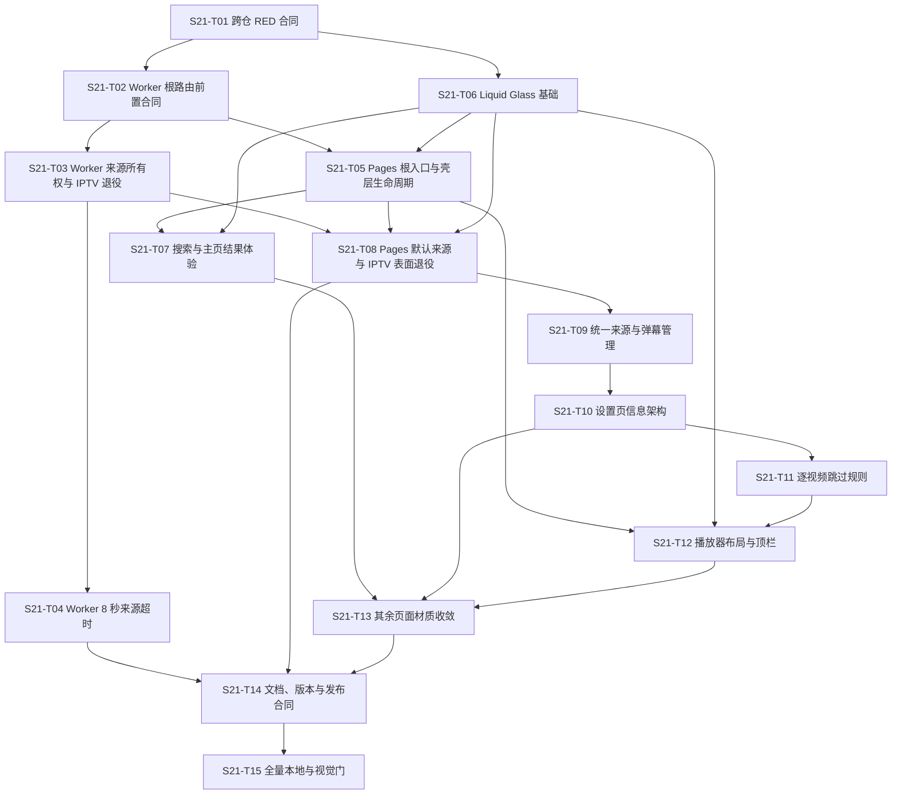

# 实施计划：SPEC 第 21 节根路由、来源所有权与 Liquid Glass 修订（四次规划）

状态：**APPROVED / STANDING APPROVAL ACTIVE**
规划日期：2026-08-18
规划模式：`fast = false`；本次请求未以精确小写首参数 `fast` 启用快速规划
目标候选：Worker `2.0.0` / API Contract `2`；UXUV-Pages `0.3.0` / manifest `apiContract: 2`
授权边界：用户于 2026-08-19 明确批准当前及后续计划修订，并取消逐次提交 SHA 的人工审批门。计划与 todo 仍可使用自动计算的 SHA-256 做内部漂移检测，但不得再要求用户提供或确认 SHA。该持续批准不授权 commit、push、GitHub Pages 发布、Cloudflare 部署、Secret/D1 变更或生产验证；本次仅延续既有 `@uxu-code:build auto` 的本地串行实现授权。

## 1. 计划依据与充分性

- 权威规格为 `work-products/SPEC.md` 第 21 节，用户于 2026-08-17 明确批准；其中已固定 22 项需求、23 条验收项、API v2、8 秒单源 deadline、逐视频 key/200 项上限、零 D1 schema 迁移、根路径 404、IPTV 退役和双版本回滚合同。
- Worker 当前为 `1.1.4` / API Contract `1`，运行时只保留根 `_worker.js`；Pages 当前为 `0.2.1`，Next `16.3.0`。API 合同存在有意破坏性删除，因此计划将 Worker 升为 `2.0.0`；Pages 仍处于 `0.x`，对应不兼容合同升为 `0.3.0`。版本/API 身份只在对应仓库的完整 v2 语义原子落地时切换：Worker 在 T03，Pages 在 T08；更早任务不得以未完成语义冒充 Contract 2。
- 只读 CodeGraph 与源码证据确认：Worker 的根前缀兼容、默认来源、IPTV、搜索超时集中在 `_worker.js`；Pages 的视觉任务共享 `app/globals.css`，来源管理共享 config document，播放器任务共享 `PlayerExperience`/`PlayerNavbar`。这些共享写集决定并发上限。
- 旧 `work-products/plan.md` / `todo.md` 已在提交 `0a4c697cdb37692b31d313a231b6f8eaae54dfa3` 完成并冻结；历史 blob 分别为 `d247f329406143df3f0f1acee5a02f85cfa046a3` 和 `02568da210a93039141b0a69c1d6659632ad12eb`。本文件是新的当前计划入口，旧计划由 Git 历史保持不可变。
- 规格没有遗留需要在规划前裁决的接口、数据、安全或回滚歧义；若实施需要改变上述版本、deadline、key、上限、法律措辞或 D1 schema，立即停止并返回 `@uxu-code:spec`。
- 本计划由 `work-products/tests/section21-plan-contract.test.mjs` 约束 HLS 迁出、写集清单、Next 本地文档、版本切换、性能/卫生门、串行策略与 plan/todo 内部完整性；该测试是规划回归证据，不扩大业务实现或远程授权。
- 前一版计划 SHA `6ef4a9515b3929695b04b0886b3fca64680dce765b0a7f5f16dd6ceba64cd91a` 在 T03 暴露阶段合同矛盾：T01 冻结的 T02 断言永久要求 Worker `1.1.4` / API `1`，而 T03 与 T15 又要求最终 `2.0.0` / API `2`。`work-products/debug/section21-review-remediation-2026-08-18.md`、旧 todo 与旧 SHA 收据保留故障链；本次二次规划仅修订测试生命周期和 T03 边界测试写集，不改变 22 项产品需求、版本目标、安全基线或远程授权边界。
- 当前工作树包含已验证但尚未获替代计划接纳的 T02、T03、T06 本地切片。它们不是新计划的完成证据：todo 全部从 `pending` 初始化；T01 先失效旧计划活动收据并修复合同，后续任务再按新计划复验；不得回滚、覆盖或重复实现已有用户修改。
- 前一批准计划 SHA `096e92fd1b7e084f118dd6939216003ace104ee9a7ad76155595ab38bbd8a77b` 执行到 T02 时，根路由专项 1/1 GREEN，但完整关联套件仅 12/19 GREEN：7 个失败均由 API 1 manifest fixtures 在已存在的 API 2 Worker 中间态执行导致。该失败不是根路由回归；本次三次规划按用户指示把 API 2 manifest fixture、兼容矩阵、MIME/大小与失败关闭同步明确归入 T03，并把 T02 收窄为版本无关的根路由/未知路径/CSP/历史身份门，解除任务所有权与依赖顺序的互锁。
- 前一版计划执行到 T08 attempt 1 时，静态聚焦合同 1/1、关联 Node 28/28、Next 构建和退役负向合同 3/3 GREEN，但完整 E2E 为 95/119。六个冻结 Section 21 flow 失败的直接原因是其 runtime config fixture 仍声明 Pages `0.2.1`、Worker `1.1.4`、API `1` 及已退役默认字段；另有十八个活动 E2E 仍断言 T05/T07/T08 已批准删除或隐藏的旧表面。该结果是 fixture/验证所有权冲突，不是允许弱化产品行为的依据。
- T09 attempt 1 在业务写入前以冻结合同确认四项 RED，并发现原写集遗漏了 `PlayerSettings` 的第二个弹幕 API 编辑入口、Premium 授权成功区的用户弹幕管理器及其活动测试。当前四次规划只把这些直接冲突路径、真正替换旧订阅物化源的重同步合同和对应聚焦验证纳入 T09；不改变产品需求、D1 schema、认证/同源边界、已完成 T01—T08 或远程授权。
- T10 attempt 1 在业务写入前确认冻结聚合合同错误地读取 `app/premium/settings/page.tsx` 薄包装而不是授权成功后的真实组件，同时旧 Premium 合同与播放器 E2E 仍反向固定 Section 21 已批准替换的五域/全局跳过表面。当前五次规划只把聚合合同中 T10 的 Premium 读取目标、旧 Premium 合同和播放器设置 E2E 纳入 T10；不改变六域规格、Premium 服务端授权、T11 逐视频规则所有权、已完成 T01—T09 或远程授权。
- T11 attempt 1 在业务写入前确认 `PlayerExperience` 持有 `mode:source:videoId` 身份，而唯一读取播放器设置并调用 `useAutoSkip` 的 `components/media/MediaPlayer.tsx` 未列入写集；在原写集内只能以会串视频/来源的全局状态绕行。当前六次规划只把该直接数据通路加入 T11；不改变逐视频 key、0—600 秒、200 项上限、同步/迁移语义、已完成 T01—T10 或远程授权。
- T13 attempt 1 已在原写集内完成材质实现并通过聚焦静态/浏览器门，但把最终聚合合同加入正式 Node 清单后，完整 `npm test` 暴露两个旧合同边界：T05 的设置顺序仍固定六域前结构；T08 的 raw-token 退休扫描器把 T09/T11 按规格保留的 legacy 数据兼容、旧导入字段清理器及其负向测试/生成字节误判为 IPTV 功能残留。当前七次规划只把这两个直接冲突测试和 `npm test` 纳入 T13，保留 attempt 1 的产品字节与 RED/GREEN 证据；不删除清理器、负向 fixture、生成物或已完成 T01—T12。
- T14 attempt 1 在业务写入前确认两项直接边界遗漏：Pages 工作流在生成最新 `release/current` 之前运行包含退休扫描器的正式 Node 门，无法证明刚发布字节；导入器虽按规格丢弃旧 IPTV/系统默认字段，却未在预览中报告有界的已跳过字段数。当前八次规划只把 Pages 工作流、导入预览数据/UI、直接 E2E/退休/parity 合同纳入 T14，并把 Pages 本地与工作流顺序固定为 build → release:build → test；不改变 Worker 2.0.0、Pages 0.3.0、API 2、D1 schema、已完成 T01—T13 或远程授权。
- T14 attempt 2 已完成上述文档、导入提示、fresh release 与成对回滚证据，并通过 Pages 全量 Node/E2E 及 Worker 聚焦门；随后正式 Worker `npm test` 暴露两个直接所有权遗漏：app-update artifact 的四个活动 fixture 仍以 `1.1.4` 冒充当前远端版本，候选卫生门要求对已生成的计划归档和视觉候选做精确 MIME/SHA 二进制登记。当前九次规划保留 attempt 2 的全部产品与证据字节，只把 `app-update-artifact.test.mjs`、`binary-allowlist.json` 和对应正式门纳入 T14 attempt 3；二进制登记只证明字节身份，不构成 T15 视觉批准。
- T15 attempt 2 已闭合 attempt 1 的五项 E2E 边界、生成 116 张 API 2 候选并保留成功性能 trace；Codex 内置浏览器随后在真实 ready player 同时测得 1440 px 的 sticky 顶栏 `84..172` 遮挡视窗控制 `120..206`、320 px 的顶栏 `84..228` 遮挡播放器 `176..338`，两处均重叠 52 px。根因是 sticky `top` 位移未在后继普通流中预留同一 inset。当前十次规划完整接纳 attempt 2 的测试、候选与性能字节，仅允许在原有 `app/globals.css` / `kvideo-player-shell.e2e.spec.ts` 写域中增加等量 bottom margin 与四断点/200% 点击盒和视觉间距回归；不改组件、播放器行为、版本、API、已完成 T01—T14 或远程授权。
- T15 attempt 3 已以等量 bottom margin 闭合播放器 sticky 顶栏纵向遮挡，并让三语四断点及 200% 的顶栏/后继内容几何门转绿；同一 200% 验证随后在 640 px 视口测得文档 `scrollWidth=678`，其中 `.player-navbar-actions` / `.theme-switcher` / `.history-sidebar-toggle` 因 rem 命中 token 扩至 88 px 而横向越界 38 px。该 reflow 缺陷与 sticky inset 正交，超出三项 CSS 语义上限。当前十一次规划完整接纳 attempt 3 的纵向修复、116 张候选及既有性能 trace，只允许在相同 CSS/播放器测试写域中增加第四项局部 token 重绑定和显式 200% reflow 回归；不得改根 token、拖拽 hook/存储、组件、版本、API、已完成 T01—T14 或远程授权。
- T15 attempt 4 已用局部 44/50 px token 闭合 200% 横向 reflow，并通过播放器 3/3 聚焦套件；Codex 内置浏览器随后在正常 320×900 ready player 测得历史浮动按钮 `[248,298]×[422,472]` 与跳过设置入口 `[206,304]×[416,460]` 相交 `1900 px²`，导致后者点击区被覆盖。该交互碰撞与 200% reflow 正交，超出四项 CSS 语义上限。当前十二次规划完整接纳 attempt 4 的 token 修复、116 张候选及既有性能 trace，只允许在同一 CSS/播放器测试写域中增加第五项移动端跳过入口右侧 64 px 预留与四断点交互几何回归；不得移动浮动按钮、改拖拽存储、隐藏控件、改组件、版本、API、已完成 T01—T14 或远程授权。
- T15 attempt 5 已以 64 px 移动端预留闭合历史按钮/跳过入口碰撞，播放器 3/3、八套聚焦 46/46 与内置浏览器几何均 GREEN；正式全量随后以 `123/124` 暴露 `kvideo-tag-management` 仍把首页推荐标签锁在浮层避让前的绝对 x 坐标。`max-width:1360px` 的已批准标签 lane 预留把 1024/320 起点分别从 `36/20` 确定性右移 58 px 至 `94/78`，而独立 accessibility 几何门已证明浮动收藏按钮不再遮挡首个标签。当前十三次规划完整接纳 attempt 5 的五项 CSS、116 张 API 2 候选与性能 trace，只新增该标签 E2E 的 test-only 基线所有权；不得再改产品 CSS、组件、版本、API、已完成 T01—T14 或远程授权。
- T15 attempt 6 已同步两个旧标签 x 坐标并达到标签 3/3、正式 E2E `124/124`、fresh release/Node/lint 门与 116 张 API 2 候选冻结；最终视觉抽检仍拒绝该候选：320 px 三标签主页的历史浮动按钮 `[248,298]×[422,472]` 与第三个可见标签相交 `252 px²`；英文 320/1024 播放器的单列 episode grid 被不换行标题/三个 44 px 控件撑宽后在内部 scrollport 裁切；繁中 320 播放器候选又因同 URL 的 scroll-position timer 在 full-page 捕获之间恢复约 224 px 而漏掉顶栏。当前十四次规划完整接纳 attempt 6 的测试、产品字节、失败截图与 `124/124` 证据，只在既有 `app/globals.css`、`section21-visual.e2e.spec.ts`、`kvideo-player-shell.e2e.spec.ts` 写域中加入两项精确布局修复和一项 test-only 截图归一化；最终产品 CSS 改变后必须重跑性能 trace，并重新生成最终 Pages rollback manifest/四补丁与三阶段演练，不能把 T14/pre-T15 字节冒充最终候选。
- T15 attempt 7 已闭合上述三项视觉 blocker、达到正式 E2E `124/124`、冻结 116 张 API 2 候选并生成 fresh 性能 trace；最终 Codex 内置浏览器仍在 320×900 strict fixture 的经典 15 px 占宽滚动条下测得 `innerWidth=320`、`clientWidth=305`，标签 scrollport 右缘为 225 px、第二标签右缘为 236 px，导致第二标签自身被裁 11 px；历史按钮仍在 248 px，lane 与按钮间距 23 px，因此这不是新的按钮重叠，而是第六项移动端标签 safe-lane 使用 containing-block margin 与 viewport 浮钮坐标不一致。当前十五次规划完整接纳 attempt 7 的产品/测试字节与失败前自动证据，只把第六项从固定 64 px margin 精确细化为 viewport-derived inline size，并要求 overlay/classic 两种滚动条模型与真实内置浏览器均证明第二标签完整、第三标签可滚入；不新增第八项产品语义、不扩大文件所有权。
- T15 attempt 8 已把移动标签 lane 锁定到 viewport 坐标，在真实 15 px 经典滚动条下取得 list right 240、第二/第三标签完整和 8 px 历史按钮间距，并再次达到正式 E2E `124/124`、冻结 116 张 API 2 候选（16099136 bytes，combined SHA-256 `00292fbe3967580217ab50a88a25f1443f86e40069a1399c15aaec4cd324b7d8`）；最终视觉抽检仍拒绝候选：英文/简中 320 px 搜索首排可点击卡片被左右 50 px 浮钮遮挡，英文 1024 px 播放器的来源选择卡被历史浮钮遮挡。繁中 320 px ready-player 当前候选已确认从原点完整捕获，不是滚动恢复缺陷。当前十六次规划保留 attempt 8 的产品、测试、`124/124`、内置浏览器和被拒候选字节，只在既有 CSS/search/player E2E 写域增加一个共享的浮动侧栏内容排除区语义，并分别投影为搜索结果双侧安全 lane 与非 cinema 桌面播放器右侧安全 lane；不移动/隐藏/缩小浮钮，不改组件、Hook、拖拽存储、滚动恢复、版本、API、已完成 T01—T14 或远程授权。
- 2026-08-18 的只读审计已提供充分修复依据：产品 23 条验收映射未发现缺口，但旧计划把不可变 inventory 的来源 SHA 错当成当前计划 SHA、审批记录互相冲突、联网依赖审计被擅自升级为阻断门，且逐任务双向补丁造成低价值证据膨胀。这些问题只需修订规划/工作流合同，不需要返回规格阶段，也不改变第 21 节产品、接口、数据、安全、兼容或回滚决定。

## 2. 执行策略与不变量

- **策略：** 串行执行。先修复并重新冻结跨仓合同，再按兼容边界和用户流程纵向复验/实现；高风险 Worker API/路由先于依赖它的 Pages 行为。
- **安全并发上限：1。** 本次没有请求 `fast`，不得形成并行波次或同时编辑两仓；每项只有在前一项集成、验证、状态原子更新后才可启动。
- **串行理由：** 当前工作树已含跨旧计划的 T02/T03/T06 切片，且 `_worker.js`、`app/globals.css`、config document、release manifest、测试清单与候选证据均为共享可变资源。串行复验比重新证明临时并发独立性更安全，协调成本也更低。
- **主代理唯一集成者：** 只有主代理可合并任务 diff、运行串行阶段屏障、写 `work-products/todo.md`、更新视觉候选或形成最终本地门结论。
- **TDD 与阶段合同：** 新行为必须先有能在旧实现上失败的 RED，再做最小 GREEN；本次已存在切片可复用前一版收据、补丁和原始输出，但必须先校验其内部哈希、RED 原因与当前结果，不得伪造重跑前状态。Worker 测试位于 `work-products/tests/` 并从最终位置以 `../../_worker.js` 等相对路径引用源码；Pages 测试位于 `../UXUV-Pages/work-products/tests/` 并以 `../../app/...`、`../../components/...`、`../../lib/...` 引用源码。聚合合同中的测试名必须以稳定任务 ID 开头，只能表达最终候选仍应成立的不变量；诸如“T02 完成时仍为 v1”的瞬时阶段守卫必须放在任务本地测试/不可变收据中，且不得进入 T15 全量发现集。Section 21 Worker/UI/visual/performance 聚合断言继续只读冻结，唯一例外是 T10 只可把 `S21-T10` 断言的 Premium 读取目标从薄路由改为授权组件，断言名、六域、锚点、全局跳过负向与桌面布局要求均保持不变；`section21-flows.e2e.spec.ts` 仅由 T08 接管 runtime config fixture 包络，测试名、交互断言、请求计数和搜索期望保持只读。保持性安全基线和候选卫生扫描器继续冻结。
- **无依赖扩张：** 不新增运行时或开发依赖，不新增构建层，不新增 D1 表，不扫描或批量改写真实账户数据。
- **证据分层：** 静态/单测、构建/E2E、候选发布物、公开 Pages、Cloudflare/真实 D1、生产登录态互不替代。本计划最多到本地候选和用户视觉审批门。

## 3. 依赖图

## 4. 读写边界、生成物与共享资源

| 范围 | 权威读取 | 允许写入 | 生成物/共享资源 |
| --- | --- | --- | --- |
| Worker | `_worker.js`、`README.md`、`CHANGELOG.md`、package/lock、现有 `work-products/tests/*.test.mjs` | 同仓任务明确列出的 `_worker.js`、README/CHANGELOG、package/lock 与 `work-products/tests/` | `_worker.js`、路由表、API contract/version、Worker 测试进程 |
| Pages | `app/`、`components/`、`lib/`、package/lock、Next/Playwright 配置、发布脚本、现有测试 | 同仓任务明确列出的产品、package/lock、配置、脚本与 `work-products/tests/` | `app/globals.css`、config document、Next `out/`、Playwright 服务/截图、release manifest |
| 工作流 | 已批准 `SPEC.md`、本计划、T01 冻结清单 | `work-products/todo.md`、`work-products/kvideo-parity-matrix.md`、`work-products/evidence/section21/` | todo 是唯一活动状态账本；候选截图不得自动覆盖批准基线；证据、补丁与收据属于最终卫生扫描范围 |

生成的 `.next/`、`out/`、测试缓存和临时服务不属于业务源码；任务结束必须停止服务并确认未改写 `next-env.d.ts`。任何视觉候选先写入 `work-products/tests/fixtures/ui-review/section21-candidate/`，用户批准前不得替换既有基线。

T01—T13 每项只维护一个 `work-products/evidence/section21/receipts/S21-Txx.json`：记录两仓 HEAD、计划 SHA、任务前后未提交 patch SHA、实际改动路径、验证结果与失败保留说明；不再为每项生成空的 forward/reverse patch，也不重复归档已有失效目录。回滚以任务允许写集、当前 diff 和未提交工作保护为准；路径已被后续任务接管时停止并人工重建。只有 T14/T15 为成对发布/回滚候选记录完整 v1/v2 文件 SHA、前向/反向补丁与本地验证命令；未发布中间态一律 HOLD。

## 5. Definition of Done

每个任务只有同时满足任务验收与以下固定门才可标记 `completed`：

1. 新测试在旧行为上有 RED 证据、在本任务实现后 GREEN；相关旧测试无回归，运行时行为得到验证。
2. 无无关重构、重复逻辑、死代码、调试输出或新增依赖；lint/格式/diff 检查通过。
3. 用户可见三语、键盘/焦点、320/768/1024/1440 和适用错误/空/加载态与任务同步完成。
4. 配置/API/数据兼容和回滚已覆盖；任务完成时公开的版本/API 身份必须与该任务后已经实现的完整语义一致；不把本地证据说成发布或生产证据。
5. T01 冻结的认证、D1/账户隔离、同源/CSRF、SSRF、来源导入、CAS 与 Free 预算保持性基线始终 GREEN；实现任务只能修改退休功能专属断言。
6. 任务 diff 由主代理复核并原子更新 todo；失败则保留最小可复验证据，不以删除失败测试伪造完成。

## 6. 任务合同

### S21-T01：修复基线身份并重新冻结跨仓合同

**目标：** 不改业务代码地解除 inventory 来源 SHA 与当前计划 SHA 的错误耦合，消除瞬时 v1 守卫与最终 v2 门的互斥，失效旧计划活动收据，并重新冻结只表达最终不变量的跨仓合同。

**验收标准：**
- [ ] 保留 `invalidated/ac7a5714/`、`invalidated/6ef4a951/` 与 `invalidated/8df83634/` 原字节；将前一批准计划仍位于活动目录的 T01/T02 收据移动到单一 `invalidated/096e92fd/`，记录源 SHA、文件 SHA 和失效原因，不重复复制已有归档、不生成新的零字节补丁。
- [ ] `section21-worker-contract.test.mjs` 保留 T02 根前缀真实 404和 T03 最终 `2.0.0` / API `2` 独立断言，但不再对最终树永久断言 T02 完成时的 `1.1.4` / API `1`；该阶段事实只由归档收据与任务本地版本测试证明。
- [ ] Worker/Pages 聚合的每条第 21 节验收项仍映射到独立顶层测试或保存全部失败明细的 soft-failure 合同；未实施项保持可归因 RED，已存在切片可为 GREEN，发现/fixture/服务错误不得冒充 RED。
- [ ] 两个 baseline inventory 原字节及其 `6ef4a951…` 来源标识保持不变；`candidate-hygiene.test.mjs` 将该标识解释为“生成此内容基线的计划”，不再要求它等于当前执行计划 SHA，同时继续逐行验证分类、文件 SHA、秘密/机器路径与二进制 allowlist。
- [ ] 保持性安全、视觉与性能基线原字节不变；规划合同验证新 todo SHA、待审批 HOLD、合法状态、`fast = false`、串行上限 1、`replacement-invalidation.json` 只绑定历史 `096e92fd…` 计划、新的 `contract-revision-invalidation.json` 绑定当前计划，以及“阶段守卫不进入最终全量门”。`red-matrix.md` 必须改为与当前实跑一致，不能把 T02 的 12/19 误写为完整 GREEN。

**依赖：** 无。
**读取范围：** 两仓现有聚合/安全/E2E 合同、release manifest、`SPEC.md` 第 21 节、前一版 todo、调试报告、活动和已失效收据/补丁。继续沿用已冻结的 `section21-security-baseline.test.mjs`、`root-prefix-inventory.txt`、`iptv-default-source-inventory.txt`、`section21-visual.e2e.spec.ts`、`section21-performance.e2e.spec.ts`、`performance-baseline.json` 与 `binary-allowlist.json`；inventory 仍只可由显式 `--write-baseline` 在目标不存在时生成，常规测试缺失即失败且永不写入，并继续区分 `worker-origin`/`github-pages-physical`/`runtime`/`active-test`/`active-negative-test`/`historical-evidence`。
**写入范围：** 仅修改 `work-products/tests/section21-worker-contract.test.mjs`、`section21-plan-contract.test.mjs`、`candidate-hygiene.test.mjs`、`section21-inventory.mjs`、`section21-inventory-generator.mjs`、`work-products/evidence/section21/red-matrix.md`、活动收据目录与 `work-products/todo.md`；可创建 `receipts/contract-revision-invalidation.json` 和 `receipts/invalidated/096e92fd/`。不得修改 Worker/Pages 产品代码、两个 inventory、保持性安全基线、视觉/性能合同或基线。
**共享可变资源：** 两仓测试运行器与 E2E fixture 命名；不写产品代码。
**聚焦验证：** 在 Worker 仓先运行 `node --test work-products/tests/section21-plan-contract.test.mjs`，再分别运行 `node --test --test-name-pattern="S21-T02" work-products/tests/section21-worker-contract.test.mjs`、`node --test --test-name-pattern="S21-T03" work-products/tests/section21-worker-contract.test.mjs` 和 `node --test work-products/tests/section21-security-baseline.test.mjs work-products/tests/candidate-hygiene.test.mjs`；规划合同和安全/卫生合同必须全部 GREEN，T02/T03 不得含互斥版本断言。然后只读核对 Pages 聚合/E2E 的测试发现与前一版 RED 明细，不重录视觉或性能基线。不得并行。
**失败保留/回滚：** 保留冲突复现、失效清单和可归因结果；若解耦来源 SHA 时弱化 inventory 行分类/文件 SHA、根 404、秘密扫描或最终 v2 语义，立即失败。回滚仅恢复本任务工作流测试/证据改动，绝不触碰产品切片、两个 inventory 或旧归档字节。
**阶段/启动条件：** Serial 0；持续计划批准与显式实现流程授权均存在后才可启动。
**主代理集成责任：** 核对旧目录不重复归档、确认 inventory 仍绑定其真实来源、只有瞬时 v1 断言退出最终发现集，重新冻结聚合文件并签发当前计划 T01 收据。

### S21-T02：Worker 根路由前置合同

**目标：** 复验 Worker 浏览器地址空间只接受逻辑根路由，并确认历史 T02 阶段收据曾在 v2 删除完整落地前保持既有版本/API 身份；不在 T03 前验证 API 2 manifest fixtures。

**验收标准：**
- [ ] `/` 和根相对静态路由正常；`/UXUV-Pages` 全家族返回真实 404，无重定向或主页回退。
- [ ] 归档的 T02 阶段证据证明该任务完成时 Worker 仍为 `1.1.4` / API Contract `1`、未提前宣告 v2；当前最终候选若已进入 T03 的 `2.0.0` / API `2`，不得为重跑 T02 而降级，也不得用最终聚合永久要求 v1。
- [ ] 未知 API 路径、非 API 非法方法、静态 CSP 与旧前缀零上游请求保持绿色；manifest API 版本、兼容矩阵、MIME、大小和前端不可用失败关闭由 T03 原子同步并验证，不作为 T02 前置门。

**依赖：** S21-T01。
**读取范围：** `_worker.js`、版本/API 常量、`work-products/tests/pages-integrity.test.mjs`、`worker-route-contract.test.mjs`、`baseline-contract.test.mjs`、历史 T02 收据与只读 T01 Worker/安全合同。
**写入范围：** 原则上只签发新 SHA 收据；仅在根路由行为回归时修改 `_worker.js`、`work-products/tests/section21-worker-contract.test.mjs`、`pages-integrity.test.mjs` 或 `worker-route-contract.test.mjs` 中与根路由直接对应的断言。package/lock、README、CHANGELOG、`baseline-contract.test.mjs`、`worker-only-boundary.test.mjs`、API 2 manifest fixtures 和 T01 重新冻结合同保持只读；不得把当前 v2 候选降回 v1。
**共享可变资源：** `_worker.js` 的浏览器路由分派；API/version 与 Pages manifest 兼容语义在本任务只读。
**聚焦验证：** 在 Worker 仓依次运行 `node --test --test-name-pattern="S21-T02" work-products/tests/section21-worker-contract.test.mjs`、`node --test --test-name-pattern="static CSP|true 404" work-products/tests/pages-integrity.test.mjs`、`node --test --test-name-pattern="unknown API paths|non-API methods" work-products/tests/worker-route-contract.test.mjs` 和 `node --test work-products/tests/baseline-contract.test.mjs`，并校验归档 T02 收据 SHA 与原始 v1 身份记录；不得运行完整 `pages-integrity.test.mjs` 冒充 T02 门，也不得并行。
**失败保留/回滚：** 保留根路由失败 fixture；当前未发布 v2 中间态始终 HOLD，本地撤销只移除本任务新增的根路由修复，不制作旧前缀兼容层、版本降级或 manifest fixture 临时兼容。
**阶段/启动条件：** Serial 1；T01 合同修复、失效记录与重新冻结 GREEN 后。
**主代理集成责任：** 复核未知路径、安全头和零上游请求，确认历史 v1 阶段证据与当前 v2 候选的证据层级没有混用，并确认 T02 没有改写任何 API 2 manifest fixture。

### S21-T03：Worker 来源所有权与 IPTV 后端退役

**目标：** 删除系统默认来源/弹幕 API 与 IPTV 后端能力，同时保留账户数据和普通媒体。

**验收标准：**
- [ ] `/api/config` 不再输出默认来源字段或 `capabilities.iptv`；`capabilities.danmaku` 仅表示代理能力。
- [ ] 两个 IPTV 路由、env/config、权限、token/cache 和专属分支消失；路由精确为 21，旧权限容错读并在后续权限写入时省略。
- [ ] 普通 HLS/DASH、代理、媒体 token、广告过滤、来源切换、Cast/PiP 与登录/D1 安全回归绿色。
- [ ] Worker 原子切换为 `WORKER_VERSION = 2.0.0` / API Contract `2`，package/lock、README、CHANGELOG 与边界合同身份同步；`pages-integrity.test.mjs` 的 manifest fixtures、五态兼容矩阵、MIME/大小/失败关闭断言同步到 API 2 并完整 GREEN，不存在已标 v2 但测试或运行时仍要求 v1 的中间完成态。

**依赖：** S21-T02。
**读取范围：** `_worker.js` config/route/auth/media/permission 分支，IPTV 与普通媒体测试。
**写入范围：** 修改 `_worker.js`、`package.json`、`package-lock.json`、`README.md`、`CHANGELOG.md`、`work-products/tests/pages-integrity.test.mjs`、`worker-route-contract.test.mjs`、`worker-only-boundary.test.mjs`、`low-fanout-routes.test.mjs`、`media-routes.test.mjs`、`auth-d1.test.mjs`、`security-boundary.test.mjs`、`sync-cas.test.mjs`、`d1-free-budget.test.mjs`、`free-budget.test.mjs`、`source-import-route.test.mjs`；删除 `iptv-stream-resilience.test.mjs`，把仍适用于普通上游的 redirect/timeout/cancel 断言迁入新建 `upstream-stream-resilience.test.mjs`。允许把 `worker-only-boundary.test.mjs` 与 `pages-integrity.test.mjs` 的当前发布身份/fixture 从 T02 阶段 v1 同步为最终 v2，但 T01 重新冻结的 Worker 聚合、安全基线与卫生扫描器保持只读；上述既有安全测试只允许删除 IPTV 专属 fixture/断言，不得弱化冻结不变量。
**共享可变资源：** `_worker.js`、权限规范化、媒体 token/cache；与任何 Worker 任务互斥。
**聚焦验证：** 先校验前一版 T03 收据、5 条独立 RED 与旧实现 patch SHA，并单独复现完整 `pages-integrity.test.mjs` 在 API 1 fixtures / API 2 Worker 组合下的 7 个归因 RED；再在 Worker 仓运行 `node --test --test-name-pattern="S21-T03" work-products/tests/section21-worker-contract.test.mjs`，随后运行 `node --test work-products/tests/pages-integrity.test.mjs work-products/tests/section21-security-baseline.test.mjs work-products/tests/worker-route-contract.test.mjs work-products/tests/worker-only-boundary.test.mjs work-products/tests/low-fanout-routes.test.mjs work-products/tests/media-routes.test.mjs work-products/tests/auth-d1.test.mjs work-products/tests/security-boundary.test.mjs work-products/tests/sync-cas.test.mjs work-products/tests/d1-free-budget.test.mjs work-products/tests/free-budget.test.mjs work-products/tests/source-import-route.test.mjs work-products/tests/upstream-stream-resilience.test.mjs`；manifest 五态兼容矩阵、MIME/大小/失败关闭、认证、D1、CSRF/SSRF、安全、同步、Free 预算和版本边界任一不绿不得解锁；不得并行。
**失败保留/回滚：** 普通媒体或安全合同一旦回归即停止；共享函数无专属证据不得删除。未发布中间态保持 HOLD，本地撤销只移除本任务 diff。
**阶段/启动条件：** Serial 3；T06 完成、T02 根路由复验 GREEN，且历史 v1 阶段证据与当前候选身份已分层。
**主代理集成责任：** 审计所有 `IPTV`/默认来源残留和发布身份断言，区分历史证据、瞬时阶段守卫与最终运行时代码。

### S21-T04：Worker 单来源 8 秒放弃与局部成功

**目标：** 使慢来源不阻塞并发搜索，且取消、超时与全失败语义可区分。

**验收标准：**
- [ ] 单一 `SEARCH_SOURCE_TIMEOUT_MS = 8_000` 控制每源每页；超时终止该源剩余页、释放槽位且不重试。
- [ ] 快源 SSE 结果先显示；至少一源成功时无全局错误，全部失败/超时时仍为 `SEARCH_SOURCES_UNAVAILABLE`。
- [ ] 客户端取消优先于 timeout，结构化日志不泄露源凭据或响应正文。

**依赖：** S21-T03。
**读取范围：** `_worker.js` 高扇出搜索/SSE/abort 路径、`high-fanout-routes.test.mjs`。
**写入范围：** 修改 `_worker.js`、`work-products/tests/high-fanout-routes.test.mjs`、`work-products/tests/structured-logging.test.mjs`；T01 聚合合同保持只读。
**共享可变资源：** `_worker.js`、并发槽、假时钟/AbortController；与 Worker 任务互斥。
**聚焦验证：** 在 Worker 仓运行 `node --test --test-name-pattern="S21-T04" work-products/tests/section21-worker-contract.test.mjs`，再运行 `node --test work-products/tests/high-fanout-routes.test.mjs work-products/tests/structured-logging.test.mjs`；不得并行。
**失败保留/回滚：** 保留能区分慢源/取消/全失败的 fixture；失败时恢复既有 20 秒行为，仅作为未完成工作树，不发布。
**阶段/启动条件：** Serial 5；T05 完成、T03 完成且 Worker 写集释放。
**主代理集成责任：** 审核计时器清理、Abort 原因和 SSE completed 计数。

### S21-T05：Pages 根入口、角落状态与窗口生命周期

**目标：** 让根地址成为唯一客户端入口，并修复品牌归零、同步提示与焦点切换行为。

**验收标准：**
- [ ] 构建无客户端 `basePath=/UXUV-Pages`，品牌归零不 reload/清持久数据；Pages 在 T08 完成前仍保持 `0.2.1` / API `1` 身份，不提前冒充 v2。
- [ ] 版本右上与同步左上共用边距 token；成功同步 3 秒隐藏，错误保持；首页继续观看横栏移除但历史/恢复/推荐保留。
- [ ] 内容顶栏无语言切换；窗口 focus/visible 不触发 pull、刷新或 UI 重置，online/手动同步和隐藏时进度保存仍工作。

**依赖：** S21-T02、S21-T06。
**读取范围：** `../UXUV-Pages/next.config.ts`、`scripts/build-release.mjs`、`playwright.config.ts`、`work-products/tests/kvideo-playwright.config.ts`、`section21-playwright.config.ts`、`static-server.mjs`、`components/ContentNavigation.tsx`、`HomeExperience.tsx`、`SyncProvider.tsx`、`RuntimeSourceSync.tsx`、`AppUpdateControl.tsx`、`SyncStatus.tsx`、`app/globals.css`、T01 `root-prefix-inventory.txt` 与只读 Pages 合同/E2E。启动前必须完整读取本地 Next 16.3.0 App Router 文档 `node_modules/next/dist/docs/01-app/03-api-reference/05-config/01-next-config-js/{basePath,assetPrefix}.md`、`01-app/02-guides/static-exports.md`、`01-app/03-api-reference/02-components/link.md`，并在收据记录“basePath 构建期内联、assetPrefix 不替代 sub-path、静态导出生成 out、Link 使用根相对 href”四项结论。
**写入范围：** 修改 `next.config.ts`、`scripts/build-release.mjs`（只切换逻辑根路由，暂保 API `1`/Worker v1 range）、`playwright.config.ts`、`work-products/tests/kvideo-playwright.config.ts`、`section21-playwright.config.ts`、`static-server.mjs`、`components/ContentNavigation.tsx`、`HomeExperience.tsx`、`SyncProvider.tsx`、`RuntimeSourceSync.tsx`、`AppUpdateControl.tsx`、`SyncStatus.tsx`、`app/globals.css`、`work-products/tests/global-shell-contract.test.mjs`、`home-ui-contract.test.mjs`、`sync-client.test.mjs`、`pages-deployment.test.mjs`、`static-export-contract.test.mjs`、`release-manifest.test.mjs`、`same-origin-boundary.test.mjs`、`app-update-control-contract.test.mjs`、`pwa-contract.test.mjs`、`kvideo-entry-states.e2e.spec.ts`、`kvideo-premium-home.e2e.spec.ts`、`kvideo-premium-library.e2e.spec.ts`、`media-flows.e2e.spec.ts`、`kvideo-visual-parity.e2e.spec.ts`、`render-ui-review.mjs`；创建 `lib/utils/display-initial.ts`。只修改 T01 清单中 `worker-origin` 条目；`github-pages-physical` 的 `/UXUV-Pages/` 保持不变。package/lock 及 T01 聚合合同/E2E 保持只读。
**共享可变资源：** `app/globals.css`、根路由、应用壳状态；与其他 Pages UI 任务互斥。
**聚焦验证：** 在 Pages 仓运行 `node --test --test-name-pattern="S21-T05" work-products/tests/section21-ui-contract.test.mjs`、`node --test work-products/tests/global-shell-contract.test.mjs work-products/tests/home-ui-contract.test.mjs work-products/tests/sync-client.test.mjs work-products/tests/pages-deployment.test.mjs work-products/tests/static-export-contract.test.mjs work-products/tests/release-manifest.test.mjs work-products/tests/same-origin-boundary.test.mjs work-products/tests/app-update-control-contract.test.mjs work-products/tests/pwa-contract.test.mjs`、`npx playwright test work-products/tests/section21-flows.e2e.spec.ts --grep "S21-T05" --config work-products/tests/section21-playwright.config.ts`；再用冻结 inventory 断言所有 `worker-origin` URL 已改为根路径且所有 `github-pages-physical` URL 未变。命令必须发现至少一个测试；不得并行。
**失败保留/回滚：** 保留焦点事件和品牌归零回归；未发布中间态始终 HOLD，本地撤销只移除本任务 diff。成对发布回滚由 T14/T15 负责。
**阶段/启动条件：** Serial 4；T03 完成，且 T02 根路由合同和 T06 token 已集成。
**主代理集成责任：** 检查 DOM/href/chunk 无旧前缀，并确认开发服务未污染生成文件。

### S21-T06：Liquid Glass 基础材质与可访问性降级

**目标：** 建立无新依赖、可复用且有边界的全站材质 token 与功能层基础。

**验收标准：**
- [ ] `--shell-edge-inset`、regular/clear、边框、圆角、命中区、三主题和对比 token 集中定义，无散落的一次性玻璃修补。
- [ ] 不支持 blur、reduced motion/transparency、forced colors 与 increased contrast 时退化为不透明 surface，焦点与 44 px 命中区保持。
- [ ] 玻璃仅用于导航/控制/dialog/popover；内容卡与长文本不形成 glass-on-glass，固定功能层外无每卡 blur。
- [ ] 固定 120 卡搜索滚动和 30 秒静音视频 fixture 的三次热身后中位数不越过 T01 性能基线：p95 RAF 间隔不得同时恶化超过 10% 且超过 2 ms、long-task 总时长不得同时增加超过 10% 且超过 50 ms、视频新增 dropped frames 不超过 1；滚动内容的 computed `backdrop-filter` 必须为 `none`。任一指标受环境噪声无法稳定复现时停止，不以放宽阈值通过。

**依赖：** S21-T01。
**读取范围：** `app/globals.css`、现有 UI 原语、主题/图标/弹窗与可访问性测试。
**写入范围：** 修改 `../UXUV-Pages/app/globals.css`、`work-products/tests/global-shell-contract.test.mjs`、`work-products/tests/accessibility.e2e.spec.ts`；T01 聚合合同保持只读。若这三个路径不足，任务停止并修订计划，不在实施时临场扩权。
**共享可变资源：** `app/globals.css` 与全局 token；所有后续 Pages 视觉任务依赖其稳定命名。
**聚焦验证：** 在 Pages 仓运行 `node --test --test-name-pattern="S21-T06" work-products/tests/section21-ui-contract.test.mjs`、`node --test work-products/tests/global-shell-contract.test.mjs`、`npx playwright test work-products/tests/accessibility.e2e.spec.ts --config playwright.config.ts`，再运行冻结的 `npx playwright test work-products/tests/section21-performance.e2e.spec.ts --config work-products/tests/section21-playwright.config.ts` 并保存指标/trace SHA；不得并行。
**失败保留/回滚：** 不通过高对比/无 blur 时停止；仅回退 token/原语 diff，不重写相邻组件。
**阶段/启动条件：** Serial 2；T02 根路由复验完成后。
**主代理集成责任：** 冻结 token 名与材质边界，拒绝新增依赖或内容层 blur。

### S21-T07：搜索合并、卡片动作与折叠工具栏

**目标：** 完成从查询到结果操作的整条搜索体验，避免误合并、重叠和控制拥挤。

**验收标准：**
- [ ] 标题+类别族+年份指纹保守合并；动漫/电视剧、不同年份和 unknown 桶按规格隔离。
- [ ] 探测/星标至少 8 px 间距、44 px 命中区；工具栏默认收起，只保留同排排序/类别屏蔽及 `aria-expanded` 控制。
- [ ] Paid/Free 提示桌面单行、320 px 最多两行；四断点、200% 缩放、三语与 SSE 局部结果保持可用。

**依赖：** S21-T05、S21-T06。
**读取范围：** `../UXUV-Pages/components/search/VideoGrid.tsx`、`SearchResults.tsx`、`SearchResultControls.tsx`、`SearchResultCard.tsx`、`VideoGroupCard.tsx`、`lib/utils/search-result-policy.ts`、`app/globals.css` 与搜索合同/E2E。
**写入范围：** 修改这七个产品路径、`work-products/tests/search-results-contract.test.mjs`、`search-strategy-contract.test.mjs`、`kvideo-search-results.e2e.spec.ts`；T01 聚合合同/E2E 保持只读。
**共享可变资源：** `app/globals.css`、搜索状态与测试 fixture；与 Pages UI 任务互斥。
**聚焦验证：** 在 Pages 仓运行 `node --test --test-name-pattern="S21-T07" work-products/tests/section21-ui-contract.test.mjs`、`node --test work-products/tests/search-results-contract.test.mjs work-products/tests/search-strategy-contract.test.mjs`、`npx playwright test work-products/tests/section21-flows.e2e.spec.ts --grep "S21-T07" --config work-products/tests/section21-playwright.config.ts`；命令必须发现至少一个测试；不得并行。
**失败保留/回滚：** 保留五类指纹 fixture 和断点截图；不以放宽 unknown 合并规则修测试。
**阶段/启动条件：** Serial 6；T04 完成，且 T05 壳层和 T06 token GREEN。
**主代理集成责任：** 核对合并算法为纯可单测逻辑，确认 CSS 无动作覆盖补丁。

### S21-T08：Pages 系统默认与 IPTV 运行表面退役

**目标：** 依据 T01 冻结清单原子删除 Pages 的环境默认注入和 IPTV 可达面，迁出普通 HLS 共用逻辑，并在完整 v2 语义成立后才切换 Pages 身份。

**验收标准：**
- [ ] 删除 `RuntimeSourceSync` 及所有挂载/状态消费，移除 runtime config 的 `subscriptionSources`、`iptvSources`、`danmakuApiUrl`、`capabilities.iptv` 和 `useDanmaku` 系统 API fallback；新账户来源、订阅、弹幕 API 为空，已有账户记录不自动删除。
- [ ] `/iptv`、导航、组件、lib、样式、fixture 和全部 IPTV 正向 Node/E2E/视觉场景退役；唯一活动 IPTV 测试是负向退休合同，parity 历史仅保留 `approved-retired-by-SPEC-21` 条目。
- [ ] 删除 `lib/iptv/playback-policy.ts` 前，先把 `selectCompatibleHlsLevel`、`supportsHevcPlayback` 迁入纯模块 `lib/player/hls-compatibility.ts`，更新 `useHlsPlayer` 与普通媒体测试；普通/Premium HLS/DASH、代理、广告、切源、Cast/PiP/VideoTogether 全绿。
- [ ] Pages 最后原子切换为 `0.3.0` / manifest API `2` / Worker `>=2.0.0 <3.0.0`，package/lock/build ID/release manifest 同步；不存在已标 v2 却仍接受 v1 默认字段或 IPTV 的完成态。`section21-flows.e2e.spec.ts` 的 runtime config fixture 同步切换为该身份且删除 v1 默认字段，测试行为断言保持不变。

**依赖：** S21-T03、S21-T05、S21-T06。
**读取范围：** T01 冻结的两个 baseline inventory、T07 完成后且 T08 启动前由主代理显式生成且不可覆盖的 `inventory-snapshots/S21-PRE-T08-*`、T08 attempt 1 的 95/119 E2E 输出与 Playwright artifacts、本任务写入范围、只读 Section 21 UI/visual/performance、安全/卫生合同、`components/VideoTogetherController.tsx` 与 `../UXUVideo/work-products/kvideo-parity-matrix.md`。T01 baseline 只用于来源与历史角色审计，不要求已批准的 T03/T05/T07 修改后仍逐字相等；attempt 2 启动时先核对既有 `S21-PRE-T08` 快照为 attempt 1 的已验证起点，不得因 attempt 1 的授权修改而重新生成或要求当前树逐字匹配旧快照。
**写入范围：** 只允许修改/删除冻结 inventory 中分类为 `runtime` 或 `active-test` 的路径，且至少包括 `app/globals.css`、`app/iptv/page.tsx`、`components/{ContentNavigation,IptvExperience,PasswordGate,RuntimeConfigProvider,RuntimeSourceSync}.tsx`、`components/iptv/`、`components/media/MediaPlayer.tsx`、`components/player/hooks/{useDanmaku,useHlsPlayer}.ts`、`components/settings/{PlayerSettings,UserDanmakuSettings}.tsx`、`lib/iptv/`、`lib/media/{media-client,playback-routing}.ts`、`scripts/build-release.mjs`、`package.json`、`package-lock.json`，以及 inventory 列出的活动 `work-products/tests/*.test.mjs`、`*.e2e.spec.ts`、生成/渲染 helper 和非历史 config fixture。删除五个 IPTV Node 正向测试、`kvideo-iptv-browse.e2e.spec.ts` 和八个 IPTV DOM/PNG fixture；创建 `lib/player/hls-compatibility.ts`、`work-products/tests/hls-compatibility.test.mjs`、`iptv-retirement-contract.test.mjs`；正式 Node 清单在 T08 只加入退休负向与 HLS 合同，`section21-ui-contract.test.mjs` 继续由任务聚焦命令单独运行，待 T13 全部未来静态合同实现后再纳入 `npm test`；更新 `kvideo-visual-parity.e2e.spec.ts` 移除退休 route 但不接受新视觉基线；更新 `../UXUVideo/work-products/kvideo-parity-matrix.md`。本次规划额外允许只修改 `section21-flows.e2e.spec.ts` 的 `runtimeConfig` fixture，使其使用 Worker `2.0.0`、Pages `0.3.0`、API `2` 并删除 v1 默认字段；不得修改该文件的测试名、交互断言、请求计数或搜索结果。活动 E2E 只有在失败断言与 T05/T07/T08 已批准行为直接冲突时才可更新旧期望，产品回归必须修产品，不能删测或放宽可访问性、安全、同步隔离和媒体行为。分类为 `historical-evidence` 的 `uxuv-pages-0.1.2`/KVideo 清单只读保留并由 parity 标记解释；T01 UI/visual/performance、安全、卫生合同和 inventory 保持只读。
**共享可变资源：** Pages 路由树、runtime config、parity matrix、测试清单；单独串行。
**聚焦验证：** 在 Pages 仓运行 `node --test --test-name-pattern="S21-T08" work-products/tests/section21-ui-contract.test.mjs`、`node --test work-products/tests/iptv-retirement-contract.test.mjs work-products/tests/hls-compatibility.test.mjs work-products/tests/media-ui-contract.test.mjs work-products/tests/mobile-device-player-contract.test.mjs work-products/tests/playback-routing.test.mjs work-products/tests/playback-lifecycle-contract.test.mjs work-products/tests/playback-automation-contract.test.mjs work-products/tests/kvideo-feature-parity.test.mjs`、`npm test`、`npm run build`、`npm run test:e2e`、`npm run release:build`。T08 完成时上述命令必须全部退出 0；未来 T09—T13 聚合合同仍由各任务聚焦命令维持 RED，不得提前进入当前正式 Node 清单。负向退休合同必须分别证明：运行时/`out`/`release/current` 零退休表面与 v1 默认字段；包括 Section 21 flows 在内的活动测试只允许本负向合同中的拒绝断言；历史证据只允许冻结 inventory 中带 parity 标记的文件。缺失路径、读取错误或未分类命中均失败；不得用 raw `rg` 的退出码 1 作为失败；不得并行。
**失败保留/回滚：** attempt 1 的 95/119 输出和 trace 保留；attempt 2 必须逐项关闭原 24 个失败，任何新增普通媒体、同步隔离、安全、完整 E2E 或 release 回归立即停止。不得删除/放宽普通 HLS 共用断言。未发布中间态 HOLD，本地撤销受内部文件哈希和任务写集收据约束。
**阶段/启动条件：** Serial 7 attempt 2；T03、T05、T07 已完成，attempt 1 已归档，持续计划批准有效；不得重跑或覆盖已完成任务。
**主代理集成责任：** 逐项关闭冻结 inventory，确认普通 HLS 共用函数已先迁出、v2 身份最后切换，并区分历史证据、负向合同与运行时残留。

### S21-T09：统一视频源与用户弹幕 API 管理

**目标：** 用一个账户级管理区承载订阅、单源和弹幕 API，不再区分系统/个人。

**验收标准：**
- [ ] 单一区块支持订阅导入、单源新增/编辑/启停/排序/搜索/重同步/删除；无重复“个人视频源”入口。已有订阅重同步只在用户确认有效预览后，以新 `sourceIds` 替换同模式旧物化源；读取失败、取消或空预览保留旧源与 `lastUpdated`。
- [ ] 来源只标示“订阅导入/单独添加”，普通/Premium 隔离与权限不变；既有 `system`、`personal` 或缺少 `kind` 的 D1 记录不自动迁移、不清空且可继续编辑，新增独立源不再写入“个人”语义。
- [ ] 弹幕 API 无系统默认或播放器内第二个 URL 编辑入口；普通与 Premium 都在各自授权范围内显示明确空状态。只有有效账户 API 被明确选择后弹幕开关才可用；删除当前选择立即恢复禁用且运行时保持零请求。

**依赖：** S21-T08。
**读取范围：** `UserSourceSettings`、`SourceSettings`、`SourceManager`、导入 modal、`UserDanmakuSettings`、`PlayerSettings`、`PremiumSettingsExperience`、来源 policy/types/sync config、弹幕运行时选择链与对应设置测试。
**写入范围：** 删除 `../UXUV-Pages/components/settings/UserSourceSettings.tsx` 及其 `app/globals.css` 孤儿规则；修改 `components/settings/SourceSettings.tsx`、`SourceManager.tsx`、`ImportModal.tsx`、`AddSourceModal.tsx`、`UserDanmakuSettings.tsx`、`PlayerSettings.tsx`、`components/premium/PremiumSettingsExperience.tsx`、`lib/content/source-settings-policy.ts`、`lib/content/types.ts`、`app/settings/page.tsx`、`app/premium/settings/page.tsx`、`app/globals.css`、`work-products/tests/settings-sources-contract.test.mjs`、`source-import-contract.test.mjs`、`danmaku-player-contract.test.mjs`、`player-settings-contract.test.mjs`、`kvideo-settings-sources.e2e.spec.ts`、`kvideo-source-import.e2e.spec.ts`、`kvideo-player-settings.e2e.spec.ts`、`kvideo-premium-settings.e2e.spec.ts`；T01 聚合合同保持只读。
**共享可变资源：** config `sources/subscriptions/danmaku`、`app/globals.css`、设置测试；串行。
**聚焦验证：** 在 Pages 仓串行运行 `node --test --test-name-pattern="S21-T09" work-products/tests/section21-ui-contract.test.mjs`、`node --test work-products/tests/settings-sources-contract.test.mjs work-products/tests/source-import-contract.test.mjs work-products/tests/danmaku-player-contract.test.mjs work-products/tests/player-settings-contract.test.mjs`、`npx playwright test work-products/tests/kvideo-settings-sources.e2e.spec.ts work-products/tests/kvideo-source-import.e2e.spec.ts work-products/tests/kvideo-player-settings.e2e.spec.ts work-products/tests/kvideo-premium-settings.e2e.spec.ts --config playwright.config.ts`；不得并行。E2E 必须覆盖旧订阅读取失败保留、不同 ID 成功替换并 tombstone 同模式旧源、standard/Premium 不串线、无选择禁用、选择后可启用及删除当前选择后禁用。
**失败保留/回滚：** 使用脱敏 fixture 证明已有记录保留；不得用清空 config 或全量 kind 迁移修复。失败重同步只更新该订阅的 `lastError/updatedAt`，不得删除旧物化源；成功写入新源和订阅后才 tombstone 同模式已退出的旧 ID。回退只撤销统一 UI/规范化与重同步逻辑。
**阶段/启动条件：** Serial 8；T08 运行表面退役 GREEN。
**主代理集成责任：** 审核写入 ownership/kind 兼容、确认后替换顺序、Premium 授权内挂载和弹幕无选择零请求，防止数据丢失或旧开关静默复活。

### S21-T10：设置页六域信息架构与响应式控件

**目标：** 重排普通/Premium 设置，使真实三语内容在窄屏和缩放下不拥挤、不变形。

**验收标准：**
- [ ] 六域顺序、桌面锚点+单内容列和移动单列落实；来源/弹幕入口唯一，逐视频跳过不在全局设置。
- [ ] 设置行采用左文右控件，长文案不用拉伸分段按钮；账户/危险操作、label、44 px 命中区符合规格。
- [ ] 320/768/1024/1440、200% 缩放及简中/繁中/英文无截断、水平滚动、按钮变形或焦点丢失。

**依赖：** S21-T09。
**读取范围：** `../UXUV-Pages/app/{settings,premium/settings}/page.tsx`、`components/settings/*.tsx`、`components/premium/PremiumSettingsExperience.tsx`、`app/globals.css` 与设置合同/E2E fixture。
**写入范围：** 修改 `../UXUV-Pages/app/settings/page.tsx`、`app/premium/settings/page.tsx`、`components/premium/PremiumSettingsExperience.tsx`、`components/settings/AccountSettings.tsx`、`CloudflareUsageSettings.tsx`、`DataSettings.tsx`、`DisplaySettings.tsx`、`ExportModal.tsx`、`ImportModal.tsx`、`PlayerSettings.tsx`、`SettingsImportModal.tsx`、`SettingsPageHeading.tsx`、`SettingsSection.tsx`、`SortSettings.tsx`、`SourceSettings.tsx`、`SyncSettings.tsx`、`UserDanmakuSettings.tsx`、`app/globals.css`、`work-products/tests/settings-preferences-contract.test.mjs`、`settings-sources-contract.test.mjs`、`player-settings-contract.test.mjs`、`premium-settings-contract.test.mjs`、`kvideo-settings-preferences.e2e.spec.ts`、`kvideo-premium-settings.e2e.spec.ts`、`kvideo-player-settings.e2e.spec.ts`；只修改 `section21-ui-contract.test.mjs` 的 `S21-T10` Premium 读取目标，使其检查授权成功分支的真实六域，其他任务、断言名及行为要求只读；创建候选 `work-products/tests/fixtures/ui-review/section21-candidate/settings-{locale}-{viewport}.png`，不覆盖既有基线。
**共享可变资源：** `app/globals.css`、设置组件树、视觉 fixture；串行。
**聚焦验证：** 在 Pages 仓运行 `node --test --test-name-pattern="S21-T10" work-products/tests/section21-ui-contract.test.mjs`、`node --test work-products/tests/settings-preferences-contract.test.mjs work-products/tests/settings-sources-contract.test.mjs work-products/tests/player-settings-contract.test.mjs work-products/tests/premium-settings-contract.test.mjs`、`npx playwright test work-products/tests/kvideo-settings-preferences.e2e.spec.ts work-products/tests/kvideo-premium-settings.e2e.spec.ts work-products/tests/kvideo-player-settings.e2e.spec.ts --config playwright.config.ts`；不得并行。Premium 流程必须证明 loading/locked/error 时锚点与六域均未挂载，授权成功后才显示同序六域；播放器流程不得继续寻找已退役的全局片头/片尾控件。
**失败保留/回滚：** attempt 1 的 16 项 RED、旧 Node 11/11 与旧浏览器 4/4 输出归档；候选截图写新目录，不覆盖已批基线；若三语任一失败或完整活动测试仍依赖全局跳过 UI，任务保持未完成。
**阶段/启动条件：** Serial 9 attempt 2；T09 统一管理 GREEN，attempt 1 已在产品写入前归档，持续计划批准有效。
**主代理集成责任：** 逐断点审查实际渲染而非仅字符串测试，控制 CSS diff 范围。

### S21-T11：逐视频片头片尾规则与同步迁移

**目标：** 把跳过配置从全局设置迁到播放器，并按视频安全持久化/同步。

**验收标准：**
- [ ] `mode:source:videoId` 规则隔离，0—600 秒、最多 200 项、按 `updatedAt` 淘汰最旧；切视频/来源不泄漏状态。
- [ ] 播放器 dialog/popover 可保存/删除规则，Escape/焦点归还/错误/44 px 完整，保存不重置播放时间。
- [ ] timestamped config 与 v2 导入导出保留规则、忽略旧 IPTV；旧全局 skip 字段不驱动也不自动复制。

**依赖：** S21-T10。
**读取范围：** `document-types.ts`、settings transfer、player settings/skip hooks/auto-skip、`PlayerExperience`、`components/media/MediaPlayer.tsx`、播放器状态与同步测试。
**写入范围：** 修改 `../UXUV-Pages/lib/sync/document-types.ts`、`lib/data/settings-transfer.ts`、`lib/player/auto-skip.ts`、`lib/hooks/usePlayerSettings.ts`、`components/PlayerExperience.tsx`、`components/media/MediaPlayer.tsx`、`components/player/hooks/useSkipControls.ts`、`useAutoSkip.ts`、`components/settings/PlayerSettings.tsx`、`app/globals.css`、`work-products/tests/auto-skip.test.mjs`、`player-settings-contract.test.mjs`、`data-settings-contract.test.mjs`、`sync-foundation.test.mjs`、`kvideo-player-settings.e2e.spec.ts`、`kvideo-data-settings.e2e.spec.ts`；T01 聚合合同保持只读。
**共享可变资源：** config document schema、导入导出版本、`PlayerExperience`、`MediaPlayer`、`app/globals.css`；串行。
**聚焦验证：** 在 Pages 仓运行 `node --test --test-name-pattern="S21-T11" work-products/tests/section21-ui-contract.test.mjs`、`node --test work-products/tests/auto-skip.test.mjs work-products/tests/player-settings-contract.test.mjs work-products/tests/data-settings-contract.test.mjs work-products/tests/sync-foundation.test.mjs`、`npx playwright test work-products/tests/kvideo-player-settings.e2e.spec.ts work-products/tests/kvideo-data-settings.e2e.spec.ts --config playwright.config.ts`；不得并行。
**失败保留/回滚：** 保留 201 项淘汰、键冲突和字节预算 fixture；不得提高文档上限。v1 回滚必须安全忽略 v2 字段。
**阶段/启动条件：** Serial 10 attempt 2；设置页不再拥有全局 skip UI，attempt 1 已在产品写入前归档，持续计划批准有效。
**主代理集成责任：** 复算最坏 200 项序列化字节，审核 LWW/timestamp 语义和播放不中断证据。

### S21-T12：播放器影院布局、顶栏与网页全视窗

**目标：** 统一播放页宽度和控制位置，使影院/横向选集/顶栏在桌面、移动和网页全视窗一致。

**验收标准：**
- [ ] 影院为单主列，来源/选集在视频下横排；触摸、Shift+滚轮、方向键、自动滚入和焦点可用。
- [ ] 顶栏/视频/控制/选集/元数据边界误差 ≤1 CSS px；收藏位于用户首字设置入口左侧，无底部重复、无语言下拉/齿轮。
- [ ] `player-web-fullscreen-open` 隐藏且禁用返回顶部；原生全屏、Cast、PiP、播放错误回退不回归。

**依赖：** S21-T05、S21-T06、S21-T11。
**读取范围：** `PlayerExperience`、`PlayerNavbar`、`EpisodeList`、`PlayerFavoriteButton`、`BackToTop`、player hooks 与播放器测试。
**写入范围：** 修改 `../UXUV-Pages/components/PlayerExperience.tsx`、`components/player/PlayerNavbar.tsx`、`EpisodeList.tsx`、`PlayerFavoriteButton.tsx`、`components/ui/BackToTop.tsx`、`components/player/hooks/useFullscreenControls.ts`、`lib/utils/display-initial.ts`、`app/globals.css`、`work-products/tests/player-shell-contract.test.mjs`、`desktop-player-contract.test.mjs`、`mobile-device-player-contract.test.mjs`、`media-ui-contract.test.mjs`、`kvideo-player-shell.e2e.spec.ts`、`kvideo-desktop-player.e2e.spec.ts`；T01 聚合合同保持只读。
**共享可变资源：** `PlayerExperience`、`app/globals.css`、player fixture；串行。
**聚焦验证：** 在 Pages 仓运行 `node --test --test-name-pattern="S21-T12" work-products/tests/section21-ui-contract.test.mjs`、`node --test work-products/tests/player-shell-contract.test.mjs work-products/tests/desktop-player-contract.test.mjs work-products/tests/mobile-device-player-contract.test.mjs work-products/tests/media-ui-contract.test.mjs`、`npx playwright test work-products/tests/kvideo-player-shell.e2e.spec.ts work-products/tests/kvideo-desktop-player.e2e.spec.ts --config playwright.config.ts`；不得并行。
**失败保留/回滚：** 保留四断点边界测量与输入法 fixture；回滚布局不得恢复底部收藏或顶栏语言。
**阶段/启动条件：** Serial 11；T11 规则入口稳定。
**主代理集成责任：** 实测边界/焦点和系统全屏，审查共享宽度只定义一次。

### S21-T13：其余页面与弹层材质收敛

**目标：** 把 Liquid Glass 边界扩展到尚未被功能切片触及的认证、收藏、历史、Premium 与通用弹层，不改业务行为。

**验收标准：**
- [ ] 所有路由的导航/浮动控制/dialog/popover 使用统一功能层材质，内容卡/表格/长文保持 standard material。
- [ ] 三主题、forced colors、reduced motion/transparency、320—1440 和 200% 缩放无 glass-on-glass、溢出或不可见焦点。
- [ ] 收藏、历史、Premium、认证、PWA、TV/WebView 83 行为测试保持绿色，无新依赖或组件重写。
- [ ] 正式 Node 清单完整绿色；旧设置顺序按批准六域验证，退休扫描区分被禁止的可达 IPTV 表面与规格要求的旧字段丢弃/负向兼容证据。

**依赖：** S21-T07、S21-T10、S21-T12。
**读取范围：** `../UXUV-Pages/components/PasswordGate.tsx`、`PublicPage.tsx`、`FavoritesExperience.tsx`、`favorites/FavoritesSidebar.tsx`、`history/WatchHistorySidebar.tsx`、`premium/PremiumExperience.tsx`、`premium/PremiumSettingsExperience.tsx`、`ThemeSwitcher.tsx`、`VideoCard.tsx`、`VideoTogetherController.tsx`、`app/favorites/page.tsx`、`app/premium/page.tsx`、`app/premium/favorites/page.tsx`、`app/globals.css` 与明确列出的 PWA/TV/WebView/可访问性合同。
**写入范围：** 仅修改上述 14 个产品路径、`package.json`（只把已全绿的 `section21-ui-contract.test.mjs` 纳入正式 Node 清单，不改依赖或版本）、`work-products/tests/app-update-control-contract.test.mjs`、`iptv-retirement-contract.test.mjs`、`auth-ui-contract.test.mjs`、`favorites-contract.test.mjs`、`history-contract.test.mjs`、`premium-home-contract.test.mjs`、`premium-library-contract.test.mjs`、`premium-settings-contract.test.mjs`、`pwa-contract.test.mjs`、`kvideo-webview-compatibility.test.mjs`、`accessibility.e2e.spec.ts`、`kvideo-auth-parity.e2e.spec.ts`、`kvideo-favorites.e2e.spec.ts`、`kvideo-history.e2e.spec.ts`、`kvideo-premium-home.e2e.spec.ts`、`kvideo-premium-library.e2e.spec.ts`；创建 `work-products/tests/fixtures/ui-review/section21-candidate/routes-{route}-{locale}-{viewport}.png`。退休合同只可精确分类必要的旧字段丢弃器、其生成字节与成对负向断言，不得整文件跳过 `out`、`release/current` 或活动测试；T01 聚合合同保持只读。
**共享可变资源：** `app/globals.css`、通用 dialog/popover、全路由视觉 fixture；串行。
**聚焦验证：** 在 Pages 仓运行 `node --test --test-name-pattern="S21-T13" work-products/tests/section21-ui-contract.test.mjs`、`node --test work-products/tests/app-update-control-contract.test.mjs work-products/tests/iptv-retirement-contract.test.mjs`、`node --test work-products/tests/auth-ui-contract.test.mjs work-products/tests/favorites-contract.test.mjs work-products/tests/history-contract.test.mjs work-products/tests/premium-home-contract.test.mjs work-products/tests/premium-library-contract.test.mjs work-products/tests/premium-settings-contract.test.mjs work-products/tests/pwa-contract.test.mjs work-products/tests/kvideo-webview-compatibility.test.mjs`、`npm test`、`npx playwright test work-products/tests/accessibility.e2e.spec.ts work-products/tests/kvideo-auth-parity.e2e.spec.ts work-products/tests/kvideo-favorites.e2e.spec.ts work-products/tests/kvideo-history.e2e.spec.ts work-products/tests/kvideo-premium-home.e2e.spec.ts work-products/tests/kvideo-premium-library.e2e.spec.ts --config playwright.config.ts`、`npx playwright test work-products/tests/section21-visual.e2e.spec.ts work-products/tests/section21-performance.e2e.spec.ts --config work-products/tests/section21-playwright.config.ts`、`npm run lint`；不得并行。
**失败保留/回滚：** 行为测试失败时只回退本任务表面 diff；候选图不覆盖基线，不以降低对比阈值通过。
**阶段/启动条件：** Serial 12；搜索/设置/播放器功能切片已 GREEN。
**主代理集成责任：** 审核每个改动可追溯到需求 22，拒绝顺手重构。

### S21-T14：README、版本与双仓发布合同同步

**目标：** 同步用户文档与本地候选身份，使 Worker/Pages 只能成对发布或回滚。

**验收标准：**
- [ ] README 删除 `SUBSCRIPTION_SOURCES`、`DANMAKU_API_URL`、`IPTV_SOURCES`，声明用户自备合法来源、项目不提供/存储视频及 24 小时规则不构成许可/免责。
- [ ] 审计 Worker `2.0.0`、Pages `0.3.0`、package/lock/build ID、manifest API `2` 与 `>=2.0.0 <3.0.0` 已由 T03/T08 原子同步；v1/v2 混搭在 release gate 失败关闭。
- [ ] v2 导入导出文档、21 路由、parity 退休说明、成对发布/回滚矩阵和可执行顺序一致；无机器路径、Secret、真实源或账户数据。
- [ ] v1/v2 导入预览对被丢弃的退休字段只报告去重、有界的字段名/数量，不回显字段值；取消导入零写入，确认后才应用其余合法数据。
- [ ] app-update artifact 的成功、package fallback、畸形版本、超限和旧版本拒绝 fixture 均使用明确的 v2/v1 身份，不能先被无关版本 409 截断；产品失败关闭逻辑保持不变。
- [ ] 所有 Section 21 计划归档与视觉候选二进制均以精确 repository/path/MIME/SHA-256 登记；登记不代表视觉质量获批，T15 在用户明确批准前仍为 HOLD。
- [ ] 只读发布 runbook 固定顺序：前向先发布 Pages v2 到唯一公开根目录并验证 manifest/公开字节（旧 Worker 只允许保护性 503），再激活 Worker v2；回滚先恢复 Pages v1 根目录，再恢复 Worker v1。第二步或健康检查若未在预先批准的维护窗完成，立即恢复原配对；任一 SHA/绑定/健康检查不符停止。runbook 不授权执行这些远程动作，也不自行规定未经规格批准的维护窗时长。

**依赖：** S21-T04、S21-T08、S21-T13。
**读取范围：** 两仓 README/package/version、release scripts/manifest tests、parity/设置导入导出文档。
**写入范围：** 修改 `README.md`、`CHANGELOG.md`、`work-products/tests/baseline-contract.test.mjs`、`worker-only-boundary.test.mjs`、`pages-integrity.test.mjs`、`app-update-artifact.test.mjs`、`work-products/kvideo-parity-matrix.md`、`work-products/evidence/section21/binary-allowlist.json`；修改 `../UXUV-Pages/.github/workflows/pages.yml`、`lib/data/settings-transfer.ts`、`components/settings/SettingsImportModal.tsx`、`work-products/tests/release-manifest.test.mjs`、`pages-deployment.test.mjs`、`runtime-config-contract.test.mjs`、`data-settings-contract.test.mjs`、`kvideo-data-settings.e2e.spec.ts`、`kvideo-feature-parity.test.mjs`、`iptv-retirement-contract.test.mjs`；创建 `work-products/tests/section21-rollback-drill.test.mjs`、`work-products/evidence/section21/pair-rollback.json`、`release-runbook.md`、`worker-v1.reverse.patch`、`pages-v1.reverse.patch`、`worker-v2.forward.patch`、`pages-v2.forward.patch`。Pages package/lock 在 T08 后只读；Pages 仓当前无 README，不新增重复用户文档；Pages builder 保持 API-major 中立，配对权威门仍是 Worker 对 manifest API/range 的失败关闭；若版本身份不一致，退回 T03/T08，不在 T14 临时修正产品身份。
**共享可变资源：** 版本、package lock（只读）、release manifest/构建产物、导入预览与退休扫描器；串行。
**聚焦验证：** Worker 仓运行 `node --check _worker.js`、`node --test work-products/tests/app-update-artifact.test.mjs work-products/tests/candidate-hygiene.test.mjs work-products/tests/worker-only-boundary.test.mjs work-products/tests/baseline-contract.test.mjs work-products/tests/pages-integrity.test.mjs`、`npm test`；Pages 仓先运行 `rg -n "section21-ui-contract|iptv-retirement-contract|hls-compatibility" package.json`、`npm run build`、`npm run release:build`，再运行 `node --test work-products/tests/release-manifest.test.mjs work-products/tests/pages-deployment.test.mjs work-products/tests/runtime-config-contract.test.mjs work-products/tests/data-settings-contract.test.mjs work-products/tests/kvideo-feature-parity.test.mjs work-products/tests/iptv-retirement-contract.test.mjs`、`npm test`、`npx playwright test work-products/tests/kvideo-data-settings.e2e.spec.ts --config playwright.config.ts`；最后在 Worker 仓运行 `node --test work-products/tests/section21-rollback-drill.test.mjs`。Pages 工作流必须同样固定 build → release:build → test 后才上传。回滚测试必须在仓库内隔离临时双仓中成对物化反向补丁、核对 scope 内全部 v1 canonical blob SHA/mode、向 v1 config 注入 v2 逐视频字段、运行 v1 runtime-config/sync/import/manifest/auth/security 合同，再物化前向补丁恢复并核对 scope 内全部 v2 SHA/mode；本地 drill base 与冻结生产回滚身份分别记录，不得把本地 HEAD 冒充生产字节；不得在真实工作树应用补丁，不得并行。
**失败保留/回滚：** 不生成可混搭候选；失败时保留两仓工作树但标记 HOLD。只有回滚演练完整通过且 `pair-rollback.json` 的两仓 after SHA 全匹配时，真实回滚才具备候选资格；任何不匹配都停止，不覆盖工作。反向补丁候选检查、回滚后 v1 验证和前向恢复验证是三个独立阶段。二进制 allowlist 只能登记当前字节，不得隐藏未登记文件或替代 T15 视觉审批。
**阶段/启动条件：** Serial 13 attempt 3；所有产品切片 GREEN，attempt 2 的 material writes 与三阶段回滚证据按归档 receipt 原样接纳。
**主代理集成责任：** 复核版本/manifest/公开文档与前向/逆向顺序一致，逐步列出 Pages 根 manifest、Worker `/api/config`、认证、同步和普通播放健康检查，并明确尚未发布。

### S21-T15：全量本地、浏览器视觉与发布前 HOLD 门

**目标：** 聚合自动化与真实浏览器证据，形成可审阅的本地候选，不执行远程动作。

**2026-08-20 attempt 11 调试替代：** attempt 10 的 121 图批准与当时证据原字节归档；后续 review/debug 已修改 Worker 与 Pages 产品字节，因此该批准不再覆盖活动候选。attempt 11 只接管已复现的上游 body 生命周期、逐视频规则键、分组来源缓存、跨模式导入冲突，以及 T15 收据生成/候选身份/活动收据合同；不得扩大产品功能。证据生成器只冻结产物身份，不执行验证命令、不硬编码 GREEN 或性能样本；机器审批记录内部绑定截图与完整 release-scope 身份，但不得要求用户提供、确认或复述哈希。完成新的自动门、fresh release/trace/rollback、二进制收据和用户视觉批准前，T15 保持 `in_progress` / HOLD。

**2026-08-20 attempt 12 视觉拒绝替代：** 用户明确拒绝 attempt 11，原因是活动候选仍呈现近不透明的普通卡片，没有达到已批准的 iOS 27 Liquid Glass 材质与光感；同时再次指出人工审批不应使用 SHA。attempt 12 完整保留 attempt 1—11 的八项布局补修，只修复该已复现材质缺口：在 `app/globals.css` 把 regular/clear 功能层改为可见的背景扩散、暗边、明亮镜面高光与克制深度，并把版本/同步角落控件纳入同一材质；影片卡片、设置正文与长文本继续使用 standard material。只扩展既有 Pages 材质合同、可访问性/视觉/性能测试与 T15 evidence，不改业务 TSX、接口、版本或依赖。新的人类审批只使用“视觉候选 12”标签、代表预览和批准/拒绝反馈；哈希仅留在机器证据中。

**2026-08-20 attempt 13 预呈交视觉复核替代：** attempt 12 的自动化与材质修复保持接纳，但内部预呈交复核发现设置页的持久同步角落浮层在 320 px 与 200% 文本下遮挡返回入口和页面标题；该候选未呈交用户，按原字节归档为内部拒绝。attempt 13 只把设置/高级设置页的同步角落状态改为参与文档流的可见状态条，保留原有 3 秒成功态、持久错误态、页面内 `SyncSettings` 状态与重试入口，并把视觉几何门扩展为同步状态不得与返回、标题或浮动操作相交。同时把 T15 证据转换抽成可执行纯守卫，负向证明旧证据缺失/漂移与非法决定均零写入；归档批准沿自身路径绑定归档 evidence/review。除此之外不改玻璃材质、同步业务、接口、版本或依赖。新的人类审批只使用“视觉候选 13”标签与可见预览。

**验收标准：**
- [ ] Worker syntax/test/size/security/hygiene/path/diff 与 Pages test/lint/build/release/E2E/锁文件检查全绿，SPEC 21 的 23 条验收矩阵无缺失；候选卫生扫描覆盖两仓 tracked+untracked 文本、package/lock、配置、脚本、补丁/收据/evidence、`out` 与 `release/current`。
- [ ] attempt 1 的正式 E2E `117/122` 五项失败全部闭合：三个来源对话框 locator 只同步 T09 的“单独来源”语义，usage 顺序只同步 T10 六域合同；原 app-update 不重叠断言保持不变，并用共享尺寸 token 修复 Premium 设置标题遮挡。视觉审计另发现的主页浮动收藏按钮与首个标签在 320/768/1024 的遮挡同样以几何断言闭合，不移动用户拖拽存储合同。attempt 2 内置浏览器发现的播放器 sticky 顶栏遮挡同样必须在 320/768/1024/1440 与 200% 下证明外层点击盒不覆盖后继内容，玻璃视觉边界至少留 8 px；attempt 3 发现的 200% 横向 reflow 必须在 640 px 视口证明 `scrollWidth=640`、播放器动作区/主题切换器/历史浮动按钮边界均位于视口内且图标命中盒不小于 44 px；attempt 4 发现的 320 px 历史浮动按钮/跳过设置碰撞必须证明两者相交面积为零、至少保留 8 px 水平间距且各自命中盒仍为 50 px/至少 44 px；attempt 5 全量暴露的标签管理旧绝对坐标只同步为避让后的 1024 px `x=94` 与 320 px `x=78`，管理按钮、y/height、关系几何与全部标签行为断言保持不变；attempt 6 视觉审查发现的三标签主页在 320 px 必须把可见 lane 右缘置于历史按钮左侧至少 8 px、完整显示前两个标签并保留横向滚动，英文播放器四断点必须证明 episode panel 无内部横向 overflow 且来源/选集控制与最右剧集不越过内容右缘，候选 producer 每次截图前必须清除本 URL 的 `scroll-pos:*` fixture 状态并断言 `scrollX=scrollY=0`；attempt 7 的经典滚动条边界必须在 `innerWidth=320`、`clientWidth=305` 时证明标签 list 右缘固定为 240 px、第二标签右缘不超过 list、list 到历史按钮至少 8 px，且滚到末端后第三标签完整落在 list 内而不与历史按钮相交；attempt 8 最终视觉抽检发现的搜索/播放器浮钮内容遮挡必须在三语四断点证明搜索结果 grid 与左右浮钮各留至少 8 px、320 px 单列且无文档横滚，并在 901—1439 px 非 cinema 播放器中证明历史浮钮与当前来源卡相交面积为零、水平安全间距至少 8 px，1440 px 原布局保持不变。
- [ ] 所有最终候选 fixture 固定 Worker `2.0.0`、Pages `0.3.0`、API `2`，不再以 v1 徽章、检查更新失败或缺参数播放器冒充候选。自动视觉套件与 Codex 内置浏览器在三语、四断点、200% 缩放、浅/深主题、forced-colors、reduced-motion/reduced-transparency 和失败关闭降级下审查主页、真实搜索结果/折叠工具栏、六域设置、ready 播放器/剧集/逐视频跳过入口、not-found 及其余静态路由；设置页与高级设置页不显示角落同步浮层，全局同步状态在这些路由只以页面文档流状态条显示，既有 `SyncSettings` 页面内状态与重试入口保留，且两者均不得与返回、标题或浮动操作相交；截图只写候选目录，review sheet 以“视觉候选 13”标签和代表预览请求用户批准或拒绝，不要求用户处理机器身份值。
- [ ] 固定性能套件重跑 T01 同一 fixture/浏览器条件并满足 T06 数值门，以 CLI 强制保留成功 trace，保存三次原始指标、中位数、阈值比较、trace 与 SHA；只靠视觉顺滑不得替代性能证据。
- [ ] 两仓候选 SHA、fresh `out`→`release/current` 字节身份、发布顺序、v1 配对回滚和未执行远程动作清楚记录；批准视觉前状态为 HOLD，不得宣称部署 GO。

**依赖：** S21-T14。
**读取范围：** 两仓完整 diff、所有测试/发布合同、候选截图与第 21 节矩阵。
**写入范围：** T15 evidence/workflow 只修改 `work-products/plan.md`、`work-products/todo.md`、`work-products/tests/section21-plan-contract.test.mjs`、`work-products/evidence/section21/`（含 attempt 归档/replan/receipt、`red-matrix.md`、`binary-allowlist.json`、`t15-candidate-evidence.json`、`t15-visual-review.md`、`t15-performance-trace.zip`、最终 `pair-rollback.json` 与四个 forward/reverse patch）；Pages 只修改 `app/globals.css`、`work-products/tests/app-flows.e2e.spec.ts`、`usage-ui.e2e.spec.ts`、`accessibility.e2e.spec.ts`、`global-shell-contract.test.mjs`、`section21-ui-contract.test.mjs`、`kvideo-settings-preferences.e2e.spec.ts`、`kvideo-search-results.e2e.spec.ts`、`kvideo-player-shell.e2e.spec.ts`、`kvideo-tag-management.e2e.spec.ts`、`section21-visual.e2e.spec.ts`、`static-server.mjs` 及 `work-products/tests/fixtures/ui-review/section21-candidate/`。attempt 1—11 的既有布局边界保持不变；attempt 12 额外允许在 `app/globals.css` 统一 regular/clear 的语义透明度、背景扩散、暗边、镜面高光和克制深度，把 `.app-update-trigger` 与 `.sync-status` 纳入玻璃功能层，并同步正常态/降级态材质回归。不得给影片卡、设置正文或滚动列表逐项增加 blur，不得新增伪 3D、霓虹、运行时依赖或业务组件。既有第四项只可把播放器图标动作的局部命中 token 固定为 44 px、浮动按钮局部 token 固定为既有 50 px；第五项只可在 `max-width: 520px` 内为 `.player-skip-rule-control` 预留 64 px inline-end；第六项只可在 `max-width: 520px` 内把 `.kvideo-tag-sort-list` 细化为 `inline-size: calc(100vw - 98px)` 并把 column gap 保持为 4 px，使 overlay/classic scrollbar 下 list 均为 `[18,240]`、第二标签完整且第三标签仍可滚入；不得隐藏第三标签、禁用经典滚动条、移动/缩小浮动按钮或改拖拽存储；第七项只可用 `minmax(0,1fr)` 固定 episode panel 单列收缩合同并允许 heading/右侧控制组自然换行、右对齐，不得用 hidden/clip 掩盖 overflow；第八项只可引入 `--floating-sidebar-content-inset: clamp(0px, calc(720px - 50vw), 64px)`，用该 token 对 `.kvideo-search-results .kvideo-result-grid` 对称收窄并保持居中、仅在 `max-width: 479px` 改为单列，同时对 `min-width: 901px` 的非 cinema `.player-layout` 预留同 token 的 inline-end margin；四断点搜索 grid 与左右 50 px 浮钮、播放器历史浮钮与来源卡均须至少留 8 px，1440 px、cinema、浮钮位置/尺寸/拖拽状态不变，不得隐藏卡片、禁用交互、overflow clip 或制造横滚。`kvideo-search-results.e2e.spec.ts` 只可增加左右浮钮/grid 关系回归并同步第八项直接改变的四断点结果卡几何，不得放宽卡片内容、操作、200%、隔离或 a11y 断言；`kvideo-player-shell.e2e.spec.ts` 只可增加历史浮钮/current-source 关系回归，既有 producer 稳定化仍只可清除本测试 URL 的 scroll-position session fixture、等待并断言原点，不得改产品滚动恢复；`kvideo-tag-management.e2e.spec.ts` 只可把两个旧 x 坐标字面量 `36/20` 同步为 `94/78`，不得删除或放宽 y、height、功能与隔离断言；`app-update-control.e2e.spec.ts` 保持只读回归门，其他业务代码和历史基线只读。

**attempt 13 附加写入范围：** Worker evidence/workflow 额外允许 `work-products/tests/candidate-hygiene.test.mjs`、`generate-t15-attempt10-receipts.mjs`、`generate-t15-validation-receipt.mjs`、`t15-evidence-generator.test.mjs`、`t15-evidence-transition.mjs`、`t15-validation-receipt.test.mjs`；Pages 额外允许 `components/SyncStatus.tsx`。这些路径只用于设置类路由去除重复角落状态、同步状态几何门和可执行证据转换守卫。
**共享可变资源：** 全量测试进程、Next dev server、Playwright/内置浏览器、候选 SHA 与视觉审批状态；串行。
**聚焦验证：** 先接纳 attempt 3 已完成的播放器 sticky inset 四断点与 200% RED/GREEN：对可见的 `.player-navbar` 外盒要求后继首项不被点击盒覆盖，对 `.player-navbar-glass` 要求至少 8 px 间距；320/768 的后继首项为 `.media-player`，1024/1440 为 `.player-viewport-control`。再接纳 attempt 4 在 640 px 视口、根字体 200% 下完成的横向 reflow RED/GREEN：`documentElement.scrollWidth` 等于 640，`.player-navbar-actions`、`.theme-switcher`、`.history-sidebar-toggle` 的 rect 完全位于视口内，播放器动作按钮与两个浮动按钮命中盒分别不小于 44 px 与 50 px；测试不得注入诊断 CSS。然后接纳 attempt 5 对 320/768/1024/1440 历史浮动按钮与跳过设置入口完成的交互碰撞 RED/GREEN。接纳 attempt 6 的 test-only 标签坐标 GREEN 后，先只加回归并分别运行 `section21-visual.e2e.spec.ts` 与 `kvideo-player-shell.e2e.spec.ts`：主页三种 320 px 降级状态在旧 CSS 下 lane gap `-56` 必须 RED；英文播放器 320/1024 的 panel `scrollWidth/clientWidth` 和最右控件必须 RED；player producer 必须清除本 URL 的 `scroll-pos:*` session fixture 并在每张图前轮询 `scrollX=scrollY=0`。attempt 7 已让这些门、`124/124` 与 fresh trace 转绿，但其内置浏览器经典滚动条 RED 必须作为 attempt 8 的先验失败保留：`innerWidth=320`、`clientWidth=305`、list right 225、tag2 right 236。先把视觉 fixture 的推荐内容同步为两个固定本地卡片并扩展几何回归，自动环境分别记录 `innerWidth-clientWidth`（overlay 可为 0，不能冒充经典模型）；再仅用 viewport-derived inline size 细化第六项 CSS，重跑特殊状态图并在 Codex 内置浏览器 strict fixture 下取得真实 15 px classic gutter GREEN：list right 240、tag2 完整、lane gap 至少 8，滚到末端后 tag3 完整且不与历史按钮相交。attempt 8 已让该边界与正式 `124/124` 转绿，但其 116 张候选的浮钮/内容视觉 RED 必须作为 attempt 9 先验失败保留；先只在 `kvideo-search-results.e2e.spec.ts` 与 `kvideo-player-shell.e2e.spec.ts` 加关系几何回归，证明旧 CSS 下搜索 320/768/1024 grid 安全间距 RED、1440 保持 GREEN，播放器三语 1024 current-source/history 相交 RED、其余断点保持 GREEN；再用同一 viewport-derived exclusion token 实现第八项 CSS，使搜索 grid/左右浮钮及播放器来源卡/历史浮钮均至少留 8 px，50 px 浮钮命中盒、拖拽语义、320 单列卡片交互、cinema 与 1440 布局不变，并在 Codex 内置浏览器以 320 搜索与 1024 ready-player 复核。之后按正式入口重跑 `npm run test:e2e` 达到完整发现数 `124/124` 并重新冻结全部 116 图。产品 CSS 已改变，性能必须重新运行 `npx playwright test work-products/tests/section21-performance.e2e.spec.ts --config work-products/tests/section21-playwright.config.ts --trace on`，保存新的三样本、中位数与成功 trace，不再把 `88b6bc…` 冒充最终候选。全部 Playwright 与内置浏览器完成后，Pages 最后重新执行 `npm run build`→`npm run release:build`→`npm test`、manifest/release 字节身份、`npm run lint`、`npm ls --all`、锁文件/`next-env.d.ts`/`git diff --check`；随后重新生成最终 `pair-rollback.json` 与四补丁并运行三阶段隔离 drill，最终 Pages v2 manifest 必须包含当前 CSS 而不是 T14/pre-T15 字节。Worker 最后执行 `node --check _worker.js`、`npm test`、`npm run check:size`、`npm ls --all`、两仓路径/秘密/diff 审计。候选 evidence/review sheet 与所有最终 PNG/ZIP 写完并精确更新 MIME/SHA 后，在 Worker 仓最后运行冻结的 `node --test work-products/tests/candidate-hygiene.test.mjs`：它从两仓 `git ls-files --cached --others --exclude-standard` 加显式 `out`/`release/current` 生成存在文件清单，扫描全部文本候选和 T14/T15 patch/receipt/evidence，机器绝对路径只在字符串/行边界识别，合法 `components/home/hooks` 不命中；无匹配为成功、匹配为失败、读取/未覆盖为错误，二进制截图/trace/归档只允许按 MIME+SHA 清单排除。它覆盖 `github_pat_`、OpenAI/GitHub/AWS/private-key、项目 Secret 赋值、Bearer/session、Cloudflare Token 与高熵候选，并只允许明确脱敏 fixture。依赖漏洞/签名检查仅作为 `Recommended`：另获用户授权后，可用两仓权威 lockfile 运行 `npm audit --audit-level=high --registry=https://registry.npmjs.org`，Pages 在 npm 支持时另运行 `npm audit signatures`；未授权、镜像 `NOT_IMPLEMENTED`、网络失败或未完成记为 `unperformed`，不阻断本地候选完成，也不得自动 `npm audit fix`/`--force`。
**失败保留/回滚：** attempt 1 已按 `117/122`、v1 视觉 fixture 与缺失成功性能 trace 原样归档；attempt 2 已按 116 张候选、成功性能 trace 与播放器几何失败原样归档；attempt 3 已按 sticky inset GREEN、116 张候选及 200% 横向 reflow RED 原样归档；attempt 4 已按 reflow GREEN、播放器 3/3 及 320 px 交互碰撞 RED 原样归档；attempt 5 已按碰撞 GREEN、聚焦 46/46、内置浏览器 GREEN 与全量 123/124 的旧标签坐标失败原样归档；attempt 6 已按标签 3/3、全量 124/124、fresh release、被否决的 116 张候选及三项视觉 blocker 原样归档；attempt 7 已按三项 blocker GREEN、全量 `124/124`、116 张候选、fresh trace 与经典滚动条实页 RED 原样归档；attempt 8 已按经典滚动条 GREEN、全量 `124/124`、被拒绝的 116 张候选与三张浮钮/内容 blocker 原样归档，attempt 9 接纳这些字节但不视为最终候选；attempt 11 保留自动门全绿但视觉被拒绝的机器身份和用户反馈。任何新增真实产品缺陷、全量回归、候选不稳定或证据缺口都保留日志/截图并把 todo 标记 `failed`/`blocked`；attempt 12 只允许上述材质根因修复与对应测试/evidence，不得顺手修改业务代码。视觉未获用户明确批准即保持 `in_progress` 与 HOLD。
**阶段/启动条件：** Serial 14 attempt 13；T14 双仓身份一致，attempt 1—12 的失败、历史收据与视觉决定均保留，attempt 13 只接管预呈交复核确认的同步状态遮挡和证据转换测试缺口。
**主代理集成责任：** 复核 v2 fixture 与真实候选身份，使用 Codex 内置浏览器完成本地可见状态审查，停止所有服务、只清理本次生成且已确认可再生的缓存，复核工作树范围，并向用户提交“视觉候选 13”的代表预览与本地证据结论；人工决定只使用候选标签和可见预览，用户视觉批准仍不授权 commit、push 或部署。

## 7. 串行执行合同

本次 `fast = false`，不形成并行波次。固定顺序为：

`T01 → T02 → T06 → T03 → T05 → T04 → T07 → T08 → T09 → T10 → T11 → T12 → T13 → T14 → T15`

每项启动前必须满足其显式依赖和上一串行阶段的集成屏障。T07 完成后、T08 启动前，主代理运行 `node work-products/tests/section21-inventory-generator.mjs --write-snapshot S21-PRE-T08` 生成不可覆盖的启动前清单，并立即以 `--verify-snapshot S21-PRE-T08` 复验；这样 T03/T05/T07 的已批准修改不会被错误识别为快照漂移。任一任务的 diff、命令输出、失败保留或 todo 原子更新未验证时，后续任务全部冻结。

## 8. 风险、停止与回滚

| 风险 | 影响 | 控制 |
| --- | --- | --- |
| v1/v2 或 Worker/Pages 混搭 | 认证页/静态资产不可用 | T03/T08 才切身份；T14 固定 Pages-first、健康检查与成对逆序恢复；维护窗时长另行审批，混搭只允许保护性 503 |
| IPTV 删除误伤普通媒体 | 视频无法播放 | T03/T08 正向普通媒体回归；共享函数无证据不得删 |
| 已有账户来源被误删 | 用户数据损失 | 不迁移/扫描真实 D1；脱敏 fixture 证明只停止环境回灌 |
| 逐视频 config 膨胀/冲突 | 同步失败 | 200 项、字节预算、timestamp/LWW、最旧淘汰 |
| 全局 CSS 并发冲突或过度 blur | 布局/性能/可访问性回归 | Pages 视觉任务串行；功能层限定、无 blur fallback、固定性能 fixture 与 T01/T06/T13/T15 同条件 trace |
| 开发/构建改写生成文件 | 非预期 diff | 每阶段停止服务并检查 `next-env.d.ts`、`.next/`、`out/` 与工作树 |

出现以下任一情况立即停止并返回规格或用户裁决：新增依赖/D1 schema；删除或批量改写真实数据；改变 8 秒、key、200 项、法律措辞或版本配对；普通媒体回归无法隔离；根路由仍依赖旧前缀；320 px/200%/高对比不可用；发现用户未提交改动与计划冲突。

## 9. 持续计划批准与完整性门

用户于 2026-08-19 明确“批准所有计划，不再设置 SHA”。因此 **STANDING APPROVAL ACTIVE**：后续为修复已证实任务边界而产生的计划替代不再等待用户逐次确认摘要或 SHA，`todo.md` 可在结构、依赖、写集和验证合同全绿后直接保持 `APPROVED / READY FOR BUILD`。实现器仍自动计算 plan/todo/receipt 哈希用于漂移检测和失败归因；该内部值不是用户审批凭据，也不得再次要求用户提交。持续批准不扩大已有实现范围，更不授权 commit、push、Pages 发布、Cloudflare/D1/Secret 操作或生产结论。
