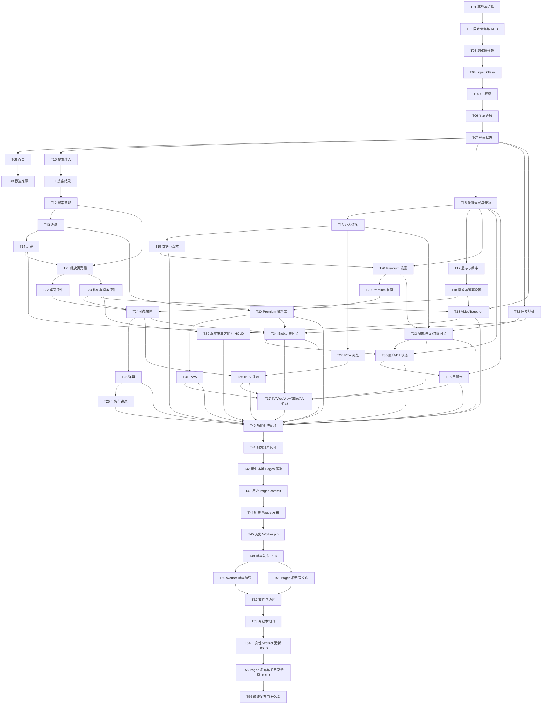

# 实施计划：KVideo 4.9.19 完整 UI/功能复刻

状态：**T49-T53/CP8-local 已完成；T01-T45/CP0-CP7 为历史已完成基线；原 T46-T48 已被取代；T54-T56 保持独立 HOLD**

## 1. 计划依据与充分性

- 规格：`work-products/SPEC.md`，用户在收到 2026-08-08 修订后直接调用 `@uxu-code:plan`，已授权进入规划。
- 权威基准：UXUVideo Git commit `28334f41407082ae1028fa4a4180bcc46d31c52a`，其 `package.json` 版本为 KVideo `4.9.19`。
- 当前 Worker：UXUVideo `main` HEAD `e7e397e520f90433f98eb1f929fc5d135bacfec0`，单文件 `_worker.js` 已实现 Worker/D1/登录安全架构；本轮不重做该架构。
- 规划起点前端：UXUV-Pages `main` HEAD `4bc847affa76755a5c99ce249d793aa43e0b83bb`，版本 `0.1.2`，工作树在规划检查时干净；虽有 8 个静态入口，但只保留简化界面与部分流程。
- 差距证据：固定 KVideo 提交包含完整设计样式、导航、主题、搜索、来源/订阅、收藏/历史、自定义播放器、弹幕、广告过滤、IPTV、Premium、设置、PWA、TV 和三语界面；当前 UXUV-Pages 只有少量通用体验组件和原生化播放器，不能据此声明完成复刻。
- 2026-08-11 Pages 发布修订依据：用户明确要求删除 `_worker.js` 的 `PAGES_GIT_COMMIT`、manifest/资产 SHA 固定和 Pages 对接密钥，只使用 `pagesVersion`、`apiContract`、`workerRange` 判断兼容；兼容 Pages 小步更新不得要求用户重发 Worker。现有 `_worker.js` 仍精确固定 `0.2.0`/commit/manifest SHA，UXUV-Pages 发布脚本仍生成 `gitCommit`/`sha256`/`sri` 并写版本目录，均是本轮待迁移对象。
- 参考边界：`../CfGfwAX/_worker.js` 只固定公共 Pages 根地址并直接读取页面，不含 Pages 版本、commit、manifest SHA、资源 SHA 或对接密钥。本计划保留 UXUVideo 已有 manifest 的路由/MIME/大小/兼容校验，但移除会强制 Worker 随 Pages 小改而更新的身份固定。
- 规划充分性：规格已固定功能矩阵、安全边界、兼容字段、失败关闭、一次性迁移顺序和回滚条件。当前修订不改变 API Contract、D1、认证或媒体合同；若实现发现必须新增 Secret、改变 API Contract 或放宽路径/MIME/大小边界，立即停止并回到 `@uxu-code:spec`。

旧 `work-products/plan.md` / `todo.md` 的 Worker/Pages 架构迁移历史继续作为证据；T42-T45 的精确身份结果只描述 2026-08-10 已发生的候选/发布事实，不再是当前运行时发布规范。未执行的原 T46-T48 被 T49-T56 取代，禁止按旧 pin 流程继续执行。

## 2. 成功定义与不变量

1. `work-products/kvideo-parity-matrix.md` 的所有用户能力 ID 最终只能是 `pass` 或引用 SPEC 13.3 的 `approved-difference`；不得有 `unverified`、缺失或隐含合并项。架构差异登记不使用 ID，也不参与状态门。
2. 每个用户能力 ID 都必须在任何产品代码改动前，对固定 UXUV-Pages `0.1.2` commit `4bc847affa76755a5c99ce249d793aa43e0b83bb` 产生可执行、可保存的 RED；随后才允许对应垂直切片转为 GREEN。禁止只查源码字符串。若后来发现遗漏 ID，立即退回 T01/T02，并在改该能力前补齐固定 0.1.2 RED；完整性闭环任务不得事后补造证据。
3. 直接复用固定提交中的组件、样式、文案和纯浏览器逻辑；只在静态导出、Worker API、D1 同步和登录安全边界冲突处做局部适配。
4. 每个实施任务聚焦一个用户流程，通常不超过 5 个产品文件；若迁移依赖闭包超过 5 个文件，按任务中声明的 A/B 小批次逐批验证，不能一次混改。
5. 所有新增测试放在相应仓库 `work-products/tests/`；测试引用仓库文件时从其最终位置使用相对路径，禁止 `C:\\Code` 等机器路径。
6. UXUVideo `_worker.js` 只有在 RED 合同证明现有 Worker 无法支持 KVideo 正常成功路径时才允许最小修改；不得放宽 SSRF、CSRF、认证、Free 上限或 D1 安全合同。
7. 不 reset、checkout 或覆盖当前工作树；从固定提交取源码使用只读 `git show`/`git archive` 到临时目录或逐文件补丁。
8. 视觉基线只能来自固定提交和无敏感 fixture；更新基线截图、改变阈值或批准非 13.3 差异必须先问用户。
9. Worker 固定唯一 `PAGES_BASE_URL`，但不固定 Pages 版本、commit、manifest SHA、资产 SHA 或 SRI。运行时只接受合法 `pagesVersion`、相同 `apiContract`、覆盖当前 Worker 的 `workerRange` 以及安全路由/MIME/大小合同；兼容 Pages 更新与回滚均不修改 Worker。
10. 本地、公开 Pages、测试 Cloudflare/D1、真实媒体/设备证据分别记录，互不替代。
11. T04-T38 的每个用户流程切片必须在本任务内同步闭合其简中/繁中/英语文案、键盘/焦点、适用的 320/768/1024/1440 断点和错误/空/加载状态；不得把这些质量要求推迟到最终汇总任务。

## 3. 依赖图

## 4. 任务

### T01：冻结三方基线并证明矩阵完整

**范围：** 固定 KVideo、当前 UXUV-Pages、当前 Worker 三个身份；逐页审计固定提交的可达组件、hooks、stores、样式、测试和文案，将用户能力写入稳定 ID 矩阵；SPEC 13.3 架构差异另表登记且不分配 ID。不修改产品代码。

**验收标准：** 所有规格 13.2 分号项都有唯一稳定 ID、固定提交入口、目标入口和测试映射；源码审计新增行为也有 ID；矩阵状态值域严格受限。

**验证：** `kvideo-feature-parity.test.mjs` 对提交身份、ID 唯一性、必填列、状态值域和测试映射先 RED 后 GREEN；保存三仓 `git status`/HEAD 证据。

**依赖：** 无。

**可能涉及：** `work-products/kvideo-parity-matrix.md`、UXUV-Pages `work-products/tests/kvideo-feature-parity.test.mjs`、`work-products/tests/fixtures/kvideo-4.9.19/source-inventory.json`。

**回滚：** 仅反向移除本任务新增规划/测试产物；不改变三个 Git 工作树的既有业务文件。

### T02：建立确定性 KVideo 参考与 0.1.2 RED 证据

**范围：** 以固定提交、锁文件、Chromium、字体、`zh-CN`、`Asia/Taipei`、固定时钟和合成数据生成八路由/四断点参考截图、DOM/交互清单；为 T01 中每个用户能力 ID 建立对固定 0.1.2 commit 的可执行失败断言和失败报告。

**验收标准：** 基线可从固定提交重建且哈希一致；fixture 无账号、Cookie、Secret、真实源或观看数据；每个用户能力 ID 都有独立或明确共享但可逐 ID 归因的 0.1.2 RED，缺任一 ID 即不得开始 T03。

**验证：** 对临时物化的 0.1.2 commit 运行全部 KVideo 行为/视觉测试并保存逐 ID RED 清单；`kvideo-visual-parity.e2e.spec.ts --update-snapshots` 仅在首次审阅任务执行，随后无更新参数运行并验证全页 `0.01`、关键区 `0.005`、布局 2 CSS px 合同。

**依赖：** T01。

**可能涉及：** UXUV-Pages `work-products/tests/kvideo-visual-parity.e2e.spec.ts`、`work-products/tests/fixtures/kvideo-4.9.19/`、`work-products/kvideo-red-baseline.md`、`scripts/materialize-kvideo-reference.mjs`。

**回滚：** 可删除未审阅的生成物；已审阅基线只能经用户批准更新，不能被当前实现截图覆盖。

### T03：恢复 KVideo 浏览器依赖与兼容工具

**范围：** 从固定提交恢复拖拽、图标、繁简转换、状态管理和纯浏览器辅助依赖；保持 Next 静态导出、无 server-only、无 Upstash/Vercel Analytics。

**验收标准：** 依赖版本由锁文件固定；静态构建不引入 Node/Secret；旧 WebView 83 的转译边界仍可测。

**验证：** `npm ci`、`npm test`、`npm run lint`、`npx tsc --noEmit`、`npm run build`；依赖与 bundle 秘密扫描。

**依赖：** T02。

**可能涉及：** UXUV-Pages `package.json`、`package-lock.json`、`next.config.ts`、`work-products/tests/static-export-contract.test.mjs`。

**回滚：** 反向移除本任务新增依赖和配置；保留现有 `hls.js`、Next 与测试工具链。

### T04：复刻安全登录纵向切片

**范围：** 在一个可独立运行的登录流程内，同时迁移 PasswordGate 所需 Liquid Glass token、Button/Input/Icon、焦点管理、登录加载/错误和真实 session 请求；不创建可独立存在的样式或原语基础层。

**验收标准：** Worker origin 可完成登录并进入确定性主页占位；密码不进入 URL/storage/log；登录的三语、键盘、焦点、四断点和视觉 token 与固定基准一致；未使用的通用组件/CSS 不迁移。

**验证：** auth E2E、网络/存储秘密扫描、登录关键区 `0.005`、axe、三语、键盘与四断点。

**依赖：** T03。

**可能涉及：** UXUV-Pages `components/PasswordGate.tsx`、`lib/store/auth-store.ts`、`app/globals.css`、`components/ui/Button.tsx`、`work-products/tests/app-flows.e2e.spec.ts`；Input/Icon 作为同任务小批次。

**回滚：** 整体回到现有安全 PasswordGate；绝不恢复客户端 Secret 或匿名认证。

### T05：复刻登录后的基础首页纵向切片

**范围：** 在已登录成功路径内，同时迁移主页基本布局、MovieCard/Grid、Card/Icon、同源内容请求以及加载/空/失败状态；高级豆瓣/标签/推荐留给 T08/T09。

**验收标准：** 用户登录后可看到 KVideo 主页信息架构和合成内容/空/错误状态；海报占位和卡片交互可用；三语、键盘、焦点和四断点完整；无未使用横向原语。

**验证：** 基础 HOM ID、同源网络、内容/空/错误 E2E、axe、三语和首页四断点截图。

**依赖：** T04。

**可能涉及：** UXUV-Pages `app/page.tsx`、`components/home/MovieCard.tsx`、`components/home/MovieGrid.tsx`、`lib/content/api-client.ts`、`work-products/tests/kvideo-home-search-parity.e2e.spec.ts`。

**回滚：** 回到 T04 登录后确定性主页占位；登录流程保持可用。

### T06：复刻全局导航、主题、语言与 TV 导航流程

**范围：** 在 T05 可用主页上恢复 Navbar、普通/Premium 入口、三态主题、三语切换、滚动恢复、返回顶部，以及 TV 检测/10 英尺导航/空间焦点核心；页面专用 TV 行为随所属切片实现。

**验收标准：** 用户可在主页完成导航、主题、语言、滚动和键盘/遥控焦点流程；八路由直接刷新保持静态入口；触摸/键盘/TV 焦点不冲突；后续切片扩展而不替换壳层。

**验证：** GLB/DEV 全局 ID、`kvideo-visual-parity` 壳层、`kvideo-iptv-device-parity` 首页遥控导航、三语/四断点和静态 build。

**依赖：** T05。

**可能涉及：** UXUV-Pages `app/layout.tsx`、`components/layout/Navbar.tsx`、`components/ThemeProvider.tsx`、`components/LocaleProvider.tsx`、`components/TVNavigationInitializer.tsx`；空间导航 core 为同任务小批次。

**回滚：** 恢复现有 RuntimeConfig/PasswordGate 包装顺序，不影响同源 API 安全边界。

### T07：闭合公开直访、设置缺失与会话失效流程

**范围：** 在 T04 登录成功流之外，复刻 `github.io` 公开说明、设置缺失、初始加载、会话失效、无权限和重试；保留 HttpOnly Cookie/session 权威和 Pages 直访零认证请求。

**验收标准：** `github.io` 只显示公开说明且零 API；Worker origin 各失败状态可恢复到登录/主页；三语、键盘、焦点和四断点满足 KVideo 设计语言。

**验证：** direct Pages/setup/session/permission/retry E2E、网络敏感信息扫描、错误状态截图与焦点顺序。

**依赖：** T06。

**可能涉及：** UXUV-Pages `components/PublicPage.tsx`、`components/AdminGate.tsx`、`components/PasswordGate.tsx`、`components/RuntimeConfigProvider.tsx`、`work-products/tests/app-flows.e2e.spec.ts`。

**回滚：** 回到现有安全登录实现；绝不恢复客户端 Secret 或匿名代理。

### T08：复刻首页与豆瓣发现流程

**范围：** 恢复电影/电视剧切换、豆瓣标签/分类、内容卡片、海报占位和普通/Premium 分流。固定提交把演员/导演点击搜索实现于播放页 `VideoMetadata`，因此 `HOM-012` 随 T21 闭合，不在首页发明基准外字段或控件。

**验收标准：** 首页信息架构、卡片密度、加载/空/错误状态和详情/搜索跳转与基准一致；所有请求保持同源 `/api/*`；TV 遥控焦点按卡片网格移动且不丢失当前位置。

**验证：** `kvideo-home-search-parity` 的 HOM/Douban ID、首页三语/键盘/TV 遥控/四断点截图和取消/错误 fixture。

**依赖：** T07。

**可能涉及：** UXUV-Pages `app/page.tsx`、`components/home/MovieCard.tsx`、`components/home/MovieGrid.tsx`、`lib/hooks/useHomePage.ts`、`lib/content/api-client.ts`。

**回滚：** 回滚首页切片，保留安全登录和同源 API client。

### T09：复刻标签管理、推荐与无限滚动

**范围：** 恢复标签添加/删除/默认恢复/拖拽排序、个性化推荐、热门内容和无限滚动。

**验收标准：** 拖拽与键盘排序均持久化；普通/Premium 标签状态隔离；分页追加无重复且取消后不继续更新。

**验证：** HOM/TAG ID 的行为 E2E、原 `tag-management-view` 语义回归、移动/桌面视觉对照。

**依赖：** T08。

**可能涉及：** UXUV-Pages `components/home/TagManager.tsx`、`components/home/TagList.tsx`、`components/home/hooks/useTagManager.ts`、`components/home/hooks/usePersonalizedRecommendations.ts`、`lib/hooks/useInfiniteScroll.ts`。

**回滚：** 回滚标签/推荐存储键和组件，保留已迁移首页基本流。

### T10：复刻搜索输入、历史与繁简转换

**范围：** 恢复 SearchBox/Form、历史下拉、复用、单项删除、清空、键盘导航和繁简转换。

**验收标准：** 历史容量/排序/持久化与账户隔离一致；输入法、键盘和 TV 遥控焦点行为稳定；转换不改写原始可回看查询。

**验证：** SEA 输入/历史/转换 ID；无鼠标/遥控完整操作；三语与四断点；当前 0.1.2 RED 记录转 GREEN。

**依赖：** T07。

**可能涉及：** UXUV-Pages `components/search/SearchBox.tsx`、`components/search/SearchHistoryDropdown.tsx`、`lib/hooks/useSearchHistory.ts`、`lib/utils/chinese-convert.ts`、`work-products/tests/kvideo-home-search-parity.e2e.spec.ts`。

**回滚：** 回滚搜索输入切片，不删除现有用户历史数据。

### T11：复刻搜索结果分组、卡片与徽章

**范围：** 恢复普通/同名合并视图、VideoGrid/GroupCard、来源/类型/语言/清晰度徽章及展开状态持久化。

**验收标准：** SSE 增量到达时稳定插入、无跳序/重复；徽章与基准字段一致；展开状态按账户/模式持久化。

**验证：** SEA 结果/分组/徽章 ID、增量流 fixture、四断点与关键区 `0.005`。

**依赖：** T10。

**可能涉及：** UXUV-Pages `components/search/VideoGrid.tsx`、`components/search/VideoGroupCard.tsx`、`components/search/SourceBadges.tsx`、`components/search/TypeBadges.tsx`、`components/search/LanguageBadges.tsx`。

**回滚：** 回退分组视图，保留搜索请求与取消能力。

### T12：复刻筛选、排序、延迟与清晰度探测

**范围：** 恢复来源/类型筛选、类目屏蔽、相关性/延迟/发布时间/评分/名称排序、实时延迟和按需分辨率探测。

**验收标准：** 所有原排序选项和稳定 tie-break 存在；延迟/探测失败不删除结果；Free/Paid 上限由 Worker 返回并被 UI 解释。

**验证：** SEA filter/sort/latency/resolution ID、SSE 取消、Worker 既有预算合同和网络请求计数。

**依赖：** T11。

**可能涉及：** UXUV-Pages `lib/hooks/useSearchState.ts`、`lib/hooks/useLatencyPing.ts`、`lib/hooks/useResolutionProbe.ts`、`lib/utils/sort.ts`、`components/ResolutionProbeButton.tsx`。

**回滚：** 回滚筛选/排序状态到上一个兼容 schema，不清除已有用户设置。

### T13：复刻收藏资料库与搜索收藏流程

**范围：** 恢复搜索页收藏、网格/列表、侧边栏、删除、容量提示和空状态；播放页收藏按钮留给 T21 在播放器壳层中接入，避免反向依赖。

**验收标准：** 普通/Premium 与账户严格隔离；刷新后本地状态一致；搜索页收藏按钮的加载、已收藏和错误反馈与基准一致；矩阵 `FAV-002` 与全部跨设备同步 ID 保持 `unverified`，分别等待 T21/T34。

**验证：** 除 `FAV-002` 和跨设备同步外的 FAV ID、双账户/双模式本地 E2E、三语/键盘/四断点视觉；本任务不运行同步冲突通过断言。

**依赖：** T12。

**可能涉及：** UXUV-Pages `app/favorites/page.tsx`、`components/favorites/FavoriteButton.tsx`、`components/favorites/FavoritesPageContent.tsx`、`lib/store/favorites-store.ts`、`work-products/tests/kvideo-home-search-parity.e2e.spec.ts`。

**回滚：** 反向移除 UI 适配，保留用户同步文档和收藏记录。

### T14：复刻历史资料库与管理流程

**范围：** 以确定性历史 fixture 恢复 50 条上限、侧边栏、单删/清空和继续播放链接；自动记录、同标题去重、断点续播由 T24 在真实播放生命周期中接入。

**验收标准：** 历史列表/侧边栏/删除/清空/50 条边界可独立运行；普通/Premium/账户隔离；矩阵 `HIS-001` 至 `HIS-005` 保持 `unverified` 直到 T24。

**验证：** `HIS-006` 至 `HIS-011` 的本地行为、删除/清空确认框、继续播放路由、三语/键盘/四断点；双设备 CAS 留给 T34。

**依赖：** T13。

**可能涉及：** UXUV-Pages `components/history/WatchHistorySidebar.tsx`、`components/history/HistoryList.tsx`、`components/history/HistoryItem.tsx`、`lib/store/history-store.ts`、`work-products/tests/kvideo-player-parity.e2e.spec.ts`。

**回滚：** 回滚历史 UI/节流逻辑，禁止删除现有历史文档。

### T15：复刻设置壳层与普通来源管理

**范围：** 恢复设置页分区/顺序、SettingsSection、系统/个人来源展示、添加/编辑/启停/删除/上下移动/折叠和校验。

**验收标准：** 原字段、默认值、错误文案、确认流程和拖拽/按钮排序均存在；来源改动即时本地持久化；同步队列接入和跨设备状态明确留给 T33；设置页 TV/遥控焦点顺序可用。

**验证：** SRC/SET 本地 shell/CRUD/排序、三语/键盘/TV 遥控 E2E、设置页四断点关键区截图；本任务不把同步 ID 标 pass。

**依赖：** T07。

**可能涉及：** UXUV-Pages `app/settings/page.tsx`、`components/settings/SettingsSection.tsx`、`components/settings/SourceManager.tsx`、`components/settings/AddSourceModal.tsx`、`lib/store/user-sources-store.ts`。

**回滚：** 回滚 UI，不删除用户源或 tombstone；恢复前一兼容数据读取。

### T16：复刻导入、订阅与批量来源流程

**范围：** 恢复 JSON 粘贴、文件、链接、订阅四类导入，以及订阅添加、更新、管理、失败提示和重复处理。

**验收标准：** 导入在写入前校验/预览；不接受 Secret/危险 scheme；重复和部分无效输入按 KVideo 行为报告且不破坏已有源；各导入模态具备 TV/遥控焦点高亮、陷阱和返回恢复。

**验证：** SRC import/subscription ID、合成文件/链接 fixture、同源/SSRF 合同、撤销/失败路径及三语/键盘/TV 遥控模态 E2E。

**依赖：** T15。

**可能涉及：** UXUV-Pages `components/settings/ImportModal.tsx`、`components/settings/import/FileImportTab.tsx`、`components/settings/import/LinkImportTab.tsx`、`components/settings/import/SubscriptionImportTab.tsx`、`lib/utils/source-import-utils.ts`。

**回滚：** 回滚导入 UI/解析器，不清空已存在来源与订阅。

### T17：复刻显示、主题、语言与搜索排序设置

**范围：** 恢复 DisplaySettings、SortSettings、主题、语言、布局/展示项和类目屏蔽设置。

**验收标准：** 设置项、默认值、顺序和即时预览与基准一致；旧配置可兼容读取；三语和主题持久化不跨账户泄漏。

**验证：** SET display/theme/language/sort ID、reload/账户切换 E2E、设置关键区视觉。

**依赖：** T15。

**可能涉及：** UXUV-Pages `components/settings/DisplaySettings.tsx`、`components/settings/SortSettings.tsx`、`components/ThemeSwitcher.tsx`、`lib/store/settings-store.ts`、`work-products/tests/kvideo-settings-parity.e2e.spec.ts`。

**回滚：** 兼容保留旧字段；回滚 UI 时不删除用户偏好。

### T18：复刻播放器、跳过、代理、弹幕与广告设置

**范围：** 恢复 PlayerSettings、UserDanmakuSettings、代理模式、片头片尾、自动连播、广告模式/关键词和用户弹幕 API 优先级设置。

**验收标准：** 所有原控件、范围、默认值、禁用依赖和错误提示存在；设置能被播放器实时读取；安全限制以说明呈现而非隐藏入口。

**验证：** SET player/danmaku/ad ID、`player-settings-snapshot` 语义回归、保存/重载/账户隔离 E2E。

**依赖：** T17。

**可能涉及：** UXUV-Pages `components/settings/PlayerSettings.tsx`、`components/settings/UserDanmakuSettings.tsx`、`lib/store/settings-store.ts`、`lib/player/player-settings.ts`、`work-products/tests/kvideo-settings-parity.e2e.spec.ts`。

**回滚：** 回滚新增设置读取，保留未知字段以允许前向恢复。

### T19：复刻普通模式数据导入导出与版本检查

**范围：** 恢复普通模式设置/来源/订阅/播放器/弹幕/广告 JSON 导入导出、预览/确认、容量提示、版本检查三态和数据隔离说明；Premium schema 在 T20 接入后才闭合“全设置”ID。

**验收标准：** 普通模式导出不含密码/Cookie/Secret；导入事务性校验，失败不部分覆盖；更新成功/无需更新/失败状态与基准一致；数据模态可用遥控完成预览/确认/取消；DAT-001/002 保持 `unverified` 直到 T20。

**验证：** 普通模式 DAT 子合同、往返字节 fixture、恶意/超限输入、版本 API 三态、三语/键盘/TV 遥控模态 E2E 和秘密扫描。

**依赖：** T16、T17、T18。

**可能涉及：** UXUV-Pages `components/settings/DataSettings.tsx`、`components/settings/ExportModal.tsx`、`components/settings/ImportModal.tsx`、`components/settings/AppVersionSettings.tsx`、`work-products/tests/kvideo-settings-parity.e2e.spec.ts`。

**回滚：** 回滚 UI；不得删除或重写用户本地/D1 文档。

### T20：复刻 Premium 来源与独立设置

**范围：** 恢复 PremiumSourceSettings、独立设置页、服务端授权失效/重验和与普通模式分离的数据入口；把 Premium 设置/来源纳入 T19 的全设置导入导出 schema。

**验收标准：** Premium 来源 CRUD/排序/导入能力与普通模式对应；无有效服务端 session 不显示伪成功；普通配置不被 Premium 操作覆盖；包含 Premium 的完整 JSON 往返后 DAT-001/002 才可转 GREEN；设置页和模态可用 TV/遥控完整操作。

**验证：** PRE/SET Premium ID、包含普通/Premium 的全设置 JSON 往返、403/失效/重验、三语/键盘/TV 遥控 E2E、双模式存储和秘密扫描。

**依赖：** T15、T16、T18、T19。

**可能涉及：** UXUV-Pages `app/premium/settings/page.tsx`、`components/settings/PremiumSourceSettings.tsx`、`components/PremiumPasswordGate.tsx`、`lib/store/premium-mode-settings.ts`、`work-products/tests/kvideo-settings-parity.e2e.spec.ts`。

**回滚：** 回滚 Premium UI 适配，服务端授权继续失败关闭。

### T21：复刻播放页壳层、元数据、来源与选集

**范围：** 恢复 PlayerNavbar、VideoMetadata（含演员/导演点击搜索）、SourceSelector、EpisodeList、空/错误状态、顶部对齐、列表/网格、每 50 集分页和来源折叠分组，并在此闭合 `HOM-012`。

**验收标准：** 路由参数和短链接/sessionStorage 行为一致；演员/导演名称可直接触发对应搜索；切源/切集状态明确；页面不使用原生播放器控件作为主界面；播放页收藏按钮完成 `FAV-002`，历史继续播放链接可进入正确剧集；遥控方向键在选集/来源区工作且不会误控视频区域。

**验证：** PLY shell/source/episode ID、`FAV-002`、历史继续播放链接、短链接/刷新/50 集边界 E2E，以及本切片三语/键盘/四断点视觉。

**依赖：** T12、T14。

**可能涉及：** UXUV-Pages `app/player/page.tsx`、`components/player/PlayerNavbar.tsx`、`components/player/VideoMetadata.tsx`、`components/player/SourceSelector.tsx`、`components/player/EpisodeList.tsx`。

**回滚：** 回滚播放壳层到现有安全错误页，保留媒体 API 客户端。

### T22：复刻桌面自定义播放器控制层

**范围：** 恢复桌面 overlay、进度、播放/暂停、音量/静音、倍速、快进/退、控制栏隐藏、光标和快捷键。

**验收标准：** 控件数量、位置、图标、可访问名称和快捷键与基准一致；隐藏/显示计时确定；原生 `controls` 不作为生产界面。

**验证：** PLY desktop ID、虚拟媒体时钟 E2E、控制层关键区 `0.005`、键盘与 reduced-motion。

**依赖：** T21。

**可能涉及：** UXUV-Pages `components/player/DesktopVideoPlayer.tsx`、`components/player/desktop/DesktopControls.tsx`、`components/player/desktop/DesktopProgressBar.tsx`、`components/player/hooks/useDesktopPlayerLogic.ts`、`work-products/tests/kvideo-player-parity.e2e.spec.ts`。

**回滚：** 回滚桌面控制层而不改变媒体 URL/会话安全。

### T23：复刻移动手势、全屏、PiP 与 Cast

**范围：** 恢复移动控件、双击、方向、系统/网页全屏、Android PiP、标准 PiP、Google Cast 和不可用状态。

**验收标准：** 触摸、桌面和 TV 遥控输入互不冲突；播放器区域方向键隔离；能力缺失时入口保留可解释状态；mock/禁用态不绕过同源媒体安全；真实 Cast/PiP 证据未获授权时对应 ID 保持 `unverified`。

**验证：** PLY mobile/fullscreen/PiP/Cast mock 与播放器方向键隔离；320/768/TV 截图；真实 Cast/PiP 设备步骤只在独立 HOLD 任务执行。

**依赖：** T21。

**可能涉及：** UXUV-Pages `lib/hooks/useMobilePlayer.ts`、`lib/hooks/mobile/useDoubleTap.ts`、`components/player/hooks/desktop/useFullscreenControls.ts`、`components/player/hooks/desktop/useCastControls.ts`、`work-products/tests/kvideo-player-parity.e2e.spec.ts`。

**回滚：** 按能力子批次回滚，保留基础播放和错误状态。

### T24：复刻 HLS、代理、卡顿与失败切源策略

**范围：** 恢复 HLS.js 生命周期、直连/智能重试/总是代理、Range、取消、卡顿检测、切源、延迟排序、实际分辨率和切集状态；在真实媒体事件中接入历史自动记录、同标题去重、断点续播和写入节流。

**验收标准：** 上一播放实例完全销毁；取消传播到 Worker；失败切源有上限且不循环；T18 持久化代理/播放器设置真实驱动 media client；`HIS-001` 至 `HIS-005` 转 GREEN 且节流不产生高频 D1 写。

**验证：** PLY strategy ID、`HIS-001` 至 `HIS-005`、持久化设置→media client 行为、HLS/Range/超时/取消 fixture、Worker `media-stream`/安全/预算现有合同。

**依赖：** T14、T18、T22、T23。

**可能涉及：** UXUV-Pages `components/player/hooks/useHlsPlayer.ts`、`components/player/hooks/useStallDetection.ts`、`components/player/hooks/useVideoResolution.ts`、`lib/player/resolution-cache.ts`、`lib/media/media-client.ts`。

**回滚：** 恢复现有受控媒体客户端；绝不退回匿名或不受限代理。

### T25：复刻弹幕聚合、轨道与 Canvas

**范围：** 恢复聚合/用户 API 优先级、Canvas 渲染、滚动/顶部/底部、开关、透明度、字号、区域及播放联动。

**验收标准：** 暂停/跳转/全屏后时间轴收敛；无数据/失败不影响播放；渲染量有上限且不泄漏用户 API。

**验证：** DAN ID、`danmaku-canvas-utils` 语义回归、虚拟时钟 Canvas E2E 和性能边界。

**依赖：** T24、T18。

**可能涉及：** UXUV-Pages `components/player/DanmakuCanvas.tsx`、`components/player/hooks/useDanmaku.ts`、`lib/player/danmaku-canvas-utils.ts`、`lib/utils/danmaku-utils.ts`、`work-products/tests/kvideo-player-parity.e2e.spec.ts`。

**回滚：** 禁用弹幕层并恢复明确状态，不影响视频主流。

### T26：复刻广告过滤、自动跳过与自动连播

**范围：** 恢复关闭/关键词/智能/激进模式、播放器切换、自定义关键词、HLS 清单过滤、片头片尾和自动连播。

**验收标准：** 过滤失败安全返回原可播放清单或明确错误，不生成损坏清单；跳过/连播边界和用户覆盖与基准一致。

**验证：** ADS/PLY skip ID、旧 m3u8 detector/duration-grid/filter 语义回归、恶意/边界 playlist fixture。

**依赖：** T24、T18。

**可能涉及：** UXUV-Pages `lib/utils/m3u8-ad-detector.ts`、`lib/utils/m3u8-utils.ts`、`components/player/hooks/useAutoSkip.ts`、`components/player/hooks/usePlaybackPolling.ts`、`work-products/tests/kvideo-player-parity.e2e.spec.ts`。

**回滚：** 回滚过滤/跳过子层，保留原始安全播放路径和用户设置。

### T27：复刻 IPTV 来源、分组、搜索与三级浏览

**范围：** 恢复 M3U/M3U8/JSON 导入、自定义源、缓存、最多三源并发、分组/搜索/分页和源→分类→频道导航。

**验收标准：** UA/Referer 与源字段完整；缓存/更新/失败状态可见；权限不足显示解释而非空白页；TV 遥控可完成源→分类→频道三级移动和选择。

**验证：** IPTV browse/source ID、合成 M3U/JSON fixture、三源并发计数、三语/键盘/TV 遥控和四断点视觉。

**依赖：** T16。

**可能涉及：** UXUV-Pages `app/iptv/page.tsx`、`components/iptv/IPTVSourceManager.tsx`、`components/iptv/IPTVChannelGrid.tsx`、`lib/store/iptv-store.ts`、`lib/utils/m3u-parser.ts`。

**回滚：** 回滚 IPTV 浏览 UI，不删除用户自定义源。

### T28：复刻 IPTV 多线路播放与兼容策略

**范围：** 恢复前三线路折叠、自动切源/延迟、HLS 重写、重定向/超时/重试、HEVC/H.264 选择和快捷键。

**验收标准：** 切台/切线取消旧流；签名 token/权限失败有明确状态；浏览器不支持 HEVC 时选择兼容线路或解释失败；TV 快捷键和焦点不会逃出播放器。

**验证：** IPTV play/line/codec ID、HLS 与重定向 fixture、Worker IPTV 安全/流合同、键盘/TV 遥控 E2E。

**依赖：** T24、T27。

**可能涉及：** UXUV-Pages `components/iptv/IPTVPlayer.tsx`、`lib/media/media-client.ts`、`lib/hooks/useKeyboardNavigation.ts`、`work-products/tests/kvideo-iptv-device-parity.e2e.spec.ts`；仅在 RED 证明缺口时最小改 UXUVideo `_worker.js`。

**回滚：** 回滚播放器适配；Worker 路由保持认证和失败关闭。

### T29：复刻 Premium 首页、推荐、分类与搜索

**范围：** 恢复独立入口、分类模糊合并、多源交错、推荐、搜索和服务端授权失效处理。

**验收标准：** Premium 内容不混入普通模式；聚合顺序、分类命名和加载/空/错误与基准一致；403 触发重新验证；TV/遥控可在分类、搜索和内容网格间稳定移动焦点。

**验证：** PRE home/search/recommend ID、聚合 fixture、授权失效、三语/键盘/TV 遥控 E2E和四断点视觉。

**依赖：** T09、T12、T20。

**可能涉及：** UXUV-Pages `app/premium/page.tsx`、`components/premium/PremiumContent.tsx`、`components/premium/PremiumContentGrid.tsx`、`lib/hooks/usePremiumHomePage.ts`、`work-products/tests/kvideo-home-search-parity.e2e.spec.ts`。

**回滚：** 回到 Premium 安全门和错误状态，不泄漏 Premium 源。

### T30：复刻 Premium 收藏、历史与物理隔离

**范围：** 恢复 Premium 收藏页、历史侧边栏、继续播放和独立本地容量/命名空间；跨设备同步接入留给 T34。

**验收标准：** 普通与 Premium 数据不能互读/覆盖；账户切换清除内存视图但保留各自数据；所有入口保持原视觉；收藏/历史网格、侧边栏和确认框可用 TV/遥控完整操作。

**验证：** PRE library 本地 ID、双模式双账户本地 E2E、三语/键盘/TV 遥控/四断点视觉；同步 payload 检查留给 T34。

**依赖：** T13、T14、T29。

**可能涉及：** UXUV-Pages `app/premium/favorites/page.tsx`、`components/favorites/FavoritesPageContent.tsx`、`components/history/WatchHistorySidebar.tsx`、`lib/store/premium-mode-settings.ts`、`work-products/tests/kvideo-home-search-parity.e2e.spec.ts`。

**回滚：** 回滚 Premium 视图，不合并或删除任一模式数据。

### T31：复刻 PWA 安装与静态缓存生命周期

**范围：** 单独恢复 manifest、图标、安装态、Service Worker 注册、版本化静态缓存和升级清理；不在本任务改同步或设置面板。

**验收标准：** SW 只缓存当前不可变首方静态资源，不缓存 API、认证或媒体；旧 cache 可安全清理；浏览器/PWA/直接刷新行为与基准一致。

**验证：** `PWA-001` 至 `PWA-006`、缓存升级/离线 E2E、安装能力 mock + 人工步骤、三语/键盘/四断点。

**依赖：** T06、T30。

**可能涉及：** UXUV-Pages `public/sw.js`、`public/manifest.json`、`components/ServiceWorkerRegister.tsx`、`app/layout.tsx`、`work-products/tests/pwa-contract.test.mjs`。

**回滚：** 发布前用新 cache 名称撤销候选；不碰 `release/0.1.2` 或用户数据。

### T32：建立可独立回滚的本地优先同步基础

**范围：** 只建立 ETag/CAS client、离线队列、冲突合并、重试、账户命名空间和统一同步状态；不接具体配置/来源/资料库文档 UI。

**验收标准：** 网络/D1/配额失败保留本地 dirty 数据；并发 409 可重现并收敛；账户切换不串数据；基础层不假定某种文档 payload。

**验证：** 双 browser context、断网/恢复、409/配额 fixture、纯合并函数和账户隔离测试。

**依赖：** T07。

**可能涉及：** UXUV-Pages `lib/sync/document-client.ts`、`lib/sync/document-merge.ts`、`lib/sync/document-store.ts`、`components/SyncProvider.tsx`、`work-products/tests/sync-client.test.mjs`。

**回滚：** 停用远端队列并保留现有 localStorage/D1 文档；不删除 tombstone。

### T33：接入配置、来源与订阅同步

**范围：** 将设置、普通/Premium 来源和订阅逐类接入 T32；每类为独立 ≤5 文件子批次，先本地即时再远端 CAS。

**验收标准：** 配置/来源/订阅各自有离线、冲突、配额和恢复证据；未知字段兼容保留；普通/Premium/账户命名空间不串写。

**验证：** `PWA-007` 至 `PWA-009`、SET/SRC 对应 ID、逐文档双 context E2E 和 payload schema 检查。

**依赖：** T16、T20、T32。

**可能涉及：** UXUV-Pages `lib/hooks/useConfigSync.ts`、`lib/hooks/useCloudSync.ts`、`lib/hooks/useSubscriptionSync.ts`、`lib/store/user-sources-store.ts`、`work-products/tests/kvideo-settings-parity.e2e.spec.ts`。

**回滚：** 逐文档类型关闭远端接入，保留本地数据和可前向恢复字段。

### T34：接入收藏与历史同步

**范围：** 将普通/Premium 收藏和历史接入 T32，保持本地即时、30 天 tombstone、播放进度节流和模式/账户隔离。

**验收标准：** 双设备删除不会被旧设备复活；离线收藏/进度恢复后收敛；Premium 与普通 payload 物理隔离。

**验证：** `PWA-010` 至 `PWA-014`、FAV/HIS/PRE 相关 ID、双 context 冲突/恢复与写频率测试。

**依赖：** T14、T24、T30、T32。

**可能涉及：** UXUV-Pages `lib/store/favorites-store.ts`、`lib/store/history-store.ts`、`lib/utils/sync-records.ts`、`components/AutoSync.tsx`、`work-products/tests/app-flows.e2e.spec.ts`。

**回滚：** 关闭该两类远端同步并保留本地/D1 记录；不删除 tombstone。

### T35：按 KVideo 视觉接入账户与 D1 同步状态

**范围：** 将账户管理、离线/等待/冲突/配额/错误状态作为独立 SettingsSection 增量插入，不改变原设置顺序或重做同步基础。

**验收标准：** super_admin/普通用户权限正确；配置、来源、订阅、收藏、历史所有文档类型的离线/等待/冲突/配额/恢复状态均可操作；不含账户级 Cloudflare 数值；新增区块的三语、键盘和四断点符合 KVideo token。

**验证：** SET-004、SET-021、PWA 状态 ID、所有文档类型的权限/会话失效/离线/冲突/配额/恢复 E2E 和关键区 `0.005`。

**依赖：** T15、T32、T33、T34。

**可能涉及：** UXUV-Pages `components/settings/AccountSettings.tsx`、`components/SyncStatus.tsx`、`components/settings/SyncSettings.tsx`、`app/settings/page.tsx`、`work-products/tests/kvideo-settings-parity.e2e.spec.ts`。

**回滚：** 移除新增区块但保留安全账户 API、同步队列和全部数据。

### T36：按 KVideo 视觉接入 Cloudflare 用量卡

**范围：** 只在账户管理之后、播放设置之前插入 super_admin 用量卡和根级分级提醒；普通用户/Pages 直访不请求用量 API。

**验收标准：** 四项指标、账户/项目边界、警戒线、UTC 倒计时、observedAt/stale/未配置/失败状态完整；Token 不进入浏览器、D1、Cache、URL 或日志。

**验证：** SET-020、现有 `usage-ui.e2e.spec.ts`、70/85/95/100 边界、权限/零请求/秘密扫描和三语/键盘/四断点视觉。

**依赖：** T15、T35。

**可能涉及：** UXUV-Pages `components/settings/CloudflareUsageSettings.tsx`、`components/UsageAlertProvider.tsx`、`lib/hooks/useCloudflareUsage.ts`、`app/settings/page.tsx`、`work-products/tests/usage-ui.e2e.spec.ts`。

**回滚：** 移除用量卡/提醒调用，不影响账户、同步或其他设置区块。

### T37：汇总 TV、WebView、三语与 WCAG 合同

**范围：** 只汇总各垂直切片已实现的三语、键盘、断点、TV/遥控、错误状态和 WebView 83 可解析证据；不得在此首次实现 TV 检测、10 英尺 UI、空间导航、焦点高亮或播放器方向键隔离。发现遗漏必须退回所属任务。

**验收标准：** 八路由可仅键盘/遥控操作；三语无硬编码遗漏；axe serious/critical 为 0；触摸/TV/桌面焦点不互相污染；每项能回溯所属切片证据。

**验证：** `kvideo-iptv-device-parity`、`accessibility.e2e.spec.ts`、WebView 83 静态资产检查、三语截图与字符串清单。

**依赖：** T28、T30、T31、T33、T34、T35、T36。

**可能涉及：** UXUV-Pages `work-products/tests/kvideo-iptv-device-parity.e2e.spec.ts`、`work-products/tests/accessibility.e2e.spec.ts`、`work-products/device-evidence.md`；产品缺陷回所属任务。

**回滚：** 任一证据失败即退回所属任务并恢复对应 ID 为 `unverified`；本任务没有可回滚的产品实现。

### T38：复刻 VideoTogether 创建、加入与配置状态

**范围：** 恢复 VideoTogetherController 的创建房间、加入房间、配置状态和禁用说明；第三方脚本仅由 Worker RuntimeConfig/CSP 允许时加载，默认关闭，禁止把凭据或房间状态写入公共 Pages 构建物。

**验收标准：** mock 环境下 `EXT-001` 至 `EXT-003` 的入口、成功/失败/禁用态完整；未获第三方授权时不加载真实脚本且 ID 保持 `unverified`；播放器菜单可用 TV/遥控操作。

**验证：** VideoTogether capability mock、CSP/禁用/加载失败/创建/加入、三语/键盘/TV 遥控 E2E、网络与秘密扫描；真实脚本/房间证据只在下一独立 HOLD 任务执行。

**依赖：** T07、T18、T23。

**可能涉及：** UXUV-Pages `components/VideoTogetherController.tsx`、`components/player/desktop/DesktopMoreMenu.tsx`、`components/RuntimeConfigProvider.tsx`、`work-products/tests/kvideo-player-parity.e2e.spec.ts`、`work-products/tests/kvideo-settings-parity.e2e.spec.ts`。

**回滚：** 禁用并移除第三方脚本加载，保留明确的 KVideo 视觉禁用态；不影响播放器或 Cast。

### T39：验证真实 Cast 与 VideoTogether 能力（HOLD）

**执行结论（2026-08-10）：** 用户将交付边界明确为 CfGfwAX 式单文件 Worker：用户复制 `_worker.js` 到 Cloudflare 后自行完成真实设备验收。固定 VideoTogether 顶层脚本和 Codex 内置浏览器临时房间流程已验证；Cast 首方 SDK/同源代理合同通过，因无指定设备不声明真实 Cast 已验证，也不再阻断 T40-T42 本地候选。

**范围：** 只有用户明确授权启用第三方脚本和使用指定设备/测试房间后，才加载真实 VideoTogether 脚本并执行创建/加入房间，同时在指定 Cast 设备上验证连接、控制和断开；未授权时只保留 T23/T38 的 mock/禁用态。

**验收标准：** 真实脚本来源与 RuntimeConfig/CSP 完全一致且无额外遥测/凭据泄漏；创建/加入/失败/断开可复验；Cast 不绕过 Worker 同源媒体路径；`EXT-001` 至 `EXT-004` 只有取得真实证据后才转 `pass`。

**验证：** 记录授权范围、脚本 URL 哈希/CSP、测试房间步骤、Cast 设备/浏览器版本、网络日志和秘密扫描；结果与 mock 证据分栏。

**依赖：** T23、T38、显式第三方脚本/设备授权。

**可能涉及：** UXUV-Pages `work-products/third-party-capability-evidence.md`；经批准的测试 RuntimeConfig/CSP 和用户指定设备，不修改公共构建物。

**回滚：** 立即关闭测试 RuntimeConfig 中的第三方脚本并结束房间/投屏；保留禁用态，不删除证据。

### T40：闭合全部功能对照 ID

**范围：** 只聚合 T01/T02 与各切片已经生成的证据，把 `unverified` 转为 `pass` 或引用 SPEC 13.3 的 `approved-difference`；不得在此新增 ID、补做 0.1.2 RED 或首次实现产品能力。

**验收标准：** 零 `unverified`、零缺测试映射、零未审批差异；每个 ID 能回溯 T02 的 0.1.2 RED、固定提交入口、目标实现和 GREEN 证据。

**验证：** `npm test`、全部 KVideo 行为 E2E、矩阵一致性测试和失败注入；发现缺口立即回退 T01/T02/所属实现任务。

**依赖：** T19、T25、T26、T28、T30、T31、T33、T34、T35、T36、T37、T38、T39。

**可能涉及：** UXUV-Pages `work-products/kvideo-parity-evidence.md`、`work-products/tests/kvideo-feature-parity.test.mjs`、五个 KVideo E2E 文件。

**回滚：** 某项回归立即恢复为 `unverified` 并阻断后续；不删除 RED/审阅证据。

### T41：闭合八路由四断点视觉矩阵

**范围：** 对内容/空/错误/弹窗/菜单/播放器状态执行全页、关键区、DOM、边界、token 和动效验收，并由用户审阅任何所需基线更新。

**验收标准：** 全页差异 ≤0.01、关键区 ≤0.005、主布局 ≤2 CSS px；无通用仪表板/原生播放器替代；所有基线更新都有明确审批。

**验证：** 固定 Chromium/字体/时区全量截图、重复两次确定性检查、视觉报告和人工对照清单。

**依赖：** T40。

**可能涉及：** UXUV-Pages `work-products/tests/kvideo-visual-parity.e2e.spec.ts`、`work-products/tests/fixtures/kvideo-4.9.19/`、`work-products/kvideo-visual-report.md`。

**回滚：** 产品回归回所属任务；禁止用更新基线掩盖差异。

### T42（历史，已完成）：形成内容冻结的本地 Pages 候选

**执行结论（2026-08-10）：** `0.2.0` 的 Pages/Worker 本地门全绿；128 个 Node 合同、105 个浏览器场景、连续两轮 32/32 视觉矩阵及两次确定性构建通过。80-asset 验证清单两次 SHA-256 均为 `c0931c5b05df3579ef2cf10d5348a6e4a1b4dedc4e694ddce6b61d07dc4e3a80`。workflow 的 `expectedCommit == GITHUB_SHA`、commit-bound manifest 与固定 upload-artifact commit 均有失败关闭测试。该身份基于未提交 base HEAD，只证明本地内容可复现；未 commit、push、发布或部署。

**范围：** 选择高于 `0.1.2` 的新版本，修改并验证现有 `.github/workflows/pages.yml`：发布输入/触发 commit 必须满足 `expectedCommit == GITHUB_SHA`，Actions artifact 必须携带由该 commit 构建的路径/SHA/MIME manifest。执行两仓全门和确定性构建；不 commit/push/publish。

**验收标准：** Pages/Worker 本地门全绿；workflow 拒绝 expectedCommit/GITHUB_SHA 不一致并把 artifact 绑定到精确 commit；候选内容清单覆盖全部预期文件，`0.1.2` 未改变。

**验证：** UXUVideo `node --check _worker.js; npm test; npm run check:size; git diff --check`；UXUV-Pages 全门；Actions workflow 静态/fixture 测试覆盖 SHA 不匹配失败、artifact manifest 生成和两次构建一致。

**依赖：** T41。

**可能涉及：** UXUV-Pages `package.json`、`package-lock.json`、`CHANGELOG.md`、`.github/workflows/pages.yml`、`work-products/local-gate.md`。

**回滚：** 删除未提交候选输出并恢复候选版本元数据；不碰 `release/0.1.2`。

### T43（历史，已完成）：冻结精确 Pages commit 与 Git tree

**执行结论（2026-08-10）：** 已完成。UXUV-Pages 的最终公开发布身份为 main commit `75b3dfbc20fbcfbd8d298056e57f3c34ab65539b`、Git tree `f8b40f4cbcd4d1d0fa01de42d6871fa9e68ff79e`，发布后本地工作树保持干净。

**范围：** 仅在用户明确授权 UXUV-Pages commit 后，提交 T42 已验证的精确文件集合；提交过程中禁止修改代码、测试、workflow 或 Pages 配置。

**验收标准：** commit 的 Git tree 与 T42 候选内容清单逐文件一致；创建后工作树干净；commit SHA、tree SHA、版本、artifact manifest SHA、release manifest SHA 和回滚点记录齐全。

**验证：** 对该 commit 在干净临时工作区重跑 release build/核心合同，比较 tree/artifact manifest/release manifest/资产哈希；差异即废弃候选并回 T42。

**依赖：** T42、显式 commit 授权。

**可能涉及：** UXUV-Pages Git commit、`work-products/pages-candidate-identity.md`；不再改产品文件。

**回滚：** 未 push 时保留或按用户指示撤销 commit；禁止 reset/checkout 覆盖工作树。

### T44（历史，已完成）：发布精确 Pages commit

**执行结论（2026-08-10）：** 已完成。push 触发的验证运行 `31403111681` 与 Pages 发布运行 `31403199106` 均成功；`gh-pages` 固定为 `ebee3e674cbed5d7f577509162456823bd9a1da7`，公网根路径指向 `0.2.0`，release manifest 为 80 assets / SHA-256 `ddd6377eed91b3073019d5065c2dddc141bf28070d3127f0ddda797fd7c88175`。

**范围：** 仅在用户明确授权 push/gh-pages/Pages 设置后，推送 T43 精确 commit，并以该 SHA 作为 `expectedCommit` 运行已验证的 `pages.yml`；禁止在发布步骤修改候选文件或 workflow。

**验收标准：** Actions `GITHUB_SHA` 等于 T43 commit；Actions artifact manifest、`gh-pages` tree manifest 和公网路径/SHA/MIME manifest 逐级一致；`0.1.2` 字节不变；失败时不更新 Worker。

**验证：** 核对 Actions run head SHA/artifact digest、`gh-pages` tree、公开 release manifest、全部路径/SHA/MIME、8 路由和缓存头；公网字节与 Actions artifact manifest 比较，而不是直接假定等同源码树。

**依赖：** T43、显式 push/Pages 授权。

**可能涉及：** 远端 `main`/`gh-pages`、GitHub Pages 设置、UXUV-Pages `work-products/pages-publication.md`；不修改本地业务代码。

**回滚：** Pages 服务继续指向最后已验证版本或恢复设置；禁止覆盖/删除历史版本。

### T45（历史，已完成）：验证公开字节并更新本地 Worker 固定版本

**执行结论（2026-08-10）：** 已完成。`gh-pages` 与公网 release manifest 字节一致，80/80 公开资产 SHA-256 匹配；本地 Worker 已固定到 Pages `0.2.0`、commit `75b3dfbc20fbcfbd8d298056e57f3c34ab65539b` 和 manifest SHA-256 `ddd6377eed91b3073019d5065c2dddc141bf28070d3127f0ddda797fd7c88175`。Worker 不信任 GitHub Pages 的上游 MIME 表达，而在资产哈希通过后使用已固定 manifest 的 MIME；定向合同 16/16 通过。未 commit、未部署 Worker。

**当前解释（2026-08-11）：** 上述 pin 是历史事实，不再是目标状态。T49-T53 将以新的版本兼容合同替代它；不得把历史 SHA 复制到新的 Worker、manifest、文档或发布门。

**范围：** 先只读验证 T44 的 Actions artifact→`gh-pages` tree→公网字节链，再最小更新 `_worker.js` 的固定 Pages 版本、Pages commit/tree 和 manifest SHA；尚不 commit 或部署 Worker。

**验收标准：** Worker 只接受新不可变版本；任一公开字节/哈希/Contract 或 Worker 按 manifest 返回的 MIME 不符即 503 且停止；旧 Worker/Pages 固定身份被保留为回滚基线。

**验证：** `pages-integrity.test.mjs`、Worker 全量/语法/大小/秘密扫描、公开只读探测和 `git diff --check`。

**依赖：** T44。

**可能涉及：** UXUVideo `_worker.js`、`work-products/tests/pages-integrity.test.mjs`、`CHANGELOG.md`、`work-products/release-gate.md`。

**回滚：** 逐行恢复旧 pin 常量和版本说明；不修改 Pages 公共字节或 D1。

### 原 T46-T48：旧精确身份/部署流程（已取代，不执行）

原任务依赖 Worker 固定 Pages commit、manifest SHA 和版本，因此与 2026-08-11 的兼容发布合同冲突。它们从未获得执行授权，也不得继续作为当前待办；历史文本由 Git 保留，当前执行从 T49 开始。

### T49：先建立 Pages 兼容发布 RED 合同

**执行结论（2026-08-11）：** 已完成。UXUVideo 聚焦门 18 项中 13 项按预期失败，根因覆盖 manifest SHA、硬编码 Pages 版本、三项 pin 常量和整资产旧校验；UXUV-Pages 聚焦门 15 项中 7 项按预期失败，根因覆盖 commit 必填、SHA/SRI manifest、版本目录、`expectedCommit` 和旧 identity helper。其余既有子合同通过，未发现测试语法或环境损坏。

**范围：** 只改两仓 `work-products/tests/`。UXUVideo 用内存构造的 manifest/stream 替代对固定 `origin/gh-pages` 字节和 SHA 的单元测试依赖；UXUV-Pages 先把发布清单、根目录产物和 workflow 的新合同写成可执行失败断言。不改业务代码、脚本或 workflow。

**验收标准：** RED 至少证明当前实现仍依赖 `PAGES_VERSION`、`PAGES_GIT_COMMIT`、`PAGES_MANIFEST_SHA256`、`gitCommit`、资产 `sha256`/`sri`、版本输出目录和 `expectedCommit`；并覆盖兼容 `pagesVersion` 可变、非法 semver、API Contract 不匹配、Worker range 不兼容、危险路径、错误 MIME、缺失 404、超限/无长度资产、无 Pages 密钥以及动态版本头/运行时配置。

**验证：** 分别运行 UXUVideo `node --test work-products/tests/pages-integrity.test.mjs work-products/tests/worker-route-contract.test.mjs work-products/tests/worker-only-boundary.test.mjs` 与 UXUV-Pages `node --test work-products/tests/release-manifest.test.mjs work-products/tests/pages-deployment.test.mjs work-products/tests/pwa-contract.test.mjs`；保存预期失败测试名和失败原因，确认失败来自旧合同而非 fixture/环境损坏。

**依赖：** T45 历史基线、已修订 SPEC 第 7/14/15/16 节。

**可能涉及：** UXUVideo `work-products/tests/pages-integrity.test.mjs`、`work-products/tests/worker-route-contract.test.mjs`、`work-products/tests/worker-only-boundary.test.mjs`；UXUV-Pages `work-products/tests/release-manifest.test.mjs`、`work-products/tests/pages-deployment.test.mjs`、`work-products/tests/pwa-contract.test.mjs`。测试从最终位置用 `../../...` 或 `../../../UXUV-Pages/...` 相对引用仓库文件。

**回滚：** 只撤销本任务新增的失败断言；不恢复或改写现有产品文件。

### T50：让 Worker 按版本兼容加载 Pages

**执行结论（2026-08-11）：** 已完成。聚焦门 18/18 GREEN；`node --check _worker.js` 通过。Worker 只固定公开 Pages 根地址，动态读取兼容 manifest 版本，拒绝非 200、错误 MIME、无效/超限长度与实际超限流，并且不向 Pages 转发认证信息。定向源码扫描未发现旧版本、commit、manifest SHA 或资产 SHA/SRI pin。

**范围：** 最小修改 UXUVideo `_worker.js`：删除 `PAGES_VERSION`、`PAGES_GIT_COMMIT`、`PAGES_MANIFEST_SHA256` 和 `PAGES_RELEASE`；保留固定公共 `PAGES_BASE_URL`。manifest 只校验 `schemaVersion`、合法 `pagesVersion`、相同 `apiContract`、覆盖当前 Worker 的 `workerRange`、安全 route/asset 映射、允许 MIME 和 404；忽略旧 manifest 中多余的 commit/SHA/SRI 字段，以便一次性迁移期间继续服务当前 Pages。

**验收标准：** 同一 Worker 可接受两个不同且兼容的 Pages 版本以及“同版本、不同内容”的合法清单；拒绝非法版本/API/range/路径/MIME/缺失资源。资产上游必须为 200、拒绝重定向、`Content-Type` 与 manifest 一致，并提供不超过上限的有效 `Content-Length`；响应体通过计数流返回，实际字节超限时取消上游，不为 SHA 缓冲整份资产。静态响应和 `/api/config` 使用该次已验证 manifest 的 `pagesVersion`；其他未读取 manifest 的 API 响应不得回报伪造或过期 Pages 版本。Pages 请求不发送 Cookie、Authorization、Secret、Token 或任何对接密钥。

**验证：** T49 UXUVideo RED 全部转 GREEN；源码定向扫描确认不存在三项 pin 常量及 Pages 资产 SHA/SRI 比较；测试验证 `/api/config`、静态响应头和结构化日志中的版本来自 manifest，不来自 Worker 字面量。

**依赖：** T49。

**可能涉及：** UXUVideo `_worker.js` 及 T49 已列 UXUVideo 测试；不改 D1 schema、认证、媒体代理或其他 API。

**回滚：** 恢复本任务前的 Worker 文件即可；尚未远端更新时不触碰 Pages 或 D1。

### T51：把 UXUV-Pages 简化为单一根目录发布

**执行结论（2026-08-11）：** 已完成。UXUV-Pages 聚焦门 15/15 GREEN。构建器生成并原子替换 `release/current`，同版本同内容返回 unchanged、同版本内容修订会更新当前产物；manifest 不再包含 commit/SHA/SRI。workflow 不再接收 `expectedCommit`，Actions artifact 以 run ID 区分，并把 `release/current` 同步到 `gh-pages` 根目录；专用 commit 身份脚本已删除。

**范围：** 修改 UXUV-Pages 发布脚本与 workflow：manifest 仅保留 `schemaVersion`、`pagesVersion`、`apiContract`、`workerRange`、`routes`、资产 `path/contentType`；生成单一当前产物目录，允许同一语义版本在内容修订后重建；workflow 直接发布该目录到 `gh-pages` 根，不再生成/保护版本目录，不要求 `expectedCommit`，并删除只服务 SHA 身份固定的脚本与测试。Git 历史和 Actions artifact 仍可作为审计/回滚记录，但不进入运行时 manifest 或 Worker 判断。

**验收标准：** release manifest 不含 `gitCommit`、`sha256`、`sri` 或密钥；同版本内容变更能替换当前本地产物；workflow 无 `release/${PAGES_VERSION}`、`protect /0.2.0`、`EXPECTED_COMMIT` 或自定义 commit-SHA 校验；构建仍拒绝缺文件、危险路径、未知 MIME、Secret 文本和不合法版本/API/range。

**验证：** T49 UXUV-Pages RED 全部转 GREEN；连续两次相同输入产物一致，同版本内容修改后当前产物更新；静态扫描确认 workflow/发布脚本不再支持公开版本目录或 SHA 身份字段，且测试仍覆盖根目录 `.nojekyll`、`rsync --delete` 和 Actions 最小权限。

**依赖：** T49。可与 T50 分仓实施，但在 T53 前合并验证。

**可能涉及：** UXUV-Pages `scripts/build-release.mjs`、`scripts/verify-release-identity.mjs`（删除）、`.github/workflows/pages.yml`、`package.json` 及 T49 已列 UXUV-Pages 测试。

**回滚：** 恢复旧脚本/workflow；本任务不运行 Actions、不改 `gh-pages`、不删除公开目录。

### T52：同步文档、版本诊断与仓库边界

**执行结论（2026-08-11）：** 已完成。README 与 Unreleased 变更记录现明确：Pages 公开根无对接密钥，兼容 Pages 可独立发布，只有 API Contract 或 `workerRange` 不兼容时才要求更新 Worker；回滚为重新发布上一份兼容 artifact。Worker 私有 `DB`、`ADMIN_PASSWORD`、`AUTH_SECRET` 等边界保持不变。文档边界门 5/5 GREEN，Pages 聚焦门仍为 15/15 GREEN。

**范围：** 只更新两仓与本轮合同直接相关的 README/CHANGELOG/边界测试：说明这是一次性 Worker 迁移，之后兼容 Pages 可独立发布；公开 Pages 无对接密钥；API Contract 或 `workerRange` 变化才要求 Worker 更新；回滚为重新发布上一兼容 Pages artifact。清除把 Pages commit/SHA/固定版本描述成运行时必要条件的文字。

**验收标准：** 文档不再要求用户复制 Pages SHA/commit 或为 Pages 配密钥；明确 `DB`、`ADMIN_PASSWORD`、`AUTH_SECRET` 仍是 Worker 私有配置，未被本轮放宽；版本目录、`main/latest` 拼接和生产状态声明均无回归。

**验证：** 文档/边界合同 GREEN；扫描 `PAGES_GIT_COMMIT|PAGES_MANIFEST_SHA256|release/0.2.0|UXUV-Pages/0.2.0` 仅允许出现在历史证据或明确的反向测试中；秘密扫描零新增命中，`git diff --check` 通过。

**依赖：** T50、T51。

**可能涉及：** UXUVideo `README.md`、`CHANGELOG.md`、`work-products/tests/worker-only-boundary.test.mjs`；UXUV-Pages 现有变更日志/发布合同文档和相应测试。

**回滚：** 只恢复本任务文档和边界断言；不改变已验证代码。

### T53：闭合两仓本地兼容与迁移顺序

**执行结论（2026-08-11）：** 已完成。五组合矩阵 GREEN：新 Worker 可服务带旧 commit/SHA/SRI 多余字段的 manifest、新精简 manifest、同版本修订内容和新兼容版本，并对不兼容 range 失败关闭。UXUVideo 语法通过、89/89 测试通过、gzip 38,554/3,145,728 bytes；UXUV-Pages lint、静态 build、130/130 单测通过。Playwright 首轮 105/107 暴露两个仍查找旧“搜索 …”链接的过期断言，页面实际已正确显示“播放 …”按钮；按现有直达影片合同修正测试后，失败文件 3/3、全量 107/107 通过。两仓秘密扫描与 `git diff --check` 均通过。证据仅为本地候选，不代表已 commit、push、发布或生产可用。

**范围：** 不新增功能。按矩阵验证“新 Worker + 当前旧字段 manifest”“新 Worker + 新精简 manifest”“新 Worker + 同版本修订内容”“新 Worker + 新兼容版本”“不兼容 API/range”五种组合；把一次性远端顺序固定为先 Worker、后 Pages。不得用“旧 Worker + 新 manifest”作为可发布组合。

**验收标准：** 前四种合法组合按合同成功，不兼容组合失败关闭；当前旧 manifest 的多余 SHA/commit 字段不会阻止新 Worker，精简 manifest 不再依赖这些字段；本地候选不含 Secret，Worker gzip 小于 3 MiB，两仓工作树差异均可审阅。

**验证：** UXUVideo `node --check _worker.js`、`npm test`、`npm run check:size`、秘密扫描、`git diff --check`；UXUV-Pages `npm test`、`npm run lint`、`npm run build`、`npm run test:e2e`、秘密扫描、`git diff --check`。任何因环境而未运行的门必须单列，不得以其他绿色结果替代。

**依赖：** T52。

**可能涉及：** 两仓既有 `work-products/tests/` 和本计划/清单状态；不修改生产业务逻辑。

**回滚：** 若矩阵失败，退回对应 T50/T51/T52；不执行远端动作。

### T54：一次性更新 Worker（HOLD）

**范围：** 仅在用户另行授权复制或部署后，把 T53 已验证的新 Worker 先更新到目标 Cloudflare；此时公开 Pages 仍保持当前旧字段 manifest，禁止同时切 Pages。

**验收标准：** 目标 Worker 能通过当前公开根 manifest 服务首页、设置和静态资产，`/api/config`/版本头显示 manifest 版本，既有认证/D1/API 冒烟无退化；未发送 Pages 密钥。

**验证：** 记录用户复制或经授权部署的 Worker 版本/deployment ID，以及当前 Pages 根目录只读探测。不得用本地测试冒充远端完成。

**依赖：** T53、显式 Worker 复制/部署授权。

**可能涉及：** 用户 Cloudflare Worker；不改 Pages、D1 schema 或 Secret 值。

**回滚：** 恢复上一 Worker；Pages 尚未改变，因此无需同步回滚 Pages。

### T55：发布精简 Pages 并清理旧版本目录（HOLD）

**范围：** 仅在 T54 远端证据通过且用户另行授权 push/Pages 发布后，发布 T51 的根目录产物。先只读确认生产 HTML/JS/manifest 已无 `/UXUV-Pages/0.2.0/` 或其他版本路径引用，再让 `rsync --delete` 删除 `gh-pages` 的遗留版本目录；不配置任何对接密钥。

**验收标准：** 公开根 manifest 为精简字段，八个路由和关键资产经 Worker 正常返回；旧版本目录已不存在或返回 404，且生产页面无旧路径请求；兼容 Pages 再次小改时无需修改 Worker 即能显示新 `pagesVersion`/内容。

**验证：** Actions、`gh-pages` tree、公开根 manifest、浏览器网络请求和 Worker 版本头分层记录；旧目录删除前后路径清单可审阅。删除仅限已确认的 `gh-pages` 版本目录。

**依赖：** T54、显式 UXUV-Pages commit/push/Pages 发布与远端目录清理授权。

**可能涉及：** UXUV-Pages `main`/`gh-pages` 和 GitHub Pages；不修改 Worker、D1 或 Cloudflare Secret。

**回滚：** 把上一兼容 Pages artifact 重新发布到根目录；Worker 保持不变。若兼容判断错误，先恢复上一根 artifact，再决定是否回滚 Worker。

### T56：给出最终 GO/NO-GO（HOLD）

**范围：** 用户调用 `@uxu-code:ship` 后，对 T53 本地门、T54 一次性 Worker 顺序、T55 根目录发布/旧目录清理和兼容 Pages 独立更新证据给出 GO/NO-GO；GO 不自动授权新的部署。

**验收标准：** 无运行时 commit/SHA/Pages 密钥，兼容更新无需 Worker，API/range 不兼容失败关闭，回滚只需重新发布上一 Pages artifact；任一证据缺失即 NO-GO。

**验证：** 重跑只读配置/路径/版本探测并核对证据层级、时间与回滚点。

**依赖：** T55、用户调用 `@uxu-code:ship`。

**可能涉及：** `work-products/release-gate.md`、`work-products/todo.md`；不修改业务代码。

**回滚：** 按 T55 回滚 Pages；只有一次性 Worker 本身发生独立回归时才按 T54 回滚 Worker，D1 schema 不变。

## 5. 检查点

### CP0：参考可复验（T01-T02）

- 固定提交身份、完整矩阵、视觉/DOM 基准与 0.1.2 RED 已保存。
- 未审阅基线不得进入 UI 迁移。

### CP1：全局壳层（T03-T07）

- KVideo 设计系统、原语、导航、主题、语言和安全登录状态已闭环。
- 八路由仍静态导出，Pages 直访仍零认证请求。

### CP2：首页与搜索（T08-T14）

- 发现、标签、推荐、搜索、筛选、收藏和历史均完成逐项 RED/GREEN。
- 普通/Premium/账户隔离和同源 API 门未退化。

### CP3：全部设置（T15-T20）

- 来源、订阅、导入、显示、排序、播放器、弹幕、广告、数据、版本和 Premium 设置入口全部恢复。
- 设置数据前向兼容且不会在回滚时丢失。

### CP4：自定义播放器（T21-T26）

- 自定义桌面/移动控件、播放策略、弹幕、广告过滤、跳过和连播全部达到固定基准。
- 原生控件替代、无限重试、匿名代理或完整媒体缓冲均不存在。

### CP5：IPTV 与 Premium（T27-T30）

- IPTV 三级导航、多线路和兼容策略完整；Premium 首页/设置/收藏/历史物理隔离。

### CP6：PWA、同步、设备与可选第三方能力（T31-T39）

- PWA、逐文档同步、账户/D1 状态、用量卡、TV/WebView/三语/WCAG 与 VideoTogether/Cast 本地及经授权真实证据分任务全绿且可独立回滚。

### CP7：本地候选（T40-T42）

- 功能矩阵零 `unverified`，视觉阈值全绿，历史 `0.2.0` 候选可复现。
- 这里只能称为本地发布候选，不能称为已发布或生产可用。
- **执行结论（2026-08-10）：** CP7 GREEN；随后 T43-T45 完成了当时的精确身份发布与本地 Worker pin。该 pin 已被 2026-08-11 新合同取代，不能继续进入旧 T46-T48。

### CP8：Pages 兼容发布迁移（T49-T56；T54-T56 HOLD）

- T49-T53 必须证明无 runtime commit/SHA/Pages 密钥、动态版本正确、五组合兼容矩阵和两仓本地门；这只形成本地候选。
- T54 必须先完成一次性 Worker 更新；T55 才能发布精简根目录并删除旧版本目录。只有这一顺序、兼容小改无需 Worker、Pages-only 回滚和最终 `@ship` 均闭合后才可能 GO。

## 6. 计划测试文件

全部位于 UXUV-Pages `work-products/tests/`：

- `kvideo-feature-parity.test.mjs`
- `kvideo-visual-parity.e2e.spec.ts`
- `kvideo-home-search-parity.e2e.spec.ts`
- `kvideo-player-parity.e2e.spec.ts`
- `kvideo-settings-parity.e2e.spec.ts`
- `kvideo-iptv-device-parity.e2e.spec.ts`

复用并扩展现有 `app-flows.e2e.spec.ts`、`media-flows.e2e.spec.ts`、`usage-ui.e2e.spec.ts`、`accessibility.e2e.spec.ts` 以及静态导出、同源、PWA、发布清单合同。fixture 只放 `work-products/tests/fixtures/`，跨仓引用从最终测试位置相对解析。

UXUVideo 只在 RED 证明 Worker 合同缺口时扩展既有 `work-products/tests/`；不得为了前端复刻复制第二套 Worker 或恢复 Next API。

T49-T53 的定向合同固定复用：

- UXUVideo `work-products/tests/pages-integrity.test.mjs`、`worker-route-contract.test.mjs`、`worker-only-boundary.test.mjs`。
- UXUV-Pages `work-products/tests/release-manifest.test.mjs`、`pages-deployment.test.mjs`、`pwa-contract.test.mjs`。
- 不新增固定公网 commit/SHA fixture；manifest/stream 单元测试使用内存 fixture，公开根目录只读探测仅属于 T55 远端证据。

## 7. 风险与门

| 风险 | 影响 | 缓解 / 门 |
| --- | --- | --- |
| 从截图重写而非迁移源码 | 视觉与隐藏行为继续丢失 | 固定提交源码/测试优先，截图只做视觉证据 |
| 矩阵漏项 | 少量 E2E 全绿却功能残缺 | 稳定 ID、源码可达性审计、零 `unverified` 门 |
| 当前 0.1.2 被当作基准 | 简化设计被固化 | 0.1.2 只作 RED 对象，不可更新参考截图 |
| 静态导出与旧 Next 依赖冲突 | 构建失败或恢复服务端代码 | 纯浏览器适配；禁止 `app/api`、server-only、fs、Upstash |
| 共享 store/schema 迁移破坏数据 | 收藏/历史/设置丢失 | 兼容读取、账户/模式隔离、回滚不删数据 |
| 播放器与 IPTV 真实源不稳定 | 自动化误判 | 合成确定性 fixture 与真实源证据分层 |
| TV/Cast/PiP 无法完全自动化 | 隐藏缺陷 | 能力 mock + 可复验人工设备步骤，未执行不得标 pass |
| 视觉基线被实现覆盖 | 回归被掩盖 | 基线更新 Ask first；固定 commit/hash；双重审阅 |
| Worker 安全因兼容 UI 被放宽 | 认证/SSRF/配额风险 | 现有合同为不可退化门；UI 解释限制，不删除安全控制 |
| 旧 Worker 无法读取精简 manifest | Pages 先发布会让现网 UI 503 | 一次性迁移严格先 T54 Worker、后 T55 Pages；T53 证明新 Worker 可读旧/新两种 manifest |
| 兼容 Pages 内容发生非预期变化 | 无运行时 SHA 可识别内容漂移 | 保护仓库/Pages 权限，保留 Git/Actions artifact，发布前全门；异常时只重新发布上一兼容根 artifact |
| Pages 版本或合同伪造 | Worker 加载不兼容 UI | 合法 semver、精确 API Contract、Worker range、安全路径/MIME/大小失败关闭；不拼接 `main/latest` |

## 8. 并行与冲突约束

- T01-T07 和所有共享样式/provider/store 任务必须串行。
- T08-T14 在各自依赖稳定后可按不重叠文件并行；共享搜索状态由 T10-T12 的单一所有者维护。
- T15-T20 的设置 shell/store 共享度高，默认串行。
- T22/T23 可并行研究但不能并发修改共享播放器状态；T24 合并后才能做 T25/T26。
- T27 与 T29 可并行；T28/T30 分别等待其前置。
- T31 与 T32 可在各自前置完成后并行；T33/T34 共享同步基础但按不同文档类型串行合并，T35/T36 各自独立回滚。
- T37 与 T38 在各自前置完成后可独立验证；T39 是独立授权 HOLD。T49 后 T50/T51 可分仓并行，T52-T56 必须串行；任何并行任务合并后都要重跑对应检查点。

## 9. 当前未决项

- 首次视觉基线已获用户批准；后续仍禁止无批准更新基线或修改阈值。
- 真实 Cast、PiP、PWA 安装、TV 与 Cloudflare 环境由用户部署后验收；本地证据不得冒充真实设备或生产证明。
- `pagesVersion` 继续来自 UXUV-Pages `package.json`，只用于用户可见版本与兼容诊断；同版本允许内容修订。是否升版由 Pages 变更语义决定，不再触发 Worker 更新。
- 公开 `gh-pages` 遗留版本目录的实际删除只在 T55 执行；必须先确认 T54 目标 Worker 已更新且生产请求不再引用旧路径。
- 任何固定提交中可达、但当前矩阵未覆盖的行为都自动扩大矩阵，而不是静默删减；若它需要非 13.3 架构差异，停止并请求修订 SPEC。

## 10. 完成与授权边界

- 本计划获批后，只有用户明确调用 `@uxu-code:build`（或 `@uxu-code:build auto`）才允许开始本地实现。
- 本地实现授权不包含 commit、push、Pages 发布、Worker 部署、真实 D1/Secret/Analytics Token 或生产切换。
- T39 已按用户明确的单文件 Worker 交付边界完成本地/受控真实房间验证；T43-T45 是历史已完成事实。原 T46-T48 已取代且禁止执行；T54、T55、T56 分别是新的 Worker 更新、Pages 发布/远端目录删除和最终发布门 HOLD。
- 计划完成不等于产品完成；产品完成必须满足 SPEC 15.A-G 和本计划 CP8。

## 11. 单模型对抗审查修订记录

用户选择跳过跨模型复核。以下 8 项均按“有效且需修订”处理，没有以 trade-off 或 noise 驳回：

| 发现 | 修订 |
| --- | --- |
| T02 只按领域 RED，旧闭环任务可事后补证据 | T02 改为每个用户能力 ID 在固定 0.1.2 commit 上先 RED；T40 只聚合，遗漏必须退回 T01/T02 |
| 收藏/历史与播放器依赖倒置 | T13/T14 限定资料库能力；T21 接播放页收藏，T24 接自动历史/断点 |
| T24 未依赖播放器设置 | T24 增加 T18，并验证持久化设置真实驱动 media client |
| T04-T06 横向迁移、质量拖到最终 | T04 改为完整登录流、T05 改为可用基础首页、T06 改为可操作导航/主题/语言/TV 流；所有后续切片同步闭合质量，T37 只汇总 |
| 原 T31 过大且不可独立回滚 | 拆为 T31 PWA、T32 同步基础、T33/T34 逐文档同步、T35 账户/D1 状态、T36 用量卡 |
| Pages 发布前未冻结精确身份且误指 workflow | T42 验证 `.github/workflows/pages.yml` 的 expectedCommit/GITHUB_SHA 与 artifact manifest；T43 冻结 commit/tree；T44 逐级绑定 artifact、gh-pages 和公网字节 |
| Worker 远端门没有精确 commit | T46 冻结 commit/tree、部署字节与 schema 哈希；T47/T48 绑定 deployment ID/digest |
| 回滚未证明旧组合兼容 | T47 验证旧 Worker 精确字节 + Pages 0.1.2 + 同一 schema 的完整状态读写合同，T48 将其列为 GO 必需证据 |

第二轮单模型审查同样由用户选择跳过跨模型复核；8 项均按“有效且需修订”处理：

| 发现 | 修订 |
| --- | --- |
| 功能闭环未依赖数据、弹幕、广告等终端任务 | T40 显式依赖 T19/T25/T26/T28/T30/T31/T33-T39 等所有终端功能任务 |
| VideoTogether 无实施任务 | 新增 T38，覆盖创建、加入、配置、CSP、禁用和失败态 |
| T04-T06 仍是横向层 | 改为可独立 GREEN 的登录、基础首页、全局导航/主题/语言/TV 用户流程 |
| 收藏/历史/来源在同步基础前声称同步通过 | T13/T14/T15/T30 仅验本地行为，跨设备同步由 T33/T34 闭合 |
| 全设置导入导出缺播放器/Premium 依赖 | T19 依赖 T18 并实现普通 schema；T20 接入 Premium 后才闭合完整 DAT ID |
| T37 仍首次实现 TV 行为 | TV/遥控分配到 T06/T08/T10/T15/T21/T23/T27/T28；T37 只汇总证据 |
| Pages workflow 与发布产物身份非原子 | T42 要求 expectedCommit == GITHUB_SHA 并生成 artifact manifest；T43/T44 绑定 commit→artifact→gh-pages→公网字节 |
| Worker 部署与回滚状态身份不足 | T46 冻结 Git object 字节/schema 哈希；T47 绑定 deployment ID/digest/远端 schema 并运行旧组合完整状态合同 |

第三轮单模型审查仍发现 5 项 P1。用户明确授权修复并直接定稿、不再进行疑点审查；以下均按“有效且需修订”完成：

| 发现 | 修订 |
| --- | --- |
| `ARCH-*` 被排除在逐项 RED 外 | 架构差异改为无 ID 登记表；所有用户能力 ID 一律需要固定 0.1.2 RED |
| T20 未依赖 T19 | 增加 T19→T20，由 T20 独占包含 Premium 的完整设置往返闭环 |
| T35 未依赖 T33 | 增加 T33→T35，并验证所有文档类型的离线/冲突/配额/恢复状态 |
| 真实 Cast/VideoTogether 可能未经授权启用 | T23/T38 只允许 mock/禁用态；新增 T39 独立 HOLD，真实脚本/设备/房间证据须单独授权 |
| 多个切片缺 TV/遥控验收 | T16/T19/T20/T29/T30/T38 增加遥控焦点/陷阱/方向键 E2E；T37 仍只汇总 |

2026-08-11 用户以 CfGfwAX 的固定公共根地址模式取代运行时精确身份固定；本次规划修订不重写上述历史审查结论，只声明其中 T42-T48 的 pin/逐字节发布建议已不再规范当前执行：

| 新约束 | 计划处理 |
| --- | --- |
| Pages 小改不得要求 Worker 更新 | T50 只按 `pagesVersion`/API Contract/Worker range/安全映射判断兼容，T53 验证同版本修订和新兼容版本 |
| Worker/manifest 不使用 commit 或 SHA 固定 | T49 先 RED，T50/T51 删除 runtime/published identity 字段；Git/Actions 只留作外部审计记录 |
| 公开 Pages 不配置对接密钥 | T49/T50/秘密扫描证明 Worker→Pages 请求无 Cookie、Authorization、Token 或 Secret |
| 移除多版本目录 | T51 本地删除版本目录逻辑；T55 在先更新 Worker并确认零引用后才删除远端遗留目录 |
| 一次性迁移不能中断现网 | T50 新 Worker兼容当前旧字段 manifest，T54 先更新 Worker，T55 后发布精简 manifest |
