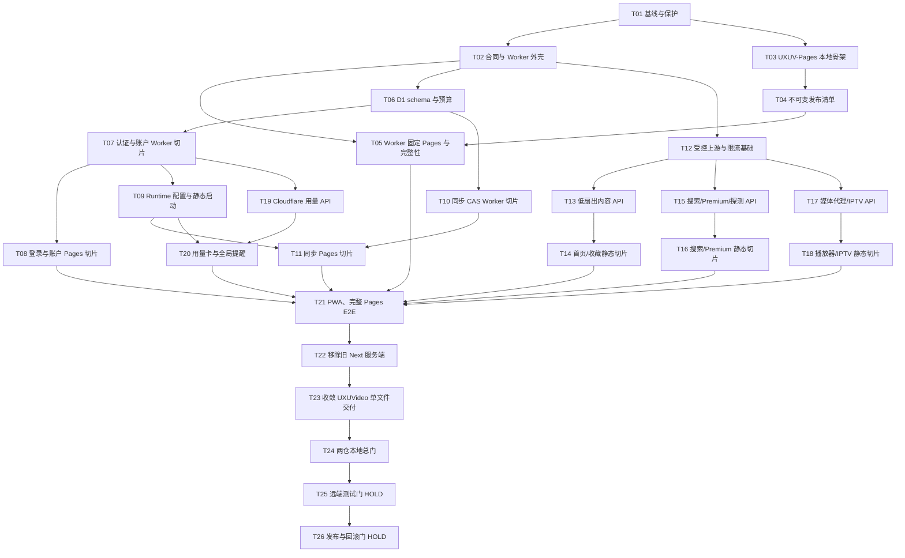

# 实施计划：UXUVideo Worker / UXUV-Pages 分仓迁移

## 1. 计划依据与充分性

- 依据：`work-products/SPEC.md`，状态为 **Approved**，目标为 Worker API Contract v1。
- 充分性：规格已确认仓库职责、22 条 API 合同、D1 唯一存储、认证与同步、安全边界、Free 预算、Pages 完整性、发布顺序、回滚和需另行授权的远端操作；不存在阻止本地实施计划的实质决策空缺。
- 当前证据：`UXUVideo` 是 `main` 上的脏工作树，含大量未提交 Web-only 删除/修改；当前为 Next.js `output: 'standalone'`、21 个 `app/api/**/route.ts`、Upstash 认证/同步和服务端布局依赖。实施不得 reset、checkout、覆盖或重做这些改动。
- 配对仓库：`../UXUV-Pages` 当前只有 `.git/`，尚无提交，`origin` 已指向 `https://github.com/uxudjs/UXUV-Pages.git`。所有本地文件可规划，但创建远端内容、commit、push 和 Pages 发布仍为 HOLD。
- 计划只授权后续任务拆分；本轮不授权 `@build`、commit、push、部署、真实 D1 或 Cloudflare 变更。

## 2. 不变量

1. 所有新增测试文件只放在各仓库 `work-products/tests/`。
2. UXUVideo 测试引用 `_worker.js` 使用 `../../_worker.js`；跨仓引用 UXUV-Pages 使用 `../../../UXUV-Pages/...`。UXUV-Pages 跨仓引用 Worker 使用 `../../../UXUVideo/_worker.js`。禁止机器绝对路径。
3. 每个行为切片先有失败合同测试，再做最小实现；每个切片结束运行聚焦测试与 `git diff --check`。
4. `_worker.js` 是唯一部署产物，也是单文件长度例外；运行时不得依赖 npm、Next、Node 文件系统或本地文件。
5. 公共 Pages 不接收密码、Cookie、认证、同步或 Analytics Token；所有敏感操作保持 Worker 同源。
6. 旧 Next 实现只有在对应 Worker + Pages 合同和本地 E2E 通过后才能删除。
7. D1 schema 只允许幂等、向后兼容的新增；不可逆迁移、真实数据迁移或删除必须另审。
8. 本地、公开 Pages、Cloudflare 测试实例和真实第三方媒体证据分别报告，互不替代。
9. 每个实施会话最多处理一个任务；若任务的机械迁移超过 5 个文件，按任务内列出的批次逐批完成，每批均单独验证，不把未验证批次混入同一变更。

## 3. 依赖图

## 4. 任务

### T01：冻结基线并恢复可重复验证入口

**范围：** 在 `work-products/` 记录两仓 `git status`、当前路由/页面清单和测试基线；诊断 Windows 下 `npm test` glob 与现有 build/type 阻塞，只对确认阻塞迁移的基线缺陷另做最小修复，不借机整理无关代码。

**验收标准：**

- 未提交 Web-only 改动有可核对清单，后续每一任务都能证明未丢失。
- 现有 21 条路由、8 个页面入口和当前验证命令有机器可读基线。
- 已区分新回归、既有阻塞和环境限制；不能安全修复的基线项明确标为 NO-GO 条件。

**验证：** 显式枚举 `tests/**/*.test.ts` 运行当前测试；运行 `npm run lint`、`npm run build`、`git diff --check` 和可用的 `./verification/run --quick`，保存命令与结果，不把已知失败写成通过。

**依赖：** 无。

**可能涉及：** `work-products/baseline.md`、`work-products/tests/baseline-contract.test.mjs`；仅在诊断证明必要时涉及 `package.json` 或相关构建配置。

**回滚：** 删除本任务新增的基线产物；对业务/配置修复逐文件反向补丁，禁止用 reset/checkout。

### T02：锁定 API Contract v1 与 Worker 外壳

**范围：** 先建立 22 路由、方法、API 404/405、统一错误体、版本头、请求 ID、路由分发和最小结构化日志的合同测试，再创建无运行时依赖的 `_worker.js` 外壳。

**验收标准：**

- 22 个路径合同全部注册，未知 API 不回退 HTML，非 API 非 GET/HEAD 返回 405。
- JSON/SSE 错误和版本响应头与规格一致；日志默认脱敏。
- 只建立外壳和共享原语，未实现的业务路由明确失败关闭，不伪造成功。

**验证：** `node --check _worker.js`；`node --test work-products/tests/worker-route-contract.test.mjs work-products/tests/structured-logging.test.mjs`；`git diff --check`。

**依赖：** T01。

**可能涉及：** `_worker.js`、`work-products/tests/worker-route-contract.test.mjs`、`work-products/tests/structured-logging.test.mjs`。

**回滚：** 移除外壳与对应测试；不触碰现有 Next 路由。

### T03：建立 UXUV-Pages 本地静态导出骨架

**范围：** 仅在本地空仓库建立 Next.js 静态导出、TypeScript、Lint、测试脚本和 8 个确定性占位入口；设置 `output: 'export'`、`images.unoptimized: true`，不创建远端内容。

**验收标准：**

- 8 个路由均可静态导出，直接 Pages 模式只显示公开说明，不显示登录表单。
- 构建图中不存在 `app/api/`、`lib/server/`、`server-only`、`fs`、Vercel Analytics 或 Secret。
- `npm ci` 可由锁文件复现；新测试只在 `work-products/tests/`。

**验证：** `npm ci`、`npm test`、`npm run lint`、`npm run build`、`git diff --check`。

**依赖：** T01。

**可能涉及：** `package.json`、`package-lock.json`、`next.config.ts`、`tsconfig.json`、`work-products/tests/static-export-contract.test.mjs`；页面占位按不超过 5 文件的批次处理。

**回滚：** 删除本地骨架文件；不操作 `.git`、origin 或远端仓库。

### T04：生成不可变 release manifest

**范围：** 在 UXUV-Pages 增加发布构建脚本和合同测试，生成版本、完整 commit、API Contract、Worker range、静态路由、资源 SHA-256、MIME 与 SRI；拒绝字节不同的版本覆盖。

**验收标准：**

- 8 个 HTML 入口及全部首方 JS/CSS/公共资源都在清单中且可重算。
- 可变版本名、短 SHA、漏资源、MIME 错误、哈希错误和覆盖已有版本均失败。
- 输出只含公开静态内容和许可证，不含 Secret、Cookie、用户源或账户数据。

**验证：** `npm test -- --test-name-pattern release`（或项目等价聚焦命令）；重新构建两次并比较确定性；`git diff --check`。

**依赖：** T03。

**可能涉及：** `scripts/build-release.mjs`、`work-products/tests/release-manifest.test.mjs`、`package.json`、本地发布 fixture（位于 `work-products/tests/fixtures/`）。

**回滚：** 删除生成器和测试产物；不得删除或覆盖已发布版本目录。

### T05：Worker 固定 Pages 版本并失败关闭

**范围：** 在 `_worker.js` 实现固定版本常量、清单/HTML SHA-256、API Contract/semver range、精确路由映射、缓存头、安全 503 和同 Contract 回退；禁止 `main/master/latest`。

**验收标准：**

- 只加载固定版本目录；清单、HTML、资源或兼容校验失败均返回内置 503。
- HTML、哈希资产、认证/API 的缓存策略符合规格；未知页面返回固定 `404.html`。
- 回退只允许已固定、已验证且同 API Contract 的上一版本。

**验证：** `node --test work-products/tests/pages-integrity.test.mjs`，其中跨仓路径使用 `../../../UXUV-Pages/...`；`node --check _worker.js`；`git diff --check`。

**依赖：** T02、T04。

**可能涉及：** `_worker.js`、`work-products/tests/pages-integrity.test.mjs`。

**回滚：** 恢复本任务前固定常量/解析区；发布后回滚合同是恢复上一版 `_worker.js`，不修改 Pages 已发布字节。

### T06：D1 schema、查询计划与 Free 预算基础

**范围：** 先锁定幂等 schema、索引、`ensureSchema()`、稳定存储错误、row metrics 和 8.6 最坏情形预算，再在 `_worker.js` 建立 D1 访问层；不接入真实 D1。

**验收标准：**

- `accounts`、`sessions`、`user_documents`、`rate_limits` 及必要索引可重复初始化。
- 常用认证/同步查询使用主键或索引，无无界 `SCAN`、`SELECT *` 或无界清理。
- 最坏情形模型低于 1,000,000 行读、50,000 行写、50 MiB；缺 `DB` 或配额错误失败关闭。

**验证：** `node --test work-products/tests/d1-free-budget.test.mjs`；用可控 D1 stub 核对 `rows_read/rows_written` 和查询计划 fixture；`node --check _worker.js`。

**依赖：** T02。

**可能涉及：** `_worker.js`、`work-products/tests/d1-free-budget.test.mjs`、`work-products/tests/fixtures/d1.mjs`。

**回滚：** 移除未被业务使用的 D1 区段；真实 schema 变更尚未获授权。未来发布只允许向后兼容新增。

### T07：认证、会话、账户与 Premium Worker 切片

**范围：** 实现 `/api/auth`、`/api/auth/session`、账户集合/单项路由；包含 PBKDF2、`__Host-` Cookie、token hash、会话撤销、最后一个 super_admin、账户/会话上限、服务端 Premium 授权和低频 D1 限流。

**验收标准：**

- 缺 `DB`/`ADMIN_PASSWORD`/`AUTH_SECRET` 时 `SETUP_REQUIRED`/503，绝不匿名降级。
- 明文密码/token 不进入 D1、响应或日志；登出、改密码、删账户能撤销会话。
- 最多 8 账户、每账户 5 会话、最后一个 super_admin 保护和 Premium 服务端检查均锁定。

**验证：** `node --test work-products/tests/auth-d1.test.mjs work-products/tests/security-boundary.test.mjs work-products/tests/d1-free-budget.test.mjs`；`node --check _worker.js`。

**依赖：** T06。

**可能涉及：** `_worker.js`、`work-products/tests/auth-d1.test.mjs`、`work-products/tests/security-boundary.test.mjs`。

**回滚：** 移除认证路由实现并恢复明确 503 占位；不得回退为旧匿名/Upstash兼容路径。

### T08：登录与账户管理 Pages 切片

**范围：** 将 PasswordGate、session store、权限 Gate 和账户设置迁入 UXUV-Pages，改为同源 `/api/auth*`，直接 Pages 模式不提交凭据。

**验收标准：**

- Worker origin 上可完成登录、登出、账户 CRUD 与权限状态；Premium 只信服务端 session。
- `github.io` 直接入口无登录表单、无认证请求；密码只出现在测试 Worker origin 的 POST body。
- 普通用户与 super_admin 的可见性、错误/加载/失效会话状态明确。

**验证：** 聚焦组件测试；`npx playwright test work-products/tests/app-flows.e2e.spec.ts --grep auth`；检查网络、存储和控制台。

**依赖：** T03、T07。

**可能涉及：** `components/PasswordGate.tsx`、`components/AdminGate.tsx`、`components/settings/AccountSettings.tsx`、`lib/store/auth-store.ts`、`work-products/tests/app-flows.e2e.spec.ts`；依赖按每批不超过 5 文件迁移。

**回滚：** 回退该 Pages 切片到公开占位状态；Worker 认证保持可独立测试。

### T09：Runtime 配置、session 启动与确定性静态布局

**范围：** 实现 `/api/config` 的公开/认证分层，并在 UXUV-Pages 建立 RuntimeConfigProvider；静态布局不读文件、Redis 或运行时环境，启动并行加载 config/session。

**验收标准：**

- 未登录配置不泄漏订阅/IPTV 源；实例化配置只来自 Worker 同源 API。
- 8 个入口在 config/session 未完成前显示一致启动态，不闪现受限功能。
- 站点文案、图标、能力、广告关键词和第三方脚本开关由 Provider 注入；第三方脚本默认关闭。

**验证：** `node --test work-products/tests/worker-route-contract.test.mjs` 的 config 用例；UXUV-Pages `runtime-config-contract.test.mjs`；静态 build；Playwright 直接 Pages/Worker origin 对照。

**依赖：** T07、T03。

**可能涉及：** UXUVideo `_worker.js`；UXUV-Pages `app/layout.tsx`、`components/RuntimeConfigProvider.tsx`、`components/SiteIconProvider.tsx`、`work-products/tests/runtime-config-contract.test.mjs`。

**回滚：** Pages 回到确定性公开占位；Worker config 保持最小安全响应。

### T10：配置与媒体库同步 CAS Worker 切片

**范围：** 实现 `/api/user/config`、`/api/user/sync` 的 ETag/baseVersion、D1 CAS、409、512 KiB 限制、字段/记录合并和 30 天 tombstone。

**验收标准：**

- 并发旧版本写入稳定返回 `SYNC_CONFLICT` 与当前版本，不静默覆盖。
- config 与 library 的定义合并规则可收敛；每账户/每 kind 最多 60 秒一次写入。
- D1 不可用/配额错误保留客户端数据，并返回稳定错误码。

**验证：** `node --test work-products/tests/sync-cas.test.mjs work-products/tests/d1-free-budget.test.mjs`；并发 fixture 和大小边界。

**依赖：** T06、T07。

**可能涉及：** `_worker.js`、`work-products/tests/sync-cas.test.mjs`。

**回滚：** 同 API major 内只回退 Worker 逻辑，schema 保持向后兼容；不删除文档或 tombstone。

### T11：离线优先同步 Pages 切片

**范围：** 迁移 cloud/config/subscription sync hooks 与相关 store，接入 ETag/CAS、冲突合并、离线队列和配额错误 UI。

**验收标准：**

- 本地变更立即保存，服务端不可用不伪装已同步；恢复后按合同合并。
- 双浏览器冲突能在 UI 中解释并收敛；删除记录不会被旧设备复活。
- `STORAGE_QUOTA_EXCEEDED` 保留未同步数据并显示 UTC 重置/清理/升级说明。

**验证：** 聚焦纯函数测试；`npx playwright test work-products/tests/app-flows.e2e.spec.ts --grep sync`；浏览器双 context 用例。

**依赖：** T09、T10。

**可能涉及：** `lib/hooks/useCloudSync.ts`、`lib/hooks/useConfigSync.ts`、`lib/hooks/useSubscriptionSync.ts`、`lib/utils/sync-records.ts`、`work-products/tests/app-flows.e2e.spec.ts`；store 迁移另按 ≤5 文件批次。

**回滚：** 停用远端同步并保留本地数据；不删除 D1 文档。

### T12：受控上游、SSRF、流、签名和并发基础

**范围：** 在 `_worker.js` 先实现所有代理类路由共用的 URL/重定向验证、头白名单、超时、字节上限、Web Streams、HMAC 子资源 token、isolate 令牌桶、子请求/等待响应头预算。

**验收标准：**

- 私网/保留地址、混淆 IP、危险端口和重定向逃逸被拒绝。
- Cookie、Authorization、CF-*、X-Forwarded-* 永不转发；JSON/HTML/M3U 有上限，二进制不全量缓冲。
- Free 路径硬限制不超过 50 子请求、6 个等待响应头连接；超限稳定 429/错误码。

**验证：** `node --test work-products/tests/security-boundary.test.mjs work-products/tests/free-budget.test.mjs work-products/tests/media-stream.test.mjs` 的基础用例。

**依赖：** T02、T07。

**可能涉及：** `_worker.js`、`work-products/tests/security-boundary.test.mjs`、`work-products/tests/free-budget.test.mjs`、`work-products/tests/media-stream.test.mjs`。

**回滚：** 恢复各路由安全 503 占位；不得恢复不安全的 Cookie 转发或匿名代理。

### T13：低扇出内容 API 切片

**范围：** 分批实现 `/api/app-update`、`/api/danmaku`、`/api/detail`、三条 Douban 路由和 `/api/ping`；每批最多一个路由族，复用 T12 原语并保持既有成功字段。

**验收标准：**

- 每条路由的认证、方法、host/schema、超时、缓存和字节上限符合规格。
- Douban image 不是任意图片代理；ping 单目标且总超时 8 秒。
- 上游失败映射为安全稳定错误，不泄漏原始响应或完整 URL。

**验证：** 每批运行 `worker-route-contract.test.mjs` 对应路由、`security-boundary.test.mjs` 和 `free-budget.test.mjs`；最终运行三者全集。

**依赖：** T09、T12。

**可能涉及：** `_worker.js` 与上述三个既有测试文件；fixture 放 `work-products/tests/fixtures/`。

**回滚：** 仅将失败路由族恢复为安全 503，不影响已通过路由。

### T14：首页、搜索展示与收藏静态切片

**范围：** 按 ≤5 文件批次迁移首页、搜索结果、收藏页及其浏览器安全依赖；API 只使用同源相对 `/api/*`，不改变视觉设计。

**验收标准：**

- `/` 与 `/favorites` 静态导出，加载/空/错误状态完整。
- 搜索触发、详情导航、历史/收藏本地状态在 Worker origin 工作。
- 没有硬编码 Worker/GitHub 域名、server import 或 Next 图片优化依赖。

**验证：** UXUV-Pages build；`same-origin-boundary.test.mjs`；Playwright `app-flows` 中 home/favorites；320/768/1024/1440 截点。

**依赖：** T09、T13。

**可能涉及：** `app/page.tsx`、`app/favorites/page.tsx`、相邻 `components/home/*`/`components/favorites/*` 和 `work-products/tests/same-origin-boundary.test.mjs`；严格分批。

**回滚：** 单批回退到上一个可构建静态状态；不删除 UXUVideo 原页面。

### T15：搜索、Premium 聚合与分辨率探测 Worker 切片

**范围：** 实现 `/api/search-parallel`、`/api/premium/category`、`/api/premium/types`、`/api/probe-resolution` 的 SSE、授权、Free/Paid 扇出/并发/条数限制、取消传播与缓存。

**验收标准：**

- Free 上限固定为 12 源/5 并发/3 页/500 条，探测 6 视频/3 并发/每项 2 变体；Paid 上限符合规格。
- Premium 无有效 server session 必须 403；前端状态不能绕过。
- SSE 取消停止上游工作，错误事件使用统一结构；不使用 Node `Buffer`。

**验证：** `worker-route-contract.test.mjs`、`free-budget.test.mjs`、`security-boundary.test.mjs` 的聚焦用例；取消与上限压力 fixture。

**依赖：** T12。

**可能涉及：** `_worker.js` 与三个合同测试文件。

**回滚：** 按路由族恢复安全失败，不放宽 Free 或授权上限。

### T16：搜索与 Premium 静态页面切片

**范围：** 迁移搜索流 UI、Premium 首页/收藏/设置、分辨率探测与服务端 Premium session 状态；按页面族和依赖闭包分批。

**验收标准：**

- `/premium`、`/premium/favorites`、`/premium/settings` 静态导出并使用同源 API。
- SSE 增量、取消、上限提示、授权失效和错误状态可见。
- Free/Paid UI 只展示服务端返回的能力，不在客户端扩大预算。

**验证：** build；`same-origin-boundary.test.mjs`；Playwright `app-flows` 中 search/premium/probe；响应式回归。

**依赖：** T14、T15。

**可能涉及：** 对应 `app/premium/**`、`components/premium/**`、搜索 hooks、`work-products/tests/app-flows.e2e.spec.ts`；每批 ≤5 文件。

**回滚：** 回退单页面族；保留已通过页面和 Worker 路由。

### T17：媒体代理与 IPTV Worker 切片

**范围：** 分两批实现 `/api/proxy` 与 `/api/iptv`/`/api/iptv/stream`，包含首次 session、IPTV 权限、10 分钟 token、HLS 重写、Range、20 秒响应头超时、取消和流终止日志。

**验收标准：**

- 无匿名开放代理；签名子资源不逐段访问 D1，CORS 不使用通配符。
- M3U/HLS 清单最大 1 MiB，媒体 body 直通且字节/Range 正确，不无界缓冲。
- 客户端取消可终止上游；流开始后的错误只终止流并记录分类。

**验证：** `node --test work-products/tests/media-stream.test.mjs work-products/tests/security-boundary.test.mjs work-products/tests/free-budget.test.mjs`；短流/Range/取消 fixture。

**依赖：** T12。

**可能涉及：** `_worker.js` 与三个测试文件。

**回滚：** 单独关闭 media 或 IPTV 路由为安全 503；不退回 Cookie 转发。

### T18：播放器与 IPTV 静态页面切片

**范围：** 迁移 `/player`、`/iptv`、HLS 播放、Range/重试、权限与错误 UI；按播放器、IPTV、公共媒体 hooks 三批实施。

**验收标准：**

- 两个入口静态导出，媒体请求只发往 Worker 同源签名路径。
- 播放取消/切源终止旧请求；权限、token 过期、配额和上游中断均有明确状态。
- 现有响应式与可访问性基线保持，不做视觉重设计。

**验证：** build；Playwright `app-flows` 中 player/IPTV；受控 HLS 短流程；`same-origin-boundary.test.mjs`。

**依赖：** T09、T17。

**可能涉及：** `app/player/**`、`app/iptv/**`、`components/player/**`、`components/iptv/**`、`work-products/tests/app-flows.e2e.spec.ts`；每批 ≤5 文件。

**回滚：** 回退单批到可构建页面；Worker 仍可由合同测试验证。

### T19：Cloudflare 用量 Worker API 切片

**范围：** 实现 super_admin 同源 `/api/admin/usage`、四项配置整体检查、固定 GraphQL endpoint/Bearer/variables、受控整数、5 分钟快照、1 小时陈旧回退、稳定错误和阈值。

**验收标准：**

- 未配置返回 200 `configured:false`；Token 不进入 URL、响应、D1、Cache payload 或日志。
- 最多一个 GraphQL 子请求，账户总量与项目量分开；UTC 日界、70/85/95/100 和 D1 警戒线正确。
- 无旧快照的 401/403/429/GraphQL/网络失败正确映射；接口不写 D1。

**验证：** `node --test work-products/tests/cloudflare-usage-contract.test.mjs work-products/tests/structured-logging.test.mjs work-products/tests/security-boundary.test.mjs`。

**依赖：** T07、T12。

**可能涉及：** `_worker.js`、`work-products/tests/cloudflare-usage-contract.test.mjs`、已有 logging/security 测试。

**回滚：** 恢复 `configured:false` 安全状态；业务 API 不受影响。

### T20：设置页用量卡与全局提醒切片

**范围：** 在主设置页指定位置加入 super_admin 用量卡，并建立根级 UsageAlertProvider；覆盖四项进度、账户/项目边界、UTC 倒计时、陈旧/未配置/失败和普通用户通用配额错误。

**验收标准：**

- 卡片位于账户管理后、播放设置前，不在 Premium 设置重复；普通用户看不到精确数字。
- 等级同时有文字、数值和可访问标签；warning 以上显示不可永久静默的全局横幅。
- DOM、URL、网络记录、存储与日志中 Analytics Token 零出现。

**验证：** `npx playwright test work-products/tests/usage-ui.e2e.spec.ts`；axe 聚焦卡片；320/768/1024/1440；静态 build。

**依赖：** T09、T19，以及设置页基础迁移批次。

**可能涉及：** `app/settings/page.tsx`、`components/settings/CloudflareUsageSettings.tsx`、`components/UsageAlertProvider.tsx`、`lib/hooks/useCloudflareUsage.ts`、`work-products/tests/usage-ui.e2e.spec.ts`。

**回滚：** 移除 UI 消费者，保留 API 的安全未使用实现。

### T21：PWA、完整 Pages E2E 与可访问性收口

**范围：** 迁移 public 资源、manifest、service worker、剩余 UI 依赖与 `/settings`；建立完整同源、视觉尺寸、axe、控制台和网络回归。

**验收标准：**

- 8 个入口、PWA 资源和所有首方静态资产都进入 release manifest。
- Service Worker 不缓存认证/API/媒体，按 Pages 版本清理旧首方 cache。
- 全部核心流程、加载/空/错误状态和四个断点通过；无新增严重/关键 axe 问题、控制台错误或敏感跨源请求。

**验证：** `npm test`、`npm run lint`、`npm run build`；`app-flows.e2e.spec.ts`、`usage-ui.e2e.spec.ts`、`accessibility.e2e.spec.ts`；清单重算。

**依赖：** T05、T08、T11、T14、T16、T18、T20。

**可能涉及：** `public/*`、`components/ServiceWorkerRegister.tsx`、`app/settings/**`、`work-products/tests/accessibility.e2e.spec.ts`、`work-products/tests/playwright.config.ts`；每批 ≤5 文件。

**回滚：** 回退最后一个资源/页面批次；保留上一个绿色静态发布候选。

### T22：在合同通过后移除旧 Next 服务端

**范围：** 只有 22 路由、D1、安全、预算和 Pages 本地 E2E 全绿后，分批删除 `app/api/`、`lib/server/`、Upstash 依赖及服务端专用配置；先用守卫测试证明删早会失败。

**验收标准：**

- UXUVideo 不再含 Next route、Redis/Upstash、`NextRequest/NextResponse`、server-only、Node 文件系统运行时路径。
- `_worker.js` 合同测试仍全绿；UXUV-Pages 不引用已删除源。
- 当前未提交 Web-only 改动完整保留；只删除已被已验证候选替代的文件。

**验证：** `node --test`、`node --check _worker.js`、禁止项扫描、跨仓引用扫描、`git diff --check`。

**依赖：** T21 及全部 Worker API 切片。

**可能涉及：** 现有 `app/api/**`、`lib/server/**`、`package.json`/lock；删除按路由族和依赖闭包分批，测试守卫位于 `work-products/tests/repository-boundary.test.mjs`。

**回滚：** 在未发布阶段用逐文件反向补丁恢复误删；禁止 reset/checkout。发布后只回滚到保存的上一版 `_worker.js`，不恢复不安全旧服务。

### T23：收敛 UXUVideo 为单文件 Worker 交付

**范围：** 在 UXUV-Pages 全部接管静态前端后，分批移除 UXUVideo 的 Next UI、Node 构建依赖和旧验证面；保留 `_worker.js`、README、CHANGELOG、LICENSE、本地脚本与 `work-products/`。

**验收标准：**

- 用户部署只需复制 `_worker.js` 并配置 `DB`、`ADMIN_PASSWORD`、`AUTH_SECRET`；可选用量配置写清 Secret/普通变量边界。
- 压缩后 Worker 小于 3 MB，运行时无 npm/本地文件依赖；MIT 归属完整。
- README 明确 Free 尽力而为、Pages 固定版本、D1/用量配置、证据层级和回滚。

**验证：** `node --check _worker.js`、`node --test`、压缩大小检查、禁止依赖扫描、`git diff --check`。

**依赖：** T22。

**可能涉及：** `README.md`、`CHANGELOG.md`、`LICENSE`、`package.json`/lock 与剩余 Next 前端文件；每个删除批次先由 repository-boundary 测试覆盖。

**回滚：** 在发布前逐批反向恢复；发布回滚仅恢复上一候选 `_worker.js` 和匹配文档，不修改固定 Pages 字节。

### T24：两仓本地总门

**范围：** 对精确候选运行完整本地门并生成证据清单；不修复无关问题，不把工作树绿色等同已提交候选。

**验收标准：**

- UXUVideo：`node --check _worker.js`、`node --test`、压缩大小、秘密扫描、`git diff --check` 全绿。
- UXUV-Pages：`npm ci`、`npm test`、`npm run lint`、`npm run build`、全部 Playwright/axe、清单重算、秘密扫描、`git diff --check` 全绿。
- 跨仓 Worker/Page 版本、API Contract、manifest、CHANGELOG 一致；任何失败都明确 NO-GO。

**验证：** 运行上述命令并将摘要与候选 SHA/文件哈希写入 `work-products/local-gate.md`；不声称公开 Pages/Cloudflare/真实媒体通过。

**依赖：** T23。

**可能涉及：** 仅 `work-products/local-gate.md` 与必要的证据文件；不修改业务代码来掩盖失败。

**回滚：** 删除证据产物无业务影响；候选失败返回对应任务修复，不放宽门。

### T25：公开 Pages 与 Cloudflare 测试实例门（HOLD）

**范围：** 需用户另行授权后，先发布不可变 Pages 候选并验证公开字节/SHA/MIME，再在独立测试 Worker + 测试 D1 验证首次自举、22 路由、row metrics、Free CPU/子请求、双浏览器同步、临时只读 Analytics Token 和受控 30 分钟 HLS。

**验收标准：**

- Pages 公开字节与本地清单一致且不可变；Worker 只固定该版本。
- Free profile 无持续 1102/1027、无超 50 子请求/6 连接；关键 D1 实际 row metrics 低于警戒线。
- Analytics Token 只经测试 Secret 注入，真实第三方媒体另列人工证据。

**验证：** 保存脱敏的远端请求、版本头、row metrics、CPU/错误、浏览器网络与 30 分钟 fixture 证据；逐项标注环境。

**依赖：** T24；另需对发布 Pages、创建/修改测试 Worker/D1 和 Token 使用的明确授权。

**可能涉及：** 各仓 `work-products/remote-gate.md`；不得把 Secret 或真实数据写入仓库。

**回滚：** 删除测试 Worker/D1 需再次确认精确目标；Pages 不覆盖已发布版本。失败时不更新可复制 `_worker.js`。

### T26：发布与回滚门（HOLD）

**范围：** 在 T25 全绿后核对先 Pages、后 Worker 的顺序、精确候选、CHANGELOG、D1 向后兼容和上一版回退；只给 GO/NO-GO，不自动 commit、push 或部署。

**验收标准：**

- GO 只针对精确 Pages commit/manifest SHA 与精确 `_worker.js` SHA；任一漂移重跑相关门。
- 上一版 Worker 能读当前 additive D1 schema并使用上一固定 Pages；否则 NO-GO。
- commit、push、公开发布、生产部署各自仍需用户授权。

**验证：** 比对两仓状态、发布清单、Worker 常量、CHANGELOG、测试证据和回滚演练结果。

**依赖：** T25。

**可能涉及：** `work-products/release-gate.md`；不修改业务代码。

**回滚：** 发布后恢复上一版 `_worker.js`；Pages 版本保留不可变；禁止破坏性回滚 D1。

## 5. 检查点

### CP1：合同和交付外壳（T01-T05）

- 两仓本地骨架可验证，Worker/Pages 合同无可变版本入口。
- 旧 Next 实现尚未删除。

### CP2：身份、配置和同步（T06-T11）

- D1 预算、登录、账户、会话、Premium、配置和双设备冲突在本地合同中闭环。
- 缺绑定/Secret、配额和冲突路径均失败关闭。

### CP3：内容与媒体（T12-T18）

- 所有代理类路由共享 SSRF/头/流/并发原语；22 路由用户功能达到本地等价。
- 本地受控流证据不被描述为 Cloudflare 或真实媒体证明。

### CP4：用量、PWA 和 Pages 完整体验（T19-T21）

- 8 页面、PWA、用量卡、全局提醒、a11y 与四断点全部通过。
- Token/密码/Cookie 的网络与产物扫描零泄漏。

### CP5：删除旧实现与本地候选（T22-T24）

- 先证明替代完整，再分批删除；UXUVideo 收敛到单文件交付。
- 本地总门只形成“可进入远端测试”的结论。

### CP6：远端与发布（T25-T26，HOLD）

- 只有获得明确授权并取得公开 Pages、测试 Cloudflare/D1 和受控长流证据后，才可能给发布 GO。

## 6. 计划测试文件

### UXUVideo

- `work-products/tests/baseline-contract.test.mjs`
- `work-products/tests/worker-route-contract.test.mjs`
- `work-products/tests/auth-d1.test.mjs`
- `work-products/tests/sync-cas.test.mjs`
- `work-products/tests/d1-free-budget.test.mjs`
- `work-products/tests/security-boundary.test.mjs`
- `work-products/tests/pages-integrity.test.mjs`
- `work-products/tests/free-budget.test.mjs`
- `work-products/tests/media-stream.test.mjs`
- `work-products/tests/structured-logging.test.mjs`
- `work-products/tests/cloudflare-usage-contract.test.mjs`
- `work-products/tests/repository-boundary.test.mjs`

### UXUV-Pages

- `work-products/tests/static-export-contract.test.mjs`
- `work-products/tests/release-manifest.test.mjs`
- `work-products/tests/runtime-config-contract.test.mjs`
- `work-products/tests/same-origin-boundary.test.mjs`
- `work-products/tests/app-flows.e2e.spec.ts`
- `work-products/tests/usage-ui.e2e.spec.ts`
- `work-products/tests/accessibility.e2e.spec.ts`
- `work-products/tests/playwright.config.ts`

测试 fixture 只放相邻 `work-products/tests/fixtures/`，只含合成/公开测试数据。任何跨仓路径都从测试最终目录相对解析。

## 7. 风险与门

| 风险 | 处理 | 门 |
| --- | --- | --- |
| 当前脏工作树被覆盖 | T01 快照、逐文件补丁、禁止 reset/checkout | 每任务前后对比 status |
| 单文件 Worker 产生共享冲突 | Worker 任务串行；每次只改一个路由族 | 聚焦合同 + 全量语法 |
| 过早删除 Next | T22 前要求全部替代和 Pages E2E | repository-boundary 守卫 |
| Free CPU/PBKDF2 不足 | 不降低哈希，远端实测 | 持续 1102 则 NO-GO |
| D1 预算估算偏低 | 公式测试 + 实际 row metrics | 超 8.6 警戒线 NO-GO |
| Pages/Worker 漂移 | 固定版本、manifest SHA、跨仓门 | 任一不一致 NO-GO |
| Analytics Token 泄漏 | 固定 endpoint、Bearer、秘密扫描 | 任一命中 NO-GO |
| 第三方媒体不稳定 | 受控 fixture 与真实源分层 | 不以本地通过替代真实证据 |

## 8. 未决但不阻塞本地实施的事项

- Pages 最终公开 URL/可选自定义域名：在 T25 发布授权时确定，并固化为不可变版本基址。
- 测试 Worker、测试 D1、临时 Analytics Token 的具体账户与生命周期：在 T25 前由用户明确授权。
- 若 PBKDF2 在 Workers Free 持续超 10 ms CPU，必须由用户在 Paid 或重新审批认证方案之间决策；计划不得擅自降低强度。
- 若现有 build/type 阻塞经 T01 证明不是迁移范围内可安全修复，T24 保持 NO-GO 并单独立项，不以删除测试或放宽规则解决。

## 9. 并行化约束

- T02/T03 可在不同仓独立推进；T04 完成后才能做 T05。
- Worker 业务任务都修改 `_worker.js`，默认串行，禁止多个实施者并发写同一文件。
- UXUV-Pages 的页面迁移可在合同稳定后按互不重叠的页面族并行，但共享 provider/store 由单一任务先落定；合并前分别 build/E2E。
- T22/T23 删除任务必须串行且最后执行。

## 10. 完成定义

计划本身完成不代表迁移完成。只有 T01-T24 全绿才是“本地远端测试候选”；T25 远端证据全绿才可进入 T26；T26 的 GO 仍不自动授权 commit、push、Pages/Worker 发布或生产切换。
